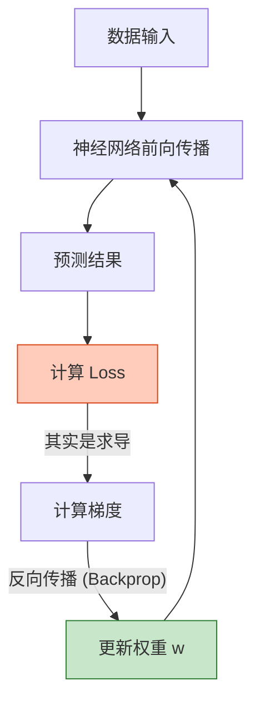

# 01. AI 祛魅：从神经元到损失函数

> [!NOTE]
> **不只是黑盒**
> 
> 本文不涉及科幻内容。将从生物学和数学的交叉点出发，通过 **Perceptron (感知机)** 和 **Gradient Descent (梯度下降)**，推导出 AI 学习的本质。

## 1. 仿生学起点：感知机 (Perceptron)

神经网络的最小单元是**神经元**。
数学上，它就是一个线性函数加上一个非线性激活。

$$ y = f(\sum_{i=1}^{n} w_i x_i + b) $$

*   $x_i$: 输入信号（比如像素点的亮度）。
*   $w_i$: 权重 (Weight)。也就是连接的粗细，代表重要程度。
*   $b$: 偏置 (Bias)。阈值。
*   $f$: **激活函数 (Activation Function)**。

### 以房价预测为例
为了理解 $w$ 和 $b$，以房价预测为例：
*   $x_1$ (面积): 100平米。 $w_1$ (单价): 5万/平。
*   $x_2$ (房龄): 20年。 $w_2$ (折旧): -0.5万/年。
*   $b$ (地段底价): 200万。

$$ \text{房价} = (100 \times 5) + (20 \times -0.5) + 200 = 690 \text{万} $$

这即是神经元的功能：**对特征进行加权求和**。
模型训练的过程，就是不断调整 $w$ (单价/折旧率) 和 $b$ (底价)，让计算出来的 690万 逼近真实成交价。

### 为什么需要激活函数？
如果只有 $w \cdot x + b$，无论叠多少层，最终都只是一个线性组合（Linear Combination）。
引入 **ReLU** ($f(x) = \max(0, x)$) 或 **Sigmoid**，引入了非线性，网络才能拟合任意复杂的曲线（Universal Approximation Theorem）。

## 2. 学习的本质：损失与优化

机器的“学习”机制，本质上是在**求极值**。

### Loss Function (损失函数)
需要一个数学公式来衡量“模型猜的”和“真实答案”差得有多远。
对于分类问题，常用 **Cross-Entropy Loss (交叉熵损失)**：

$$ L = - \sum y_{true} \log(y_{pred}) $$

这个 $L$ 相当于地形图上的**高度**。目标是走到山谷最低点（Loss 最小化）。

### Gradient Descent (梯度下降)
在梯度下降中，如同身处高山寻找下山路径。
**通过梯度探路**。
计算当前位置的**梯度**（坡度的方向和陡峭程度），然后往反方向迈一步。

$$ w_{new} = w_{old} - \eta \cdot \nabla L $$

*   $\nabla L$: 梯度（导数）。
*   $\eta$: **Learning Rate (学习率)**。步长过大会导致震荡，过小会导致收敛缓慢。

## 3. 弱人工智能 vs 强人工智能

有了这一套数学框架，观察当前的 AI 技术。
目前的 LLM，无论多强，本质上都是在**高维空间中拟合一个超级复杂的概率分布函数**。

*   **ANI (弱 AI)**: 既然是函数拟合，就受限于训练数据的分布 (Distribution)。遇到分布之外的数据 (Out of Distribution)，它就会瞎猜（幻觉）。
*   **AGI (强 AI)**: 需要具备因果推理 (Causal Inference) 和世界模型 (World Model)，而不光是统计相关性。

## 小结

AI 不神秘，它是由：
1.  **架构** (Perceptron, Transformer...)
2.  **目标** (Loss Function)
3.  **优化器** (Gradient Descent, Adam)

三者组成的数学机器。
下一篇，将拆解现代 AI 的巅峰之作 —— Transformer 架构的内部数学细节。
