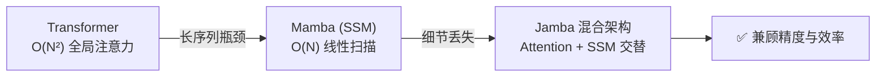

# AI 核心原理（二）—— 模型架构演进：从 Transformer 到 Mamba 混合体

> **环境：** PyTorch 2.0+, Mamba-1.1.1, 基于 LLaMA 3 / Jamba 架构理论

为了让大模型能一口气读完一本 10 万字的小说，现在的做法是强行把这 10 万字的每一个特征向量全部塞进显卡的显存里。随着你跟它的多轮死磕对话越来越长，显卡突然报出一句刺眼的 `CUDA out of memory`。这就是所有 LLM 的心脏——Transformer 暴力美学的代价。

---

## 1. Transformer：不压缩的 $O(N^2)$ 暴力美学



Transformer 能在一众架构中杀出重围，核心设计理念极其反常识：**Don't Compress（绝不压缩历史）**。
它强行把历史上的每一个 Token 都完完整整地保存在显存的矩阵里，这就引出了让所有加速团队头疼的 KV Cache。

### 显式权衡：精度的代价

$$ \text{Attention}(Q, K, V) = \text{softmax}\left(\frac{QK^T}{\sqrt{d_k}}\right)V $$

这个公式里的 $QK^T$ 是一个 $N \times N$ 的超级相似度矩阵（$N$ 是你的对话长度）。
- **收益**：模型具备了完美的"大海捞针"能力。它能精准记住你在第一轮对话说的变量名。
- **代价**：计算量与显存占用随着文本长度呈**平方级爆炸**（$O(N^2)$）。处理 128k 上下文时，单看存放 $K$ 和 $V$ 的显存，可能就直接吃掉了一张昂贵的 A100。

```python
# <--- 核心：计算相似度矩阵时的序列长度爆炸点
scores = torch.matmul(query, key.transpose(-2, -1)) / math.sqrt(d_k)
# 假设 query 和 key 的长度都是 100k
# 生成的 scores 矩阵会包含 100亿个元素！
```

## 2. 破局者 Mamba (SSM)：回归线性的压缩法则

如果在端侧算力拉胯的手机上跑不起来 Transformer，怎么破？
Mamba（Selective State Space Model）扛起了降本的大旗，它沿用了 RNN 古老的思想：**Compress（压缩历史）**。

它不再保存所有的历史 Token，而是将无尽的历史，碾碎并压缩进一个固定大小的状态变量 $h_t$ 中。

### 选择性状态空间（Selective Mechanism）

$$ h_t = (1 - \Delta_t) h_{t-1} + \Delta_t x_t $$

这里的 $\Delta_t$ 是 Mamba 的灵魂，它是一个**由当前输入动态决定的过滤门**：
- 如果当前词 $x_t$ 是一句没用的"嗯嗯哦哦"（废话），$\Delta_t$ 系统接近 0，模型忽略它，保持记忆 $h_{t-1}$ 不变。
- 如果当前词是关键的密码，$\Delta_t$ 接近 1，模型果断遗忘旧状态，强行写入新记忆。

**显式权衡（Trade-offs）**：
这种由输入决定遗忘门的机制，让 Mamba 的推理显存永远固定为 $O(1)$。但代价是，**压缩必然带来细节丢失**。在极其复杂的逻辑查表、多跳代码推导等长文本任务上，纯 Mamba 模型会因为早期关键信息被后面的"垃圾信息"挤掉而产生严重幻觉。

## 3. 2026 年的终极方案：Jamba-Style 混合架构

纯 Mamba 记不住账本细节，纯 Transformer 买不起显卡。
于是，工业界转向了 **Hybrid（混合）架构**。就像计算机有大容量慢速的硬盘，配上昂贵超快的 L1 Cache 缓存。

现代百亿级规模的 LLM 开始分层搭积木：
1. **主体（Body）**：90% 的网络层是 **Mamba/SSM**。负责快速吞噬海量极长的文档，建立起这篇文档的宏观世界观。享受 $O(N)$ 的超快体感。
2. **关键点（Heads）**：10% 的层是 **Attention**（通常配合 Sliding Window 局部滑动）。专门用来在生成最终答案时，向最近的上下文进行"精准查阅"，保证代码或名字不会瞎编。

> **观测与验证**：如果你在拥有显卡监控环境的机器上跑一个混合架构模型。当输入一段长度高达 50k 的 Prompt 时，执行 `watch -n 1 nvidia-smi`。你会观察到，相比于纯 LLaMA 模型飙升吃掉几十 G 显存的恐怖走势，混合架构会在第一波波峰后迅速稳定在一个极低的显存水位（通常不到前者的 20%）。这就是 SSM 层在发挥作用。

## 4. 常见坑点

**1. KV Cache 挤爆显存导致的 OOM**
很多开发者用类似 vLLM 这样的推理框架部署开源模型时，觉得自己的显卡连大模型权重（比如 14GB）都装得下，为什么多来了几个并发请求就突然 OOM 崩溃？
**解释**：大家往往忽略了生成过程中，长文本带来的 KV Cache 会像毒瘤一样疯狂吃显存。
**解法**：启动时必须通过 `--gpu-memory-utilization` 严格卡死显存配额上限，或者给框架上 KV Cache 量化（如 FP8、甚至 INT4），宁愿牺牲万分之一的词精度，也要砍掉一半雷区的显存开销。

## 5. 延伸思考

Transformer 的核心矛盾是 $O(N^2)$，现在学术界搞出了各种变体，比如 Ring-Attention（它把 Attention 的计算拆分到多个机器集群里像流水线一样传算）。

你觉得这是从根本上解决了平方计算量的问题，还是仅仅是在靠着氪金（堆积成百上千张卡）把算力危机强行掩盖了？在 1000 万 Token 的单次输入请求时代，哪条路才是真理？

## 6. 总结

- **Transformer** 是不压缩的显存黑洞，但换来了当下最好的涌现能力。
- **Mamba** 实现了状态记忆空间的完美压缩，解决了显卡装不下的窘境。
- 只有将两种模型在纵向层级上混搭组装，才能扛得住在移动端落地的大规模超短响应架构。

## 7. 参考

- [Attention Is All You Need (Vaswani et al.)](https://arxiv.org/abs/1706.03762)
- [Mamba: Linear-Time Sequence Modeling with Selective State Spaces](https://arxiv.org/abs/2312.00752)
- [Jamba: A Hybrid Transformer-Mamba Language Model](https://arxiv.org/abs/2403.19887)
