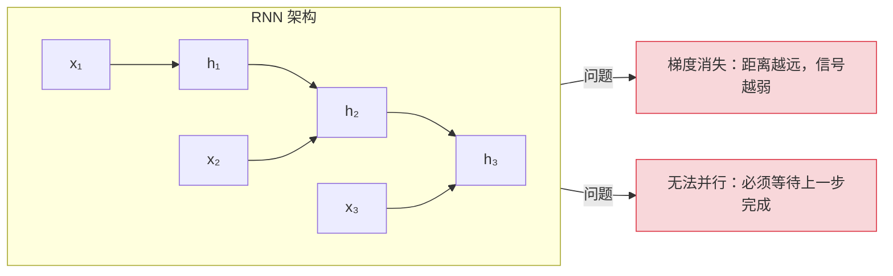
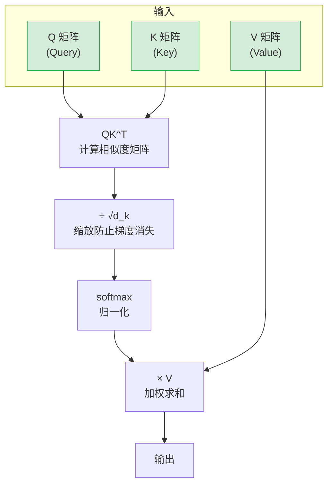
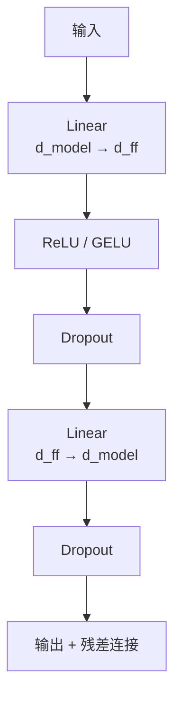
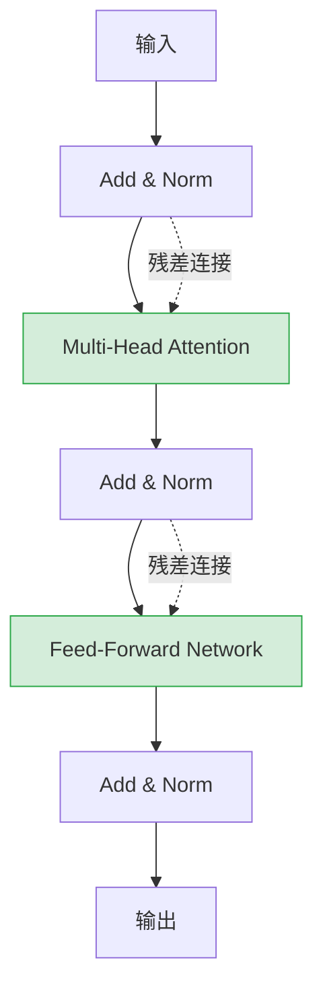

# AI 核心原理（一）—— Transformer 架构：Attention 机制的数学本质

> **环境：** PyTorch 2.0+, Python 3.10+

RNN 对长距离依赖"健忘"——当你想让模型记住第一章的变量名来回答第三章的问题时，梯度消失让这个任务几乎不可能完成。LSTM 通过门控机制勉强缓解，但 $O(N)$ 的顺序计算依然无法并行。2017 年，Attention Is All You Need 用一个反直觉的设计彻底绕过了这个瓶颈：**让每个 Token 都"看到"所有其他 Token**。

---

## 1. 序列建模的核心矛盾

在 Transformer 出现之前，RNN 是序列建模的标准答案。



LSTM 引入了门控机制：

$$ h_t = f_t \odot h_{t-1} + i_t \odot \tanh(W_{xh} x_t + W_{hh} h_{t-1} + b_h) $$

| 门控 | 作用 | 代价 |
|------|------|------|
| $f_t$（遗忘门） | 丢弃历史信息 | 信息一旦丢失无法恢复 |
| $i_t$（输入门） | 添加新信息 | 参数量翻倍，推理变慢 |
| $o_t$（输出门） | 控制输出内容 | 隐藏状态维度固定，上限低 |

LSTM 的致命缺陷：**必须按顺序计算**。第 100 个 Token 依赖第 99 个的结果，无法并行。A100 显卡算力再强，也得老老实实一个个排队。

---

## 2. Self-Attention：让每个 Token 主动"看"所有 Token

Attention 的核心思想极简：**Query 是"我在找什么"，Key 是"我有什么"，Value 是"实际内容"**。

### 2.1 Q, K, V 的物理意义

类比：图书馆检索系统。

- Query = 你的搜索词
- Key = 每本书的书名标签
- Value = 书的实际内容

你拿着 Query 跟所有 Key 比对相似度，得分最高的书，其 Value 就是你想要的答案。

### 2.2 注意力分数计算

$$ \text{Attention}(Q, K, V) = \text{softmax}\left(\frac{QK^T}{\sqrt{d_k}}\right)V $$



**为什么除以 $\sqrt{d_k}$？**

Q 和 K 的点积结果均值随 $d_k$ 增大而增大。softmax 在输入值过大时会进入饱和区，梯度接近零。

$$ \sqrt{d_k} = 64 \Rightarrow \text{缩放后方差稳定为 1} $$

---

## 3. Multi-Head Attention：分工合作的智慧

单一 Attention 头只能学到一种"关注模式"。Multi-Head 让模型同时关注不同类型的关系。

```mermaid
flowchart LR
    subgraph Input["输入 X"]
        X["原始嵌入"]
    end

    X --> Q1["Q₁"] & K1["K₁"] & V1["V₁"]
    X --> Q2["Q₂"] & K2["K₂"] & V₂"]
    X --> Qh["Qₕ"] & Kh["Kₕ"] & Vₕ"]

    Q1 & K1 & V1 --> A1["Head₁"]
    Q2 & K2 & V2 --> A2["Head₂"]
    Qh & Kh & Vh --> Ah["Headₕ"]

    A1 & A2 & Ah --> concat["Concat"]
    concat --> W_O["W_O"]
    W_O --> Output["输出"]
```

**每个头学习不同的关注模式：**

| 头 | 关注的关系 | 类比 |
|---|-----------|------|
| Head 1 | 句法结构 | 主语→动词 |
| Head 2 | 指代关系 | "它"→前文名词 |
| Head 3 | 语义相似 | 同义词、近义词 |

$$ \text{MultiHead}(Q, K, V) = \text{Concat}(\text{head}_1, ..., \text{head}_h) W^O $$

$$ \text{head}_i = \text{Attention}(QW_i^Q, KW_i^K, VW_i^V) $$

**Trade-offs：**
- 收益：捕捉多维关系，表达能力翻倍
- 代价：参数量 × h（通常 h=8），推理显存线性增长

---

## 4. Positional Encoding：Attention 本身不感知位置

Self-Attention 是**位置无关**的。"狗咬人"和"人咬狗"经过 Attention 后，Token 之间互相交换信息，但谁在左边谁在右边，模型完全不知道。

### 4.1 为什么需要位置编码

自然语言中，词序往往决定语义。

- "凯撒 打败 高卢" vs "高卢 打败 凯撒"
- 同样的 Token，不同顺序，意思天壤之别

### 4.2 三角函数编码

Transformer 原论文使用 sin/cos 函数生成位置向量：

$$ PE_{(pos, 2i)} = \sin\left(\frac{pos}{10000^{2i/d_{\text{model}}}}\right) $$

$$ PE_{(pos, 2i+1)} = \cos\left(\frac{pos}{10000^{2i/d_{\text{model}}}}\right) $$

```python
# attention_is_all_you_need.py
import math
import torch

def positional_encoding(seq_len: int, d_model: int) -> torch.Tensor:
    """生成位置编码矩阵"""
    position = torch.arange(seq_len).unsqueeze(1)  # [seq_len, 1]
    # [d_model] 维度的指数衰减项
    div_term = torch.exp(
        torch.arange(0, d_model, 2) * -(math.log(10000.0) / d_model)
    )
    # 偶数维度用 sin，奇数维度用 cos
    pe = torch.zeros(seq_len, d_model)
    pe[:, 0::2] = torch.sin(position * div_term)
    pe[:, 1::2] = torch.cos(position * div_term)
    return pe
```

**为什么选 sin/cos？**

三角函数具备一个关键特性：**相对位置可以通过线性变换表示**。

$$ \sin(A+B) = \sin A \cos B + \cos A \sin B $$
$$ \cos(A+B) = \cos A \cos B - \sin A \sin B $$

这意味着模型可以通过简单的线性层学到"距离"的概念。

**Trade-offs：**
- 收益：位置信息可泛化，支持处理训练时未见过的更长序列
- 代价：固定模式，可能不是最优。RoPE、ALiBi 等编码方式是更现代的替代

---

## 5. Feed-Forward Network：非线性变换

每个 Transformer 层还包含一个全连接前馈网络：



$$ \text{FFN}(x) = W_2 \cdot \sigma(W_1 \cdot x + b_1) + b_2 $$

典型配置：$d_{\text{model}} = 512, d_{ff} = 2048$（扩展 4 倍）。

```python
# transformer_block.py
class FeedForward(nn.Module):
    def __init__(self, d_model: int, d_ff: int, dropout: float = 0.1):
        super().__init__()
        self.linear1 = nn.Linear(d_model, d_ff)
        self.linear2 = nn.Linear(d_ff, d_model)
        self.dropout = nn.Dropout(dropout)

    def forward(self, x: torch.Tensor) -> torch.Tensor:
        # 先扩展维度，引入更多参数空间
        x = self.linear1(x)
        x = torch.relu(x)  # <--- 核心：非线性激活
        x = self.dropout(x)
        x = self.linear2(x)
        return x
```

**FFN 的实际作用：**
- Attention 做信息聚合，FFN 做非线性变换
- FFN 占用 Transformer 50-60% 的参数量
- 一些研究表明 FFN 相当于"键值记忆"

---

## 6. Layer Normalization：训练稳定性的基石

LayerNorm 让每层的输入分布保持稳定，加速收敛。

$$ y = \frac{x - \mu}{\sqrt{\sigma^2 + \epsilon}} \cdot \gamma + \beta $$

```python
# layernorm.py
class LayerNorm(nn.Module):
    def __init__(self, d_model: int, eps: float = 1e-6):
        super().__init__()
        self.gamma = nn.Parameter(torch.ones(d_model))  # 缩放参数
        self.beta = nn.Parameter(torch.zeros(d_model))   # 平移参数
        self.eps = eps

    def forward(self, x: torch.Tensor) -> torch.Tensor:
        # 计算均值和标准差（最后一个维度）
        mean = x.mean(dim=-1, keepdim=True)
        std = x.std(dim=-1, keepdim=True, unbiased=False)
        # 归一化后仿射变换
        return self.gamma * (x - mean) / (std + self.eps) + self.beta
```

**两种 Norm 的关键区别：**

| 特性 | LayerNorm | BatchNorm |
|------|-----------|-----------|
| 归一化维度 | 单样本特征维度 | batch 维度 |
| 训练/推理行为 | 一致 | 必须区分 |
| 适合的任务 | NLP、Transformer | CV、CNN |
| 可解释性 | 更稳定 | 受 batch size 影响大 |

---

## 7. 完整 Transformer 层

将以上组件组合：



**残差连接（Skip Connection）的作用：**
- 梯度可以直接回传到底层，缓解梯度消失
- 底层信息无损传递到高层
- Transformer 深达数十层仍能训练的核心保障

---

## 8. 核心权衡：O(N²) 复杂度的真实代价

Transformer 的 Attention 机制带来性能突破，但也有明确的代价。

$$ QK^T: \underbrace{N \times d_k}_{\text{计算}} \times \underbrace{d_k \times N}_{\text{计算}} = N^2 d_k $$

| 序列长度 N | 显存占用（单层，fp16） | 相对 512 的倍数 |
|-----------|---------------------|----------------|
| 512 | ~1 GB | 1× |
| 2048 | ~16 GB | 16× |
| 8192 | ~256 GB | 256× |
| 32768 | ~4 TB | 4096× |

**实际约束：**
- 单张 A100（80GB）最大支持约 32k token 全注意力
- 更长序列需要 Sparse Attention、Flash Attention 等变体
- Ring Attention 将 Attention 拆分到多卡，但通信开销巨大

```python
# flash_attention_demo.py
import torch

# 普通 Attention 显存爆炸演示
def naive_attention(query: torch.Tensor, key: torch.Tensor, value: torch.Tensor):
    """
    标准 Attention 实现
    显存复杂度: O(N²)
    """
    d_k = query.size(-1)
    # 这里会生成 N×N 的矩阵
    scores = torch.matmul(query, key.transpose(-2, -1)) / math.sqrt(d_k)
    return torch.matmul(F.softmax(scores, dim=-1), value)

# Flash Attention 显存优化演示
def flash_attention(query: torch.Tensor, key: torch.Tensor, value: torch.Tensor):
    """
    Flash Attention 实现
    显存复杂度: O(N)
    核心思想：分块计算，避免生成完整注意力矩阵
    """
    # 手动实现需使用 tiling，这里示意核心思路
    BLOCK_SIZE = 128
    # ... 分块累加逻辑
    pass
```

---

## 9. 常见坑点

**1. 位置编码不一致导致的性能崩塌**

很多开源模型用了自定义位置编码（如 RoPE），但下游任务代码用了原始 sin/cos 实现。

**现象**：推理结果随机，loss 不下降。

**原因**：位置编码不匹配，模型实际学习到的位置信息被破坏。

**解法**：确认模型配置文件中的 `position_embedding_type`，使用配套的解码逻辑。

**2. Attention _mask 的方向搞反**

因果语言模型的 mask 矩阵是下三角，而不是上三角。

**现象**：模型"看到"了未来信息，训练 loss 异常低，推理质量差。

**解法**：

```python
# 正确：下三角 mask（当前 token 只能看到自己和之前的 token）
seq_len = 512
mask = torch.tril(torch.ones(seq_len, seq_len))  # <--- 核心
# tensor([[1., 0., 0., ...],
#         [1., 1., 0., ...],
#         [1., 1., 1., ...],
#         ...])
```

**3. 混合精度训练时 Attention 溢出**

使用 fp16 时，QK^T 的点积结果可能超出 fp16 表示范围。

**现象**：nan loss，梯度爆炸。

**解法**：确保使用 `scaled_dot_product_attention`（PyTorch 2.0+）或手动缩放。

---

## 10. 延伸思考

Transformer 的 $O(N^2)$ 复杂度本质上是"全连接"的代价。自然界中，人类的注意力是高度稀疏的——你不会在阅读时平等地关注每个字。

**问题：**

- 能否设计一种"自适应稀疏"机制，让模型自己学会在什么位置"节省注意力"？
- Sparse Attention、Linear Attention、Mamba 等新架构，是真正从数学上绕过了 $O(N^2)$，还是在精度和效率之间做了妥协？
- 当上下文窗口接近 100k token 时，Transformer 的优势是否还存在？

---

## 总结

| 组件 | 核心功能 | Trade-off |
|------|---------|-----------|
| Self-Attention | 全局信息聚合 | O(N²) 显存 |
| Multi-Head | 多维关系捕捉 | 参数量 × h |
| Positional Encoding | 注入位置信息 | 固定模式，可改进 |
| FFN | 非线性变换 | 占用 50%+ 参数量 |
| LayerNorm | 训练稳定性 | 轻微推理开销 |

Transformer 的本质是**用 $O(N^2)$ 的显存换 $O(1)$ 的并行度**。在 GPU 算力充足的时代，这是一个划算的交换。但当序列长度持续增长，这个代价迟早会触碰到硬件的天花板。

---

## 参考

- [Attention Is All You Need (Vaswani et al., 2017)](https://arxiv.org/abs/1706.03762)
- [Layer Normalization (Ba et al., 2016)](https://arxiv.org/abs/1607.06450)
- [RoFormer: Enhanced Transformer with RoPE](https://arxiv.org/abs/2104.09864)
- [FlashAttention-2: Faster Attention with Better IO-Aware Parallelism](https://arxiv.org/abs/2307.08691)
- [GPT-4 Technical Report](https://cdn.openai.com/papers/gpt-4.pdf)
