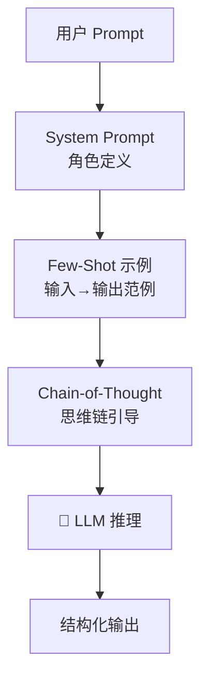

# AI 核心原理（三）—— 提示工程实战：揭秘 In-Context Learning 甚至连载

> **环境：** 任意支持 System Prompt 与 Few-Shot 能力的指令微调大模型 API (如 Claude 3.5, GPT-4o)

不少后端工程师很排斥"提示工程（Prompt Engineering）"，觉得那不过是一门靠堆砌溢美之词去"讨好" AI 语言模型的忽悠玄学。
但如果回归底层架构，当你往 Prompt 里丢入两个示例并让它照葫芦画瓢时，**模型内部庞大的神经网络矩阵，其实正在经历一场无需改变任何权重的隐性反向更新。**

---

## 1. 原理剥析：这不是魔法，是隐式微调



当我们不通过 LoRA 或者全参数 SFT 去改变模型的基底文件，为什么仅仅提供少量示例（Few-Shot），模型就能奇迹般地掌握一个从未见过的新任务提取格式？

这背后的数学内核叫 **In-Context Learning (ICL，上下文学习)**。

### 隐式梯度下降（Implicit Gradient Descent）

斯坦福大学与 MIT 的多项对照验证表明，大语言模型的推演机制可以理解为一套动态的系统：
你塞进 Context 上下文历史里的每一个示例输入和参考答案 $(x_i, y_i)$，在 Transformer 的 Attention 矩阵层进行正向的前向传播推算时，在数学等效上，**等同于这个模型拿着这些样本在内部给自己执行了一次梯度下降更新**。

这也就意味着，**你写 Prompt 里的 Example 示例，就是在实时的构建微调训练集。**

### Induction Heads（归纳头电路）

这套动态更新的生理结构支撑，来自于一种被 Anthropic 定位到的特殊注意力神经元组合：**Induction Heads（归纳头）**。
它们的逻辑只讲究模式匹配，相当于一个强大的正则提取复读机。当你输入序列展现出：
`[A] 后面总是固定跟着 [B]` 这个结构特征时。

只要新的序列一触发 `[A]`，Induction Heads 的特征神经就亮了，它会利用注意力矩阵强行把目标位锚定在之前的 `[B]` 的映射逻辑上将其复制。这就是大模型具有强大的 Few-Shot 例句照抄能力的核心底色。

## 2. 结构化驯服：CO-STAR 实战框架

知道了原理，如果只拿纯自然语言写一坨千字长文布置需求，模型会陷入巨大的注意力涣散漩涡。对于越高级的底层指令基座，越需要使用代码式的结构学设计。

目前新加坡科技局总结的 **CO-STAR** 框架结合 XML 结构是工程师控制幻觉的标配手段。

### 显式权衡（Trade-offs）
提供复杂的 CO-STAR 背景描述和海量的 XML 示例包裹，**代价是极端拉伸首字返回时间（TTFT）并抬升输入 Token 的网络耗时成本**。但换来的是 JSON Schema 解析时高达 99.9% 的零容错强制输出格式匹配率。

```xml
<system_instruction>
  你是一个被植入在 VS Code 编辑器内的无情重构检查插件。
</system_instruction>

<!-- <--- 核心结构：使用明确打断的 XML Tag 来强制隔绝上下文干扰 -->
<context>
  原始代码库正在进行 React 18 到 19 的语法升维，所有旧的 useEffect 挂载数据必须被全部拔除。
</context>

<objective>
  找出以下变更大纲中，还带有没有被完全清理的代码死角。
</objective>

<rules>
  1. DO NOT 解释你的思考逻辑，因为你是供程序解析的 API。
  2. 输出严格被锁死在 JSON 字符串，任何前后多余的 Markdown 代码块引用符 Markdown 都会让调用端崩溃。
</rules>
```

> **观测验证**：使用上述带有 `<rules>` 强限制的 Prompt 调用 Claude API，并且设置响应格式要求卡死。验证成功的结果是：你只能从后台监控的 RAW 响应体里收到带有起步 `{` 的光秃秃文本，哪怕有任意一次附带了 `好的，没问题。以下是...` 这类寒暄，都说明你的 Prompt 防御被穿透了，规则不够强悍。

## 3. 思维链 CoT：用过程换取胜率

当你要求模型直接吐出最终结果时，模型本质是在复杂的知识空间里进行单步全量搜寻。容易被局部的概率高峰骗入死胡同产生幻觉（例如算力大如 GPT-4 也会算错鸡兔同笼）。

加入要求其“一步一步想（Think step by step）”的指令，会让模型从一口气推导变成接力演算。每生成一句过程推导（如"既然鸡和免总共有35个头..."），这句刚生成的话语就会重新加入长记忆上下文作为前置输入，强行排除了其余不可能的解空间路径组合，**让错误的概率坍缩聚集**。

## 4. 常见坑点

**1. 互相打架的 Few-Shot 例证**
你在 `<example>` 代码块里提供了三组非常详尽的问答对照样例，希望模型照做。结果发现在第二组样例里，你为了偷懒复制粘贴少写了一行返回值的验证字段。
这会让刚刚提到的隐式梯度下降逻辑陷入混乱：底层模型会以为你的目标函数带有随机抛弃该验证值的可能特征，于是它在回答真实问题时也开始随即乱扔字段。
**解法**：如果你要在 Prompt 里放 Few-Shot 标杆样例，每一个样例的标点符号、回车缩进，必须保持军事化的一致性对齐。宁愿零示例（Zero-shot），也绝不放错了一个脏数据样本。

## 5. 延伸思考

既然在系统级 Prompt 里写入大量极其缜密的规则和各种条件判断语句（ICL），在数学机制上等效于模型自己跑了一轮梯度微调（Fine-Tuning）。

那么请问，这俩工具到底孰优孰劣？在你的真实业务代码构建里，什么场景下你会把 1000 个问答用例打包成 Dataset 扔进 GPU 去跑几小时的 LoRA 权重炼丹，什么场景下你宁可把它们挤进超长的 Prompt 提示词窗口耗费每笔的流媒体调用量？

## 6. 总结

- ICL（上下文学习）通过底层神经原里的 Induction Heads 网络实现了零权重调整的特化变身。
- XML 标签的层叠加上 CO-STAR 的立体环绕定性，能抹除多余的漫天遐想概率噪声。
- 用 Prompt 去构建严丝合缝的需求门槛，绝不只是文科生的遣词造句，而是彻底的数据架构工程。

## 7. 参考

- [In-context Learning and Induction Heads (Anthropic Research)](https://transformer-circuits.pub/2022/in-context-learning-and-induction-heads/index.html)
- [Why Can GPT Learn In-Context? Language Models Secretly Perform Gradient Descent as Meta-Optimizers](https://arxiv.org/abs/2212.10559)
