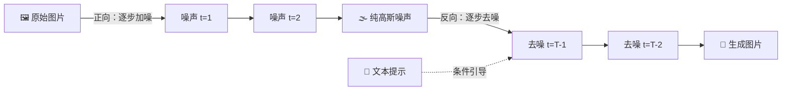

# AI 核心原理（四）—— 视觉生成：从 Diffusion 数学原理到 DiT 演进

> **环境：** Diffusers 0.30+, PyTorch 2.4+，底层覆盖 Flux.1/SD3/Sora 架构生态

如果说 LLM 模拟了人类词汇堆叠的句法逻辑，那 Sora 和 Flux 这类以假乱真的视觉生成模型，本质上是在用数学方程式逆向推演物理世界中的热力学熵增定律。

你可以很容易地把一滴红墨水搅拌到纯净的自来水中直到它变得混沌不堪。但如何把一杯浑浊的墨水水，再一丝一毫不落得反向剥离出一滴纯净的红墨水？这也是图像生成工业的终极命题。

---

## 1. 扩散模型 (Diffusion)：不是绘画，是去噪

Diffusion 的底层思想并非一笔一划地给像素打草稿画图，而是本质上只是**去噪（Denoising）工程**。

### 数学直觉：预测噪声的残差

算法不需要笨拙地真的模拟水滴一秒秒扩散的时间轴（前向加噪过程）。因为马尔可夫链和高斯概率论早就给出了公式：只要有一个随机常数步数 $t$，我们就能瞬间一步算出原本清晰的原图此时被叠加成了什么模样的带噪图像 $x_t$。

而那个试图凭空捏造图片的模型，它要做的事情极其朴素：在一个残破不堪的雪花屏中，在得知今天是第 $t$ 步的参数下，努力**预测出当年被撒进这幅图里的一把噪声 $\epsilon$** 到底长啥样。

即使底层的变分下界推导天书一样繁琐，最终落到代码实现时，监督它打分的 Loss 函数退化为简单的差值对比：

$$ Loss = \| \epsilon_{True} - \epsilon_{Predicted} \|^2 $$

传统 DDPM 需要 1000 步采样才能生成可用图像。每一步都要跑一遍 U-Net，生成一张图等待时间以秒计算。

> **观测验证**：使用 `diffusers` 库去初始化一段基础的 DDPM 管道代码去跑图，你会发现在控制面板输出的每一个 progress iteration step 里，传给底层算法的核心变幻数字只有时间点 `t` 和一个含有高频噪点的 Tensor，完全找不到任何对线条描边的坐标点阵描述。

## 2. DiT (Diffusion Transformer)：告别卷积 U-Net

在 Stable Diffusion 早年统治二次元时期，老旧的 U-Net（一种卷积神经网络架构 CNN）是万花筒的核心发动机。但随着 Sora 的出圈跟 Flux 的破空来袭，**DiT 已经全方位接管图像战争**。

**显式权衡（Trade-offs）**：

CNN 的硬伤是天生的短视。用局部感受野卷积一块像素拼一块，一旦遇到画面里第 1 帧的鸟飞到第 150 帧，它根本想不起来之前那只鸟掉毛了没，所以以前的 AI 视频动辄肢体扭曲变形。

虽然换上包含全局视野 Attention 的 DiT，彻底根治了超高分辨率及长时序视频由于"遗忘"引发的违和感。但背后的代价是拉高了数个量级的超大算力需求及 $O(N^2)$ 的暴力硬件墙。

### 核心微操：AdaLN 的魔法降临

给模型传达"帮我画一只戴墨镜赛博朋克风猫"的这个文字串（Prompt），模型是怎么搞懂它的？魔法发生在一种名为 **AdaLN (Adaptive Layer Norm)** 的动态层切片里。

- Prompt 不仅仅是一个贴在旁边的文本 Embedding，它像是一种注射剂，直接动态侵入了神经网络深处的归一化系数（缩放 $\gamma$ 与偏移 $\beta$）。
- 如果要求的是"黑夜雷厉风暴"，参数会被扭曲以大幅激进压低所有的亮度通道；如果是"明亮阳光"，它在每一步就拼命压制高对比度的噪点突进。

## 3. Flow Matching 时代的闪击降临

传统 Diffusion 由于步长必须细碎切分的理论缺陷，像是在布满大雾中的黑森林漫步随机游走盲目摸索。如果你强行只走两步，出来的可能只是一堆恶心的色块。

Stable Diffusion 3 与当下宇宙最强的开源标杆 **Flux.1**，抛弃了旧架构，切换到了数学上更直接的 **Flow Matching（流匹配）** 指南上。

- 它的目的只有一个：不再绕远路，直接尝试以最直接的方式，在无序的"噪声点分布集"于真实的"图像点分布集"之间拉扯出一条**笔直且最短直达（Straight Path）的导流管线**。
- 这个改动让工业界最痛恨的"50 步抽卡太久了"成为历史。现在你只要 4 到 8 个 Step，通过大步长采样就能生成一幅摄影级别的巨片。相比 DDPM 的 1000 步，这是 2 个数量级的效率提升。

## 4. 常见问题：物理常识崩塌的悬崖

**物理规律靠强背硬扛的涌现灾难**

Sora 震撼世界的那几天，无数自媒体鼓吹模型自身懂得了如何编写一套三维物理重力交互引擎。这实际上是极其危险的拟合错觉。

**解释**：DiT 并没有真正内生出万有引力常数 `g = 9.8` 的计算公式。它只是因为见过了海量杯子碎裂的高清时序图片切片，通过强制预测下一块被时空压缩后的 3D VAE Latent 色块应该怎么移动，而拼装出的一连串帧对偶动画。

如果在训练集没有给它看过玻璃杯子往天上飞的悬浮现象，你强行让它生成"桌子砸烂飞天杯子"，这会导致该模型直接在连续物理推导帧里直接变形破相，甚至前后帧人物因为像素拉丝变成异形。本质说明这依然只是 2D 到 3D 的超大容量贴图动画而已。

## 5. 延伸思考

Sora 展示出了对复杂遮挡物的追踪保持（也就是车子开到桥洞后，驶出来还是同一辆车），这依靠极其暴力的巨型 Transformer 时间线跨度记忆在支撑。

你相信完全没有硬编码一套真正的类似虚幻引擎物理数学碰撞系统注入到底座里的架构，只通过投喂万亿级小时时长的视频，这头超级算力怪兽终有一天能真正依靠隐空间矩阵乘法"悟出"完整的微观世界量子力学定律和时间常数吗？

## 6. 总结

- 扩散理论不是描绘图的过程，它是一场针对底片强行去除白噪点的预测。
- DiT 把传统的 CNN 替换并拔除了老旧的近视眼，但也带来了恐怖级别的算力门槛跃迁。
- 追求极致的高效流匹配生成管线让 1000 步的渲染迭代浓缩到了 4-8 步的极速赛道里。
- 不引入真正的物理守恒定律方程，视频生成的模型尽头其实依然摆脱不了一本正经的梦境连环画性质。

## 7. 参考

- [Denoising Diffusion Probabilistic Models (DDPM)](https://arxiv.org/abs/2006.11239)
- [Scalable Diffusion Models with Transformers (DiT)](https://arxiv.org/abs/2212.09748)
- [Flow Matching for Generative Modeling](https://arxiv.org/abs/2210.02747)
