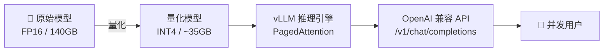

# AI 核心原理（五）—— 本地部署：量化压榨与 vLLM 显存管理

> **环境：** 任意支持 CUDA 12.x 的 GPU 环境环境，底层支持 vLLM 0.4.x+, Ollama/llama.cpp 架构

买了一张昂贵的 24G 显存 4090，跑一个区区 14B 的开源模型，自己玩挺流畅，但只要稍微加上十几个并发请求，后台瞬间无情地抛出 `CUDA out of memory`。
为什么显卡监控上 Tensor Core 的算力使用率还没拉满，推理服务器就先崩溃宕机了？

因为大模型推理，从来都不是拼谁的算术单元算得快。

---

## 1. 原理剥析：被卡死在内存墙上

GPU 就像一个拥有几万个引擎的超级跑车（Tensor Core 矩阵乘法单元），但它的油管（显存带宽 Memory Bandwidth）却细得可怜。

**Memory Bound（显存受限瓶颈）**
生成文本是一个不可并行的连串任务结构（Auto-regressive）。每生成 1 个 Token（也就是一个单词字词），底层的硬件就要把那巨大的几十 GB 权重参数，从显存（VRAM）原封不动地搬运一遍到计算单元（SRAM）里。

所以大部分时间里，算力单元都在无聊地等待数据传过来。
这也解释了为什么 Apple 的 M 系列芯片在推理大模型时能跨界越级打怪——因为苹果的**统一内存架构（UMA）**直接把带宽拉到了恐怖的 800GB/s。

## 2. 破局手段：量化（Quantization）

既然下水管道（带宽）拓不宽，那就想办法把传过去的水体积强行变小。

**显式权衡（Trade-offs）**：
量化的本质就是把高精度的浮点数（`FP16`，占据 16个 bit），强行低清晰度地映射挤压进整数坑位（`INT4`，4个 bit）。
- **收益**：模型体积立马缩水 4 倍，原先 14B 模型需要 28GB 显存，现在只要一块 8G 的平民卡就能跑，同时带宽搬运速度倍增。
- **代价**：模型会变损变笨。特别是 LLM 内部有一些激活数值会毫无规律地呈现比其他值大上百倍的**离群点（Outliers）**，如果粗暴挤压，这类核心逻辑特征会被强行截断，发生严重的常识推理灾难。因此目前业界大量采用像 `AWQ` 和 `SmoothQuant` 这样将难度转移分布的高级非对称量化技巧。

## 3. vLLM 与 PagedAttention 的降维打击

光缩小模型还不够，挡在多并发面前的绝望大山是 **显存碎片化**。

以前的推理程序很蠢，一个用户请求进来，不知道他要聊 10句 还是 1000句。所以系统就按照最大可能（比如 8k 长度）直接在显存里划走一大块连续的 KV Cache 保留地。最后用户说了句"你好"就跑了，显存占用了 99% 但全都是空的废料，导致其余新用户全部卡死排队。

**PagedAttention 操作系统级灵感**
vLLM 借鉴了操作系统做内存分页（Virtual Memory）的思路：
无论你的上下文多长，显存被全部分切成不连续的一个个小格子（Block，比如 16MB）。
KV Cache 不需要连续安放，哪里有空位填哪里，系统通过查一页目录表（Page Table）去拼装回来。

经过这种拼图魔法，显存浪费率从高达 60% 断崖式跌落到 **低于 4%**。同样的机器能硬抗的吞吐量（Throughput）暴涨数倍乃至 20 倍。

## 4. 常见坑点

**1. GGUF 格式下异构调度的灾难延迟**
普通开发者使用 Ollama 跑 `GGUF` 按道理依靠 mmap 直接零拷贝进显存应该快到飞起。但很多人发现出字速度极其卡顿。
**解释原因**：你下载的模型太大或者显存太小，导致 30 层 Transformer 有 20 层装在了 GPU，剩下的 10 层溢出并退回到了系统 CPU 内存里。导致每次前向传播推理，庞大的张量数据要在极其龟速的 PCIe 接口线上来回搬运，硬生生把跑车拖成了拖拉机。
**解法**：在启动时严密查阅 Ollama 日志，如果发生溢出，果断换更小参数体量的版本或者更高压缩比的量子位层级（比如从 `Q8` 降到 `Q4_K_M`），保证 **100% 的 Layers 全部 offload 进 GPU 显存内**。

**2. vLLM 默认吃满卡的惊吓**
很多刚上手 vLLM 的后端一跑就发现自己的整块 A100 直接 100% 被瓜分占满，以为中了挖矿木马，无法给旁边的其它小模型部署留空间。
**解法**：vLLM 贪婪的设计默认会在引擎启动时去占据可达额度的极限显存预留给 Cache 碎片。你必须手动在启动参数增加 `--gpu-memory-utilization 0.6` 卡死其资源调度。

## 5. 延伸思考

近年来，Google 力推 TPU，新兴厂商猛攻针对推理专门极致简化的 LPU（Language Processing Unit，砍掉巨量没用的通用图形算子，只做海量快取）。
面对这种算力底座完全解耦替换的浪潮，你觉得未来几年内，大模型推理还会是英伟达 GPU 的天下吗？这帮底层生态会重演 CPU 和 GPU 多年分庭抗礼的态势吗？

## 6. 总结

- 核心矛盾是内存带宽太细，Tensor 计算单元太空闲。
- 量化技术牺牲微弱模型精度，以 4 倍的比例成吨地解决带宽搬运瓶颈。
- PagedAttention 干掉了长句预分配显存浪费，是企业级高并发底座的核心标准。
- 对于本地消费级显卡部署，保障模型完整切入显存远离 PCIe 交互是核心底线。

## 7. 参考

- [Efficient Memory Management for Large Language Model Serving with PagedAttention](https://arxiv.org/abs/2309.06180)
- [SmoothQuant: Accurate and Efficient Post-Training Quantization for Large Language Models](https://arxiv.org/abs/2211.10438)
