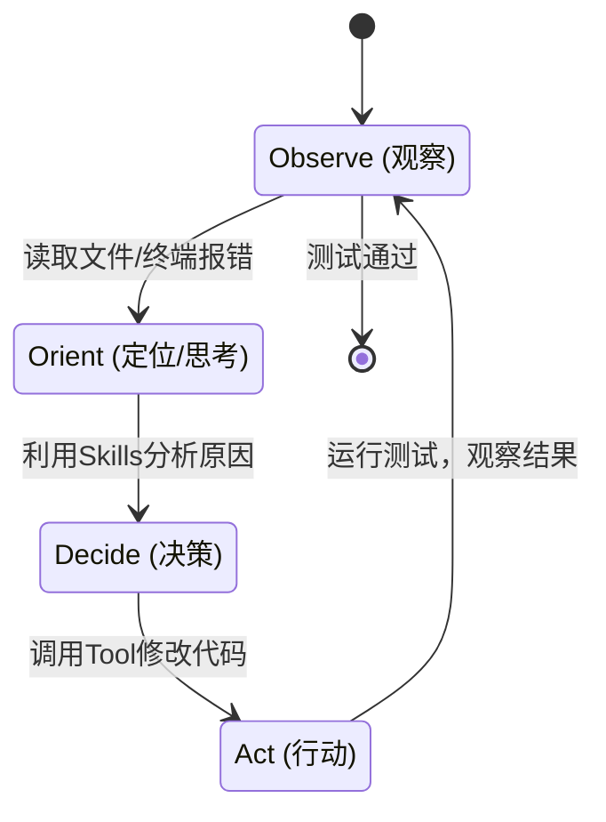

# 06. 编程新范式：从 Copilot 到 Agent (Antigravity & MCP)

> [!IMPORTANT]
> **警告：硬核内容**
> 
> 本文不再讨论“AI 能帮人写什么代码”，而是探讨“**如何构建一个自动化的 AI 研发团队**”。
> 本文会拆解 **Antigravity / Claude Code** 的运行机制，并详细介绍如何配置 **.agent/rules** 和编写 **MCP Server**。

## 1. 架构演进：从 “补全” 到 “循环”

### Copilot 的局限 (Stateless)
传统的 Copilot 是**无状态**的。它只看当前文件的光标位置 + 最近打开的 Tabs。
它就像一个**健忘的实习生**：告诉它改了 A 文件，它下一秒去 B 文件时就忘了 A 的改动。

### Agent 的核心：OODA 循环
Antigravity 和 Claude Code 引入了 **OODA Loop (Observe-Orient-Decide-Act)**。



*   **持久化记忆 (Memory)**：它会维护一个 `context` 窗口，记录过去 10 轮的操作。
*   **主动式终端 (Active Terminal)**：它不光会生成代码，还会**真的运行** `ls`, `grep`, `npm test` 来验证自己的假设。

---

## 2. 核心配置：Rules (构建 AI 宪法)

Antigravity/Cursor 允许用户通过配置文件定义 AI 的行为准则。这不只是提示词，这是**系统级约束**。

### 实战：编写一个生产级的 `.agent/rules` (或 `.cursorrules`)

在项目根目录创建文件，内容如下：

```markdown
# Project Context
Stack: Next.js 14, TailwindCSS, PostgreSQL, Prisma.
State Management: Zustand only (No Redux).

# Code Style (强制执行)
1. **Functional Components**: Use `const Component = () => {}` syntax.
2. **Types**: 
   - Strict TypeScript everywhere. 
   - interfaces usually prefixed with `I`.
   - No `any`, use `unknown` if unsure.
3. **Error Handling**:
   - Backend: All API routes must act within a `try/catch` block.
   - Frontend: Use `react-hot-toast` for user-facing errors.

# Agent Behavior
1. **Always Verify**: After writing code, ALWAYS run `npm run lint` before returning control to user.
2. **Think in Steps**: If a task involves >2 files, list the plan first.
3. **No Placeholders**: Never leave comments like `// ... rest of code`. Write full code.
```

**为什么这很重要？**
如果不写这个，AI 可能会给你写 Class Component，或者引入 Redux，导致每次都要花时间纠正它。**Rules 是提效杠杆率最高的地方。**

---

## 3. 连接万物：MCP (Model Context Protocol) 详解

MCP 是 Anthropic 提出的开放标准，是为了解决“AI 无法访问外部数据”的痛点。
它采用了 **Client-Host-Server** 架构：

*   **Client**: IDE (Cursor/Antigravity)。
*   **Host**: 运行环境。
*   **Server**: 实际连接数据源的插件 (Git, Postgres, Filesystem)。

### 实战：手写一个简单的 MCP Server

假设想让 AI 能**查询实时的加密货币价格**（这是训练数据里没有的）。
我们需要写一个简单的 Python MCP Server。

**1. 安装依赖**
```bash
pip install mcp
```

**2. 编写 `crypto_server.py`**

```python
from mcp.server.fastmcp import FastMCP
import httpx

# 初始化 MCP 服务
mcp = FastMCP("Crypto-Helper")

@mcp.tool()
async def get_crypto_price(symbol: str) -> str:
    """
    获取加密货币的实时价格。
    Args:
        symbol: 代币符号 (例如 'bitcoin', 'ethereum')
    """
    url = f"https://api.coincap.io/v2/assets/{symbol.lower()}"
    async with httpx.AsyncClient() as client:
        response = await client.get(url)
        data = response.json()
        
    if "data" in data:
        price = float(data["data"]["priceUsd"])
        return f"Current price of {symbol}: ${price:.2f}"
    else:
        return f"Error: Could not find {symbol}"

if __name__ == "__main__":
    mcp.run()
```

**3. 在配置中挂载**
在 IDE 的 MCP 配置中添加：

```json
{
  "mcpServers": {
    "crypto": {
      "command": "python",
      "args": ["/path/to/crypto_server.py"]
    }
  }
}
```

**4. 效果**
现在，在对话框里问：“比特币现在多少钱？”，AI 会自动调用 `get_crypto_price("bitcoin")` 并告诉你实时价格。
**这就是 MCP 的威力：无限扩展 AI 的能力边界。**

---

## 4. 技能与工作流 (Skills & Workflows)

### Skills: 封装好的能力块
在 Antigravity 中，Skill 是一组预定义的 Prompt + Tools 集合。
前端常用的 `frontend-design` skill 可能包含：
*   **Prompt**: "你是一位获得 awwwards 奖项的设计师..."
*   **Tool**: 调用 `Pencil` MCP 生成线框图。
*   **Knowledge**: 内置了 Material Design, Tailwind 配色表的知识。

### Workflows: 将 SOP 代码化
Workflow 是将复杂的任务流程化。比如一个 **Feature Dev Workflow**：

1.  **Requirement (需求分析)**:
    *   Input: 用户的一句话描述。
    *   Action: 调用 `/brainstorm` skill，分析出 User Stories。
2.  **Design (设计)**:
    *   Action: 使用 `frontend-design` skill 生成组件结构。
3.  **Code (编码)**:
    *   Action: 写代码，并自动应用 Rules。
4.  **Verify (验证)**:
    *   Action: 运行 `npm test`。如果有错，自动进入 Debug Loop。

## 5. 社区精选：GitHub Star Top 10 Skills (MCP Servers)

为了不让大家重复造轮子，这里整理了 GitHub 上最热门的 10 个 MCP Server，安装即用：

| 排名 | Skill Name | 作用 | 核心场景 |
| :--- | :--- | :--- | :--- |
| **01** | **[Filesystem](https://github.com/modelcontextprotocol/servers/tree/main/src/filesystem)** | 文件读写 | **必装**。允许 AI 读取、修改本地代码和文档。 |
| **02** | **[Git](https://github.com/modelcontextprotocol/servers/tree/main/src/git)** | 版本控制 | 允许 AI 自动 Commit, Push, 查看 Diff。 |
| **03** | **[Brave Search](https://github.com/modelcontextprotocol/servers/tree/main/src/brave-search)** | 联网搜索 | 让 AI 拥有实时信息，不再受限于训练数据截止日期。 |
| **04** | **[PostgreSQL](https://github.com/modelcontextprotocol/servers/tree/main/src/postgres)** | 数据库操作 | 允许 AI 直接查询 DB，进行 schema 检查或数据分析。 |
| **05** | **[Puppeteer](https://github.com/modelcontextprotocol/servers/tree/main/src/puppeteer)** | 浏览器操控 | 让 AI 打开网页，截图，从动态 JS 页面抓取数据。 |
| **06** | **[Slack](https://github.com/modelcontextprotocol/servers/tree/main/src/slack)** | 团队协作 | AI 可以读取即时通讯记录，甚至在群里发送通知。 |
| **07** | **[Sentry](https://github.com/modelcontextprotocol/servers/tree/main/src/sentry)** | 错误监控 | AI 自动拉取最新的报错日志，分析堆栈，提出修复建议。 |
| **08** | **[Google Drive](https://github.com/modelcontextprotocol/servers/tree/main/src/gdrive)** | 办公文档 | 读取公司共享的 Doc/Sheet，作为知识库来源。 |
| **09** | **[Memory](https://github.com/modelcontextprotocol/servers/tree/main/src/memory)** | 长期记忆 | 给 AI 一个简单的知识图谱，记住用户的偏好。 |
| **10** | **[Sequential Thinking](https://github.com/modelcontextprotocol/servers/tree/main/src/sequential-thinking)** | 深度思考 | 强制开启 System 2 慢思考模式，适合复杂逻辑推理。 |

> [!TIP]
> **如何安装？**
> 大多数通过 `npx` 或 `pip` 即可直接安装。建议查看 `modelcontextprotocol/servers` 官方仓库获取最新配置。

## 6. 总结：如何构建 AI 团队？

1.  **立规矩 (Rules)**：先把项目规范写进 `.agent/rules`。
2.  **加装备 (MCP)**：把数据库、Git、设计工具（Pencil）通过 MCP 连接给 AI。
3.  **练技能 (Skills)**：针对特定任务（修Bug、写前端、写SQL）加载对应的 Skill。
4.  **定流程 (Workflows)**：用 SOP 约束 AI 的行为，防止它发散。

做到这四点，面对的就不再是一个冷冰冰的聊天机器人，而是一个**经过严格训练、装备精良、懂用户习惯的数字化研发团队**。
