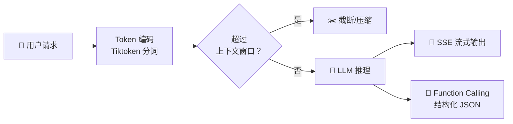

# AI 核心原理（七）—— API 工程化：Token 算法、SSE 与函数调用

> **环境：** OpenAI/Anthropic 官方 API 标准接口，Python 3.10+, Tiktoken SDK

初学者觉得 AI 开发就是拿着 Key 调一个 `POST` 请求获取结果，极其简单。
但当这套系统上到了生产环境：前端面对空转十秒的白屏，中后台半夜报 `context_length_exceeded` 异常崩溃。

---

## 1. 致命边界：Token 计算与截断



模型可不是按"你的字数"算钱和算容量的，所有的计量单位都是 Token（分词碎片）。
模型的上下文窗口（Context Window）不仅包含你传过去的 Prompt，还包含它将要打出来的字。

### 显式权衡（Trade-offs）
大窗口（比如 128k）很爽，但越长的输入历史代表着越发昂贵的 API 调用单价和指数增幅的计算卡顿。如果不提前精准算准即将超标的 Token 盈余，**很多闭源模型会不讲武德地开启默认沉默截断（Truncation）**：它会强行抛弃掉你最早期设定的系统 Prompt 人设，导致角色在一个聊了很久的对话后期突然崩塌错乱发癫。

### tiktoken：坚决抵制模糊估算

如果你还在用 `len(text) / 2` 这种拍脑袋的方式猜 Token，系统出故障是迟早的事情。
必须引入跟官方一致的 BPE 分词字典跑本地预估：

```python
import tiktoken

def calculate_exact_tokens(text: str, model_name: str = "gpt-4o") -> int:
    # <--- 核心：拿到针对具体模型特化的分词映射表
    encoding = tiktoken.encoding_for_model(model_name)
    return len(encoding.encode(text))

print(calculate_exact_tokens("这是一个非常复杂的 Token 计算")) 
```

## 2. 体验拯救者：SSE 单向流式传输

如果你的模型分析长达一分钟，让用户看一分钟的 Loading 圈，这产品直接宣告死亡。
ChatGPT 是如何做到那种丝滑的"打字机"挨个往外蹦字效果的？这不是什么高深双向 WebSocket 魔法，而是基于 HTTP 的单向低消耗老旧协议：**Server-Sent Events (SSE)**。

SSE 让服务器可以在收到一个普通拉取请求后，不切断连接通道，并且源源不断地向客户端推挤碎片数据。

```http
HTTP/1.1 200 OK
Content-Type: text/event-stream

data: {"choices": [{"delta": {"content": "今天"}}]}

data: {"choices": [{"delta": {"content": "天气"}}]}

data: [DONE]
```

> **观测与验证**：打开你平时用的任何包含流式生成的 AI 对话 Web 网站，在 Chrome DevTools 的 Network 面板里找到那条一直处于 Pending 未断开的核心对话请求。在 `EventStream` Tab 栏下查看，如果你能看到一条条以 `data:` 开头紧接着 JSON 碎片的日志像瀑布一样连续打出，说明前端顺利接管了 SSE 渲染解析通道。

## 3. Function Calling：扒开外衣的 Prompt

API 的高级玩法 Function Calling (工具调用)，让许多开发者以为模型内部长出了一个沙盒环境去跑了代码。

这完全是假象。Function Calling 底层依然是最古老的 **Prompt Injection (提示词强行注入)**。

当你在传入参数中定义了 `tools = [...]` 配置时，OpenAI 后台网关做的唯一一件事就是阻遏一下请求。把你的代码 Schema，利用特定格式翻译回了一段极为严苛的伪代码文本塞进了发给模型的隐藏系统提示词里。

```markdown
// 模型实际看到的被强行加塞进来的隐身 Prompt 结构片段：
## 拥有的工具集
你有权限访问如下沙盒能力：
namespace functions {
  type get_weather = (_: {
    location: string,
  }) => any;
}

## 核心规约
如果用户问题能命中上述工具，立即停止用聊天散文回复！给我输出严丝合缝匹配的 JSON Object。
```

## 4. 常见坑点

**1. ChatML 格式下的隐形 Token 刺客**
假设你的窗口只剩刚好 10 个 token 的额度，而你的最新消息刚刚好算准了包含"九个 token"，发送出去却被 API 粗暴打出 `MaxTokenError`。
**原因解释**：你只计算了文本本身的 Token 身价。但现代大模型的对话数组包装（Messages array）在底层都会被包裹上 `<|im_start|> user \n 内容 <|im_end|>` 等特殊控制截断字符。每一次问答都会产生约 3到4个不可见的额外系统 Token 损耗（Overhead）。
**解法**：预留水位。做滑动窗口截除历史记录时，永远为每次发送留出 5% 左右的绝对安全盈余区，不能卡死极值。

**2. SSE 流式打字导致 JSON 工具解析直接炸飞**
**解释原因**：当你开启 `stream=True` 并同时在使用类似"要求模型输出复杂嵌套 JSON 财报格式"的任务时。前端收到的是一段被切割的残缺字符串 `{"name": "Ap`。此时你去用原生的 `JSON.parse` 糊上去，必定爆出解析错误。
**解法**：在流式拼装未收到最后一条标志结束报文时，必须挂载像 `partial-json` 这样的库充当缓冲区拦截转换，或者强行用正则粗取兜底再映射至表格层。

## 5. 延伸思考

TTFT（首字响应时间 Time to First Token）和 TPS（每秒吐出 Token 数 Tokens Per Second）是 AI 工程学里评判链路健康的唯二黄金指标。

由于首段极长的 Prompt（超过上万字文件分析）带来的 Attention 计算压力，TTFT 也就是预填充等待时间甚至长达数秒难以逾越。目前除了砸钱换更好的卡池，你有没有在业务中见过哪些精妙的缓存或预计算设计来秒接这种“百页文档重提首问”的低延迟起手优化呢？

## 6. 总结

- 过长的上文如果不加以 Tiktoken 算法的主动裁剪管理，会遭遇闭源架构致命的默默截断失忆。
- SSE 流式协议彻底改变了传统的 HTTP 等待逻辑，但给工程层面的半挂 JSON 解析带来了严重冲击。
- 把 Function Calling 祛神圣化，本质依然基于大语言模型自然文本生成的概率涌现。

## 7. 参考

- [Using Server-Sent Events (MDN Web Docs)](https://developer.mozilla.org/en-US/docs/Web/API/Server-sent_events/Using_server-sent_events)
- [OpenAI 官方关于 Token 细粒度计算的最佳实践论文指引](https://cookbook.openai.com/examples/how_to_count_tokens_with_tiktoken)
