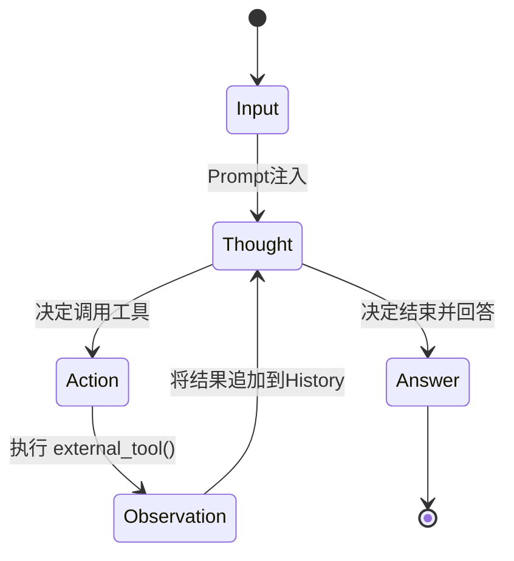
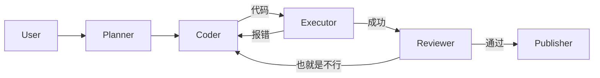

# 09. Agent：有限状态机 (FSM) 与图论架构

> [!NOTE]
> **从脚本到自主系统**
> 
> Agent 不是魔法，它是**循环 (Loop)** 和 **状态管理 (State Management)** 的结合体。
> 从计算机科学的角度看，Agent 本质上是一个运行在 LLM 之上的 **有限状态机 (Finite State Machine)**。

## 1. 理论模型：ReAct 的 FSM 视角

ReAct (Reason + Act) 是最基础的 Agent 模式。可以把它建模为一个状态机：

$$ S = \{ \text{Thought}, \text{Action}, \text{Observation}, \text{Answer} \} $$

*   **Thought (思考)**: 由于 $LLM(P(\text{next}| \text{Observation}))$ 生成。
*   **Action (行动)**: 解析 Thought 中的 Tool Call。
*   **Observation (观察)**: 执行环境 (Env) 的反馈结果。



**关键点**：这整个过程必须在一个 Context Window 内完成。如果 History 太长，就需要 **Memory Summary (记忆压缩)** 策略。

## 2. 代码级拆解：ReAct Prompt 模版

Agent 到底是怎么跑起来的？核心在于这个 Prompt 模版（以 LangChain 为例）：

```text
Answer the following questions as best you can. 
You have access to the following tools:

{tools}  <-- 工具描述注入在这里

Use the following format:

Question: the input question you must answer
Thought: you should always think about what to do
Action: the action to take, should be one of [{tool_names}]
Action Input: the input to the action
Observation: the result of the action
... (this Thought/Action/Observation can repeat N times)
Thought: I now know the final answer
Final Answer: the final answer to the original input question

Begin!

Question: {input}
Thought: {agent_scratchpad}  <-- 历史对话记录在这里
```

**Stop Sequence (停止符)**:
这一点非常重要。LLM 生成完 `Action Input` 后，必须立刻由程序强行打断（Stop Generation），不能让 LLM 自己生成 `Observation`（那是幻觉）。
程序接管，运行 Python 函数，拿到真实结果，拼接到 Prompt 后面，再让 LLM 继续生成。

## 3. 多智能体协作：图论架构 (Graph)

当单个 Agent 搞不定时，需要 Multi-Agent。
LangGraph 等框架引入了 **图 (Graph)** 的概念。

$$ G = (V, E) $$
*   **V (Nodes)**: 节点。每个节点是一个特定的 Agent（如 Coder, Reviewer）或一个函数。
*   **E (Edges)**: 边。定义了控制流的转移条件（如 `if bug_found -> goto Coder`）。

### 架构模式

1.  **Hieraichal (层级式/老板模式)**:
    *   由一个 Controller Agent (Manager) 负责分发任务。
    *   Worker Agents 互不通信，只向 Manager 汇报。

2.  **Sequential (顺序式/流水线)**:
    *   `Planner -> Coder -> Reviewer -> Tester`
    *   单向流动，类似于 Waterfall 开发模式。

3.  **Cyclic (环形/协作式)**:
    *   `Coder <--> Reviewer`
    *   这是最强大的模式，允许**反馈循环**。



这种带环的图，本质上是在解决**非凸优化问题**。通过不断的迭代（Gradient Descent 的隐喻），逼近最优解。

## 4. 记忆管理 (Memory)

Agent 的寿命取决于 Context Window。为了长期运行，需要外挂记忆。

1.  **Short-term Memory**: 就是当前的 Context。
2.  **Long-term Memory**: 存入 Vector DB。
3.  **Reflection (反思)**:
    Agent 在每一步结束后，生成一个 `Self-Correction` 存入记忆。
    "上次使用了 `ls -l` 报错了，下次应该用 `ls`"。这让 Agent 具备了**学习**能力。

## 小结

Agentic Coding 的深度在于：
1.  **FSM**: 理解状态转移，防止 Agent 进入死循环。
2.  **Prompt Structure**: 理解 `Stop Sequence` 和 `Scratchpad` 的拼接机制。
3.  **Graph Theory**: 用有向图构建复杂的工作流，允许 Feedback Loop。
