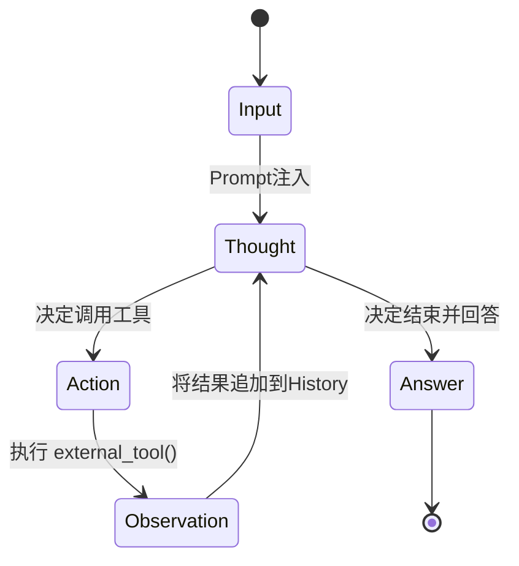

# 09. Agent：有限状态机 (FSM) 与图论架构

> [!NOTE]
> **从脚本到自主系统**
> 
> Agent 并非魔法。它本质上是一个运行在 LLM 之上的 **有限状态机 (FSM)**。
> 本文拆解它的运行机制：从最基础的 ReAct 循环，到复杂的 Graph 编排，再到最新的轻量化趋势。

## 1. 理论模型：ReAct 的 FSM 视角

ReAct (Reason + Act) 是最基础的 Agent 模式。
$$ S = \{ \text{Thought}, \text{Action}, \text{Observation}, \text{Answer} \} $$

*   **Thought**: 模型思考下一步做什么。
*   **Action**: 调用工具 (Function Call)。
*   **Observation**: 拿到工具的运行结果。

```mermaid
stateDiagram-v2
    [*] --> Input
    Input --> Thought : Prompt注入
    
    Thought --> Action : 决定调用工具
    Thought --> Answer : 决定结束并回答
    
    Action --> Observation : 执行 external_tool()
    Observation --> Thought : 将结果追加到History
    
    Answer --> [*]
```

**关键点**：防止 LLM 幻觉。LLM 生成 `Action` 后必须**被强制打断 (Stop Sequence)**，由程序去执行工具，再把结果喂回给 LLM。

## 2. 架构进阶：从 Chain 到 Graph

当任务变复杂（比如“写一个贪吃蛇游戏”），单个 Agent 的 Context Window 会很快爆炸。
我们需要 **Multi-Agent 协作**。

### LangGraph (图论架构)
LangChain 推出的框架，引入了 **图 (Graph)** 的概念。
*   **Nodes**: 不同的角色（Coder, Reviewer, Tester）。
*   **Edges**: 控制流跳转条件（如 `if bug_found -> goto Coder`）。

它允许构建**环形工作流 (Cyclic Workflows)**。
`Coder <--> Reviewer` 可以无限循环，直到 Reviewer 满意为止。这比传统的线性链 (Chain) 强大得多。

## 3. 2025 新趋势：轻量化框架 (Smolagents & PydanticAI)

虽然 LangGraph 强大，但太重了。
2025 年，开发者开始回归**原生代码**。

### 为什么抛弃 LangChain？
*   **抽象泄漏**: Debug 时报错栈极其恐怖，很难定位是 Prompt 问题还是框架问题。
*   **过度封装**: 简单的 API 调用被封装了十几层。

### 新选择
*   **PydanticAI**: 极其优雅。完全基于 Python 的 Type Hint 定义工具。如果你会写 Python 函数，你就会写 Agent。
*   **Smolagents (HuggingFace)**: 只有几百行代码的核心库。主打“Code Agent”，让 LLM 直接写 Python 代码来调用工具，而不是输出 JSON。

## 4. 调试与工具 (MCP Inspector)

写 Agent 最难的不是 Prompt，而是 **Tools**。
如果 Tool 的输出不对，Agent 就会发疯。

**MCP Inspector** 是调试神器：
*   它提供了一个 Web UI。
*   你可以手动模拟 Agent 调用你的 MCP Server。
*   查看每一次 Request/Response 的详细数据，确保工具的健壮性。

## 小结

1.  **ReAct** 是原子单位。
2.  **LangGraph** 适合构建复杂的、有状态的企业级工作流。
3.  **Lightweight** (PydanticAI) 是个人开发者和简单任务的首选。
4.  **Debug** 重点在于工具的 Input/Output 格式验证。
