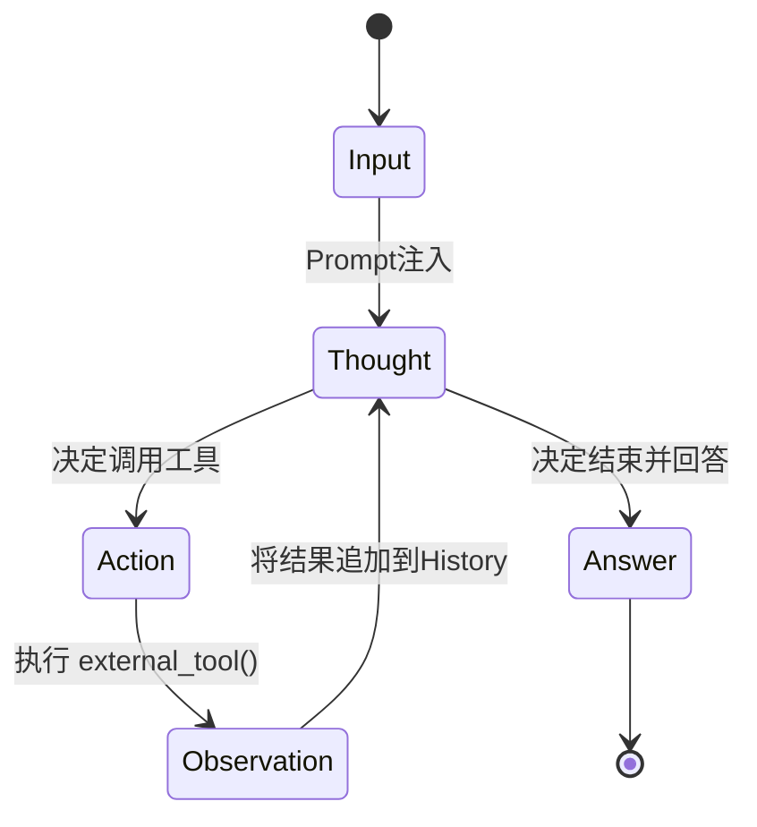
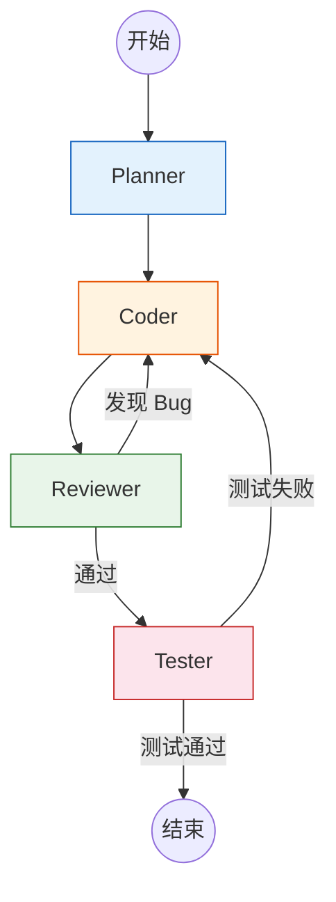
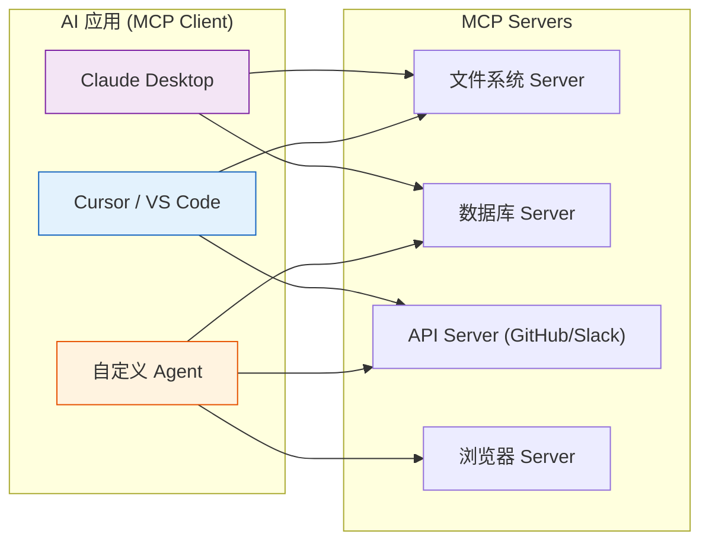
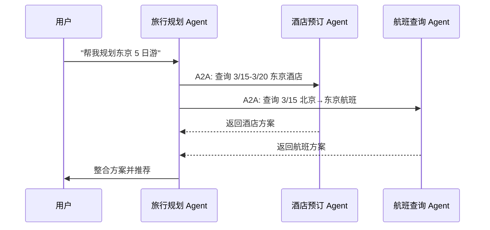

# 09. Agent：有限状态机 (FSM) 与图论架构

> [!NOTE]
> **从脚本到自主系统**
> 
> Agent 并非魔法。它本质上是一个运行在 LLM 之上的 **有限状态机 (FSM)**。
> 本文拆解它的运行机制：从最基础的 ReAct 循环，到复杂的 Graph 编排，再到 MCP 协议如何让工具接入标准化。

## 1. 理论模型：ReAct 的 FSM 视角

ReAct (Reason + Act) 是最基础的 Agent 模式。
$$ S = \{ \text{Thought}, \text{Action}, \text{Observation}, \text{Answer} \} $$

*   **Thought**: 模型思考下一步做什么。
*   **Action**: 调用工具 (Function Call)。
*   **Observation**: 拿到工具的运行结果。


```mermaid
stateDiagram-v2
    [*] --> Input
    Input --> Thought : Prompt注入
    
    Thought --> Action : 决定调用工具
    Thought --> Answer : 决定结束并回答
    
    Action --> Observation : 执行 external_tool()
    Observation --> Thought : 将结果追加到History
    
    Answer --> [*]
```

**关键点**：防止 LLM 幻觉。LLM 生成 `Action` 后必须**被强制打断 (Stop Sequence)**，由程序去执行工具，再把结果喂回给 LLM。如果不打断，LLM 会自己"想象"工具的返回结果，然后基于幻觉继续推理，最终输出一本正经的胡说八道。

## 2. 架构进阶：从 Chain 到 Graph

当任务变复杂（比如"写一个贪吃蛇游戏"），单个 Agent 的 Context Window 会很快爆炸。需要 **Multi-Agent 协作**。

### LangGraph (图论架构)

LangChain 推出的框架，引入了 **图 (Graph)** 的概念。

*   **Nodes**: 不同的角色（Coder, Reviewer, Tester）。
*   **Edges**: 控制流跳转条件（如 `if bug_found -> goto Coder`）。
*   **State**: 共享的状态字典，所有 Node 都可以读写。


```mermaid
graph TD
    Start((开始)) --> Planner
    Planner --> Coder
    Coder --> Reviewer
    Reviewer -->|发现 Bug| Coder
    Reviewer -->|通过| Tester
    Tester -->|测试失败| Coder
    Tester -->|测试通过| End((结束))
    
    style Planner fill:#e3f2fd,stroke:#1565c0
    style Coder fill:#fff3e0,stroke:#e65100
    style Reviewer fill:#e8f5e9,stroke:#2e7d32
    style Tester fill:#fce4ec,stroke:#c62828
```

它允许构建**环形工作流 (Cyclic Workflows)**。`Coder <--> Reviewer` 可以无限循环，直到 Reviewer 满意为止。这比传统的线性链 (Chain) 强大得多。

### CrewAI 与 AutoGen

除了 LangGraph，还有两个值得关注的 Multi-Agent 框架：

| 框架 | 核心思路 | 特点 |
|------|---------|------|
| **CrewAI** | 角色扮演 + 任务分配 | 定义 Agent 的"角色"和"目标"，框架自动编排协作流程。上手最快 |
| **AutoGen (Microsoft)** | 对话式协作 | Agent 之间通过消息传递来协作。支持人类介入 (Human-in-the-loop) |
| **LangGraph** | 显式状态图 | 开发者完全控制流程和节点，灵活但复杂度高 |

## 3. MCP 协议：工具接入的 USB 标准

2025 年，Agent 领域最有影响力的标准化方案是 Anthropic 提出的 **MCP (Model Context Protocol)**。

### 为什么需要 MCP？

之前每个 Agent 框架都有自己的工具接入方式——LangChain 用 `@tool` 装饰器，OpenAI 用 Function Calling JSON Schema，AutoGen 用另一套 API。工具开发者要为每个框架单独适配，碎片化严重。

MCP 的定位类似于 USB 协议：定义一套标准的 Client-Server 通信接口，任何 AI 应用（Client）都能接入任何 MCP Server（工具/数据源）。


```mermaid
graph LR
    subgraph AI应用 ["AI 应用 (MCP Client)"]
        Claude["Claude Desktop"]
        Cursor["Cursor / VS Code"]
        Custom["自定义 Agent"]
    end

    subgraph MCP_Servers ["MCP Servers"]
        FS["文件系统 Server"]
        DB["数据库 Server"]
        API["API Server (GitHub/Slack)"]
        Browser["浏览器 Server"]
    end

    Claude --> FS
    Claude --> DB
    Cursor --> FS
    Cursor --> API
    Custom --> DB
    Custom --> API
    Custom --> Browser

    style Claude fill:#f3e5f5,stroke:#7b1fa2
    style Cursor fill:#e3f2fd,stroke:#1565c0
    style Custom fill:#fff3e0,stroke:#e65100
```

### MCP 的核心概念

*   **Resources**: 数据源（文件、数据库记录、网页内容）。Agent 可以读取但不能修改。
*   **Tools**: 可执行的操作（发送邮件、创建 PR、查询 API）。Agent 请求调用，宿主应用可以要求用户确认。
*   **Prompts**: 预定义的 Prompt 模板。Server 提供结构化的指令模板，让 Agent 更准确地使用工具。

### 传输方式

MCP 支持两种传输协议：

1.  **stdio**: Server 作为子进程运行，通过 stdin/stdout 通信。适合本地工具。
2.  **Streamable HTTP**: 基于 HTTP + SSE。适合远程服务。

## 4. A2A 协议：Agent 之间的 HTTP

如果说 MCP 解决的是"Agent 如何使用工具"，那 Google 提出的 **A2A (Agent-to-Agent)** 协议解决的是"Agent 之间如何协作"。

一个典型场景：旅行规划 Agent 需要和酒店预订 Agent、航班查询 Agent 协商。这三个 Agent 可能运行在不同的服务器上，用不同的框架实现。A2A 定义了它们之间的通信标准。


```mermaid
sequenceDiagram
    participant User as 用户
    participant Travel as 旅行规划 Agent
    participant Hotel as 酒店预订 Agent
    participant Flight as 航班查询 Agent
    
    User->>Travel: "帮我规划东京 5 日游"
    Travel->>Hotel: A2A: 查询 3/15-3/20 东京酒店
    Travel->>Flight: A2A: 查询 3/15 北京→东京航班
    Hotel-->>Travel: 返回酒店方案
    Flight-->>Travel: 返回航班方案
    Travel->>User: 整合方案并推荐
```

A2A 和 MCP 是互补关系：MCP 管"人与工具"，A2A 管"Agent 与 Agent"。

## 5. 轻量化趋势：PydanticAI 与 Smolagents

虽然 LangGraph 强大，但学习曲线陡峭。2025 年，开发者开始回归**原生代码**。

### 为什么抛弃 LangChain（核心库）？

*   **抽象泄漏**: Debug 时报错栈极其恐怖，很难定位是 Prompt 问题还是框架问题。
*   **过度封装**: 简单的 API 调用被封装了十几层。改一个参数要翻三层源码。

### 新选择

*   **PydanticAI**: 极其优雅。完全基于 Python 的 Type Hint 定义工具。Agent 代码读起来就像普通 Python 函数，没有框架魔法。

```python
from pydantic_ai import Agent

agent = Agent('openai:gpt-4o', system_prompt='你是一个天气助手')

@agent.tool
async def get_weather(city: str) -> str:
    """获取指定城市的天气"""
    return f"{city} 今天 25°C，晴"

result = agent.run_sync('北京天气怎么样？')
```

*   **Smolagents (HuggingFace)**: 只有几百行代码的核心库。主打"Code Agent"，让 LLM 直接写 Python 代码来调用工具，而不是输出 JSON——执行效率更高，且支持自然的条件判断和循环。

## 6. 调试与工具

写 Agent 最难的不是 Prompt，而是 **Tools**。如果 Tool 的输出格式不对或缺少关键信息，Agent 就会陷入死循环或输出垃圾。

### MCP Inspector

MCP Inspector 是调试 MCP Server 的标准工具：
*   提供一个 Web UI，手动模拟 Agent 调用 MCP Server。
*   查看每一次 Request / Response 的详细数据。
*   验证 Tool 的 JSON Schema 是否正确。

### LangSmith

LangChain 推出的可观测性平台。可以追踪 Agent 的每一步推理过程：
*   可视化 Trace：看到 Agent 在每一步选择了什么工具、传了什么参数、拿到了什么结果。
*   成本追踪：每次调用消耗了多少 Token。
*   Playground：修改中间步骤的输入，观察 Agent 行为变化。

## 小结

1.  **ReAct** 是 Agent 的原子单位。理解了 FSM，就理解了所有 Agent 框架的根基。
2.  **LangGraph** 适合构建有状态的企业级工作流。CrewAI 适合快速原型。
3.  **MCP** 正在成为工具接入的通用标准，类似于 USB。
4.  **A2A** 定义了 Agent 间的通信协议，适合异构系统协作。
5.  **PydanticAI** 是个人开发者和简单任务的首选——代码简洁，没有抽象负担。
6.  **Debug** 重点在于工具的 Input/Output 格式验证。推荐用 MCP Inspector 或 LangSmith。
