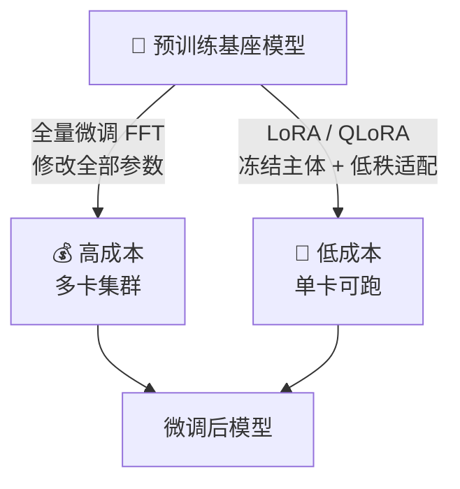

# AI 核心原理（十）—— 重塑大脑：模型微调与 LoRA 降维打击

> **环境：** LLaMA-Factory 0.8+, HuggingFace PEFT 框架, 适用单张 24G 消费级显卡

如果你用 RAG 外挂了公司整整三万份内科病例，你会发现大模型依旧学不会三甲医院老主治医师那种极具压迫感但又极度精准严谨的问诊口吻。
知识库只能外挂"参考书卷"，而强行拆开大模型脑壳、修改神经元权重的**微调（Fine-Tuning）**，才是重塑人格的唯一出路。

---

## 1. 路线抉择：全量微调（FFT） vs 高效微调（PEFT）



当我们要把一个通用的聊天助手变成一个只产出无暇 JSON 的代码审核员时，摆在面前的有两条路。

### FFT（全参微调：富人的游戏）
- **机制**：解冻大模型的所有层，几百亿甚至上千亿的参数在反向传播中全部更新一遍。
- **代价**：除了吃显存吃到倾家荡产，更大的坑是 **灾难性遗忘（Catastrophic Forgetting）**。你用一万条医疗问答数据强行冲刷了原有的浩瀚底座，模型学会了看病，但转头就算不清楚鸡兔同笼了。原有的通识被彻底抹除。

### PEFT（参数高效微调：手术刀式的精修）
- **机制**：冻底座，加挂件。比如鼎鼎大名的 **LoRA（低秩适配矩阵）**。

## 2. LoRA 的数学核武：矩阵的低秩分解

微软提出的 LoRA 证明了一个反直觉的核心事实：**模型微调时那看似翻天覆地的权重变化矩阵 $\Delta W$，本质上是非常"单薄"（低秩）的。**

假设原始的高维权重矩阵为 $W_0 \in \mathbb{R}^{d \times k}$。
在微调时，我们把 $W_0$ 上锁绝对不碰它，只在旁边搭一条外包计算的高速小道，去训练一个极小的增量 $\Delta W$。

$$ W = W_0 + \Delta W $$

LoRA 把这个夸张的 $\Delta W$ 强行一分为二，拆成了两个迷你矩阵的乘积：

$$ \Delta W = B A $$

- $B \in \mathbb{R}^{d \times r}$（窄高的矩阵）
- $A \in \mathbb{R}^{r \times k}$（扁平的矩阵）
- 这个 $r$ 就是极小的 **Rank（秩）**，一般只有微缩的 8 或 16。

**显式权衡（Trade-offs）**：
这种暴力的数学拆解降维，带来的资源压缩比是几百倍级别的。单单一个原本绝无可能搞定的 7B 级别大模型（4096 乘 4096 维度），在 LoRA rank=8 的加持下可以把训练参数狂砍到仅剩 **6 万多**！从此消费级 4090 显卡也能在家炼丹。
但代价是，LoRA 高度依赖原底座的强悍内功，如果是强灌一个连大模型压根没见过的陌生语种（比如克林贡语），低秩的贫瘠信息容量根本兜不住这种级别的天翻地覆。

## 3. 实战配置：LLaMA-Factory 挂载

脱离了早期手撕 PyTorch 源码的折磨，现在的基建由 LLaMA-Factory 这种封神级框架统治。

```bash
# <--- 核心：配置中的 rank 和 alpha 缩放比例
CUDA_VISIBLE_DEVICES=0 python src/train.py \
    --stage sft \
    --model_name_or_path meta-llama/Llama-3-8B \
    --finetuning_type lora \
    --lora_rank 16 \
    --lora_alpha 32 \
    --dataset my_medical_qa \
    --output_dir output/my_lora_checkpoint
```

> **观测与验证**：在启动 LLaMA-Factory 脚本的那一瞬间，紧盯你的 Terminal 控制台。在长篇大论的加载完毕后，日志会高亮抛出一行绿字 `trainable params: 4,194,304 || all params: 8,000,000,000 || trainable%: 0.0524%`。只要看到最后这个百分比小于 `1%`，你就可以放心长舒一口气，这证明外挂矩阵成功卡上，显卡不会原地升天了。

## 4. 常见坑点

**1. Alpha 系数失调导致的完全无感**
很多人照抄脚本改大 `lora_rank` 到 64，但忘了等比放大 `lora_alpha` 缩放倍率。
**原理解释**：在注入算式 $W_0 + \frac{\alpha}{r} BA$ 中，如果不随着加大 rank 等比提拉 alpha，你千辛万苦算出来的新知识增量会被稀释到无限趋近于零，模型跑了一天依然是原味。
**解法**：死记硬背一条工业界标杆：永远保持 `lora_alpha = 2 × lora_rank`。

**2. 严重过拟合把 AI 逼成了机械复读机**
有些开发者用几百条极其刻板的数据（比如全部回答"好的，主人~"）跑了 10 个 Epoch。结果发现模型连常识问答都不会了，任何问题都只会复读那几句口头禅。
**解法**：这就是典型的步子太大过拟合死板了。在微调数据集中，必须必须至少混入 **10% - 20% 的通用闲聊打底数据** 充当润滑剂，严防死守知识板结。

## 5. 延伸思考

目前的 LoRA 已经支持在同一底层模型上，针对每一个 User Thread 热拔插加载极小体积的不同 LoRA 适配器（比如给财务组换个算账脑，给营销组换个爆款脑）。这种被称为 Multi-LoRA 的动态混拼路由分发架构。
既然切换一个 50MB 的外挂矩阵连 1 毫秒都不用，那我们离打造那种"一人定制一个数字专属私有分身"的超级底座平台还有多远的技术债没还？

## 6. 总结

- 传统的全参数微调是一场代价极其惨烈的大出血换血手术，极易造成旧知识体系大范围坍塌遗忘。
- LoRA 等效建立在权重更新都是“低维度冗余”的真理上，用外科手术级别的矩阵相乘外包节省出了几百倍的显存占有。
- 掌控 `rank` 增量容量维度与 `alpha` 融合缩放力度，是调优从白板到大神的跨栏密码。

## 7. 参考

- [LoRA: Low-Rank Adaptation of Large Language Models (Hu et al.)](https://arxiv.org/abs/2106.09685)
- [LLaMA-Factory: Unified Efficient Fine-Tuning of 100+ Language Models](https://github.com/hiyouga/LLaMA-Factory)
