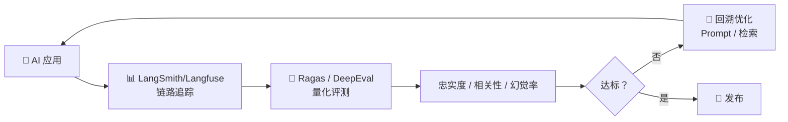

# AI 核心原理（十一）—— 拒绝玄学：LLMOps 监控与 Ragas 量化评测

> **环境：** Ragas 0.1.x, DeepEval 0.2+, LangSmith/Langfuse 溯源追踪平台

在提示词里加了一句玄之又玄的 `"请深呼吸，这对我的职业生涯至关重要"`，在测试用例 A 表现如有神助，一把合并上线后，却把用例 B 的电商客服转化率当场砸跌了 30%。
绝大部分火急火燎上线套壳的 AI 应用死了甚至根本等不到商业化，往往就是死在这种完全“测不准”的玄学蒙眼狂奔调参上。

---

## 1. 痛点破局：为什么 LLM 的单元测试那么难？



传统的软件工程测试容不下半点沙子：`assert add(1, 1) == 2`。只要不是 2，整个管线直接阻断阻截。
但大语言模型的底层是概率涌现：即使是同一道题，它可能第一遍吐出“苹果比橘子大”，第二遍换了个文案“橘子的体积显然不如苹果”。传统的正则匹配字符串对于这种千变万化的长句废话完全束手无策。

工业界目前被迫卷出了唯一可量化的标准演进：
**LLM-as-a-Judge（让大模型自己当裁判）**。花大钱调用最顶配的且无温度波动的 GPT-4 去给小弟（比如本地部署的 14B）干活后的试卷打分。

## 2. 评测行业的黄金量尺：RAG Triad（三元组）

如果你做的是 RAG（知识库检索）系统，业界已经帮你钉死了三个必须接受灵魂拷问的心跳指标。这就是 Ragas 框架带来的标尺矩阵。

### 1. Faithfulness（忠实度：抓捕幻觉）
- **核心逻辑**：AI 最后的吐字，有没有超出刚才召回给它的资料范围？
- **怎么抓**：裁判模型扫描 AI 的长篇回答，强词搜寻脱离了 Context 切片自己凭空捏造的“幽灵虚假成分”。

### 2. Answer Relevancy（回答相关性：抓捕绕圈子）
- **核心逻辑**：答对了吗还是只是在堆砌废话兜圈子？
- **怎么抓**：给裁判模型提供问题和最终结果。不要只看表面相关，如果问“如何退款”，AI 回答了整篇的“退货政策”，由于没直接给操作入口，也得给低分阻断。

### 3. Context Precision（上下文精确度：抓捕垃圾分块）
- **核心逻辑**：你那破向量排在前面的文章碎片，真的跟用户的问题贴合吗？
- **怎么抓**：这是拷问架构前置检索和粗糙 Chunking（切块）算法的最重拳。前三排查出都是广告废料，那就宣告 RAG 系统直接破产瓦解。

## 3. 落地实操：从散漫到断言拦截

我们需要把测试塞进类似 PyTest 的框架体系里作为发版拦截硬底线，比如深度嵌入 **DeepEval**。

```python
from deepeval import assert_test
from deepeval.metrics import AnswerRelevancyMetric
from deepeval.test_case import LLMTestCase

def test_answer_relevancy_guard():
    # <--- 核心：设定极其严苛的拦路虎分界线，70 分以下立即截断合并
    relevancy_metric = AnswerRelevancyMetric(threshold=0.7)
    
    test_case = LLMTestCase(
        input="我没有购物小票还能退掉这双鞋子不？",
        actual_output="我们在门店提供高达 30 天无理由退款体验周！"
    )
    
    assert_test(test_case, [relevancy_metric])
```

> **观测验证**：在终点控制台执行 `pytest test_llm_flow.py`。你会看到它并不像以前瞬间返回 Pass 结果，而是卡在那开始呼叫远端判官大模型并等待消耗了整整好几秒的时间。如果实际输出属于“顾左右而言他”，控制台会血淋淋地给你爆出红色的 `Failed`，并带有一段极具逻辑的判官点评作为断言错误抛出。这说明防护网成功织起。

## 4. LLMOps：把黑盒剖成透明玻璃板

发版上线从来都是灾难的开端。必须给大模型的每一条运行流插满监护仪器的软探针，那就是 **LangSmith** 或者 **Langfuse**。

**显式权衡（Trade-offs）**：
在业务深处埋下全套的 Trace（链路追踪）回调拦截钩子。
- **收益**：像看心电图一样定位耗时瓶颈——在哪耗时 8 秒？提取了哪三张无关数据？实现精细的问题归因排查体系。
- **代价**：对日活百万的 C 端产品，全链路 Trace 会带来显著的数据存储成本和额外的网络延迟开销。

## 5. 常见坑点

**裁判模型眼瞎倒挂（Judge Blindness）**
这大概是部署自动巡检流水线时最荒唐的地雷区雷区。开发团队为了省下那点可怜的经费，用了免费开源的 LLaMA-3-8B 或者 GPT-3.5 去充当那把判度高深的戒尺，来强行裁决复杂的图文生成大模型矩阵结果。
这会导致非常可笑的结果发生：如果大模型生成了一种非常巧妙的暗讽拐弯逻辑来回答用户，小模型裁判会因为读不懂里面的伏笔，觉得答非所问直接判定成 0 分极刑。
**解法**：做自动化拦截测评，打分裁判必须毫无悬念死死压过当前被测者一个以上的满代际身位。只有舍得为高阶智能买下这笔鉴定费率，发版的拦截分数线才有公信力可讲。

## 6. 延伸思考

如果你的研发团队正在利用 Agent 代替敲代码实现需求（比如让大模型自主拉取代码流，修改测试用例终端反馈）。对于这种最终产出可能牵涉数千行底层代码变动和系统重制结构的行为组合流。
在这类具备环境入侵性并且涉及步骤繁多回滚复杂的终端特种兵特长生身上，还能用上面提到的 RAG 传统聊天三元组硬套评估分数机制吗？还是只有冷冰冰的单元用例测试可以成为它们最终交付的宣判席？

## 7. 总结

- 传统的文本规则强匹配算法已经根本兜不住由于巨大概率生成偏差产生的外溢风险边界，让强模型制裁判罚成为了工业界迫不得已却不得不做的基线抓点。
- 三元组不仅打分了最后文字的合规度，也连带着将向量提取时抓取的前排垃圾废纸一同拉上法庭钉在了审判柱头上查缺。
- 全链路监控虽然极重但它提供了唯一的透视剖检上帝视野切面，打破了传统提示工程师互相扯皮的黑匣子混沌。

## 8. 参考

- [Ragas: Automated Evaluation of Retrieval Augmented Generation](https://github.com/explodinggradients/ragas)
- [Judging LLM-as-a-Judge with MT-Bench and Chatbot Arena](https://arxiv.org/abs/2306.05685)
- [DeepEval: The Open-Source LLM Evaluation Framework](https://docs.confident-ai.com/)
