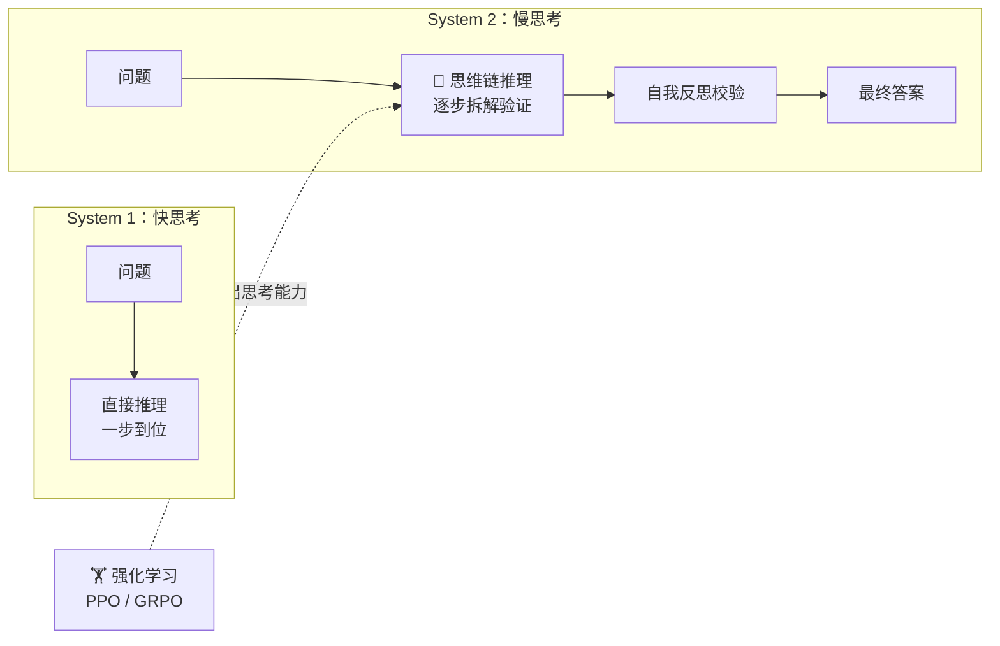

# AI 核心原理（十二）—— 慢思考革命：System 2 与强化学习的涌现 (DeepSeek R1 / o1)

> **环境：** DeepSeek-R1 架构, OpenAI o1 API，PPO / GRPO 强化学习框架

如果你让顶级大语言模型思考整整 5 分钟再开口，它解出的高斯几何难题连专业奥赛教练都拍案叫绝。
这绝对不仅是靠着堆显卡算力能砸出来的暴力美学奇迹，而是模型引入了高强度的自我博弈（Self-Play）和结果奖励淘汰的核爆：**强化学习（RL）**。

---

## 1. 跨代际界碑：快思考（System 1）与 慢思考（System 2）

2024 年底的人工智能圈层迎来了史书级别的路线重构。
心理学家丹尼尔·卡尼曼在《思考，快与慢》中勾勒出的思维模型，被冷酷地映射到了冷冰冰的硅基世界。

- **System 1（直觉快反射）**：问你“5乘5等于多少？”，不经大脑脱口而出 25。过去的所有 LLM（如 GPT-4）统统卡在这个阶段。它们永远只做 Next Token Prediction（单向喷吐），没写好的稿子绝不回头重修，哪怕方向一开始就走岔了路。
- **System 2（深度慢演绎）**：问你“713乘11等于多少？”，你需要找块小黑板分步推开拆算打草稿。这就是当下的 o1 和 DeepSeek R1 的绝对主场领域。

你能在它的骨架里看到极为繁复的草稿结构：
`Input -> <think>...长达数千字的试错推演死胡同调转车头...</think> -> Answer`

## 2. 驯服它的教鞭：强化学习（RL）算法机制

以往我们要教 AI 解数学难题，要花天价雇佣几十块钱一个小时的硅谷数学系学生，一行一行手写推推导式给它抄作业死记硬背（这就是 SFT：监督微调）。这带来的困局是，学生的解题思路和数学极限永远不可突破那帮标注员老师的上限智库瓶颈。

到了 DeepSeek R1，他们悍然采用了 **GRPO (Group Relative Policy Optimization)** 以及**结果监督论（Outcome Supervision）**。

### 给结果发期权，不再考核考勤打卡

- 怎么推导的不重要。数学题和代码测例的唯一好处是极其冷酷黑白分明，过了就是过了，结果客观到不可反驳。
- **组队拉网厮杀验证**：大模型给自己针对同道难题当场克隆出足足 64 份不同脑洞的草稿尝试路线版本去解题。
- 如果其中 5 份刁钻古怪的倒推反证过程歪打正着命中了最后 100% 正确的结果锁死。底层的强化学习优化器当场抛洒极强的正向奖励权重分发给这 5 条幸存路线。（而剩下那瞎猜的五十几条流派被打上失败惩罚印记贬值清退）。

于是，AI 不用人教，在这个动辄万亿千万次左右手博弈淘汰死循环里，**自我涌现**（Emergent）出了惊骇世俗的本能大戏。诸如：
自我反思怀疑：`Wait, let me double check this derivative...`。
跳跃更换死胡同：`This approach is too messy, let me try a different angle by transforming the coordinates.`

**显式权衡（Trade-offs）**：
让这类主打慢度推理的大脑包去解构极端繁复冗长盘结不清的逻辑矩阵，带来的**代价就是极其变态且高昂的每个问题吞噬 Token 结算账单和离谱拉长的等候延期**。
你在普通界面花 2 分钟只是为了向它提早问一声最简单的天气和股票翻译。这不仅仅是大炮打蚊子一般的可笑资源浪费挥霍，由于它在底层习惯把一切简单事务复杂套娃深度剖析解构化，其表现对于闲聊提取信息的直观感受甚至会被全面降维吊打乃至显得更加人工智障缓慢反应卡壳。

## 3. 推理缩放定律（Test-time Scaling）

只要给够显卡充足的试错草稿发散计算空窗期，一个小指甲盖大小蒸馏微缩而成的底座模型（比如 R1-Distill-7B），竟然能在冷门的复杂物理应用矩阵里轻松抹平并手撕参数万亿之上的 GPT-4o 的王座地位！
模型不再强求训练时大口大口吞吃天价的超级服务器农场规模，而是**在考场当面对决做卷子时的推理推断演算堆算力思考时间长短（Test-time），成为了衡量变局的新刻度法则天平**。

## 4. 常见坑点

**用 Few-shot 榜样去毁掉它的想象力枷锁**
这是旧时代高级提示词玩家转型升级换舱最难受转变纠正过来的一套思路顽疾沉疴。以前大模型笨得像猪，你恨不得写 100 行完美对整齐仗的超长 XML 的 Few-Shot 优质参考答卷给模型当模板手把手带偏让它跟着死磕填空做。
**解法原因**：不要给任何 reasoning 长思者塞强制格式排版的范例对撞板！这就像要求一个奥数天才去按填字游戏一笔一画做卷子一样。这会恐怖般大幅度死死压制和打断斩落了本来属于他天马行空胡乱跳跃猜解的自由流浪发酵生长路径解法。直接清爽的 Zero-Shot 放开限制甩出难题，就是对于这波系统变革的最高配置指导准绳规格。

## 5. 延伸思考

通过纯客观奖励代码测例跑通过线以及奥秘唯一真理标准的强反馈信号牵引对碰。让大模型脱离了人类教师的局限桎梏自主演进爆发。
但这局绝杀目前是被严格圈禁锁死在极其确定边界（数学/代码代码执行器）内的狂欢狂潮。那么问题来了，如果你让大模型去写一本充满人类感官悲欢离合、没有任何强制校验器来测谎鉴定的千万字鸿篇巨著《新世纪红楼梦》。在没有强制是非规则牵引发射下，这种纯依靠结果验证的自动博弈能产生有效推演嘛？又或者你有什么更好的打工打磨平替评价基线引入思路？

## 6. 总结

- 慢思考不仅是停留打字的时间拖延等待耗时卡帧，它是真正的带有反省折回试错验证的内在解题树分支大扫荡。
- RL 抛弃掉了极为孱弱局限的人工经验灌输入境包袱包办做法，向自我对打自我筛选纠错的闭环涌现进发。
- 用过去的超强约束强制对话指导控制手法会弄巧成拙把聪明脑锁进条框框的教条下水道里。

## 7. 参考

- [DeepSeek-R1: Incentivizing Reasoning Capability in LLMs via Reinforcement Learning](https://github.com/deepseek-ai/DeepSeek-R1)
- [Thinking, Fast and Slow (Daniel Kahneman)](https://en.wikipedia.org/wiki/Thinking,_Fast_and_Slow)
