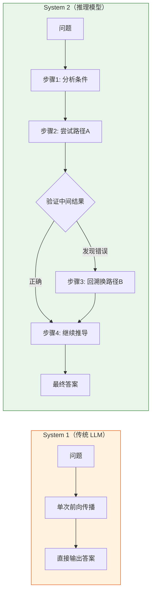
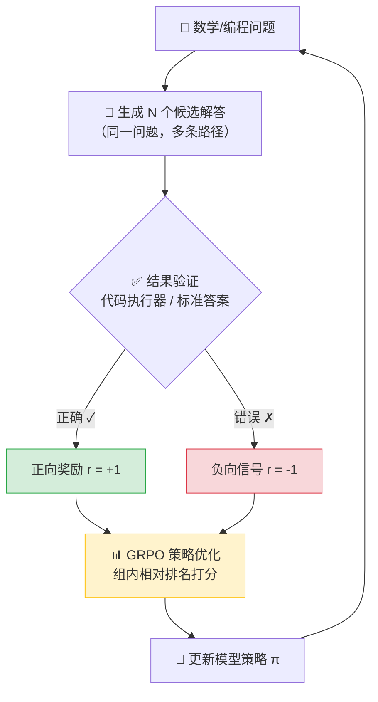

# 12. 推理模型：System 2 与强化学习 (DeepSeek R1 / o1)

> **环境：** 任意支持 o1/DeepSeek R1 API 的推理环境

当你让 GPT-4o 算一道需要 5 步推导的数学题，它往往一口气给你一个"看起来对"的答案——但仔细检查就发现中间某步偷偷跳过了逻辑链条。
这是因为传统 LLM 本质上是 System 1（快思维）：依靠直觉和模式匹配，一次前向传播就吐出结果。遇到需要**多步推理、回溯验证**的复杂问题，它的准确率断崖式下跌。

推理模型（Reasoning Models）的出现，标志着 AI 从"凭直觉猜"进化到了"逐步想清楚再说"。

---

## 1. 问题背景：为什么需要慢思维

传统的语言模型在处理复杂问题时表现有限。以数学推理为例，早期的方法依赖人工标注——雇佣专家编写详细的解题步骤，作为监督信号训练模型。这种方式有几个致命缺陷：

- **成本高**：专业领域的人工标注费用昂贵
- **质量上限**：模型的推理能力受限于标注者的水平
- **泛化差**：模型倾向于模仿解题步骤，而非真正理解问题结构



**核心矛盾**：当面对需要多步推理的复杂问题时，传统模型的准确率往往低于预期。

---

## 2. 强化学习训练机制

DeepSeek R1 采用了新的训练范式，其中核心是 **GRPO (Group Relative Policy Optimization)** 和**结果监督 (Outcome Supervision)**。

### 基于结果的奖励机制

与传统的监督微调（SFT）不同，GRPO 采用了一种基于结果的训练方式：

- **生成候选解答**：模型针对同一问题生成多个不同的解答路径
- **客观结果验证**：通过代码执行器或标准答案验证结果是否正确
- **相对奖励分配**：对成功解决问题的路径给予正向奖励，对失败的路径给予负向信号

这种方法的核心优势在于：**不需要人工编写详细的解题过程**。数学和编程问题的特殊性在于结果可以客观验证——对了就是对了，没有争议。



### 涌现的推理行为

在训练过程中，模型会自然涌现出一些有效的推理行为：

- **自我纠错**：`Wait, let me double check this step...`
- **策略切换**：当一种方法遇到困难时，尝试其他角度
- **验证步骤**：在得出最终答案前进行中间结果的检查

这些行为并非人工设计的——它们是模型在 RL 训练中自发发展出的策略，因为这些策略能帮助它获得更多奖励。

---

## 3. 测试时缩放 (Test-time Scaling)

传统的模型能力提升依赖训练阶段的算力投入（增加参数、扩大训练数据）。推理模型的突破在于将部分计算从训练时转移到推理时：

- **小模型 + 长推理**：通过增加推理时的计算量，较小的模型可以在特定任务上超越大型模型
- **动态计算分配**：根据问题难度动态调整推理深度
- **长思维链**：允许模型生成更长的推理过程

例如，在复杂的数学推理任务中，推理模型的表现与推理时分配的思考时间正相关。

---

## 4. 实战：调用推理模型 API

推理模型的 API 调用与标准模型略有不同。核心区别在于**思维链（thinking）是隐式生成的**，你无法也不应该通过 Few-shot 去干预它。

```python
from openai import OpenAI

client = OpenAI()

# <--- 核心：推理模型不需要 system prompt 和 few-shot
response = client.chat.completions.create(
    model="o1",  # 或 "deepseek-reasoner"
    messages=[
        {
            "role": "user",
            "content": "证明：对任意正整数 n，n³ - n 能被 6 整除。"
        }
    ],
    # 注意：推理模型通常不支持 temperature 参数
    # temperature=0.7  ← 会报错
)

# 推理模型会输出完整的思考过程 + 最终答案
print(response.choices[0].message.content)
# 输出的 Token 数通常是标准模型的 3-10 倍
print(f"Token 消耗: {response.usage.total_tokens}")
```

> **观测验证**：对比同一道数学题分别用 `gpt-4o` 和 `o1` 调用。你会发现 o1 的 `total_tokens` 可能高出 5 倍以上，但准确率从 ~60% 跃升到 ~95%。这就是 Test-time Compute 的直接证据。

---

## 5. 显式权衡（Trade-offs）

| 维度 | 收益 | 代价 |
|------|------|------|
| 准确率 | 数学/编程等可验证任务显著提升（+20~30%） | 简单任务反而更慢且过度思考 |
| Token 消耗 | 思维链确保可审计、可调试 | 推理 Token 是标准模型的 3-10 倍，费用暴涨 |
| 延迟 | 复杂推理一次到位，减少重试 | TTFT（首字时间）可能长达 10-30 秒 |
| 适用性 | 数学证明、代码生成、逻辑推理 | 闲聊、翻译、简单 QA 反而退化 |

**核心决策公式**：当且仅当任务具备 (1) 可客观验证 + (2) 多步推理需求 时，才值得付出推理模型的 Token 溢价。

---

## 6. 常见坑点

### 1. Few-shot 与推理模型的冲突

一个常见的提示词误区是：为推理模型提供 Few-shot 示例。

**问题所在**：
- 推理模型的优势在于生成独特的推理路径
- 强制提供格式化的示例会将推理过程限制在固定模式中
- 这会削弱模型自发探索多种解法的能力

**解法**：对于推理模型，使用 Zero-shot（直接提问，不提供示例）通常优于 Few-shot。让模型自主决定推理策略。

### 2. 推理模型的温度陷阱

很多开发者习惯性地给 API 加上 `temperature=0` 想要确定性输出。但推理模型（如 o1）的 API **不支持 temperature 参数**。

**原因**：推理模型的"思考过程"本身需要一定的采样多样性来探索不同解题路径。强制确定性会破坏 GRPO 训练出的探索-利用平衡。

**解法**：直接去掉 temperature 参数。如果需要确定性，用 `seed` 参数（部分 API 支持）或在结果端做多次采样投票（Majority Voting）。

### 3. System Prompt 失效

很多开发者把精心设计的 System Prompt 搬到推理模型上，发现模型完全无视人设指令，自顾自地长篇大论推导过程。

**原因**：推理模型的训练目标是"得到正确答案"，而非"扮演某个角色"。GRPO 训练只奖励正确结果，不奖励风格匹配。

**解法**：将格式要求放在 User Prompt 末尾作为硬约束（如 `最终答案用 \boxed{} 包裹`），而非在 System Prompt 中设定人格。

---

## 7. 延伸思考

DeepSeek R1 的成功证明了一个反直觉的事实：**不需要人类示范推理过程，只需要给结果打分，模型就能自己学会推理。** 这暗示着推理能力并非需要"灌输"，而是神经网络在足够大的规模和正确的训练信号下自然涌现的能力。

如果这一范式继续扩展——从数学、编程延伸到科学实验设计、法律推理、医学诊断——你觉得"可客观验证"这个前提条件，会成为推理模型能力边界的永久天花板吗？还是未来会出现无需客观验证也能自我进化的推理架构？

---

## 8. 总结

- **慢思维的价值**：推理时间不是浪费，而是模型进行多步验证、自我纠错的过程
- **RL 的优势**：基于结果反馈的训练使模型能够自主发展推理策略，减少对人工标注的依赖
- **方法适配**：传统提示词技巧（如 Few-shot）在推理模型上的效果可能反转，需要根据具体模型调整策略
- **核心取舍**：用 3-10 倍的 Token 成本换取复杂任务 20-30% 的准确率提升

## 9. 参考

- [DeepSeek-R1: Incentivizing Reasoning Capability in LLMs via Reinforcement Learning](https://github.com/deepseek-ai/DeepSeek-R1)
- [Thinking, Fast and Slow (Daniel Kahneman)](https://en.wikipedia.org/wiki/Thinking,_Fast_and_Slow)
- [Scaling LLM Test-Time Compute (Snell et al., 2024)](https://arxiv.org/abs/2408.03314)
