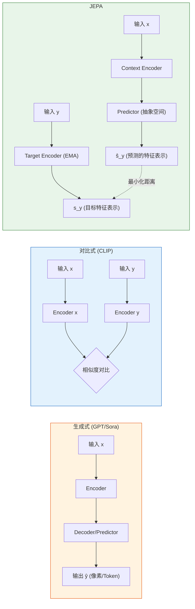
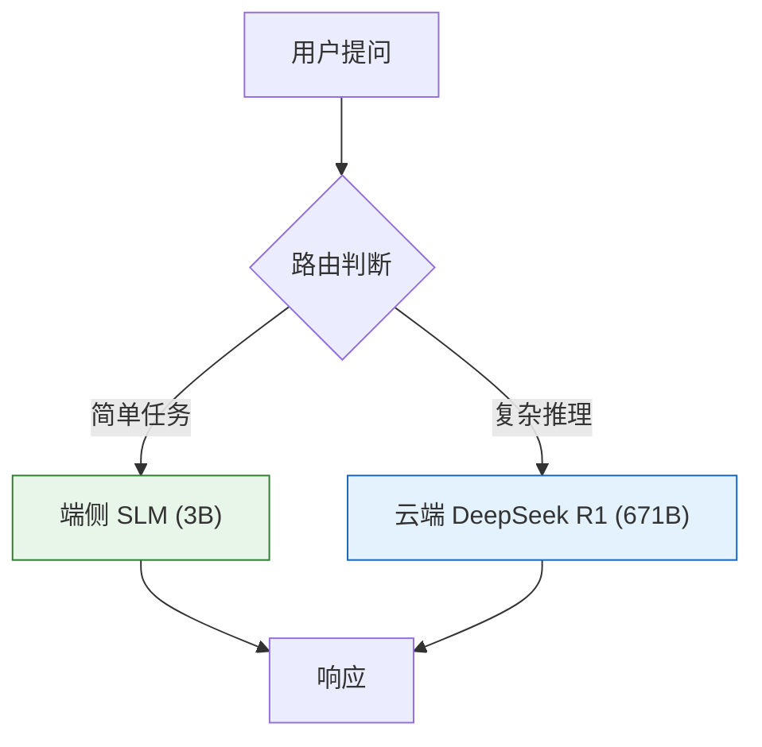

# 13. AI 的终极形态：世界模型 (World Models) 与 JEPA

> [!WARNING]
> **超越概率**
> 
> 生成式 AI (Generative AI) 只是过渡阶段。
> 真正通往 AGI 的道路，在于 **World Models (世界模型)**。AI 不应仅预测下一个字，而应理解这个世界的物理运行规律。

## 1. 三个阶段：从直觉到理解

行业经历了三次质变：

1.  **GPT-4 (System 1)**: 概率预测。阅历丰富，但缺乏逻辑推演能力，遇到复杂数学题就会编造答案。
2.  **DeepSeek R1 / o1 (System 2)**: 逻辑推理。通过强化学习习得"慢思考"，能对问题进行逐步拆解。但它依然只活在文字里，缺乏对物理世界的感知。
3.  **JEPA (World Model)**: 世界理解。LeCun 提出的目标架构——AI 在抽象空间里构建世界的内部模型，用于因果推演和规划，而非生成像素或 Token。

## 2. JEPA 的核心机制

JEPA (Joint Embedding Predictive Architecture) 的思路与当前主流的生成模型完全不同。

### 三种架构的对比

**关键区别**：
*   **生成式模型** 预测原始数据（每一个像素、每一个 Token），计算量巨大，且容易在细节处出错（手指变形、物理穿模）。
*   **JEPA** 只在**抽象特征空间**里做预测。它不关心杯子碎裂时每个碎片的像素细节，只需要预测"杯子碎了"这个状态概念。

### 核心公式

$$ s_{t+1} = \text{Predictor}(s_t, a_t, z_t) $$

*   $s_t$: 当前世界状态的抽象表示（比如：杯子在桌沿）。
*   $a_t$: 采取的动作（比如：用手推一下）。
*   $s_{t+1}$: 预测的未来状态（比如：杯子掉在地上碎了）。
*   $z_t$: 潜在的不确定性变量（Latent Variable），用以处理世界中的随机性——同一个动作未必总是产生同一个结果。

这个架构的在于：AI 真正在学习**因果关系**，而非统计相关性。

## 3. 具身智能 (Embodied AI)

具备世界模型后，AI 方可应用于具身智能 (Robotics)。2025-2026 年这个领域的进展速度出乎预料。

### 代表性进展

| 项目 | 厂商 | 核心思路 |
|------|------|---------|
| RT-2 / RT-X | Google DeepMind | VLA (Vision-Language-Action)，用 Transformer 直接输出机器人关节控制指令 |
| Optimus Gen 2 | Tesla | 基于 FSD 的视觉神经网络迁移，端到端训练行走与抓取 |
| Figure 02 | Figure AI | 接入 GPT-4o 实现语音对话 + 自主操作，能听人说话然后递苹果 |
| ALOHA 2 | Google | 低成本双臂灵巧操作，开源硬件设计 |

**VLA 架构的核心**：不再给机器人写 `if distance < 5cm then stop` 这种规则。而是让它通过世界模型推演：继续行走 → 碰撞墙壁 → 碰撞造成损伤 → 应当停止。这种推演能力可以泛化到从未见过的场景。

## 4. 端侧 AI (On-Device Intelligence)

除了云端大模型，另一个趋势是 **Small Language Models (SLM)** 在端侧的部署。

### NPU：AI 的专用心脏

现代手机芯片（Apple A-series, 骁龙 8 系列, 麒麟系列）都内置了 NPU (Neural Processing Unit)。与 GPU 的区别在于：NPU 针对矩阵乘法和低精度推理做了专门优化，功耗只有 GPU 的十分之一。

### 代表性端侧模型

*   **Phi-4-mini (Microsoft)**: 3.8B 参数，在数学推理上超越了部分 7B 模型。
*   **Gemma (Google)**: 多版本覆盖（1B 到 27B），可在 Pixel 手机上本地运行，持续迭代中。
*   **Apple Intelligence**: 基于端侧 3B 模型 + 云端 Private Cloud Compute 的混合架构。

### 混合推断 (Hybrid Inference)

端侧 AI 的终极形态不是让手机替代云端，而是**智能路由**：

*   **隐私第一**: 日常对话、照片整理永远不离开设备。
*   **零延迟**: 断网环境也能用。
*   **按需上云**: 只有数学证明、长文生成等重度任务才路由到云端。

## 5. 多模态的已来之路

"多模态"不再是论文里的概念，而是产品标配：

*   **实时语音对话**：GPT-4o 开创的语音模式已成行业标准，支持情感语调、打断、多种声音风格。延迟低于 300ms，接近人类对话的自然节奏。
*   **视觉理解**：拍一张冰箱里的照片，AI 能推荐菜谱并列出购物清单。Gemini 系列在 MMMU 基准上的表现已经接近专业人类水平。
*   **视频理解**：长视频摘要、关键帧提取、事件定位。超长上下文窗口（百万 Token 级别）在这个方向上优势明显。

## 6. 小结

2026 年的 AI 格局已经从"谁的参数多"转向了更深层的竞争：

1.  **世界模型 (JEPA)** 追求对物理因果的真正理解，而非统计层面的模式匹配。
2.  **具身智能** 从实验室走向工厂和家庭，VLA 架构让机器人具备了泛化能力。
3.  **端侧 NPU** 让 3B 参数的模型在手机上流畅运行，隐私和速度不再是矛盾。
4.  **多模态** 已经是产品级能力，文字、图像、语音、视频的边界正在消失。
