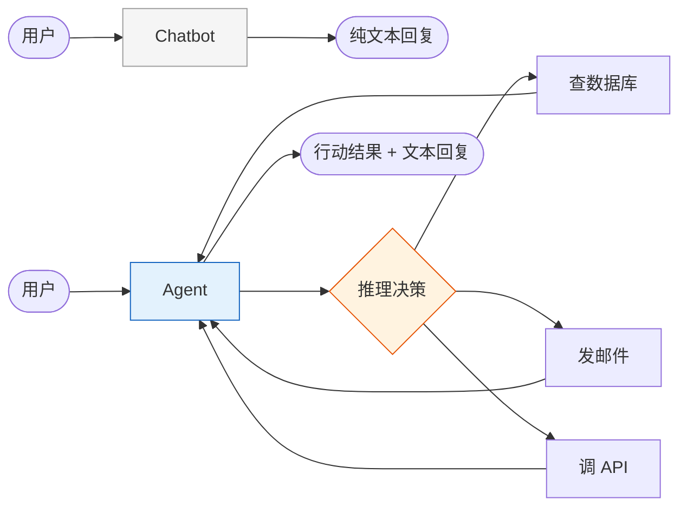
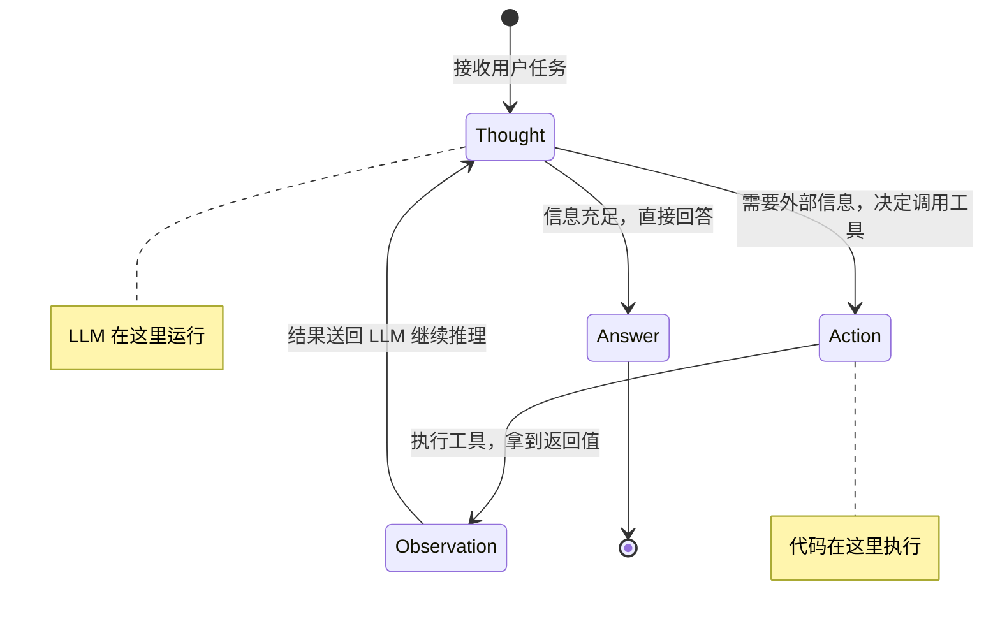
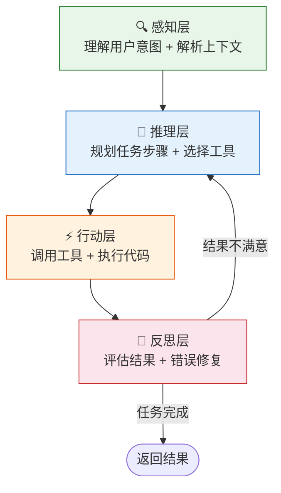

# Agent 实战（一）—— Agent 全景：从对话到自主行动

ChatGPT 能写诗、能改 Bug、能翻译法律合同——但它没法帮你查数据库里上个月的退款记录，也没法自己跑到 GitHub 上给你提 PR。差的不是智力，是手脚。Agent 就是给 LLM 装上手脚的工程方案。

> **环境：** Python 3.12+, 本篇无框架依赖（纯概念 + 伪代码）

---

## 1. Chatbot 和 Agent 的分界线

一个关键区别：**Chatbot 只产出文本，Agent 产出行动**。

把 LLM 想象成一个极其聪明的大脑。Chatbot 模式下，这个大脑被锁在一个隔音房间里——外界的问题通过纸条传进去，回答通过纸条传出来。它能推理、能分析，但它摸不到任何东西。

Agent 模式下，房间的门打开了。大脑可以走出去查文件柜、打电话、操作电脑。它依然靠同一个大脑思考，但多了**感知外部环境**和**执行具体动作**的能力。



形式化一点：Agent = LLM + 工具调用 + 循环控制。LLM 负责"想"，工具负责"做"，循环控制负责把"做的结果"喂回给 LLM，让它决定下一步。

## 2. ReAct：Agent 的思考引擎

ReAct（Reasoning + Acting）是目前最主流的 Agent 运行模式，2022 年由 Yao 等人在论文中提出。核心思路极其简单：让 LLM 交替进行**推理**和**行动**，直到任务完成。

整个过程就是一台有限状态机（FSM），只有四个状态：



用一个具体场景理解这个循环——

> **任务**："帮我查一下北京明天的天气，如果会下雨就取消我下午 3 点的户外会议。"

| 步骤 | 状态 | 内容 |
|------|------|------|
| 1 | **Thought** | 需要两步：先查天气，再根据结果决定是否取消会议 |
| 2 | **Action** | 调用 `get_weather("北京", "明天")` |
| 3 | **Observation** | 返回：`{"天气": "中雨", "温度": "12°C"}` |
| 4 | **Thought** | 明天中雨，符合取消条件，需要取消下午 3 点的会议 |
| 5 | **Action** | 调用 `cancel_meeting("下午3点户外会议")` |
| 6 | **Observation** | 返回：`{"status": "已取消", "通知": "已发送给3位参会者"}` |
| 7 | **Answer** | "北京明天中雨 12°C，已取消下午 3 点的户外会议，3 位参会者已收到通知。" |

注意几个关键细节：

- LLM 在 Thought 阶段**自主决定**调用哪个工具、传什么参数。不是预编程的 if-else。
- Action 阶段由**代码执行**，不是 LLM 在幻想。系统强制打断 LLM 的生成，去跑真实的函数调用。
- Observation 是工具的**真实返回值**，注入回对话历史后，LLM 才能做下一轮判断。

这套机制的 Trade-off 很明确：**每多一轮工具调用，就多一次完整的 LLM 推理开销**。上面的例子跑了 3 轮 Thought，意味着 3 次 API 调用。如果对话历史膨胀到几千 Token，每轮的费用和延迟都在线性增长。

## 3. Agent 的四层能力模型

ReAct 循环解决了"怎么跑"的问题。但一个完整的 Agent 系统，需要四层能力支撑：



**感知层**：不只是读用户输入的字面意思。一个成熟的 Agent 需要解析对话历史、理解隐含意图（"帮我处理一下这个"——"这个"指什么？）、识别多步任务。

**推理层**：这是 LLM 的核心能力场。任务分解、步骤排序、选择合适的工具。但 LLM 的推理并不可靠——它可能跳步、可能选错工具、可能对结果做错误的因果推断。这就是为什么反思层必须存在。

**行动层**：把 LLM 的"决策"转化为真实的代码执行。工具注册、参数校验、超时控制、权限检查全在这一层。

**反思层**：执行结果回到 LLM，它需要判断："任务完成了吗？结果对吗？需要修正吗？"。这一层的质量直接决定 Agent 的可靠性。一个不会反思的 Agent，查到了错误的数据也会信心满满地汇报。

## 4. 一次完整的 Agent 执行快照

用伪代码把上面的概念串起来。这不是可运行的代码，但它精确还原了每个 Agent 框架的底层逻辑：

```python
# 最小 Agent 伪代码——所有框架的底层都是这个循环
tools = {
    "get_weather": get_weather_func,
    "cancel_meeting": cancel_meeting_func,
}

messages = [
    {"role": "system", "content": "你是一个助手，可以调用工具完成任务。"},
    {"role": "user", "content": "北京明天下雨就取消户外会议"},
]

MAX_ITERATIONS = 10  # <--- 核心：必须有硬性上限，防止死循环

for i in range(MAX_ITERATIONS):
    response = llm.chat(messages, tools=tools)  # 调用 LLM

    if response.has_tool_call:                   # LLM 决定调用工具
        tool_name = response.tool_call.name
        tool_args = response.tool_call.arguments
        result = tools[tool_name](**tool_args)    # 执行真实函数
        messages.append({"role": "tool", "content": str(result)})
    else:                                        # LLM 决定直接回答
        print(response.content)
        break
```

30 行代码，四个关键设计决策已经暴露：

1. **工具注册表**（`tools` 字典）：Agent 能做什么，完全取决于你给它装了哪些工具。
2. **消息历史**（`messages` 列表）：LLM 的"记忆"。每轮对话、每次工具返回值都追加到这个列表。
3. **循环控制**（`MAX_ITERATIONS`）：没有这个硬限制，LLM 可能陷入死循环——反复调用同一个工具，或者在两个工具之间来回跳。
4. **中断执行**（`if response.has_tool_call`）：LLM 生成到一半，系统检测到它要调工具，立刻打断文本生成，转去执行代码。

## 5. 2026 年 Agent 技术栈全景

Agent 生态在过去一年经历了剧烈分化。框架层面：

| 框架 | 核心理念 | 适合场景 | 本系列覆盖 |
|------|---------|---------|-----------|
| **PydanticAI** | 类型安全、Model Agnostic、零魔法 | 单 Agent + 生产级应用 | ✅ 主力 |
| **LangGraph** | 图论编排、状态管理、循环工作流 | 多 Agent 复杂编排 | ✅ 进阶 |
| **OpenAI Agents SDK** | 官方支持、Guardrails、Handoffs | OpenAI 生态闭环 | 提及对比 |
| **CrewAI** | 角色扮演、团队协作 | 多 Agent 角色仿真 | 提及对比 |
| **smolagents** | 极简、Code Agent | 快速原型验证 | 提及对比 |

协议层面，两个标准正在重塑整个生态：

- **MCP（Model Context Protocol）**：Anthropic 提出，解决"Agent 怎么连接外部工具"的问题。类似 USB 接口标准——不管什么工具，只要实现 MCP Server，任何 Agent 都能即插即用。OpenAI、Google、Anthropic 已全面支持。
- **A2A（Agent-to-Agent Protocol）**：Google 提出，解决"Agent 之间怎么互相调用"的问题。当你的客服 Agent 需要调用另一个独立部署的订单 Agent，A2A 负责握手和路由。

本系列的技术选型逻辑：**PydanticAI 做核心引擎**（Pythonic、不绑定厂商），**LangGraph 做复杂编排**（当 PydanticAI 的 Handoff 模式不够用时），**MCP 做工具标准**（一次接入，到处可用）。

## 常见坑点

**1. 把 Chatbot 硬包装成 Agent**

最常见的新手误区。给 ChatGPT 写个 System Prompt 说"你是一个能查天气的助手"，但实际上没有任何工具调用能力——模型只是在"演"一个会查天气的角色，返回的天气数据全是编造的。**Agent 的行动必须是真实的代码执行，不是 LLM 的文本生成**。判断标准很简单：如果你的"Agent"在断网情况下也能返回天气数据，那它不是 Agent。

**2. 忽略循环上限**

Agent 的 ReAct 循环没有天然的终止条件。LLM 可能认为"结果不够好，再查一次"，然后反复调用同一个工具。在生产环境里，这意味着 Token 费用指数级膨胀。任何 Agent 系统都必须设置 `MAX_ITERATIONS`，超过上限就降级为直接返回当前最优结果，或者交给人工介入。

**3. 混淆"Agent 智能"和"Prompt 工程"**

Agent 的推理质量高度依赖 System Prompt 和工具描述（Tool Schema）的精确度。模糊的工具描述会导致 LLM 调错工具、传错参数。Agent 不是"更智能的 ChatGPT"，它是"LLM + 精心设计的工具接口 + 严格的流程控制"的工程系统。

## 延伸思考

Agent 本质上依赖 LLM 的推理能力来做"下一步该干什么"的决策。但 LLM 的推理并不可靠——它在复杂的多步任务上经常出错（跳步、选错工具、对中间结果做错误推断）。

一种思路是用更强的模型（GPT-4o → o1 / o3 推理模型）来提升推理质量，代价是延迟和成本；另一种思路是用更强的工程约束（预定义工作流、状态图、条件路由）来减少 LLM 的决策空间，代价是灵活性。

如果剥离所有框架，回到第一性原理：**Agent 的可靠性上限，到底是由 LLM 的推理能力决定，还是由工程编排的严密度决定？** 当任务复杂度超过 5 步以上的工具调用链时，大部分 Agent 的成功率会断崖式下跌。这个问题没有标准答案，但它决定了你的架构选型——是信任 LLM 自由发挥（PydanticAI 单 Agent），还是用图结构硬编码关键路径（LangGraph）。

## 总结

- Agent = LLM + 工具调用 + 循环控制。LLM 负责推理决策，工具负责执行动作，循环让二者交替运行。
- ReAct 是最基础的 Agent 运行模式，本质是一个四状态的有限状态机：Thought → Action → Observation → Answer。
- 每多一轮工具调用，就多一次完整的 LLM 推理开销。Token 成本和延迟随调用链长度线性增长。
- 2026 年的 Agent 技术栈：PydanticAI（引擎）+ LangGraph（编排）+ MCP（工具标准）是当前最稳定的组合。

下一篇进入 **LLM API 与 Function Calling**——Agent 的底层通信协议。搞清楚 LLM 到底是怎么"决定"调用工具的，JSON Schema 在其中扮演什么角色。

## 参考

- [ReAct: Synergizing Reasoning and Acting in Language Models (Yao et al., 2022)](https://arxiv.org/abs/2210.03629)
- [PydanticAI 官方文档](https://ai.pydantic.dev/)
- [LangGraph 官方文档](https://langchain-ai.github.io/langgraph/)
- [MCP Specification (2025-11-25)](https://spec.modelcontextprotocol.io/specification/2025-11-25/)
- [A2A Protocol - Google](https://google.github.io/A2A/)
