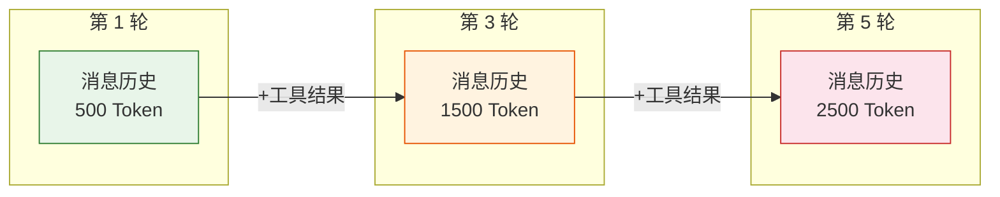
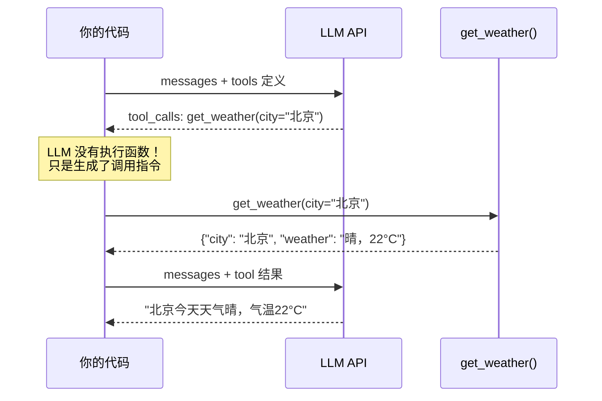

# Agent 实战（二）—— LLM API 与 Function Calling：Agent 的神经系统

上一篇把 Agent 定义为"LLM + 工具调用 + 循环控制"。这篇拆开第一个加号——LLM 和工具之间的通信协议到底是什么？LLM 不会执行代码，它怎么"决定"调用哪个工具、传什么参数？

> **环境：** Python 3.12+, openai 1.68+, anthropic 0.52+, httpx 0.28+

---

## 1. LLM API：一根管道，两种角色

所有主流 LLM 的 API 都遵循同一个交互模式：**你发一个消息列表，模型返回一条回复**。

```python
from openai import OpenAI

client = OpenAI()  # 从环境变量 OPENAI_API_KEY 读取密钥

response = client.chat.completions.create(
    model="gpt-4o",
    messages=[
        {"role": "system", "content": "你是一个简洁的技术助手。"},
        {"role": "user", "content": "Python 的 GIL 是什么？"},
    ],
)
print(response.choices[0].message.content)
```

**观测与验证**：运行后终端会输出一段关于 GIL 的中文解释。如果报 `AuthenticationError`，检查 `OPENAI_API_KEY` 环境变量是否正确设置。

`messages` 列表有三种角色：

| 角色 | 说明 | 谁写的 |
|------|------|--------|
| `system` | 设定 Agent 的人格和行为边界 | 开发者 |
| `user` | 用户的输入 | 终端用户 |
| `assistant` | 模型的回复（包括工具调用指令） | LLM |

还有第四种角色 `tool`，专门承载工具执行结果——后面 Function Calling 部分展开。

## 2. Token 经济学：每个字都在花钱

LLM 不按字符计费，按 Token 计费。一个 Token 大约等于 0.75 个英文单词，中文通常 1-2 个字消耗 1 个 Token。

这件事对 Agent 的影响很直接：**ReAct 循环每多跑一轮，整个对话历史都要重新发送一次**。假设每轮对话历史膨胀 500 Token，跑 5 轮就是额外 2500 Token 的输入开销。



几个关键参数：

**上下文窗口（Context Window）**：模型能处理的最大 Token 数。GPT-4o 是 128K，Claude 3.5 Sonnet 是 200K。听起来很大，但 Agent 的对话历史增长速度超出想象——工具返回的 JSON 数据动辄几百 Token，五六轮工具调用就能吃掉几千 Token。

**截断策略**：当对话历史逼近上下文窗口上限时，必须裁剪。常见做法是保留 System Prompt + 最近 N 轮对话 + 当前用户输入，裁掉中间的历史轮次。更优雅的做法是用摘要压缩——让 LLM 先把旧的对话历史总结成一段话，再继续。

**费用估算公式**：

```
单轮成本 = (输入 Token × 输入单价) + (输出 Token × 输出单价)
Agent 总成本 ≈ Σ(每轮输入 Token) × 输入单价 + Σ(每轮输出 Token) × 输出单价
```

以 GPT-4o 为例（2026 年 3 月价格），输入 $2.5/1M Token，输出 $10/1M Token。一个 5 轮的 Agent 交互，累计输入约 5000 Token，输出约 1500 Token，单次约 $0.03。看着不多，但日均 1 万次调用就是 $300/天。

## 3. Function Calling：LLM 调用工具的秘密

Function Calling 是整个 Agent 架构的基石。它的本质很简单：**告诉 LLM 有哪些工具可用（JSON Schema 描述），LLM 在回复时"选择"调用某个工具并生成参数，但不执行——执行由你的代码负责**。

### 3.1 定义工具：JSON Schema

工具通过 JSON Schema 描述。LLM 看到的不是你的 Python 函数源码，而是这段 Schema：

```python
tools = [
    {
        "type": "function",
        "function": {
            "name": "get_weather",
            "description": "获取指定城市的当前天气。仅支持中国大陆城市。",  # <--- 核心
            "parameters": {
                "type": "object",
                "properties": {
                    "city": {
                        "type": "string",
                        "description": "城市名称，如 '北京'、'上海'"
                    },
                    "unit": {
                        "type": "string",
                        "enum": ["celsius", "fahrenheit"],
                        "description": "温度单位，默认摄氏度"
                    }
                },
                "required": ["city"]
            }
        }
    }
]
```

`description` 字段是 LLM 决策的依据——写得模糊，LLM 就会在不该调的时候调、该调的时候不调。**工具描述的精确程度直接决定 Agent 的可靠性**。

### 3.2 完整执行流程

把 Function Calling 嵌入一次完整的 API 调用中：

```python
import json
from openai import OpenAI

client = OpenAI()

def get_weather(city: str, unit: str = "celsius") -> dict:
    """模拟天气查询接口"""
    # 生产环境替换为真实 API 调用
    mock_data = {"北京": "晴，22°C", "上海": "多云，25°C"}
    return {"city": city, "weather": mock_data.get(city, "未知城市")}

# 第一步：带工具定义发起请求
response = client.chat.completions.create(
    model="gpt-4o",
    messages=[
        {"role": "user", "content": "北京今天天气怎么样？"}
    ],
    tools=tools,  # 上面定义的 JSON Schema
)

message = response.choices[0].message
```

到这里，`message` 可能有两种状态：

```python
# 情况 A：LLM 决定调用工具
if message.tool_calls:
    tool_call = message.tool_calls[0]
    func_name = tool_call.function.name          # "get_weather"
    func_args = json.loads(tool_call.function.arguments)  # {"city": "北京"}

    # 第二步：执行真实函数
    result = get_weather(**func_args)

    # 第三步：把工具结果送回 LLM
    follow_up = client.chat.completions.create(
        model="gpt-4o",
        messages=[
            {"role": "user", "content": "北京今天天气怎么样？"},
            message,  # 包含 tool_calls 的 assistant 消息
            {
                "role": "tool",
                "tool_call_id": tool_call.id,  # <--- 必须匹配
                "content": json.dumps(result, ensure_ascii=False),
            },
        ],
    )
    print(follow_up.choices[0].message.content)

# 情况 B：LLM 直接回答（不需要工具）
else:
    print(message.content)
```

**观测与验证**：运行后终端输出类似"北京今天天气晴，气温 22°C"的自然语言回答。注意 LLM 会用 `get_weather` 的返回值来组织回复，不是照搬 JSON。

整个流程的时序图：



注意中间的分界线——**LLM 从不直接接触工具函数**。它只是根据工具的 JSON Schema 描述，决定要调用什么、传什么参数，然后把这个"调用意图"返回给你的代码。真正的函数执行在你的进程里完成。

### 3.3 并行工具调用

LLM 可以在一次回复中请求调用多个工具。比如用户问"北京和上海的天气"，`message.tool_calls` 会包含两条调用指令：

```python
# message.tool_calls 是一个列表
for tool_call in message.tool_calls:
    func_name = tool_call.function.name
    func_args = json.loads(tool_call.function.arguments)
    result = get_weather(**func_args)

    # 每个工具结果都要带上 tool_call_id
    tool_messages.append({
        "role": "tool",
        "tool_call_id": tool_call.id,
        "content": json.dumps(result, ensure_ascii=False),
    })
```

并行调用减少了 Agent 的循环轮数——原本需要两轮的操作压缩到一轮。但要注意：工具之间如果有依赖关系（先查订单 ID，再用 ID 查物流），LLM 通常会正确地分两轮调用，不会强行并行。

## 4. 多模型统一调用

Agent 不应该绑定单一模型。Anthropic 的 Claude 在长文本理解上更强，Google 的 Gemini 在多模态上更优。PydanticAI 在下一篇正式登场，但底层的多模型切换逻辑现在就能理解。

不同厂商的 API 大同小异。差异集中在三个地方：

| 差异点 | OpenAI | Anthropic | 开源（Ollama） |
|--------|--------|-----------|---------------|
| 工具参数字段 | `tools` | `tools` | `tools`（兼容 OpenAI 格式） |
| 工具调用格式 | `tool_calls` 数组 | `tool_use` content block | `tool_calls` 数组 |
| System Prompt | `messages` 中 role=system | 独立的 `system` 参数 | `messages` 中 role=system |

Anthropic 的差异稍大：

```python
import anthropic

client = anthropic.Anthropic()  # 从 ANTHROPIC_API_KEY 读取

response = client.messages.create(
    model="claude-sonnet-4-20250514",
    max_tokens=1024,
    system="你是一个简洁的技术助手。",  # <--- 独立参数，不在 messages 里
    messages=[
        {"role": "user", "content": "Python 的 GIL 是什么？"}
    ],
    tools=[{  # Schema 格式与 OpenAI 略有不同
        "name": "get_weather",
        "description": "获取指定城市的当前天气",
        "input_schema": {  # OpenAI 用 "parameters"，Anthropic 用 "input_schema"
            "type": "object",
            "properties": {
                "city": {"type": "string", "description": "城市名称"}
            },
            "required": ["city"]
        }
    }],
)
```

这种差异就是 PydanticAI 等框架存在的原因之一——它在上层做了统一抽象，你写一次工具定义，底层自动适配不同的 API 格式。

## 5. 流式输出与 Tool Call 流式处理

普通聊天场景下，流式输出（Streaming）让用户逐字看到回复，体验更好。但在 Agent 场景下，流式处理 Tool Call 比普通文本复杂得多。

```python
stream = client.chat.completions.create(
    model="gpt-4o",
    messages=[{"role": "user", "content": "北京天气"}],
    tools=tools,
    stream=True,  # <--- 开启流式
)

tool_call_chunks = {}  # 用于拼装 tool call 的碎片

for chunk in stream:
    delta = chunk.choices[0].delta

    # 普通文本流式输出
    if delta.content:
        print(delta.content, end="", flush=True)

    # Tool Call 的参数是分块到达的，需要拼装
    if delta.tool_calls:
        for tc in delta.tool_calls:
            idx = tc.index
            if idx not in tool_call_chunks:
                tool_call_chunks[idx] = {"id": "", "name": "", "args": ""}
            if tc.id:
                tool_call_chunks[idx]["id"] = tc.id
            if tc.function and tc.function.name:
                tool_call_chunks[idx]["name"] = tc.function.name
            if tc.function and tc.function.arguments:
                tool_call_chunks[idx]["args"] += tc.function.arguments
```

**关键坑点**：Tool Call 的 `arguments` 字段不是一次性返回完整 JSON，而是分成多个 chunk 逐步到达。必须用字符串拼接的方式攒齐所有 chunk，最后再做 `json.loads()`。提前 parse 会直接炸。

## 常见坑点

**1. Tool Schema 的 description 写得太随意**

`"description": "查询天气"` 太模糊。LLM 无法判断这个工具只支持中国城市、是否需要日期参数、返回值格式是什么。写成 `"获取指定中国大陆城市的当日天气状况，返回天气描述和温度"` 才够。Tool Schema 不是给人看的注释，是 LLM 做决策的输入。

**2. 忘记传 `tool_call_id`**

把工具结果送回 LLM 时，`tool_call_id` 必须和 LLM 返回的 `tool_calls[].id` 精确匹配。漏掉这个字段，API 直接报 400 错误。在并行调用场景下尤其容易搞混——两个工具结果的 `tool_call_id` 不能搞反。

**3. 把 `function.arguments` 当 dict 用**

`tool_call.function.arguments` 的类型是 `str`，不是 `dict`。必须手动 `json.loads()` 解析。而且 LLM 生成的 JSON 偶尔会有格式问题（比如多余的逗号），生产环境应该用 `try-except` 包裹，并在解析失败时让 LLM 重试。

## 总结

- LLM API 的核心是消息列表（messages）。`system` 定人格，`user` 传输入，`assistant` 存回复，`tool` 承载工具结果。
- Function Calling 让 LLM "选择"调用哪个工具、传什么参数，但 LLM 本身不执行任何代码——执行在你的进程里。
- 工具通过 JSON Schema 描述。`description` 字段的精确程度直接决定 LLM 的调用准确率。
- Token 费用随 Agent 循环轮数线性增长。对话历史管理和截断策略是成本控制的关键。
- 不同模型的 API 格式有差异（OpenAI vs Anthropic），框架层统一抽象是 PydanticAI 的核心价值之一。

下一篇用纯 Python + 这些 API，**从零手写一个完整的 ReAct Agent**——不靠任何框架，亲手实现工具注册、消息管理和循环控制。

## 参考

- [OpenAI Function Calling 官方文档](https://platform.openai.com/docs/guides/function-calling)
- [Anthropic Tool Use 官方文档](https://docs.anthropic.com/en/docs/build-with-claude/tool-use)
- [OpenAI API Pricing](https://openai.com/api/pricing/)
- [OpenAI Tokenizer 工具](https://platform.openai.com/tokenizer)
