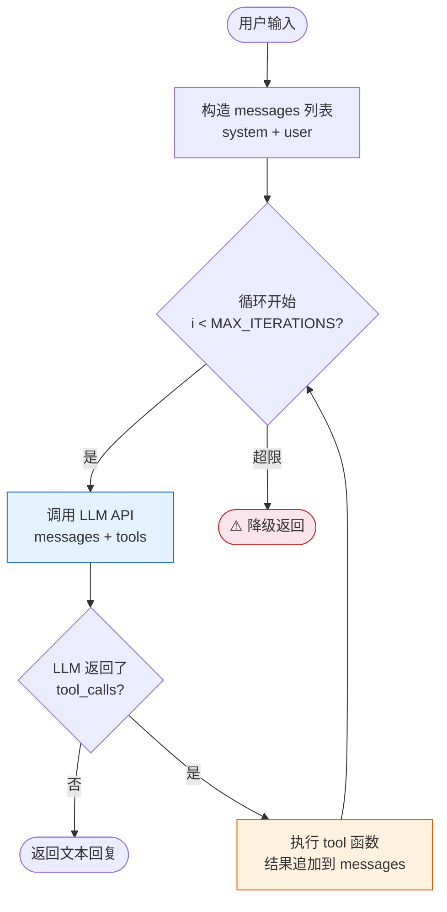
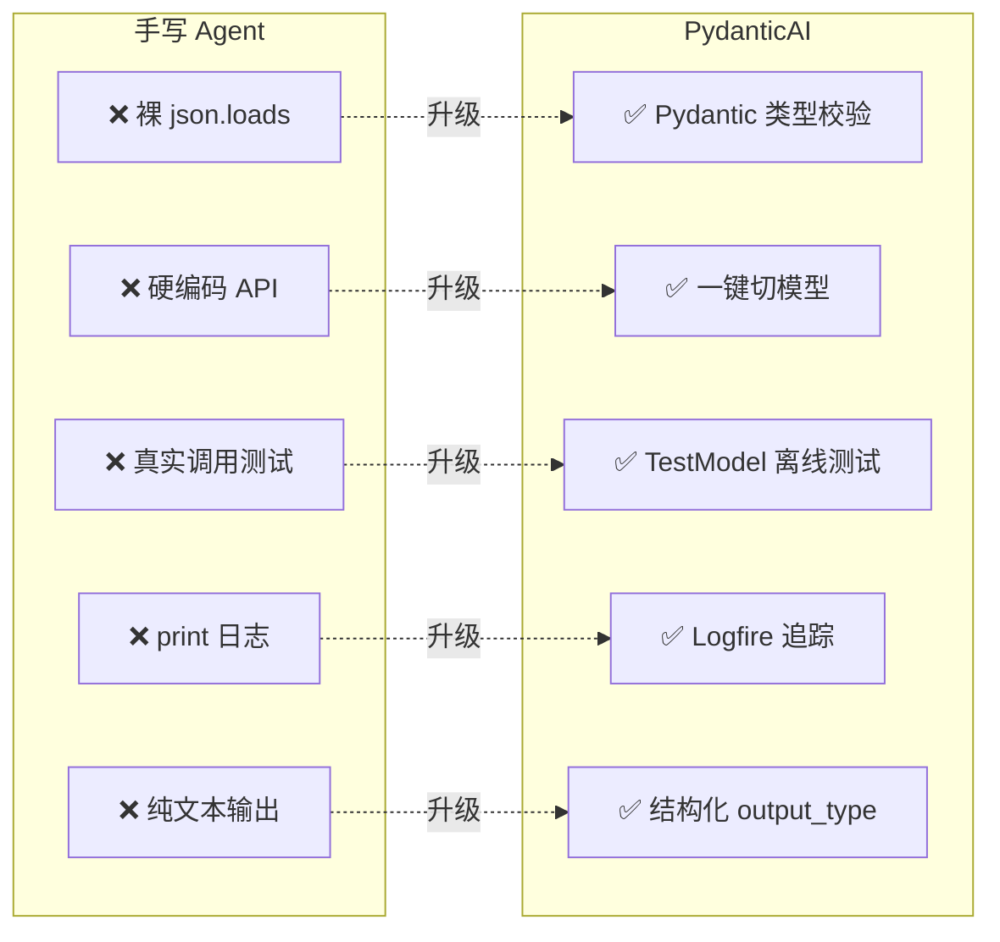

# Agent 实战（三）—— 从零手写 Agent：不依赖框架的 ReAct 实现

前两篇搞清楚了 Agent 的心智模型和 LLM API 的通信协议。这篇动手——用纯 Python + OpenAI API，不借助任何框架，实现一个完整的 ReAct Agent。写完之后，你会清楚每个 Agent 框架底层在做什么。也会明白，为什么"自己写"在生产环境里不够用。

> **环境：** Python 3.12+, openai 1.68+, uv 0.11+

---

## 1. 目标与项目结构

这个 Agent 能做什么：接收自然语言任务，自主决定调用哪些工具、以什么顺序执行，最终返回结果。

```
mini_agent/
├── agent.py        # Agent 循环核心
├── tools.py        # 工具定义与注册
├── main.py         # 入口
└── .env            # API Key（不提交到 Git）
```

`.env` 文件内容：

```bash
OPENAI_API_KEY=sk-your-key-here
```

## 2. 工具注册表：Agent 的四肢

先定义两个工具——查天气和数学计算：

```python
# tools.py
import json
import math

def get_weather(city: str) -> str:
    """获取指定城市的当前天气（模拟）"""
    weather_db = {
        "北京": "晴天，22°C，湿度 45%",
        "上海": "多云，25°C，湿度 72%",
        "广州": "雷阵雨，30°C，湿度 88%",
    }
    return weather_db.get(city, f"未找到 {city} 的天气数据")


def calculate(expression: str) -> str:
    """计算数学表达式，支持基本运算和 math 模块函数"""
    try:
        # 限制可用函数，阻止代码注入
        allowed = {"abs": abs, "round": round, "math": math}
        result = eval(expression, {"__builtins__": {}}, allowed)
        return str(result)
    except Exception as err:
        return f"计算错误: {err}"
```

接下来是关键——**工具注册表**。把函数和它的 JSON Schema 绑定在一起：

```python
# tools.py（续）

# 工具注册表：函数引用 + JSON Schema 成对注册
TOOL_REGISTRY = {
    "get_weather": {
        "function": get_weather,
        "schema": {
            "type": "function",
            "function": {
                "name": "get_weather",
                "description": "获取指定中国城市的当前天气，返回天气状况和温度",
                "parameters": {
                    "type": "object",
                    "properties": {
                        "city": {
                            "type": "string",
                            "description": "中国城市名称，如 '北京'、'上海'"
                        }
                    },
                    "required": ["city"]
                }
            }
        }
    },
    "calculate": {
        "function": calculate,
        "schema": {
            "type": "function",
            "function": {
                "name": "calculate",
                "description": "计算数学表达式。支持加减乘除、幂运算、math 模块函数（如 math.sqrt）",
                "parameters": {
                    "type": "object",
                    "properties": {
                        "expression": {
                            "type": "string",
                            "description": "Python 数学表达式，如 '2**10' 或 'math.sqrt(144)'"
                        }
                    },
                    "required": ["expression"]
                }
            }
        }
    },
}


def get_tool_schemas() -> list[dict]:
    """提取所有工具的 JSON Schema，传给 LLM"""
    return [entry["schema"] for entry in TOOL_REGISTRY.values()]


def execute_tool(name: str, arguments: dict) -> str:
    """根据名称执行工具，返回字符串结果"""
    if name not in TOOL_REGISTRY:
        return f"错误：工具 '{name}' 不存在"
    func = TOOL_REGISTRY[name]["function"]
    return func(**arguments)
```

这段代码做了两件核心的事：

1. **Schema 与函数绑定**：`TOOL_REGISTRY` 确保每个工具的 JSON Schema 和实际函数在同一个地方维护。如果函数签名改了但 Schema 没更新，Agent 就会传错参数。
2. **执行隔离**：`execute_tool()` 是唯一的工具执行入口。未来加权限检查、日志记录、超时控制，只需改这一个函数。

## 3. Agent 循环：核心 30 行

`run_agent()` 的执行流程：



整个 Agent 的核心逻辑：

```python
# agent.py
import json
from openai import OpenAI
from tools import get_tool_schemas, execute_tool

client = OpenAI()
MAX_ITERATIONS = 10  # 硬性安全上限


def run_agent(user_input: str, model: str = "gpt-4o") -> str:
    """运行一次完整的 Agent ReAct 循环"""
    messages = [
        {
            "role": "system",
            "content": (
                "你是一个任务执行助手。根据用户的需求，调用合适的工具完成任务。"
                "如果不需要工具，直接回答。每次只处理一个步骤。"
            ),
        },
        {"role": "user", "content": user_input},
    ]

    tool_schemas = get_tool_schemas()

    for iteration in range(MAX_ITERATIONS):
        response = client.chat.completions.create(
            model=model,
            messages=messages,
            tools=tool_schemas,
        )
        choice = response.choices[0]
        assistant_message = choice.message

        # 把 assistant 的回复追加到对话历史
        messages.append(assistant_message)

        # 检查是否需要调用工具
        if not assistant_message.tool_calls:
            # LLM 决定直接回答，循环结束
            return assistant_message.content or "(无内容)"

        # 执行所有工具调用（支持并行）
        for tool_call in assistant_message.tool_calls:
            func_name = tool_call.function.name
            func_args = json.loads(tool_call.function.arguments)

            print(f"  [工具调用] {func_name}({func_args})")  # 可观测性
            result = execute_tool(func_name, func_args)
            print(f"  [工具结果] {result}")

            messages.append({
                "role": "tool",
                "tool_call_id": tool_call.id,
                "content": result,
            })

    # 超过最大循环次数，降级返回
    return "⚠️ Agent 达到最大迭代次数，未能完成任务。最后状态已记录。"
```

**入口文件**：

```python
# main.py
from agent import run_agent

if __name__ == "__main__":
    queries = [
        "北京今天天气怎么样？",
        "计算 2 的 20 次方",
        "上海天气如何？如果温度超过 28 度，帮我算一下 35 * 1.5 是多少",
    ]
    for query in queries:
        print(f"\n{'='*50}")
        print(f"用户: {query}")
        answer = run_agent(query)
        print(f"Agent: {answer}")
```

**观测与验证**：

```bash
uv run main.py
```

第三个查询最有意思——Agent 需要两轮循环：先查上海天气拿到 25°C，判断没超过 28 度，直接回复不需要计算。假如 mock 数据里上海是 30°C，它就会额外调一次 `calculate` 工具。

终端输出类似：

```
==================================================
用户: 上海天气如何？如果温度超过 28 度，帮我算一下 35 * 1.5 是多少
  [工具调用] get_weather({'city': '上海'})
  [工具结果] 多云，25°C，湿度 72%
Agent: 上海今天多云，25°C，湿度 72%。温度没有超过 28 度，不需要额外计算。
```

## 4. 解剖：这 30 行代码的四个设计决策

回头审视 `run_agent()`，四个架构问题已有定论：

**消息历史是全量累积的**。每一轮 assistant 回复和 tool 结果都追加到 `messages` 列表，永远不删除。好处是 LLM 拥有完整的上下文做决策；代价是 Token 消耗随轮数线性增长。生产环境需要加一层窗口管理——保留前 N 轮和后 M 轮，中间用摘要压缩。

**工具执行是同步阻塞的**。`execute_tool()` 是同步调用。如果工具需要查数据库或调外部 API，整个 Agent 循环在这里卡住。生产环境应该用 `asyncio` 做异步并发，尤其是并行工具调用场景。

**错误处理几乎没有**。工具函数报错会直接炸掉 Agent 循环。生产环境至少需要 try-except 兜底，把错误信息作为 tool 结果返回给 LLM，让它尝试用别的方式解决——这就是 Agent 的"自修复"能力。

**没有状态持久化**。Agent 的记忆只在单次调用内存活。函数执行完，`messages` 列表就被垃圾回收了。跨会话的 Agent 需要把消息历史持久化到数据库。

## 5. 为什么需要框架：手写方案的五个缺口



这个手写 Agent 能跑，但离生产还有明确的距离：

| 缺口 | 说明 | 框架怎么解决 |
|------|------|------------|
| **类型安全** | 工具参数靠 `json.loads()` 裸解析，无验证 | PydanticAI 用 Pydantic Model 做强类型校验 |
| **多模型适配** | 切换到 Claude 要改一堆 API 调用代码 | PydanticAI 一个参数切模型 |
| **测试** | 测试 Agent 必须真实调用 LLM API，又慢又贵 | PydanticAI 提供 TestModel，离线测试 |
| **可观测性** | 只有 print 日志 | Logfire 集成，完整的调用链追踪 |
| **结构化输出** | LLM 返回的是纯文本，无法保证格式 | PydanticAI 用 Pydantic Model 约束返回类型 |

这不是说框架"更好"。而是手写方案在这五个点上都需要额外写大量样板代码，框架帮你把这些事定型成了约定。

**显式权衡**：用框架意味着多了一层抽象。报错栈变深——你看到的错误可能是框架内部的，需要翻源码才能定位。而手写方案的报错栈极其干净，错在哪里一目了然。在学习和原型阶段，手写更高效；在交付和维护阶段，框架更划算。

## 常见坑点

**1. `eval()` 的安全隐患**

上面 `calculate` 工具里用了 `eval()`。即使限制了 `__builtins__`，仍然不是完全安全的——精心构造的表达式可以突破沙箱。生产环境应该用 `ast.literal_eval()`（只支持字面量）或专用的数学解析库（如 `simpleeval`）。Agent 的工具函数必须视 LLM 传入的参数为不可信输入。

**2. LLM 生成的 JSON 格式偶尔出错**

`tool_call.function.arguments` 返回的 JSON 字符串偶尔会有问题——多余的逗号、缺失引号、Unicode 编码异常。直接 `json.loads()` 会抛 `JSONDecodeError`。加一层异常捕获，把解析错误作为 tool 结果返回给 LLM，让它重新生成，效果比直接崩溃好得多：

```python
try:
    func_args = json.loads(tool_call.function.arguments)
except json.JSONDecodeError as err:
    messages.append({
        "role": "tool",
        "tool_call_id": tool_call.id,
        "content": f"参数解析失败: {err}。请重新调用并确保参数是有效 JSON。",
    })
    continue  # 跳过本轮，让 LLM 重试
```

## 总结

- 用纯 Python 实现了一个完整的 ReAct Agent：工具注册表 + 消息历史 + 循环控制。
- 核心循环不到 30 行。`run_agent()` 的逻辑就是所有 Agent 框架的公共底座。
- 手写方案暴露了五个生产级缺口：类型安全、多模型适配、测试、可观测性、结构化输出。
- 这些缺口正是 PydanticAI 等框架存在的理由。

下一篇正式进入 **PydanticAI**——用类型安全的方式重写这个 Agent，同时获得多模型切换、依赖注入和测试支持。

## 参考

- [OpenAI Chat Completions API](https://platform.openai.com/docs/api-reference/chat)
- [Python eval() 安全风险讨论](https://nedbatchelder.com/blog/201206/eval_really_is_dangerous.html)
- [PydanticAI 设计理念 - 为什么不继续用 LangChain](https://ai.pydantic.dev/why/)
