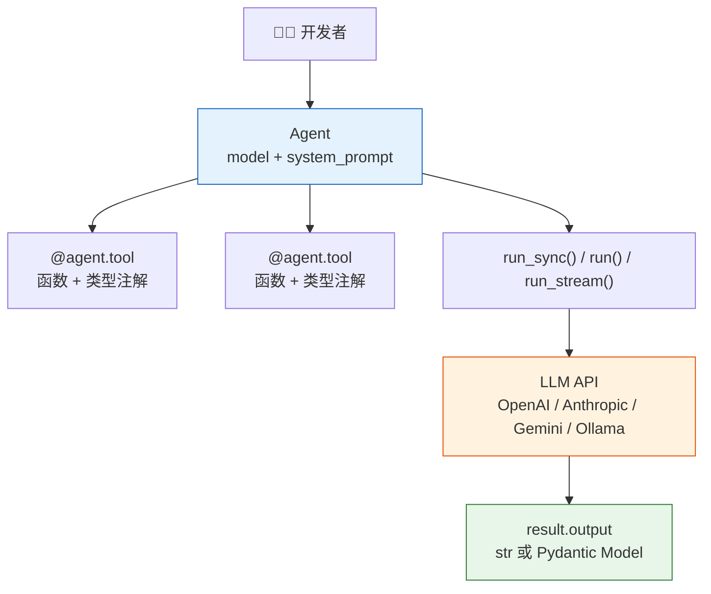
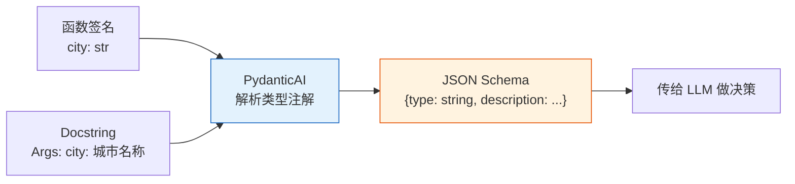

# Agent 实战（四）—— PydanticAI 入门：第一个类型安全的 Agent

上一篇手写的 Agent 核心循环不到 30 行，但也暴露了五个缺口：类型安全、多模型适配、测试、可观测性、结构化输出。PydanticAI 把这五件事变成了框架内置能力，同时保持了 Pythonic 的代码风格——没有 YAML 配置文件，没有装饰器魔法链，核心概念就四个。

> **环境：** Python 3.12+, pydantic-ai 1.70+, uv 0.11+

---

## 1. 为什么选 PydanticAI 而不是 LangChain

先回答一个绕不开的问题。LangChain 是 Agent 生态最老牌的框架，但它在 2024-2025 年经历了严重的口碑分化。核心争议集中在过度封装——一层包一层的 Chain 和 Runnable 抽象，导致报错栈动辄 200 行，根本看不清是 Prompt 问题还是底层 API 错误。

PydanticAI 的设计哲学完全相反：

| 维度 | LangChain（生态） | PydanticAI |
|------|-------------------|------------|
| 核心理念 | 一切都是 Chain/Runnable | 一切都是 Python 函数 |
| 工具定义 | 需要继承 BaseTool 或用装饰器 | 直接写函数，类型注解即 Schema |
| 调试体验 | 报错栈层层嵌套 | 报错栈扁平，指向你的代码 |
| 模型切换 | 需要更换 LLM Wrapper 类 | 改一个字符串参数 |
| 厂商锁定 | 否 | 否 |
| 学习曲线 | 陡峭（概念多） | 平缓（会写函数就行） |

PydanticAI 由 Pydantic 的作者团队开发。2025 年 9 月发布 V1 稳定版。底层复用了 Pydantic 的数据验证能力——你用 Pydantic Model 定义工具参数和返回类型，框架自动生成 JSON Schema 传给 LLM，自动校验 LLM 的返回值。

**显式权衡**：PydanticAI 的生态规模远不如 LangChain。LangChain 有海量的社区集成（向量数据库、文档加载器、Memory 模块），PydanticAI 在这些方面需要自己接。选 PydanticAI 意味着"框架做得少，你自己控制得多"——对理解底层原理是好事，对快速搭建 PoC 可能需要更多代码。

## 2. 安装与第一个 Agent

PydanticAI 的架构一张图看清：



```bash
# 推荐用 uv 管理环境
uv init my-agent && cd my-agent
uv add 'pydantic-ai[openai]'
```

`pydantic-ai[openai]` 会同时安装 OpenAI 的依赖。如果用 Anthropic 或 Gemini，换成 `pydantic-ai[anthropic]` 或 `pydantic-ai[google]`。

最简单的 Agent——不带工具，纯问答：

```python
# hello_agent.py
from pydantic_ai import Agent

agent = Agent(
    "openai:gpt-4o",  # <--- 模型用 "provider:model-name" 格式
    system_prompt="你是一个极简的技术助手，回答控制在两句话以内。",
)

result = agent.run_sync("Python 的 asyncio 和多线程有什么区别？")
print(result.output)
```

**观测与验证**：终端输出一段精简的对比描述。`run_sync()` 是同步调用，适合脚本和学习。生产环境用 `await agent.run()` 的异步版本。

四个核心概念已经全部出场：

1. **Agent**：核心对象，绑定模型和 System Prompt。
2. **model 参数**：`"openai:gpt-4o"` / `"anthropic:claude-sonnet-4-20250514"` / `"google-gla:gemini-2.0-flash"`，切模型改这一个字符串。
3. **system_prompt**：可以是字符串，也可以是函数（后面展开）。
4. **result.output**：Agent 的返回值。默认是 `str`，后面用 Pydantic Model 约束为结构化数据。

## 3. 给 Agent 装工具

用 `@agent.tool` 装饰器注册工具。对比手写方案里那一大块 JSON Schema，PydanticAI 直接从函数签名和 docstring 自动生成 Schema：

```python
from pydantic_ai import Agent, RunContext

agent = Agent(
    "openai:gpt-4o",
    system_prompt="你是一个任务执行助手，根据需求调用合适的工具。",
)


@agent.tool
async def get_weather(ctx: RunContext[None], city: str) -> str:
    """获取指定中国城市的当前天气。

    Args:
        city: 中国城市名称，如 '北京'、'上海'
    """
    weather_db = {
        "北京": "晴天，22°C，湿度 45%",
        "上海": "多云，25°C，湿度 72%",
    }
    return weather_db.get(city, f"未找到 {city} 的天气数据")


@agent.tool
async def calculate(ctx: RunContext[None], expression: str) -> str:
    """计算数学表达式。支持加减乘除和幂运算。

    Args:
        expression: Python 数学表达式，如 '2**10' 或 '144/12'
    """
    import math
    try:
        allowed = {"abs": abs, "round": round, "math": math}
        result = eval(expression, {"__builtins__": {}}, allowed)
        return str(result)
    except Exception as err:
        return f"计算错误: {err}"


result = agent.run_sync("北京天气如何？顺便算一下 2 的 16 次方")
print(result.output)
```

`RunContext[None]` 的第一个参数是必须的——框架用它传递依赖注入的上下文（下一篇展开）。这里暂时传 `None`。

**自动 Schema 生成**的机制：PydanticAI 读取函数的类型注解（`city: str`）和 docstring 里的 `Args` 描述，自动构造 JSON Schema 传给 LLM。这意味着你的 docstring 不是"可选的注释"——它直接影响 LLM 决定是否调用这个工具、传什么参数。



## 4. 三种运行模式

PydanticAI 提供三种运行方式，适配不同场景：

```python
# 1. 同步运行（学习、脚本、CLI 工具）
result = agent.run_sync("查天气")
print(result.output)

# 2. 异步运行（FastAPI、后端服务）
import asyncio

async def main():
    result = await agent.run("查天气")
    print(result.output)

asyncio.run(main())

# 3. 流式运行（实时输出、聊天界面）
async def stream_demo():
    async with agent.run_stream("查天气") as stream:
        async for chunk in stream.stream_text():
            print(chunk, end="", flush=True)

asyncio.run(stream_demo())
```

`run_stream()` 的底层原理：LLM 的文本回复逐 Token 到达时立刻推送给调用方。但如果 LLM 决定调用工具，流会暂停——先执行工具拿到结果，再继续流式输出后续文本。框架在内部处理了这个切换。

## 5. 多模型切换：一行代码的事

手写方案切模型要改 API 客户端、调整参数格式、处理响应差异。PydanticAI 把这些封装成了统一接口：

```python
# OpenAI
agent_openai = Agent("openai:gpt-4o", system_prompt="...")

# Anthropic
agent_claude = Agent("anthropic:claude-sonnet-4-20250514", system_prompt="...")

# Google Gemini
agent_gemini = Agent("google-gla:gemini-2.0-flash", system_prompt="...")

# 本地 Ollama
agent_local = Agent("ollama:qwen2.5:7b", system_prompt="...")
```

甚至可以运行时动态切换：

```python
from pydantic_ai.models.openai import OpenAIModel

gpt4o = OpenAIModel("gpt-4o")
gpt4o_mini = OpenAIModel("gpt-4o-mini")

# 复杂任务用 4o，简单任务用 mini 省钱
result = agent.run_sync("复杂的分析任务", model=gpt4o)
result = agent.run_sync("简单问答", model=gpt4o_mini)
```

这对生产环境很实用。可以实现基于任务复杂度的模型路由——简单任务走便宜的小模型，关键决策走大模型。

## 6. 对话记忆：多轮交互

默认情况下，每次 `run_sync()` 是独立的——没有上下文延续。用 `message_history` 实现多轮对话：

```python
result1 = agent.run_sync("我叫张三，在北京工作")
print(result1.output)

# 把上一轮的消息历史传入
result2 = agent.run_sync(
    "我所在城市的天气怎么样？",
    message_history=result1.all_messages(),  # <--- 核心
)
print(result2.output)
```

第二轮，Agent 能从对话历史中推断出"我所在城市"是北京，然后调用 `get_weather("北京")`。`all_messages()` 返回完整的消息列表（包括 system、user、assistant、tool 消息），可以序列化后存到数据库做持久化。

## 常见坑点

**1. 工具函数的第一个参数必须是 `RunContext`**

即使你暂时不用依赖注入，`@agent.tool` 装饰的函数第一个参数必须是 `RunContext[T]`。忘了加会直接报 `TypeError`。这是框架的硬性约定。

**2. Docstring 影响工具调用准确率**

PydanticAI 从 docstring 的 `Args` 部分生成参数描述。如果 docstring 写得含糊或干脆没写，LLM 看到的 Schema 里参数描述就是空的——它不知道 `city` 应该传什么格式。**docstring 是工具的用户界面，用户是 LLM**。

**3. `run_sync()` 在已有事件循环中报错**

如果你的代码已经在一个 `asyncio` 事件循环里（比如 Jupyter Notebook 或 FastAPI），`run_sync()` 会报 `RuntimeError: This event loop is already running`。在这些环境里用 `await agent.run()` 替代。

## 总结

- PydanticAI 的核心概念只有四个：Agent、model、tool、result。
- 工具定义极其简单：写一个带类型注解和 docstring 的 Python 函数，加上 `@agent.tool` 装饰器。
- 多模型切换只需改一个字符串参数，运行时也能动态切换（模型路由策略）。
- 对话记忆通过 `message_history` 传递，框架不替你管理——你自己控制持久化策略。

下一篇深入 **结构化输出与多模型切换**——让 Agent 的返回值不再是随意的自然语言，而是严格符合数据结构的 Pydantic Model。

## 参考

- [PydanticAI 官方文档 - Getting Started](https://ai.pydantic.dev/)
- [PydanticAI 设计理念 - Why PydanticAI](https://ai.pydantic.dev/why/)
- [Pydantic V2 文档](https://docs.pydantic.dev/latest/)
