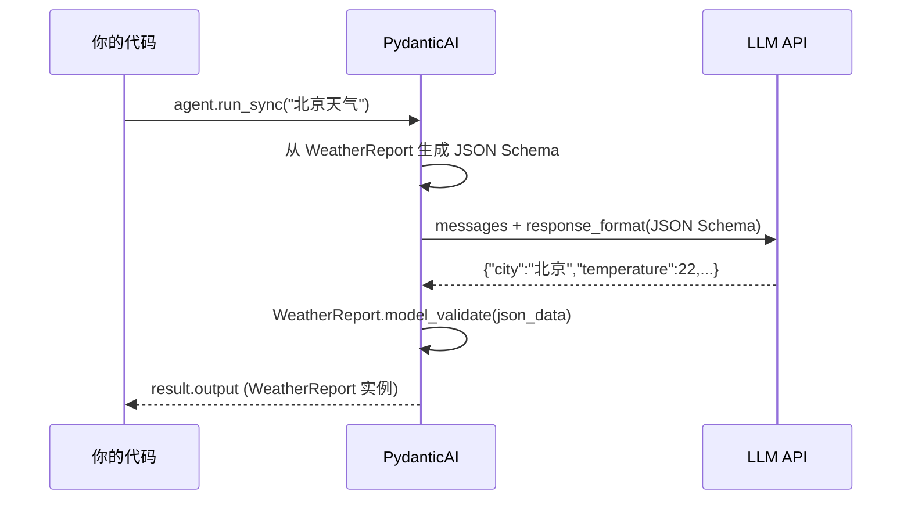

# Agent 实战（五）—— 结构化输出与多模型切换

Agent 回复一段自然语言文本——"北京今天晴，22 度"——对聊天场景没问题。但当 Agent 的输出要接入下游系统（写入数据库、触发 API、更新 UI 状态），自然语言就是灾难。你没法可靠地从"22 度"里提取出数字 22。PydanticAI 的结构化输出用 Pydantic Model 约束 LLM 的返回值，从根源上消除这个问题。

> **环境：** Python 3.12+, pydantic-ai 1.70+, pydantic 2.12+

---

## 1. 结构化输出：让 LLM 返回数据，不是散文

核心思路：定义一个 Pydantic Model 作为 `output_type`，PydanticAI 强制 LLM 按照这个结构返回 JSON，然后自动反序列化为 Python 对象。

```python
from pydantic import BaseModel, Field
from pydantic_ai import Agent


class WeatherReport(BaseModel):
    """天气报告的结构化数据"""
    city: str = Field(description="城市名称")
    temperature: float = Field(description="温度，摄氏度")
    condition: str = Field(description="天气状况，如 晴/多云/雨")
    humidity: int = Field(description="湿度百分比，0-100")
    summary: str = Field(description="一句话天气总结")


agent = Agent(
    "openai:gpt-4o",
    output_type=WeatherReport,  # <--- 核心：约束返回类型
    system_prompt="你是一个天气分析师，根据用户问题返回结构化天气数据。",
)

result = agent.run_sync("北京今天天气怎么样？")
report = result.output  # 类型是 WeatherReport，不是 str

print(f"城市: {report.city}")
print(f"温度: {report.temperature}°C")
print(f"状况: {report.condition}")
print(f"湿度: {report.humidity}%")
print(f"总结: {report.summary}")
```

**观测与验证**：`result.output` 的类型是 `WeatherReport` 实例，IDE 有完整的自动补全。`report.temperature` 是 `float`，可以直接做数值比较（如 `if report.temperature > 30`），不需要正则解析。

底层发生了什么：



PydanticAI 把 Pydantic Model 转成 JSON Schema 塞进 API 请求，LLM 被约束在这个 Schema 的框架内生成 JSON（OpenAI 的 Structured Outputs 和 Anthropic 的 JSON Mode 都支持这个能力）。返回后，Pydantic 做强类型校验——类型不对、字段缺失都会触发重试。

## 2. 复杂嵌套结构与 Union 类型

实际场景中，Agent 的输出往往不是扁平的。比如一个代码审查 Agent，需要返回多条审查意见，每条意见有严重等级、代码位置和修改建议：

```python
from pydantic import BaseModel, Field


class ReviewComment(BaseModel):
    """单条代码审查意见"""
    severity: str = Field(description="严重等级: critical/warning/info")
    line_range: str = Field(description="涉及的代码行范围，如 '15-22'")
    issue: str = Field(description="问题描述")
    suggestion: str = Field(description="修改建议")


class CodeReview(BaseModel):
    """代码审查报告"""
    file_name: str = Field(description="被审查的文件名")
    overall_score: int = Field(description="代码质量评分 1-10", ge=1, le=10)
    comments: list[ReviewComment] = Field(description="审查意见列表")
    approved: bool = Field(description="是否通过审查")


agent = Agent(
    "openai:gpt-4o",
    output_type=CodeReview,
    system_prompt="你是高级代码审查员。分析代码质量，返回结构化审查报告。",
)
```

`ge=1, le=10` 是 Pydantic 的字段验证——如果 LLM 返回了 `overall_score: 15`，Pydantic 会拒绝并触发 PydanticAI 的重试机制，让 LLM 重新生成符合约束的值。

### Union 类型：多种返回结构

有时 Agent 需要根据情况返回不同结构。比如一个分诊 Agent，可能直接回答，也可能转交给专家：

```python
from pydantic_ai import Agent


class DirectAnswer(BaseModel):
    """直接回答用户"""
    answer: str
    confidence: float = Field(ge=0.0, le=1.0)


class Escalation(BaseModel):
    """需要转交给人工/专家 Agent"""
    reason: str
    department: str
    priority: str = Field(description="high/medium/low")


agent = Agent(
    "openai:gpt-4o",
    output_type=DirectAnswer | Escalation,  # <--- Union 类型
    system_prompt="简单问题直接回答，复杂或敏感问题转交专家。",
)

result = agent.run_sync("我想退款，订单号 A12345，三天前买的")

match result.output:
    case DirectAnswer(answer=ans):
        print(f"直接回答: {ans}")
    case Escalation(department=dept, priority=pri):
        print(f"转交 {dept}，优先级 {pri}")
```

Python 3.10+ 的 `match` 语法和 Pydantic 的 Union 类型配合得天衣无缝。下游代码拿到的是确定的数据类型，不需要做任何字符串解析。

## 3. 动态 System Prompt

固定的 System Prompt 适合简单场景。但 Agent 经常需要根据上下文动态调整行为——比如根据当前用户的角色、权限、历史交互调整回复风格。

PydanticAI 支持函数式 System Prompt：

```python
from datetime import datetime
from pydantic_ai import Agent, RunContext


# 依赖类型：携带运行时上下文
class UserContext(BaseModel):
    user_name: str
    role: str  # "admin" | "user"
    timezone: str


agent = Agent(
    "openai:gpt-4o",
    deps_type=UserContext,
    system_prompt=(
        "你是一个企业内部助手。根据用户角色调整回答范围。"
    ),
)


@agent.system_prompt  # <--- 动态追加
def add_user_context(ctx: RunContext[UserContext]) -> str:
    now = datetime.now().strftime("%Y-%m-%d %H:%M")
    return (
        f"当前用户: {ctx.deps.user_name}，角色: {ctx.deps.role}，"
        f"时区: {ctx.deps.timezone}，当前时间: {now}。"
        f"{'该用户拥有管理员权限，可以查看敏感数据。' if ctx.deps.role == 'admin' else ''}"
    )


# 运行时传入上下文
admin = UserContext(user_name="张三", role="admin", timezone="Asia/Shanghai")
result = agent.run_sync("查看上个月的营收数据", deps=admin)
```

`@agent.system_prompt` 装饰的函数在每次 Agent 运行时被调用，返回的字符串追加到静态 System Prompt 后面。这样 LLM 每次看到的 System Prompt 都是最新的动态上下文。

## 4. 结果验证与自动重试

LLM 不是 100% 可靠的——即使用了结构化输出，它偶尔也会返回不符合约束的数据。PydanticAI 内置了自动重试机制：

```python
from pydantic import BaseModel, Field, field_validator
from pydantic_ai import Agent


class TaskPlan(BaseModel):
    """任务执行计划"""
    steps: list[str] = Field(min_length=2, max_length=8)
    estimated_minutes: int = Field(ge=1, le=480)
    risk_level: str

    @field_validator("risk_level")
    @classmethod
    def validate_risk(cls, v: str) -> str:
        allowed = {"low", "medium", "high"}
        if v.lower() not in allowed:
            raise ValueError(f"risk_level 必须是 {allowed} 之一，收到 '{v}'")
        return v.lower()


agent = Agent(
    "openai:gpt-4o",
    output_type=TaskPlan,
    retries=3,  # <--- 验证失败时最多重试 3 次
)
```

当 LLM 返回 `risk_level: "moderate"` 时，`field_validator` 拒绝这个值，PydanticAI 把验证错误信息发回给 LLM："risk_level 必须是 {'low', 'medium', 'high'} 之一，收到 'moderate'"。LLM 看到这个反馈后通常会修正为 `"medium"`。

这套"校验 → 报错 → 重试"的闭环，是结构化输出可靠性的最后一道防线。

## 5. 工具 + 结构化输出组合

工具和结构化输出可以同时使用。Agent 先调工具收集信息，最后用结构化格式汇总：

```python
class TravelAdvice(BaseModel):
    destination: str
    weather: str
    packing_tips: list[str]
    estimated_budget: float = Field(description="预估费用，人民币")


agent = Agent(
    "openai:gpt-4o",
    output_type=TravelAdvice,
    system_prompt="你是旅行顾问，查询目的地天气后给出旅行建议。",
)


@agent.tool
async def get_weather(ctx: RunContext[None], city: str) -> str:
    """获取指定城市的天气"""
    # ... 省略实现
    return "晴天，32°C，紫外线强"


result = agent.run_sync("下周去三亚旅游，需要准备什么？")
advice = result.output  # TravelAdvice 实例
print(f"目的地: {advice.destination}")
print(f"天气: {advice.weather}")
print(f"打包清单: {advice.packing_tips}")
print(f"预估预算: ¥{advice.estimated_budget}")
```

执行顺序：Agent 先调用 `get_weather("三亚")` 拿到天气数据，然后基于天气和旅行场景，组装出符合 `TravelAdvice` 结构的返回值。工具调用和结构化输出在同一个 ReAct 循环内完成。

## 常见坑点

**1. 结构化输出不是所有模型都支持**

OpenAI 的 GPT-4o 和 GPT-4o-mini 支持 Structured Outputs（即 `response_format: json_schema`）。但部分老模型和开源模型不支持。PydanticAI 在不支持的模型上会退化为 Prompt 引导 + JSON 解析，可靠性会下降。用 Ollama 本地模型时要注意这一点。

**2. Pydantic `Field(description=...)` 不是可选装饰**

`description` 直接映射到 JSON Schema 的字段描述，LLM 靠它理解每个字段应该填什么。没有 description 的字段，LLM 只能靠字段名猜——`estimated_minutes` 还算直观，`em` 就完全猜不到了。

**3. Union 类型的歧义**

如果 Union 里的多个类型字段高度重叠（比如两个 Model 都有 `message` 字段），LLM 可能选错类型。解决办法：给每个 Model 加一个 `type` 字段做显式区分，如 `type: Literal["direct_answer"]`。

## 总结

- 结构化输出把 LLM 的返回值从"不可控的文本"变成"强类型的数据对象"。下游代码不需要正则解析。
- Pydantic 的 `field_validator` + PydanticAI 的 `retries` 形成自动重试闭环。LLM 返回不合规数据时，框架会带着错误信息让它重新生成。
- 动态 System Prompt 用 `@agent.system_prompt` 装饰器实现，每次运行时注入最新的上下文。
- 工具和结构化输出可以组合：Agent 先用工具收集信息，最终用 Pydantic Model 结构化返回。

下一篇探讨 **依赖注入与工程化测试**——如何用 PydanticAI 的 DI 系统写出可测试的 Agent，以及如何不花一分钱 Token 就能跑完所有测试用例。

## 参考

- [PydanticAI 结构化输出文档](https://ai.pydantic.dev/output/)
- [OpenAI Structured Outputs Guide](https://platform.openai.com/docs/guides/structured-outputs)
- [Pydantic V2 Validators](https://docs.pydantic.dev/latest/concepts/validators/)
