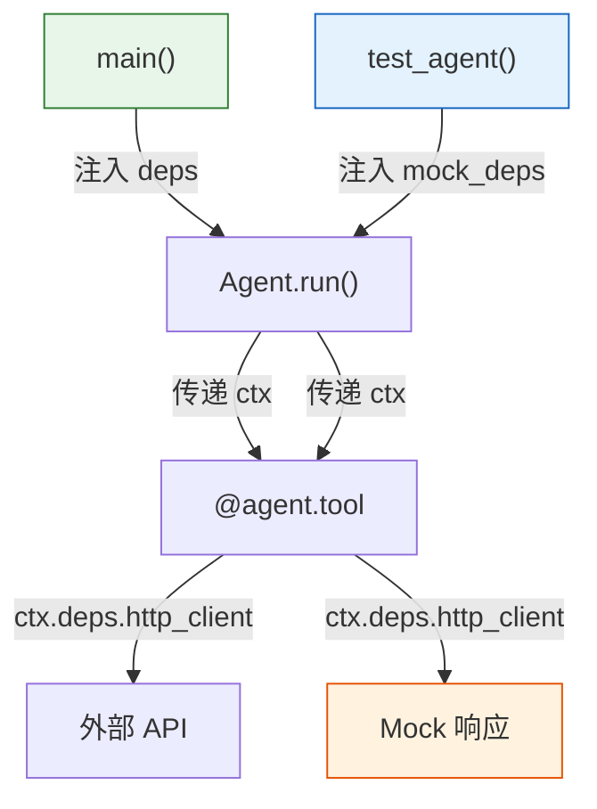

# Agent 实战（六）—— 依赖注入与工程化测试

Agent 的工具函数经常需要访问外部资源——数据库连接、API 客户端、配置对象。把这些依赖硬编码在工具函数里，写测试时就必须连真实数据库、发真实 API 请求。PydanticAI 的依赖注入（DI）系统让工具函数声明"我需要什么"，由调用方在运行时注入，测试时换成 Mock 即可。

> **环境：** Python 3.12+, pydantic-ai 1.70+, pytest 9.0+

---

## 1. 依赖注入：RunContext 与 deps

PydanticAI 的 DI 通过 `deps_type` 参数和 `RunContext` 实现。概念上很直白：Agent 声明它的依赖类型，工具函数通过 `ctx.deps` 访问。

```python
from dataclasses import dataclass
from pydantic_ai import Agent, RunContext
import httpx


@dataclass
class AgentDeps:
    """Agent 运行时所需的所有外部依赖"""
    http_client: httpx.AsyncClient
    api_base_url: str
    max_retries: int = 3


agent = Agent(
    "openai:gpt-4o",
    deps_type=AgentDeps,  # <--- 声明依赖类型
    system_prompt="你是一个天气助手。",
)


@agent.tool
async def get_weather(ctx: RunContext[AgentDeps], city: str) -> str:
    """查询城市天气

    Args:
        city: 中国城市名称
    """
    # 通过 ctx.deps 访问注入的依赖
    url = f"{ctx.deps.api_base_url}/weather?city={city}"
    response = await ctx.deps.http_client.get(url)
    response.raise_for_status()
    return response.text


# 运行时注入真实依赖
async def main():
    async with httpx.AsyncClient() as client:
        deps = AgentDeps(
            http_client=client,
            api_base_url="https://api.weather.example.com",
        )
        result = await agent.run("北京天气怎么样？", deps=deps)
        print(result.output)
```

`AgentDeps` 用 `dataclass` 定义（也可以用普通类或 Pydantic Model）。关键在于——工具函数不自己创建 HTTP 客户端，而是从 `ctx.deps` 拿。这意味着测试时可以注入一个假的客户端。



生产环境和测试环境用同一份 Agent 代码，只是注入的 `deps` 不同。

## 2. TestModel：零成本测试 Agent

测试 Agent 最大的痛点：每次测试都要调真实的 LLM API，又慢又花钱。PydanticAI 提供 `TestModel`，完全跳过 LLM 调用：

```python
# test_agent.py
import pytest
from pydantic_ai.models.test import TestModel
from agent import agent, AgentDeps  # 导入你的 Agent


@pytest.fixture
def mock_deps():
    """构造测试用的假依赖"""
    return AgentDeps(
        http_client=None,  # TestModel 不会真正调用工具
        api_base_url="https://test.example.com",
    )


def test_agent_basic(mock_deps):
    """测试 Agent 的基本行为"""
    with agent.override(model=TestModel()):  # <--- 替换为测试模型
        result = agent.run_sync("北京天气", deps=mock_deps)
        # TestModel 会返回预设的文本，不调 LLM
        assert result.output is not None
```

`TestModel` 的行为：不发生任何网络请求，直接返回一个符合 `output_type` 结构的默认值。如果 Agent 的 `output_type` 是 `str`，返回预设文本；如果是 Pydantic Model，返回所有字段为默认值的实例。

### FunctionModel：自定义响应逻辑

`TestModel` 的返回值是固定的。如果需要根据输入动态返回不同的结果，用 `FunctionModel`：

```python
from pydantic_ai.models.function import FunctionModel, AgentInfo
from pydantic_ai.messages import ModelResponse, TextPart


def mock_llm_handler(
    messages: list,
    info: AgentInfo,
) -> ModelResponse:
    """自定义 LLM 响应逻辑"""
    last_user_msg = next(
        (m for m in reversed(messages) if hasattr(m, "parts")),
        None,
    )
    # 根据用户输入返回不同的响应
    if last_user_msg and "天气" in str(last_user_msg):
        return ModelResponse(parts=[TextPart("北京今天晴天，22°C")])
    return ModelResponse(parts=[TextPart("这个问题我无法回答")])


def test_agent_with_custom_model(mock_deps):
    with agent.override(model=FunctionModel(mock_llm_handler)):
        result = agent.run_sync("北京天气", deps=mock_deps)
        assert "晴天" in result.output
```

`FunctionModel` 让你完全控制 Agent 各轮循环中 LLM 的响应内容——不花一分钱 Token，就能测试 Agent 在各种 LLM 响应下的行为。

## 3. 测试工具函数的隔离策略

工具函数往往包含外部依赖（HTTP 请求、数据库查询）。测试时有两种隔离策略：

**策略 A：用 DI 注入 Mock 依赖**

```python
@pytest.fixture
def mock_http_client():
    """返回一个预设响应的 Mock HTTP 客户端"""
    import httpx
    from unittest.mock import AsyncMock

    client = AsyncMock(spec=httpx.AsyncClient)
    mock_response = AsyncMock()
    mock_response.text = "晴天，22°C"
    mock_response.raise_for_status = lambda: None
    client.get.return_value = mock_response
    return client


def test_weather_tool(mock_http_client):
    deps = AgentDeps(
        http_client=mock_http_client,
        api_base_url="https://test.example.com",
    )
    with agent.override(model=TestModel()):
        result = agent.run_sync("查查北京天气", deps=deps)
        # 验证 HTTP 客户端被调用
        mock_http_client.get.assert_called_once()
```

**策略 B：直接测试工具函数（不经过 Agent）**

有时候只想验证工具函数的逻辑，不需要整个 Agent 循环参与：

```python
from pydantic_ai import RunContext


@pytest.mark.asyncio
async def test_get_weather_directly():
    """直接测试工具函数，绕过 Agent"""
    mock_client = AsyncMock(spec=httpx.AsyncClient)
    # ... 设置 mock 响应

    deps = AgentDeps(http_client=mock_client, api_base_url="https://test.example.com")
    ctx = RunContext(deps=deps, retry=0, tool_name="get_weather")

    result = await get_weather(ctx, city="北京")
    assert "°C" in result
```

两种策略配合使用效果最好。策略 B 保证工具函数的逻辑正确，策略 A 保证 Agent 在调用工具时的行为正确。

## 4. 可观测性：Logfire 集成

生产环境里，`print()` 日志不够用。PydanticAI 原生集成 Logfire（Pydantic 团队开发的可观测性平台）：

```python
import logfire

logfire.configure()  # 自动采集 PydanticAI 的所有调用

agent = Agent("openai:gpt-4o", system_prompt="...")

# 之后的 agent.run() 调用自动产生 trace
result = agent.run_sync("查天气")
```

Logfire 能追踪到的信息：

- 每次 LLM 调用的输入/输出、Token 用量、延迟
- 工具调用的参数和返回值
- Agent 循环的轮次和总时长
- 结构化输出的校验结果（成功 / 重试次数）

不用 Logfire 也行——PydanticAI 支持 OpenTelemetry 标准，可以接任何兼容的后端（Jaeger、Zipkin、Grafana Tempo）。

## 5. 生产级 Agent 的代码组织

当 Agent 的工具增多、逻辑变复杂时，需要合理的代码组织。推荐结构：

```
agent_service/
├── agents/
│   ├── __init__.py
│   ├── customer_support.py   # Agent 定义 + System Prompt
│   └── data_analyst.py
├── tools/
│   ├── __init__.py
│   ├── weather.py            # 工具函数（纯逻辑）
│   ├── database.py
│   └── email.py
├── deps.py                   # 依赖定义（AgentDeps）
├── schemas.py                # 结构化输出的 Pydantic Models
├── config.py                 # 模型配置、API 地址
├── tests/
│   ├── test_agents.py
│   └── test_tools.py
└── main.py
```

几个原则：

- **Agent 和工具分离**：`agents/` 只负责 Agent 定义和 Prompt 编写，`tools/` 只负责纯业务逻辑。工具函数可以被多个 Agent 复用。
- **依赖单独定义**：`deps.py` 集中管理所有依赖类型，避免循环导入。
- **Schema 独立文件**：`schemas.py` 放所有结构化输出的 Model，方便下游系统 import。

一个完整的 Agent 模块示例：

```python
# agents/customer_support.py
from pydantic_ai import Agent
from deps import SupportDeps
from schemas import SupportResponse
from tools.database import query_order
from tools.email import send_email

agent = Agent(
    "openai:gpt-4o",
    deps_type=SupportDeps,
    output_type=SupportResponse,
    system_prompt="你是客服助手，处理订单查询和退款请求。",
    retries=2,
)

# 注册工具（从 tools/ 模块引入的函数）
agent.tool(query_order)
agent.tool(send_email)
```

`agent.tool()` 不仅能用装饰器语法，也能用函数调用语法注册已有的函数——这让工具的跨 Agent 复用变得简单。

## 常见坑点

**1. deps 类型不匹配会在运行时报错**

`agent.run_sync("...", deps=wrong_type_deps)` 传了一个不匹配 `deps_type` 的对象，不会在编译时报错——Python 的类型检查是可选的。错误在运行时才暴露。建议在项目里开启 Pyright strict 模式，让类型不匹配在 IDE 里就报红。

**2. TestModel 不会触发工具调用**

`TestModel` 的行为是直接返回文本，不会模拟"LLM 决定调用工具"的过程。如果你想测试工具在 Agent 循环中的完整行为（LLM 决策 → 工具执行 → 结果回传 → LLM 汇总），需要用 `FunctionModel` 手动构造包含 Tool Call 的响应。

**3. `@agent.tool` vs `@agent.tool(retries=N)`**

工具函数可以设置独立的重试次数：`@agent.tool(retries=2)`。这和 Agent 级别的 `retries` 不同——Agent 的 retries 控制结构化输出校验失败的重试，工具的 retries 控制工具自身执行失败（如网络超时）的重试。两个层级互不干扰。

## 总结

- 依赖注入通过 `deps_type` + `RunContext[T]` 实现。工具函数声明依赖，调用方在运行时注入，测试时替换为 Mock。
- `TestModel` 跳过 LLM 调用，零成本运行测试。`FunctionModel` 自定义 LLM 响应逻辑，可以模拟各种场景。
- Logfire 原生集成，提供完整的 Agent 调用链追踪。也兼容 OpenTelemetry 标准。
- 生产级代码组织：Agent 定义、工具函数、依赖类型、输出 Schema 分文件管理。

下一篇进入 **MCP 协议**——Agent 连接外部工具的标准化方案。一次实现 MCP Server，所有 Agent 都能即插即用。

## 参考

- [PydanticAI 依赖注入文档](https://ai.pydantic.dev/dependencies/)
- [PydanticAI 测试文档](https://ai.pydantic.dev/testing/)
- [Logfire 官方文档](https://logfire.pydantic.dev/)
- [pytest 异步测试 - pytest-asyncio](https://pytest-asyncio.readthedocs.io/)
