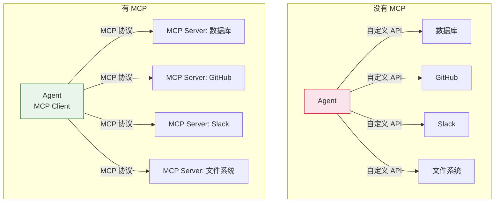
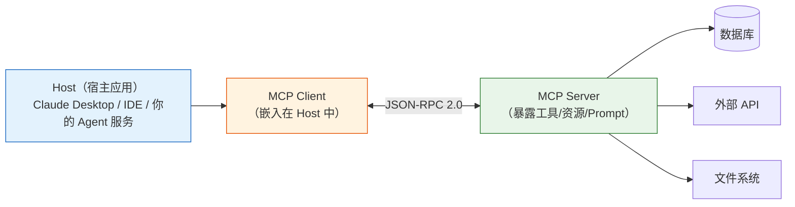

# Agent 实战（七）—— MCP 协议：标准化的工具集成层

Agent 要连数据库，写一套接口。要连 GitHub，又写一套。要连 Slack，再来一套。每个工具都要自己实现 JSON Schema、处理认证、管理会话。MCP（Model Context Protocol）把这件事标准化了——工具提供方实现 MCP Server，Agent 这边只需要一个 MCP Client，所有工具即插即用。

> **环境：** Python 3.12+, mcp 1.26+, pydantic-ai 1.70+, uv 0.11+

---

## 1. MCP 解决什么问题

没有 MCP 之前，每接入一个新工具，开发者要做四件事：

1. 阅读工具的 API 文档
2. 编写对应的 Python 封装函数
3. 手写 JSON Schema 让 LLM 理解工具参数
4. 处理认证、重试、错误格式化

工具一多，代码量呈线性爆炸。MCP 的核心价值：工具提供方按 MCP 规范实现一次 Server，所有兼容 MCP 的 Agent（Claude Desktop、Cursor、PydanticAI、LangGraph）自动获得接入能力。



MCP 由 Anthropic 在 2024 年 11 月提出。到 2026 年 3 月，OpenAI、Google、Microsoft 均已支持。它正在成为 Agent 工具集成的事实标准。

## 2. MCP 架构：三层模型

MCP 遵循 Client-Server 架构，通信基于 JSON-RPC 2.0：



**Server 暴露三种能力**：

| 能力 | 说明 | 类比 |
|------|------|------|
| **Tools** | 可执行的函数（查天气、发邮件） | Agent 的手脚 |
| **Resources** | 可读取的数据源（文件、数据库表） | Agent 的眼睛 |
| **Prompts** | 预定义的 Prompt 模板 | Agent 的操作手册 |

Agent 开发中最常用的是 **Tools**。

**传输层**有三种选择：

| 传输方式 | 适用场景 | 特点 |
|---------|---------|------|
| **stdio** | 本地 Server（同一台机器） | 最简单，通过子进程通信 |
| **SSE** | 远程 Server | HTTP 长连接 |
| **Streamable HTTP** | 生产环境推荐 | 支持无状态和有状态两种模式 |

## 3. 从零实现一个 MCP Server

用官方 Python SDK 实现一个天气查询的 MCP Server：

```bash
uv add mcp
```

```python
# weather_server.py
from mcp.server import Server
from mcp.server.stdio import stdio_server
from mcp.types import Tool, TextContent

server = Server("weather-server")


@server.list_tools()
async def list_tools() -> list[Tool]:
    """声明 Server 提供的工具列表"""
    return [
        Tool(
            name="get_weather",
            description="获取指定中国城市的当前天气",
            inputSchema={
                "type": "object",
                "properties": {
                    "city": {
                        "type": "string",
                        "description": "城市名称，如 '北京'"
                    }
                },
                "required": ["city"]
            },
        )
    ]


@server.call_tool()
async def call_tool(name: str, arguments: dict) -> list[TextContent]:
    """处理工具调用请求"""
    if name == "get_weather":
        city = arguments["city"]
        weather_db = {
            "北京": "晴天，22°C，湿度 45%",
            "上海": "多云，25°C，湿度 72%",
        }
        result = weather_db.get(city, f"未找到 {city} 的天气数据")
        return [TextContent(type="text", text=result)]

    raise ValueError(f"未知工具: {name}")


async def main():
    async with stdio_server() as (read_stream, write_stream):
        await server.run(read_stream, write_stream, server.create_initialization_options())

if __name__ == "__main__":
    import asyncio
    asyncio.run(main())
```

这个 Server 做了两件事：

1. `list_tools()` 告诉 Client "我有哪些工具"——返回工具名称、描述和参数的 JSON Schema。Client 拿到后传给 LLM 作为 Function Calling 的工具列表。
2. `call_tool()` 处理真实的工具调用请求——Client 发来工具名和参数，Server 执行实际逻辑并返回结果。

## 4. PydanticAI 接入 MCP Server

PydanticAI 原生支持 MCP。接入上面写的 Weather Server：

```python
# agent_with_mcp.py
from pydantic_ai import Agent
from pydantic_ai.mcp import MCPServerStdio

# 定义 MCP Server 连接（stdio 传输）
weather_server = MCPServerStdio(
    "uv", "run", "weather_server.py"  # 启动命令
)

agent = Agent(
    "openai:gpt-4o",
    system_prompt="你是一个助手，可以查询天气信息。",
    mcp_servers=[weather_server],  # <--- 注入 MCP Server
)


async def main():
    async with agent.run_mcp_servers():  # 启动 MCP Server 进程
        result = await agent.run("北京和上海的天气分别怎么样？")
        print(result.output)

import asyncio
asyncio.run(main())
```

`MCPServerStdio` 在 `run_mcp_servers()` 期间以子进程方式启动 Weather Server，Agent 运行结束后自动关闭。框架自动从 Server 拉取工具列表，注册到 Agent 的可用工具集。

**观测与验证**：运行后 Agent 会调用两次 `get_weather`（北京和上海），然后汇总回答。终端输出类似"北京晴天 22°C，上海多云 25°C"。

### 接入社区 MCP Server

MCP 生态已经有大量现成的 Server。比如接入一个文件系统操作的 Server：

```python
filesystem_server = MCPServerStdio(
    "npx", "-y", "@modelcontextprotocol/server-filesystem",
    "/path/to/allowed/directory"  # 限制可访问的目录范围
)

agent = Agent(
    "openai:gpt-4o",
    mcp_servers=[weather_server, filesystem_server],  # 多个 Server 并用
)
```

Agent 同时获得了天气查询和文件操作两种能力。MCP 的"即插即用"特性在这里体现得很清楚。

## 5. 实现一个数据库查询 MCP Server

更有实用价值的例子——一个只读的 SQLite 查询 Server：

```python
# db_server.py
import sqlite3
from mcp.server import Server
from mcp.server.stdio import stdio_server
from mcp.types import Tool, TextContent

DB_PATH = "app.db"
server = Server("db-query-server")


@server.list_tools()
async def list_tools() -> list[Tool]:
    return [
        Tool(
            name="query_db",
            description="对 SQLite 数据库执行只读 SQL 查询。数据库包含 users 表和 orders 表。",
            inputSchema={
                "type": "object",
                "properties": {
                    "sql": {
                        "type": "string",
                        "description": "SELECT 语句（禁止 INSERT/UPDATE/DELETE）"
                    }
                },
                "required": ["sql"]
            },
        ),
        Tool(
            name="list_tables",
            description="列出数据库中的所有表名和字段信息",
            inputSchema={"type": "object", "properties": {}},
        ),
    ]


@server.call_tool()
async def call_tool(name: str, arguments: dict) -> list[TextContent]:
    conn = sqlite3.connect(DB_PATH)
    try:
        if name == "list_tables":
            cursor = conn.execute(
                "SELECT name FROM sqlite_master WHERE type='table'"
            )
            tables = [row[0] for row in cursor.fetchall()]
            return [TextContent(type="text", text=str(tables))]

        if name == "query_db":
            sql = arguments["sql"].strip()
            # 安全检查：只允许 SELECT
            if not sql.upper().startswith("SELECT"):
                return [TextContent(type="text", text="错误：只允许 SELECT 查询")]

            cursor = conn.execute(sql)
            columns = [desc[0] for desc in cursor.description]
            rows = cursor.fetchall()
            # 格式化为可读的表格
            result = f"列: {columns}\n"
            for row in rows[:50]:  # 限制返回行数
                result += f"{row}\n"
            return [TextContent(type="text", text=result)]

    finally:
        conn.close()

    raise ValueError(f"未知工具: {name}")
```

有两个安全措施：**SQL 前缀检查**（只允许 SELECT）和**行数限制**（最多返回 50 行）。生产环境还需要加 SQL 注入防御——用参数化查询替代字符串拼接。

## 6. 生产级 MCP 的容灾与局部降级 (Degraded Mode)

在实际的生产环境中（尤其是挂载了四五个异构远程 MCP Server 的复杂 Agent），“某个 Server 的 API 密钥过期了”或“某个本地 Server 拉起超时（Handshake failure）”是常态。

生产级 Agent 不应因为单个 MCP Server 挂了就整体 Crash退出。高阶的 Harness（如 `claw-code` 等追求极高稳定性的生产引擎）会主动实现 **局部降级模式（degraded_mcp）**：
- 如果查询天气的 Server 握手失败，Harness 捕获到错误并将错误结构化告警外抛；
- Agent 和其它的健壮节点接管后，会带着剩下存活的 Server（如数据库、文件系统）继续提供有限度（Degraded）的智能服务。
- Agent 自己也可以通过内部报错流（`tool_result`）得知天气 Server 下线，然后回复用户：“抱歉，外部天气系统节点断线了，但我这里还可以继续查本地数据库”。

## 常见坑点

**1. MCP Server 的 `description` 决定 LLM 的调用决策**

和 Function Calling 一样，工具的 `description` 不是给人看的——是 LLM 决策的依据。`"查询数据库"` 太模糊，LLM 不知道该传 SQL 还是自然语言。写成 `"对 SQLite 数据库执行只读 SQL 查询。数据库包含 users 表（id, name, email）和 orders 表（id, user_id, amount, created_at）"` 效果立刻不同。

**2. stdio Server 的生命周期管理**

`MCPServerStdio` 会启动子进程。如果 Agent 代码异常退出但没有走 `async with` 的清理逻辑，子进程会变成孤儿进程。务必用 `async with agent.run_mcp_servers()` 的 context manager 语法，确保异常时也能正确关闭。

**3. MCP Server 返回值过大导致 Token 爆炸**

数据库查询可能返回大量数据。如果不限制行数（上面的 `[:50]`），Agent 会把几千行数据塞进对话历史，Token 用量暴涨。Server 端或 Agent 端必须有数据量的硬性上限。

## 总结

- MCP 标准化了 Agent 和外部工具的通信协议。工具提供方实现一次 MCP Server，所有兼容的 Agent 自动获得接入能力。
- MCP Server 暴露三种能力：Tools（执行动作）、Resources（读取数据）、Prompts（模板）。Agent 开发中最常用 Tools。
- PydanticAI 通过 `mcp_servers` 参数和 `MCPServerStdio` 无缝接入 MCP Server。多个 Server 可以并用。
- 写 MCP Server 时，工具描述和安全控制（输入校验、返回量限制）是两个必须认真对待的点。

下一篇把 **RAG（检索增强生成）和 Agent 结合**——给 Agent 装上领域知识库，让它在回答时基于事实而非幻觉。

## 参考

- [MCP 协议规范 (2025-11-25)](https://spec.modelcontextprotocol.io/specification/2025-11-25/)
- [MCP Python SDK](https://github.com/modelcontextprotocol/python-sdk)
- [PydanticAI MCP 集成文档](https://ai.pydantic.dev/mcp/)
- [MCP Server 社区列表](https://github.com/modelcontextprotocol/servers)
