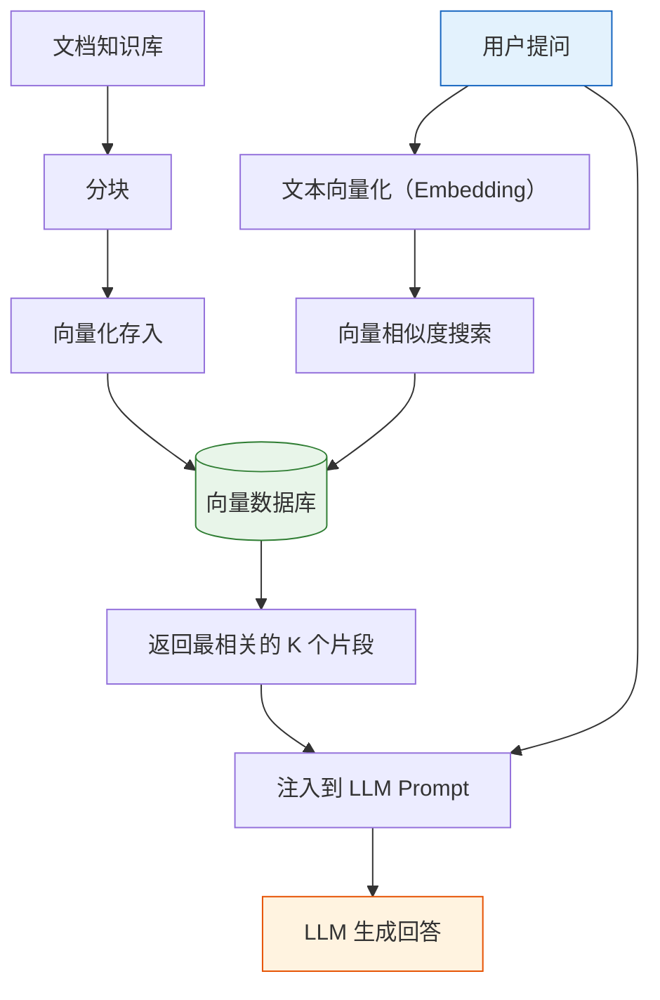
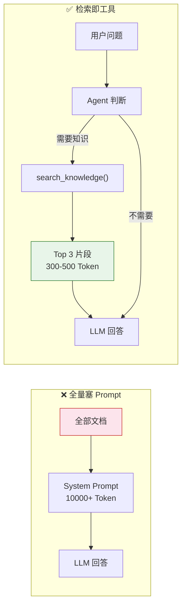

# Agent 实战（八）—— RAG + Agent：让 Agent 拥有领域记忆

LLM 的知识截止于训练数据。问它你们公司的退款政策、上周的销售数据、内部的技术规范，它只能编。RAG（Retrieval-Augmented Generation）把外部知识库接入 Agent——先检索相关文档片段，再让 LLM 基于检索结果回答。从"凭记忆编"变成"查资料答"。

> **环境：** Python 3.12+, pydantic-ai 1.70+, chromadb 1.0+, openai 1.68+

---

## 1. RAG 的核心原理

RAG 不是一个框架，是一种模式：**检索 + 生成**。



四个步骤：

1. **文档分块**：把长文档切成 200-500 字的片段（chunk）。太长会稀释重点，太短会丢失上下文。
2. **向量化**：用 Embedding 模型把每个片段转成高维向量。语义相近的文本，向量距离也近。
3. **存入向量数据库**：ChromaDB、Qdrant、Pinecone 都能干这件事。本质是一个支持近似最近邻搜索的特殊索引。
4. **检索 + 注入**：用户提问时，把问题也向量化，在数据库中找到最相似的 K 个片段，拼接到 Prompt 里让 LLM 参考。

## 2. 构建向量知识库

用 ChromaDB 做本地向量数据库。轻量无依赖，不需要单独部署服务。

```bash
uv add chromadb
```

```python
# knowledge_base.py
import chromadb
from openai import OpenAI

openai_client = OpenAI()
chroma_client = chromadb.PersistentClient(path="./chroma_db")

# 创建集合（相当于数据库的表）
collection = chroma_client.get_or_create_collection(
    name="company_docs",
    metadata={"hnsw:space": "cosine"},  # 余弦相似度
)


def embed_text(text: str) -> list[float]:
    """用 OpenAI Embedding 模型把文本转成向量"""
    response = openai_client.embeddings.create(
        model="text-embedding-3-small",
        input=text,
    )
    return response.data[0].embedding


def add_documents(docs: list[dict[str, str]]):
    """批量添加文档到知识库

    Args:
        docs: [{"id": "doc_1", "content": "...", "source": "..."}]
    """
    collection.add(
        ids=[d["id"] for d in docs],
        documents=[d["content"] for d in docs],
        embeddings=[embed_text(d["content"]) for d in docs],
        metadatas=[{"source": d["source"]} for d in docs],
    )


def search(query: str, top_k: int = 3) -> list[dict]:
    """语义搜索：返回最相关的 top_k 个文档片段"""
    query_embedding = embed_text(query)
    results = collection.query(
        query_embeddings=[query_embedding],
        n_results=top_k,
    )
    hits = []
    for i in range(len(results["ids"][0])):
        hits.append({
            "id": results["ids"][0][i],
            "content": results["documents"][0][i],
            "source": results["metadatas"][0][i]["source"],
            "distance": results["distances"][0][i],
        })
    return hits
```

**文档导入示例**：

```python
# ingest.py
from knowledge_base import add_documents

# 模拟：公司退款政策文档（生产环境从文件/数据库读取）
docs = [
    {
        "id": "refund_1",
        "content": "退款政策：购买后 7 天内可无理由退款。需提供订单号。退款金额将在 3-5 个工作日退回原支付账户。",
        "source": "退款政策.md"
    },
    {
        "id": "refund_2",
        "content": "特殊商品（定制商品、数字内容）不支持无理由退款。如有质量问题，可在 30 天内申请换货或维修。",
        "source": "退款政策.md"
    },
    {
        "id": "shipping_1",
        "content": "配送时效：标准配送 3-5 天，加急配送 1-2 天。偏远地区可能额外增加 2-3 天。免邮门槛：订单满 99 元包邮。",
        "source": "配送政策.md"
    },
]

add_documents(docs)
print(f"已导入 {len(docs)} 个文档片段")
```

运行 `uv run ingest.py` 后，`./chroma_db/` 目录下会生成持久化的向量索引。

## 3. RAG 作为 Agent 工具

RAG 本身不是 Agent。它只是一个"检索工具"。把它注册为 PydanticAI 的 `@agent.tool`，Agent 就能在需要时主动调用检索：

```python
# rag_agent.py
from pydantic_ai import Agent, RunContext
from knowledge_base import search

agent = Agent(
    "openai:gpt-4o",
    system_prompt=(
        "你是公司的客服助手。回答用户关于退款、配送等问题时，"
        "必须先调用 search_knowledge 检索公司政策文档，"
        "严格基于检索结果回答，不得编造政策内容。"
        "如果检索结果中没有相关信息，明确告知用户你无法回答。"
    ),
)


@agent.tool
async def search_knowledge(ctx: RunContext[None], query: str) -> str:
    """从公司知识库中检索与查询相关的文档片段。

    Args:
        query: 搜索关键词或问题描述
    """
    results = search(query, top_k=3)
    if not results:
        return "未找到相关文档"

    # 拼接检索结果，供 LLM 参考
    context_parts = []
    for hit in results:
        context_parts.append(
            f"[来源: {hit['source']}] {hit['content']}"
        )
    return "\n\n".join(context_parts)


result = agent.run_sync("我三天前买了个手机壳，想退款，怎么操作？")
print(result.output)
```

**观测与验证**：Agent 先调用 `search_knowledge("退款")`，拿到退款政策的文档片段，然后基于"7 天内可无理由退款"的政策内容组织回答。回复中会提到需要提供订单号、3-5 天到账。

这种"检索即工具"的模式，比直接把所有文档塞进 System Prompt 的优势在于：



- **动态检索**：只拉取和当前问题相关的内容，不浪费 Token
- **可扩展**：知识库可以不断增长，不受 Prompt 长度限制
- **Agent 自主决策**：LLM 自己判断是否需要检索，简单的寒暄不会触发检索

## 4. 分块策略：RAG 质量的生死线

分块（Chunking）是 RAG 流水线中影响最大的环节。同一份文档，分块方式不同，检索质量天差地别。

| 策略 | 说明 | 适合场景 |
|------|------|---------|
| **固定长度** | 每 500 字切一块 | 通用文档、日志 |
| **重叠滑窗** | 每 500 字切一块，相邻块重叠 100 字 | 跨段落语义不丢失 |
| **语义分块** | 按语义完整性切割（段落/章节边界） | 结构化文档 |
| **递归分块** | 先按大标题切，再按段落切，层层细分 | Markdown、HTML |

生产环境最常用**重叠滑窗**。实现也简单：

```python
def chunk_text(text: str, chunk_size: int = 500, overlap: int = 100) -> list[str]:
    """重叠滑窗分块"""
    chunks = []
    start = 0
    while start < len(text):
        end = start + chunk_size
        chunks.append(text[start:end])
        start += chunk_size - overlap  # 往前退 overlap 个字符
    return chunks
```

**Trade-off**：chunk_size 越小，检索精度越高（每块主题更单一），但 LLM 拿到的上下文碎片化严重，可能丢失跨段落的因果关系。chunk_size 越大，上下文完整性好，但检索噪声增多——一个 2000 字的块里可能只有 50 字是用户真正需要的。

实际项目中 300-500 字、50-100 字重叠是一个不错的起点。根据检索效果再调整。

## 5. 检索质量评估

RAG 系统上线后必须有评估手段。最直接的指标：

**命中率（Hit Rate）**：在 top_k 个返回结果中，包含正确答案的概率。构造 20-50 个问答对（问题 + 标准答案所在的文档 ID），跑一遍检索，计算命中率。

```python
def evaluate_retrieval(qa_pairs: list[dict], top_k: int = 3) -> float:
    """评估检索命中率

    Args:
        qa_pairs: [{"question": "...", "expected_doc_id": "refund_1"}]
    """
    hits = 0
    for pair in qa_pairs:
        results = search(pair["question"], top_k=top_k)
        result_ids = [r["id"] for r in results]
        if pair["expected_doc_id"] in result_ids:
            hits += 1
    return hits / len(qa_pairs)
```

命中率低于 80%，说明分块策略或 Embedding 模型需要调整。常见的改进方向：

- 换更强的 Embedding 模型（`text-embedding-3-large` 比 `small` 精度更高，但成本也更高）
- 调整分块大小和重叠量
- 对文档做预处理——去掉页眉页脚、合并碎片化的表格

## 常见坑点

**1. 检索结果和用户问题不在同一"语义空间"**

用户问"怎么退钱"，但文档里写的是"退款政策"。如果 Embedding 模型对中文口语化表达覆盖不好，可能检索不到。**解法**：在文档入库时，给每个 chunk 生成若干同义问题（用 LLM 做 query expansion），和原文一起向量化索引。

**2. Agent 不调用检索工具就直接回答**

LLM 对某些常识性问题很自信（比如"什么是退款"），会跳过检索直接编答案。但在客服场景里，答案必须基于公司政策文档。**解法**：在 System Prompt 里强制加约束——"回答政策类问题前，必须调用 search_knowledge 工具"。如果仍然不够可靠，用 `tool_choice="required"` 强制每次必须调工具。

**3. Token 成本随 top_k 线性增长**

检索 top_k=10 意味着把 10 个 chunk（可能 3000-5000 字）塞进 Prompt。Token 成本会显著上升。大部分场景 top_k=3 足够。只有当命中率不达标时，才考虑增加 k 值。

## 总结

- RAG = 检索 + 生成。Agent 使用 RAG 的方式是把"检索"注册为工具——Agent 主动决定何时检索、搜什么关键词。
- 构建 RAG 的四步：文档分块 → 向量化 → 存入向量数据库 → 检索注入 Prompt。
- 分块策略直接决定检索质量。重叠滑窗（300-500 字，50-100 字重叠）是常用起点。
- 检索命中率低于 80%，先调分块策略和 Embedding 模型，再考虑加重排序。

下一篇进入 **多 Agent 协作**——当一个 Agent 搞不定复杂任务时，如何拆成多个专家 Agent 分工协作。

## 参考

- [ChromaDB 官方文档](https://docs.trychroma.com/)
- [OpenAI Embedding Models](https://platform.openai.com/docs/guides/embeddings)
- [RAG 原始论文 (Lewis et al., 2020)](https://arxiv.org/abs/2005.11401)
- [Chunking Strategies for RAG](https://www.pinecone.io/learn/chunking-strategies/)
