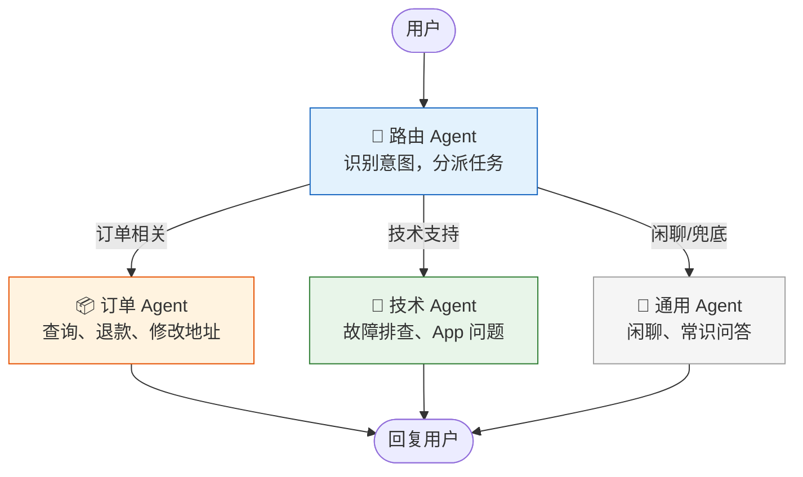
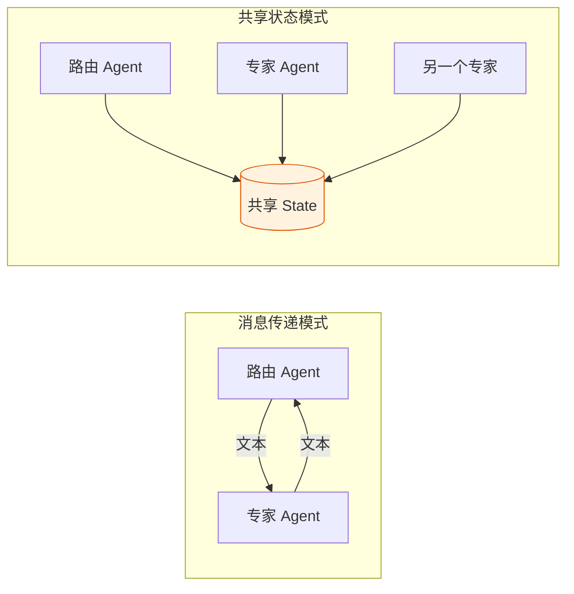

# Agent 实战（九）—— 多 Agent 协作：Handoff 与角色分工

一个 Agent 塞十几个工具，System Prompt 写到两千字——它开始分不清该用哪个工具，回答开始偏离人设。这是单 Agent 架构的天花板。解决办法不是让 Agent 变"更聪明"，而是拆。把一个全能 Agent 拆成多个专家 Agent，各管一摊，互相委派。

> **环境：** Python 3.12+, pydantic-ai 1.70+

---

## 1. 单 Agent 的天花板

两个问题会同时出现：

**上下文污染**：客服 Agent 既要查订单又要做技术支持。当用户从"我的订单在哪"切换到"你们 App 闪退怎么办"，对话历史里混着订单数据和技术词汇。LLM 的注意力被分散，回答质量下降。

**能力漂移**：工具多了之后，LLM 选错工具的概率上升。一个 Agent 有"查订单"和"查物流"两个工具，遇到"我的包裹到哪了"，它可能先查订单再查物流，也可能反过来——步骤不稳定。每多一个工具，决策空间就多一个分支。

分拆的信号很明确：**当 Agent 的错误率随工具数量上升时，该拆了**。

## 2. 路由 Agent + 专家 Agent 模式

最常用的多 Agent 模式：一个路由 Agent（Router）负责理解用户意图，把任务分派给对应的专家 Agent。



每个专家 Agent 只需要 2-3 个精准的工具和一段聚焦的 System Prompt。决策空间小，准确率高。

## 3. PydanticAI 的 Agent 委派

PydanticAI 通过 `Tool` 的返回值类型实现 Agent 之间的委派。核心机制：一个 Agent 的工具可以在内部调用另一个 Agent：

```python
from pydantic_ai import Agent, RunContext

# ---- 专家 Agent：订单处理 ----
order_agent = Agent(
    "openai:gpt-4o",
    system_prompt=(
        "你是订单处理专员。只处理订单查询、退款和地址修改。"
        "其他问题一律回复'这不在我的职责范围内'。"
    ),
)


@order_agent.tool
async def query_order(ctx: RunContext[None], order_id: str) -> str:
    """查询订单状态

    Args:
        order_id: 订单编号，格式如 ORD-12345
    """
    # 模拟数据库查询
    orders = {
        "ORD-12345": "已发货，预计明天送达",
        "ORD-67890": "待付款，请在 24 小时内完成支付",
    }
    return orders.get(order_id, f"未找到订单 {order_id}")


# ---- 专家 Agent：技术支持 ---- 
tech_agent = Agent(
    "openai:gpt-4o",
    system_prompt=(
        "你是技术支持专员。处理 App 故障、账号问题和功能咨询。"
        "先排查常见原因，再给出解决步骤。"
    ),
)


# ---- 路由 Agent ----
router_agent = Agent(
    "openai:gpt-4o",
    system_prompt=(
        "你是客服入口。根据用户问题，委派给合适的专家。"
        "订单相关问题调用 handle_order，"
        "技术问题调用 handle_tech，"
        "其他问题直接回答。"
    ),
)


@router_agent.tool
async def handle_order(ctx: RunContext[None], user_message: str) -> str:
    """将订单相关问题委派给订单处理专员

    Args:
        user_message: 用户关于订单的完整问题
    """
    result = await order_agent.run(user_message)
    return result.output


@router_agent.tool
async def handle_tech(ctx: RunContext[None], user_message: str) -> str:
    """将技术问题委派给技术支持专员

    Args:
        user_message: 用户关于技术问题的完整描述
    """
    result = await tech_agent.run(user_message)
    return result.output


# ---- 运行 ----
result = router_agent.run_sync("我的订单 ORD-12345 到哪了？")
print(result.output)
```

**执行流程**：

1. 用户说"我的订单 ORD-12345 到哪了？"
2. 路由 Agent 识别为订单问题，调用 `handle_order()`
3. `handle_order()` 内部调用 `order_agent.run()`
4. 订单 Agent 调用 `query_order("ORD-12345")`，拿到物流状态
5. 订单 Agent 组织回答，返回给路由 Agent
6. 路由 Agent 直接把结果转发给用户

## 4. 共享状态 vs 消息传递

多 Agent 之间传递信息有两种范式，选错了后果很不同。

**消息传递**（上面的实现方式）：Agent 之间通过函数调用传递文本。简单、解耦、易调试。缺点是信息在传递过程中可能丢失细节——路由 Agent 把用户的原始问题传给专家 Agent 时，如果用了自己的理解重新表述，可能引入偏差。

**共享状态**：所有 Agent 读写同一个状态对象。信息不会丢，但耦合度高。多个 Agent 同时修改状态时，需要处理冲突。



| 维度 | 消息传递 | 共享状态 |
|------|---------|---------|
| 耦合度 | 低 | 高 |
| 信息完整性 | 可能丢细节 | 完整 |
| 调试难度 | 容易追踪 | 状态突变难排查 |
| 适合场景 | 简单委派 | 复杂工作流 |

**PydanticAI 的 Agent 委派用的是消息传递模式**。如果需要共享状态，LangGraph 是更合适的工具——下一篇会展开。

## 5. 实战：三级客服系统

把上面的模式扩展成一个完整的三级客服系统：

```python
from pydantic import BaseModel, Field
from pydantic_ai import Agent, RunContext


class RoutingDecision(BaseModel):
    """路由决策结果"""
    department: str = Field(description="目标部门: order/tech/general")
    confidence: float = Field(ge=0, le=1, description="路由置信度")
    reasoning: str = Field(description="路由原因")


router = Agent(
    "openai:gpt-4o",
    output_type=RoutingDecision,
    system_prompt=(
        "分析用户意图并路由到合适部门。\n"
        "order: 订单查询、退款、物流\n"
        "tech: App 故障、账号问题、功能异常\n"
        "general: 闲聊、产品咨询、其他"
    ),
)


async def handle_customer(message: str) -> str:
    """完整的客服处理流程"""
    # 第一步：路由决策
    route = await router.run(message)
    decision = route.output
    print(f"  [路由] {decision.department} (置信度: {decision.confidence})")

    # 第二步：分派到专家 Agent
    agents = {
        "order": order_agent,
        "tech": tech_agent,
        "general": Agent("openai:gpt-4o-mini", system_prompt="友善地闲聊"),
    }
    expert = agents.get(decision.department, agents["general"])

    # 第三步：专家处理
    result = await expert.run(message)
    return result.output
```

路由 Agent 返回结构化的 `RoutingDecision`，包含置信度和路由原因。如果置信度低于阈值（比如 0.6），可以追加一轮澄清——"请问你是想查订单还是报告故障？"——而不是盲目分派。

注意 `general` 部门用了 `gpt-4o-mini`——闲聊不需要大模型，省钱。这就是模型路由的实际应用。

## 常见坑点

**1. 路由 Agent 自己抢活干**

路由 Agent 应该只做分派，不应该自己回答实际问题。但 LLM 天生"乐于助人"——看到用户问题，倾向于直接回答而不是调用委派工具。**解法**：System Prompt 里强制约束"你不能直接回答用户问题，必须委派给对应的专家"，并且设置 `tool_choice="required"` 让每轮必须调工具。

**2. 信息在委派过程中变形**

路由 Agent 理解用户说的是"订单问题"，但传给订单 Agent 时把原始问题改写了——把"ORD-12345"省略了、把"到哪了"改成了"查询物流状态"。订单 Agent 拿不到订单号，被迫反问。**解法**：工具参数直接传递用户的原始消息 `user_message`，不让路由 Agent 做重新表述。

**3. 递归委派（Agent 调 Agent 调 Agent）**

Agent A 委派给 Agent B，B 遇到不确定的问题又委派回 A——死循环。和单 Agent 的 `MAX_ITERATIONS` 同理，多 Agent 系统需要设定最大委派深度。超过深度限制，降级为通用回复。

## 延伸思考

多 Agent 系统的一个根本矛盾：**拆得越细，单个 Agent 越可靠，但系统整体的协调成本越高**。10 个专家 Agent 各顶各的很准，但路由 Agent 要在 10 个选项里做决策，路由本身的出错率也不低。

从组织管理的角度看，这和软件团队的"微服务 vs 单体"决策完全同构——拆分带来了专注和隔离，也引入了通信开销和编排复杂度。Agent 系统的"最佳粒度"取决于任务的领域边界是否清晰。边界清晰（订单 vs 技术支持），拆分收益大；边界模糊（"我的退款影响了积分"——跨越订单和会员两个领域），拆分反而增加协调难度。

## 总结

- 单 Agent 的天花板体现在上下文污染和能力漂移。工具数量超过 5-8 个时，拆分为多 Agent 的收益开始显现。
- 路由 Agent + 专家 Agent 是最常用的多 Agent 模式。路由只做意图识别和分派，不处理实际业务。
- PydanticAI 的多 Agent 委派基于消息传递模式——Agent 通过工具函数调用另一个 Agent。简单解耦，但信息可能在传递时丢失。
- 共享状态模式适合复杂工作流，这是 LangGraph 的主场——下一篇展开。

下一篇进入 **LangGraph 编排**——用图论驱动的状态机构建带循环、带条件路由、带人工审批的复杂多 Agent 工作流。

## 参考

- [PydanticAI Multi-Agent 文档](https://ai.pydantic.dev/multi-agent-applications/)
- [OpenAI Agent Handoff 设计模式](https://platform.openai.com/docs/guides/agents)
- [微服务 vs 单体架构 - Martin Fowler](https://martinfowler.com/articles/microservices.html)
