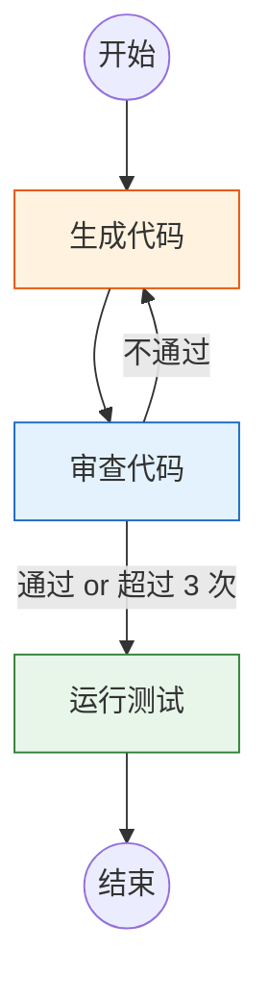

# Agent 实战（十）—— LangGraph 编排：图论驱动的复杂工作流

PydanticAI 的多 Agent 委派模式是树状的——路由 Agent 把任务分下去，专家处理完返回。但有些工作流不是树状的：代码生成后要审查，审查不过要打回重写，重写后再审查，审查通过才能测试——这是一个带**循环**的图。LangGraph 用有向图（Directed Graph）和全局状态来建模这类工作流。

> **环境：** Python 3.12+, langgraph 1.1+, langchain-openai 0.3+

---

## 1. 为什么 PydanticAI 不够

上一篇的委派模式有一个结构性限制：**消息传递是单向的**。路由 Agent → 专家 Agent → 返回结果。没有"根据专家的结果决定要不要打回重做"的原生支持。

可以在 PydanticAI 里手写循环逻辑来实现这一点，但代码会变得难以维护——状态管理、条件路由、错误恢复全部散落在 Python 函数里，没有可视化手段。

LangGraph 把这些关注点显式建模为图的组成部分：

| 概念 | 说明 | PydanticAI 对应 |
|------|------|----------------|
| **Node** | 一个执行单元（函数/Agent） | 工具函数 |
| **Edge** | 节点之间的连接 | 手动调用 |
| **Conditional Edge** | 带条件的路由 | if-else 逻辑 |
| **State** | 全局共享状态 | 无原生支持 |
| **Checkpointer** | 状态持久化 | 无原生支持 |

## 2. LangGraph 核心概念：10 分钟速通

```bash
uv add langgraph langchain-openai
```

### StateGraph + TypedDict

LangGraph 的核心是 `StateGraph`——一个以状态为中心的有向图。状态用 `TypedDict` 定义：

```python
from typing import Annotated
from typing_extensions import TypedDict
from langgraph.graph import StateGraph, START, END
from langgraph.graph.message import add_messages


class AgentState(TypedDict):
    """图的全局状态——所有节点共享"""
    messages: Annotated[list, add_messages]  # 对话历史（自动合并）
    task: str                # 当前任务描述
    code: str                # 生成的代码
    review_result: str       # 审查结果
    retry_count: int         # 重试计数器
```

`Annotated[list, add_messages]` 是 LangGraph 的特殊标注——每个节点写入 messages 时，会自动追加而不是覆盖。

### 定义节点

每个节点是一个函数，接收 `state`，返回要更新的字段：

```python
from langchain_openai import ChatOpenAI

llm = ChatOpenAI(model="gpt-4o")


def generate_code(state: AgentState) -> dict:
    """程序员节点：根据需求生成代码"""
    prompt = f"根据以下需求编写 Python 代码：\n{state['task']}"
    if state.get("review_result"):
        prompt += f"\n\n上一版审查反馈：{state['review_result']}\n请修正。"

    response = llm.invoke(prompt)
    return {"code": response.content}


def review_code(state: AgentState) -> dict:
    """审查员节点：检查代码质量"""
    prompt = (
        f"审查以下代码，指出问题或确认通过：\n"
        f"```python\n{state['code']}\n```"
    )
    response = llm.invoke(prompt)
    return {"review_result": response.content}


def run_tests(state: AgentState) -> dict:
    """测试节点：运行测试"""
    # 生产环境这里执行真实的 pytest
    return {"messages": [{"role": "system", "content": "所有测试通过 ✅"}]}
```

### 条件路由

审查通过走测试，不通过打回重写：

```python
def should_retry(state: AgentState) -> str:
    """条件路由：决定下一步走哪个节点"""
    if "通过" in state["review_result"] or "没有问题" in state["review_result"]:
        return "test"
    if state.get("retry_count", 0) >= 3:
        return "test"  # 重试超限，强制进入测试
    return "revise"
```

### 组装图

```python
graph = StateGraph(AgentState)

# 添加节点
graph.add_node("generate", generate_code)
graph.add_node("review", review_code)
graph.add_node("test", run_tests)

# 添加边
graph.add_edge(START, "generate")      # 入口 → 生成代码
graph.add_edge("generate", "review")   # 生成 → 审查

# 条件边：审查后根据结果路由
graph.add_conditional_edges(
    "review",
    should_retry,
    {"test": "test", "revise": "generate"},  # 通过→测试，不通过→重新生成
)

graph.add_edge("test", END)  # 测试 → 结束

# 编译为可执行的 Runnable
app = graph.compile()
```

执行流程的可视化：



### 运行

```python
result = app.invoke({
    "task": "写一个函数，接收列表，返回去重且排序后的结果",
    "messages": [],
    "code": "",
    "review_result": "",
    "retry_count": 0,
})

print(f"最终代码:\n{result['code']}")
print(f"审查结果: {result['review_result']}")
```

**观测与验证**：图可能执行 1-3 轮循环。审查通过后进入测试。终端输出最终的代码和审查意见。

## 3. Human-in-the-Loop：人工审批

LangGraph 的杀手特性之一。在关键节点插入人工审批——图暂停，等待人工确认后继续：

```python
from langgraph.checkpoint.memory import MemorySaver

# 用 Checkpointer 持久化状态，才能实现暂停/恢复
checkpointer = MemorySaver()
app = graph.compile(
    checkpointer=checkpointer,
    interrupt_before=["test"],  # <--- 在 test 节点前暂停
)

# 第一次运行：会在 test 前暂停
config = {"configurable": {"thread_id": "review-001"}}
result = app.invoke(
    {"task": "实现快速排序", "messages": [], "code": "", "review_result": "", "retry_count": 0},
    config=config,
)
print("⏸ 图已暂停。审查代码后继续。")
print(f"待审查代码:\n{result['code']}")

# 人工确认后恢复执行
# （生产环境中，这里可能是一个 API 回调或 UI 按钮）
final = app.invoke(None, config=config)
print("✅ 测试完成")
```

`interrupt_before=["test"]` 告诉 LangGraph：执行到 `test` 节点之前暂停。`MemorySaver` 把当前状态快照到内存（生产环境用 PostgreSQL 或 Redis），下次 `invoke(None)` 从断点恢复。

这对 Agent 的安全性至关重要——在 Agent 执行关键操作（发邮件、修改数据库、提交代码）之前，强制人工审批。

## 4. LangGraph vs PydanticAI：何时用哪个

| 场景 | 推荐 | 原因 |
|------|------|------|
| 单 Agent + 几个工具 | PydanticAI | 简单直接，代码量少 |
| 简单的路由委派 | PydanticAI | Agent 互调就够了 |
| 带循环的质量保证流程 | **LangGraph** | 循环和条件路由是原生能力 |
| 需要 Human-in-the-Loop | **LangGraph** | Checkpointer + interrupt |
| 复杂的状态管理 | **LangGraph** | 全局 State 是核心 |
| 需要最佳调试体验 | PydanticAI | 报错栈扁平清晰 |

**不是二选一的关系**。在实战项目（第 13 篇）里，PydanticAI 的 Agent 会作为 LangGraph 的节点——PydanticAI 管单个 Agent 的工具调用和结构化输出，LangGraph 管 Agent 之间的编排和状态流转。

**显式权衡**：LangGraph 引入了大量概念（State、Node、Edge、Checkpointer、MessageGraph），学习曲线比 PydanticAI 陡峭得多。如果你的需求只是"Agent A 处理不了的交给 Agent B"，用 PydanticAI 够了。LangGraph 的价值在循环工作流和状态管理——如果你的工作流是线性的，LangGraph 就是过度设计。

## 常见坑点

**1. State 更新是合并（merge），不是覆盖（replace）**

节点函数返回 `{"code": "new_code"}` 时，只更新 `code` 字段，其他字段保持不变。但如果不小心返回了一个完整的 `AgentState`，其中某些字段是空字符串，那些字段就被"覆盖"为空了。只返回你要更新的字段。

**2. 条件路由的返回值必须和 mapping 的 key 完全匹配**

`add_conditional_edges` 的第三个参数是 `{"test": "test", "revise": "generate"}`。如果 `should_retry()` 返回了 `"pass"`（不在 mapping 里），图会直接报错。用 `Literal["test", "revise"]` 做类型约束可以提前发现这类问题。

**3. 死循环防御**

审查→重写的循环如果没有退出条件，会永远转下去。必须在 State 里加 `retry_count`，并在条件路由里检查。3 次是常见上限。超限后降级为"带标记地通过"——记录为"在 3 次审查后仍有问题，已跳过"，交给人工后续处理。

## 总结

- LangGraph 用有向图建模 Agent 工作流。核心概念：StateGraph（图定义）、Node（执行单元）、Edge（连接）、Conditional Edge（条件路由）。
- 循环工作流是 LangGraph 的核心优势——代码生成 → 审查 → 打回重写 → 再审查的循环在图里是原生的。
- Human-in-the-Loop 通过 `interrupt_before` + `Checkpointer` 实现。关键操作前暂停，等待人工确认后恢复。
- PydanticAI 和 LangGraph 不是竞争关系。PydanticAI 管单 Agent，LangGraph 管编排。两者可以组合使用。

下一篇开始 **实战项目**——用前十篇的所有知识，构建一个完整的智能客服系统。

## 参考

- [LangGraph 官方文档](https://langchain-ai.github.io/langgraph/)
- [LangGraph Quick Start](https://langchain-ai.github.io/langgraph/tutorials/introduction/)
- [Human-in-the-Loop 文档](https://langchain-ai.github.io/langgraph/how-tos/human_in_the_loop/)
