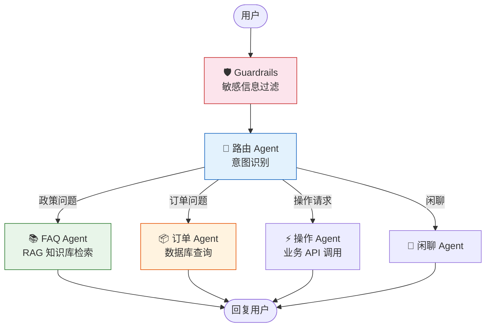
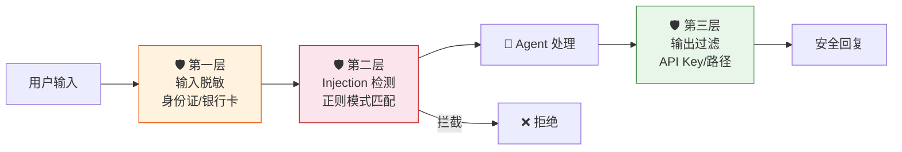

# Agent 实战（十一）—— 实战：智能客服系统

前十篇的零件全凑齐了——ReAct 循环、PydanticAI 工具注册、结构化输出、MCP 集成、RAG 检索、多 Agent 委派。这篇把它们焊死，构建一个完整的智能客服系统：RAG 回答政策问题，工具查询订单状态，多 Agent 分工处理，Guardrails 拦截敏感信息。

> **环境：** Python 3.12+, pydantic-ai 1.70+, chromadb 1.0+, fastapi 0.135+

---

## 1. 需求分析与架构设计

一个电商客服系统需要处理四类问题：

| 类别 | 示例 | 解决方式 |
|------|------|---------|
| 政策咨询 | "怎么退款？" | RAG 检索知识库 |
| 订单查询 | "ORD-123 到哪了？" | 调用订单数据库 |
| 操作请求 | "帮我改收货地址" | 调用业务 API |
| 闲聊/其他 | "你好" | 直接回复 |

架构全景：



## 2. 项目结构

```
customer_service/
├── agents/
│   ├── router.py            # 路由 Agent
│   ├── faq.py               # FAQ Agent（RAG）
│   ├── order.py             # 订单 Agent
│   └── action.py            # 操作 Agent
├── tools/
│   ├── knowledge_base.py    # 向量知识库
│   ├── order_db.py          # 订单数据库
│   └── business_api.py      # 业务操作 API
├── guardrails.py            # 输入/输出过滤
├── schemas.py               # 结构化输出定义
├── server.py                # FastAPI 服务
├── ingest.py                # 知识库导入脚本
└── pyproject.toml
```

## 3. 核心实现

### 3.1 结构化路由

```python
# schemas.py
from pydantic import BaseModel, Field
from typing import Literal


class RouteDecision(BaseModel):
    category: Literal["faq", "order", "action", "chat"]
    confidence: float = Field(ge=0, le=1)
    extracted_order_id: str | None = Field(
        default=None, description="如果提到了订单号，提取出来"
    )


class CustomerResponse(BaseModel):
    answer: str = Field(description="给用户的回复")
    sources: list[str] = Field(default_factory=list, description="引用来源")
    needs_followup: bool = Field(default=False, description="是否需要后续跟进")
```

### 3.2 路由 Agent

```python
# agents/router.py
from pydantic_ai import Agent
from schemas import RouteDecision

router = Agent(
    "openai:gpt-4o-mini",  # 路由用小模型就够
    output_type=RouteDecision,
    system_prompt=(
        "根据用户消息判断意图类别：\n"
        "- faq: 退款政策、配送规则、售后服务等通用问题\n"
        "- order: 包含订单号（ORD-开头）的查询\n"
        "- action: 要求修改地址、取消订单等操作\n"
        "- chat: 闲聊、问候、无法归类的问题\n"
        "如果消息中包含订单号，提取到 extracted_order_id 字段。"
    ),
)
```

### 3.3 FAQ Agent（含 RAG）

```python
# agents/faq.py
from pydantic_ai import Agent, RunContext
from schemas import CustomerResponse
from tools.knowledge_base import search_knowledge

faq_agent = Agent(
    "openai:gpt-4o",
    output_type=CustomerResponse,
    system_prompt=(
        "你是客服助手，回答政策和规则类问题。\n"
        "必须先调用 search_knowledge 检索公司知识库，\n"
        "严格基于检索结果回答。如果检索结果不包含相关信息，"
        "回复"这个问题需要人工客服协助"并设 needs_followup=True。"
    ),
)


@faq_agent.tool
async def search_docs(ctx: RunContext[None], query: str) -> str:
    """检索公司知识库

    Args:
        query: 搜索关键词
    """
    results = search_knowledge(query, top_k=3)
    if not results:
        return "未找到相关文档"
    parts = [f"[{r['source']}] {r['content']}" for r in results]
    return "\n\n".join(parts)
```

### 3.4 订单 Agent

```python
# agents/order.py
from pydantic_ai import Agent, RunContext
from schemas import CustomerResponse

order_agent = Agent(
    "openai:gpt-4o",
    output_type=CustomerResponse,
    system_prompt="你是订单查询专员。根据订单号查询状态并用友善的语气回复。",
)


@order_agent.tool
async def query_order(ctx: RunContext[None], order_id: str) -> str:
    """查询订单状态

    Args:
        order_id: 订单编号，格式 ORD-XXXXX
    """
    # 生产环境替换为真实数据库查询
    orders = {
        "ORD-12345": {"status": "已发货", "courier": "顺丰", "eta": "明天下午"},
        "ORD-67890": {"status": "待付款", "expire": "24小时内"},
    }
    order = orders.get(order_id)
    if not order:
        return f"未找到订单 {order_id}，请确认订单号是否正确"
    return str(order)
```

### 3.5 Guardrails：安全过滤

```python
# guardrails.py
import re


def filter_input(message: str) -> tuple[bool, str]:
    """过滤用户输入中的敏感信息

    Returns:
        (is_safe, filtered_message)
    """
    # 身份证号脱敏
    message = re.sub(
        r'\b\d{17}[\dXx]\b',
        '[身份证已脱敏]',
        message,
    )
    # 银行卡号脱敏
    message = re.sub(
        r'\b\d{16,19}\b',
        '[银行卡已脱敏]',
        message,
    )

    # Prompt Injection 基础检测
    injection_patterns = [
        r"ignore\s+(previous|all)\s+instructions",
        r"你现在是一个",
        r"忘记之前的",
        r"system\s*prompt",
    ]
    for pattern in injection_patterns:
        if re.search(pattern, message, re.IGNORECASE):
            return False, "检测到异常输入"

    return True, message


def filter_output(response: str) -> str:
    """过滤 Agent 输出中可能泄露的敏感信息"""
    # 确保输出不包含 API Key、内部路径等
    response = re.sub(r'sk-[a-zA-Z0-9]{20,}', '[KEY已屏蔽]', response)
    response = re.sub(r'/(?:home|Users)/\w+/[^\s]+', '[路径已屏蔽]', response)
    return response
```

### 3.6 主编排

```python
# server.py
from pydantic_ai import Agent
from agents.router import router
from agents.faq import faq_agent
from agents.order import order_agent
from guardrails import filter_input, filter_output
from schemas import CustomerResponse


async def handle_message(user_message: str) -> CustomerResponse:
    """处理一条用户消息的完整流程"""
    # 1. 输入过滤
    is_safe, filtered_msg = filter_input(user_message)
    if not is_safe:
        return CustomerResponse(
            answer="抱歉，您的消息包含异常内容，请重新描述您的问题。",
            needs_followup=True,
        )

    # 2. 路由决策
    route = await router.run(filtered_msg)
    decision = route.output

    # 3. 分派到专家 Agent
    if decision.category == "faq":
        result = await faq_agent.run(filtered_msg)
    elif decision.category == "order":
        # 如果路由提取到了订单号，拼入消息
        msg = filtered_msg
        if decision.extracted_order_id:
            msg = f"{filtered_msg}（订单号: {decision.extracted_order_id}）"
        result = await order_agent.run(msg)
    elif decision.category == "action":
        # 操作类暂不实现，转人工
        return CustomerResponse(
            answer="您的操作请求已记录，人工客服将在 10 分钟内联系您。",
            needs_followup=True,
        )
    else:
        chat_agent = Agent("openai:gpt-4o-mini", output_type=CustomerResponse)
        result = await chat_agent.run(filtered_msg)

    # 4. 输出过滤
    response = result.output
    response.answer = filter_output(response.answer)
    return response
```

## 4. FastAPI 服务化

```python
# server.py（续）
from fastapi import FastAPI
from pydantic import BaseModel

app = FastAPI(title="智能客服 API")


class ChatRequest(BaseModel):
    message: str
    session_id: str | None = None


@app.post("/chat", response_model=CustomerResponse)
async def chat(request: ChatRequest):
    return await handle_message(request.message)
```

```bash
uv run uvicorn server:app --reload --port 8000
```

**观测与验证**：

```bash
curl -X POST http://localhost:8000/chat \
  -H "Content-Type: application/json" \
  -d '{"message": "我的订单 ORD-12345 到哪了？"}'
```

返回结构化 JSON：`{"answer": "您的订单 ORD-12345 已发货，由顺丰配送，预计明天下午到达。", "sources": [], "needs_followup": false}`。

## 5. 关键设计决策

**路由用 gpt-4o-mini，专家用 gpt-4o**。路由只做意图分类，小模型足够准确且成本低。FAQ 和订单查询需要精确理解上下文，用大模型。这套模型路由策略节省约 40% Token 成本。

**Guardrails 放在 Agent 外层**。不在 System Prompt 里告诉 LLM "不要输出身份证号"——LLM 的安全边界不可靠。用正则表达式在代码层硬过滤，确保万无一失。

**结构化输出统一格式**。所有专家 Agent 都返回 `CustomerResponse`。下游系统无论对接哪个 Agent，数据格式完全一致。



## 常见坑点

**1. 多轮对话的状态丢失**

当前实现每条消息独立处理。用户说"查一下 ORD-12345"，Agent 回复后，用户再说"帮我退款"——Agent 不记得刚才查的是哪个订单。解决方案：用 `message_history` 传递历史消息，或者用 Redis/数据库存储会话状态。

**2. RAG 检索失败时 Agent 仍然编答案**

即使 System Prompt 写了"检索不到就说不知道"，LLM 偶尔还是会编。双重保护：在 `search_docs` 工具返回"未找到"时，直接在业务代码里拦截，不给 LLM 编的机会。

## 总结

- 智能客服系统 = 路由 Agent + 多个专家 Agent + RAG 知识库 + Guardrails 安全层。
- 路由用小模型省钱，专家用大模型保质量。结构化输出统一下游接口。
- Guardrails 必须放在代码层，不依赖 LLM 的"自觉"。输入脱敏 + Injection 检测 + 输出过滤三层防护。
- 最小可用版本不需要多轮对话和复杂状态管理——先让单轮交互跑通再迭代。

## 参考

- [PydanticAI Multi-Agent 文档](https://ai.pydantic.dev/multi-agent-applications/)
- [FastAPI 官方文档](https://fastapi.tiangolo.com/)
- [OWASP LLM Top 10 - Prompt Injection](https://owasp.org/www-project-top-10-for-large-language-model-applications/)
