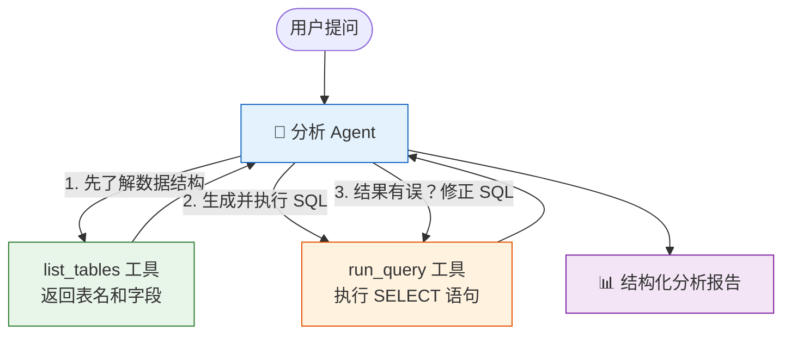
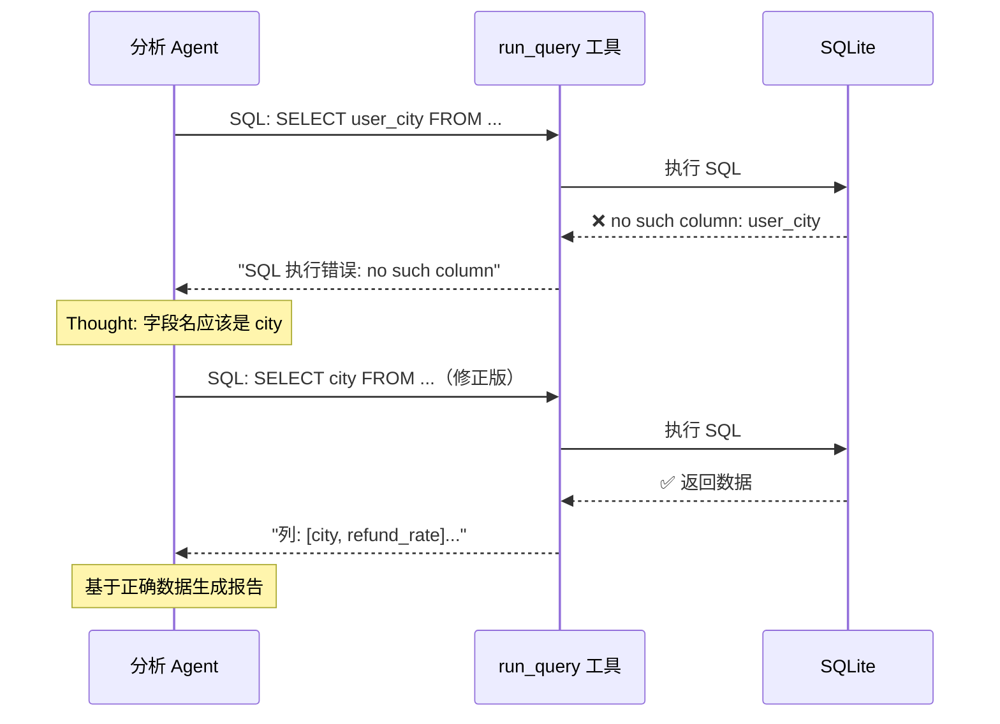

# Agent 实战（十二）—— 实战：数据分析助手

"上个月哪个城市的退款率最高？"——传统做法：开 SQL 客户端、写查询、看结果、做图表。数据分析助手让这个过程变成一句话。Agent 接收自然语言问题，自动生成 SQL 查询数据库，执行结果不符合预期时自行修正 SQL，最终生成文字分析。

> **环境：** Python 3.12+, pydantic-ai 1.70+, sqlite3（标准库）

---

## 1. 架构设计



核心设计决策：**不给 Agent 写入权限**。只有 SELECT，没有 INSERT/UPDATE/DELETE。数据安全是红线。

## 2. 准备测试数据库

```python
# setup_db.py
import sqlite3

conn = sqlite3.connect("analytics.db")
cursor = conn.cursor()

cursor.executescript("""
CREATE TABLE IF NOT EXISTS orders (
    id INTEGER PRIMARY KEY,
    city TEXT NOT NULL,
    amount REAL NOT NULL,
    status TEXT NOT NULL,  -- paid / refunded / pending
    created_at DATE NOT NULL
);

CREATE TABLE IF NOT EXISTS users (
    id INTEGER PRIMARY KEY,
    name TEXT NOT NULL,
    city TEXT NOT NULL,
    registered_at DATE NOT NULL
);

-- 插入测试数据
INSERT INTO orders (city, amount, status, created_at) VALUES
('北京', 299.0, 'paid', '2026-02-15'),
('北京', 159.0, 'refunded', '2026-02-18'),
('上海', 499.0, 'paid', '2026-02-10'),
('上海', 89.0, 'refunded', '2026-02-20'),
('上海', 199.0, 'refunded', '2026-02-22'),
('广州', 350.0, 'paid', '2026-02-05'),
('广州', 120.0, 'paid', '2026-02-12'),
('深圳', 680.0, 'paid', '2026-02-08'),
('深圳', 45.0, 'refunded', '2026-02-25');

INSERT INTO users (name, city, registered_at) VALUES
('张三', '北京', '2025-06-01'),
('李四', '上海', '2025-08-15'),
('王五', '广州', '2025-11-20'),
('赵六', '深圳', '2026-01-10'),
('钱七', '上海', '2025-03-05');
""")

conn.commit()
conn.close()
print("测试数据库已创建: analytics.db")
```

## 3. 数据分析 Agent 实现

```python
# analyst_agent.py
import sqlite3
import json
from pydantic import BaseModel, Field
from pydantic_ai import Agent, RunContext

DB_PATH = "analytics.db"


class AnalysisReport(BaseModel):
    """结构化分析报告"""
    question: str = Field(description="用户的原始问题")
    sql_used: str = Field(description="最终使用的 SQL 查询")
    raw_data: str = Field(description="查询返回的原始数据摘要")
    analysis: str = Field(description="数据分析结论，用自然语言描述")
    key_findings: list[str] = Field(description="关键发现，每条一句话")


agent = Agent(
    "openai:gpt-4o",
    output_type=AnalysisReport,
    system_prompt=(
        "你是数据分析师。根据用户的问题，先了解数据库结构，"
        "再编写 SQL 查询数据，最后给出分析结论。\n"
        "规则：\n"
        "1. 先调用 list_tables 了解表结构\n"
        "2. 编写 SQL 查询数据（只能用 SELECT）\n"
        "3. 如果 SQL 报错，根据错误信息修正后重试\n"
        "4. 基于查询结果给出分析\n"
        "5. 分析要有数据支撑，不要编造数字"
    ),
    retries=2,
)


@agent.tool
async def list_tables(ctx: RunContext[None]) -> str:
    """列出数据库中所有表的名称和字段信息"""
    conn = sqlite3.connect(DB_PATH)
    try:
        cursor = conn.execute(
            "SELECT name FROM sqlite_master WHERE type='table'"
        )
        tables = [row[0] for row in cursor.fetchall()]

        schema_info = []
        for table in tables:
            cursor = conn.execute(f"PRAGMA table_info({table})")
            columns = [(row[1], row[2]) for row in cursor.fetchall()]
            schema_info.append(f"表 {table}: {columns}")

        return "\n".join(schema_info)
    finally:
        conn.close()


@agent.tool
async def run_query(ctx: RunContext[None], sql: str) -> str:
    """执行 SQL 查询并返回结果

    Args:
        sql: SELECT 语句（禁止写入操作）
    """
    sql_stripped = sql.strip()

    # 安全检查：只允许 SELECT 和 WITH（CTE）
    allowed_prefixes = ("SELECT", "WITH")
    if not sql_stripped.upper().startswith(allowed_prefixes):
        return "错误：只允许 SELECT 查询，禁止修改数据"

    conn = sqlite3.connect(DB_PATH)
    try:
        cursor = conn.execute(sql_stripped)
        columns = [desc[0] for desc in cursor.description]
        rows = cursor.fetchall()

        if not rows:
            return f"查询返回 0 条结果。列: {columns}"

        # 格式化为可读表格
        result = f"列: {columns}\n共 {len(rows)} 条结果:\n"
        for row in rows[:100]:  # 硬性行数上限
            result += f"  {row}\n"
        return result

    except sqlite3.Error as err:
        return f"SQL 执行错误: {err}\n请检查语法后重试。"
    finally:
        conn.close()
```

**自修复机制的关键**：`run_query` 在 SQL 报错时返回错误信息（不是抛异常），Agent 收到错误后会修正 SQL 重新调用。这就是 ReAct 循环中 Observation → Thought 的实战体现。

## 4. 运行与验证

```python
# main.py
from analyst_agent import agent

queries = [
    "上个月哪个城市的退款率最高？",
    "2 月份各城市的订单总额排名",
    "有多少用户是 2026 年之后注册的？",
]

for query in queries:
    print(f"\n{'='*60}")
    print(f"问题: {query}")
    result = agent.run_sync(query)
    report = result.output
    print(f"SQL: {report.sql_used}")
    print(f"分析: {report.analysis}")
    print(f"关键发现:")
    for finding in report.key_findings:
        print(f"  • {finding}")
```

**观测与验证**：终端输出类似：

```
问题: 上个月哪个城市的退款率最高？
SQL: SELECT city, COUNT(CASE WHEN status='refunded' THEN 1 END) * 100.0 / COUNT(*) as refund_rate FROM orders WHERE created_at >= '2026-02-01' GROUP BY city ORDER BY refund_rate DESC
分析: 上海的退款率最高，达到 66.7%（3 笔订单中有 2 笔退款）...
关键发现:
  • 上海退款率 66.7%，显著高于其他城市
  • 深圳退款率 50%，但样本量仅 2 笔
  • 广州零退款，表现最佳
```

Agent 自动完成了三步：先查表结构，然后写出聚合查询（含 CASE WHEN），最后基于数据给出分析。

## 5. 错误自修复演示

给 Agent 一个容易写错的问题——涉及跨表关联：

```python
result = agent.run_sync("哪些用户所在城市的退款率超过 50%？")
```

Agent 可能的执行轨迹：

1. **第 1 轮 Thought**：需要关联 users 和 orders 表
2. **第 1 轮 Action**：`list_tables()` → 看到两个表的字段
3. **第 2 轮 Action**：尝试 SQL，可能把字段名写错
4. **第 2 轮 Observation**：SQL 报错 `no such column: user_city`
5. **第 3 轮 Thought**：字段名应该是 `city`，修正 SQL
6. **第 3 轮 Action**：执行修正后的 SQL，成功返回数据
7. **最终回答**：基于正确数据生成报告

这种自修复能力来自 ReAct 循环本身——错误结果作为 Observation 反馈给 LLM，LLM 根据错误信息调整策略。不需要额外的编排逻辑。



## 常见坑点

**1. LLM 生成的 SQL 注入风险**

虽然已经限制了 SELECT，但精心构造的查询仍然可能造成问题（比如 `SELECT * FROM sqlite_master`暴露表结构，或者超大 JOIN 导致 OOM）。生产环境应该：用数据库连接的只读用户、设置查询超时、限制结果集大小。

**2. 大数据量时 Token 爆炸**

查询返回 1000 行数据，Agent 把全部结果塞进对话历史——Token 费用暴涨。上面的 `[:100]` 行限制是基础防线。更好的做法：让 Agent 写聚合查询（GROUP BY、COUNT、AVG），而不是 `SELECT *`。在 System Prompt 里强调"优先使用聚合函数"。

**3. 数值精度问题**

LLM 不擅长精确计算。如果让 Agent 自己除法算百分比，可能算错。解法：在 SQL 里直接计算（如上面的 `COUNT * 100.0 / COUNT`），让数据库引擎做算术。Agent 只负责描述结果。

## 总结

- 数据分析助手 = Schema 感知 + SQL 生成 + 错误自修复 + 结构化分析报告。
- 安全红线：只允许 SELECT，数据库连接用只读用户，结果集限制行数。
- 自修复依赖 ReAct 循环本身——SQL 报错作为 Observation 反馈，Agent 自行修正。
- 让数据库做计算，Agent 做分析和表述。两者各司其职。

## 参考

- [Text-to-SQL 学术综述 (Katsogiannis-Meimarakis et al.)](https://arxiv.org/abs/2204.00498)
- [SQLite Python 文档](https://docs.python.org/3/library/sqlite3.html)
