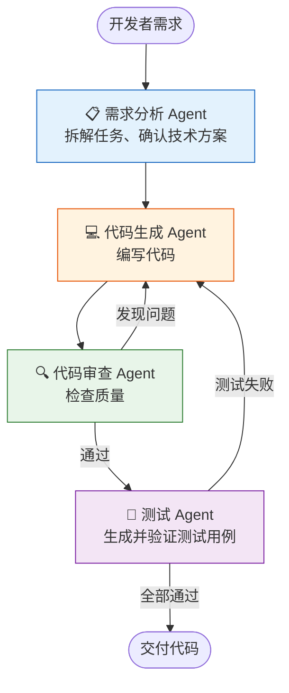

# Agent 实战（十三）—— 实战：开发辅助 Copilot

前两个项目分别解决了客服和数据分析场景。这个项目更贴近开发者日常——一个能读代码、写代码、审查代码的 Copilot Agent。它通过 MCP 接入文件系统和 Git，用 LangGraph 搭建"生成 → 审查 → 修正"的质量保证循环。

> **环境：** Python 3.12+, pydantic-ai 1.70+, langgraph 1.1+, mcp 1.26+

---

## 1. 架构设计

这个 Copilot 把代码开发拆成流水线：



两个显著的循环回路——审查打回和测试失败打回——这正是需要 LangGraph 的原因。

## 2. MCP Server 接入：文件系统工具

Copilot 需要读写文件。通过 MCP 接入文件系统 Server：

```python
# copilot/tools.py
from pydantic_ai.mcp import MCPServerStdio

# 文件系统 MCP Server（限制可访问的目录）
filesystem_server = MCPServerStdio(
    "npx", "-y", "@modelcontextprotocol/server-filesystem",
    "/path/to/workspace"  # 只允许访问工作目录
)
```

也可以用 PydanticAI 原生工具实现文件操作——更轻量，不依赖 Node.js：

```python
from pydantic_ai import Agent, RunContext
from pathlib import Path

WORKSPACE = Path("/path/to/workspace")


@agent.tool
async def read_file(ctx: RunContext[None], file_path: str) -> str:
    """读取工作目录下的文件内容

    Args:
        file_path: 相对于工作目录的文件路径
    """
    target = WORKSPACE / file_path
    # 安全校验：防止路径穿越
    if not target.resolve().is_relative_to(WORKSPACE.resolve()):
        return "错误：不允许访问工作目录之外的文件"
    if not target.exists():
        return f"文件不存在: {file_path}"
    return target.read_text(encoding="utf-8")[:5000]  # 限制读取长度


@agent.tool
async def write_file(ctx: RunContext[None], file_path: str, content: str) -> str:
    """将内容写入工作目录下的文件

    Args:
        file_path: 相对于工作目录的文件路径
        content: 要写入的完整文件内容
    """
    target = WORKSPACE / file_path
    if not target.resolve().is_relative_to(WORKSPACE.resolve()):
        return "错误：不允许写入工作目录之外的文件"
    target.parent.mkdir(parents=True, exist_ok=True)
    target.write_text(content, encoding="utf-8")
    return f"已写入 {file_path}（{len(content)} 字符）"


@agent.tool
async def list_files(ctx: RunContext[None], directory: str = ".") -> str:
    """列出目录下的文件

    Args:
        directory: 相对路径，默认工作目录根
    """
    target = WORKSPACE / directory
    if not target.resolve().is_relative_to(WORKSPACE.resolve()):
        return "错误：不允许访问工作目录之外"
    files = []
    for p in sorted(target.rglob("*")):
        if p.is_file() and ".git" not in p.parts:
            rel = p.relative_to(WORKSPACE)
            files.append(str(rel))
    return "\n".join(files[:50])  # 限制文件数量
```

**路径穿越防御**是硬性要求。Agent 传入的 `file_path` 不可信——`../../etc/passwd` 这种路径必须拦截。`is_relative_to()` 检查确保所有操作都在工作目录内。

## 3. LangGraph 工作流编排

```python
# copilot/workflow.py
from typing import Annotated
from typing_extensions import TypedDict
from langgraph.graph import StateGraph, START, END
from langgraph.graph.message import add_messages
from langchain_openai import ChatOpenAI

llm = ChatOpenAI(model="gpt-4o")


class CopilotState(TypedDict):
    requirement: str
    plan: str
    code: str
    review_feedback: str
    test_result: str
    retry_count: int
    messages: Annotated[list, add_messages]


def plan_task(state: CopilotState) -> dict:
    """需求分析：拆解任务并确认技术方案"""
    prompt = (
        f"分析以下开发需求，给出实现计划（包括文件结构、核心逻辑、依赖库）：\n"
        f"{state['requirement']}"
    )
    response = llm.invoke(prompt)
    return {"plan": response.content}


def generate_code(state: CopilotState) -> dict:
    """代码生成：基于计划编写代码"""
    prompt = f"根据以下计划编写完整的 Python 代码：\n{state['plan']}"
    if state.get("review_feedback"):
        prompt += f"\n\n审查反馈（请修正）：\n{state['review_feedback']}"
    if state.get("test_result") and "失败" in state.get("test_result", ""):
        prompt += f"\n\n测试结果（请修复）：\n{state['test_result']}"

    response = llm.invoke(prompt)
    return {
        "code": response.content,
        "retry_count": state.get("retry_count", 0) + 1,
    }


def review_code(state: CopilotState) -> dict:
    """代码审查：检查代码质量"""
    prompt = (
        f"审查以下代码。如果有问题，列出具体问题和修改建议。"
        f"如果代码质量合格，回复'审查通过'。\n\n"
        f"```python\n{state['code']}\n```"
    )
    response = llm.invoke(prompt)
    return {"review_feedback": response.content}


def test_code(state: CopilotState) -> dict:
    """测试：验证代码正确性"""
    prompt = (
        f"为以下代码生成 pytest 测试用例并预判测试结果。"
        f"如果代码逻辑有明显 Bug，指出并标记'测试失败'。\n\n"
        f"```python\n{state['code']}\n```"
    )
    response = llm.invoke(prompt)
    return {"test_result": response.content}


def route_after_review(state: CopilotState) -> str:
    """审查后路由"""
    if "通过" in state.get("review_feedback", ""):
        return "test"
    if state.get("retry_count", 0) >= 3:
        return "test"  # 超限强制进测试
    return "revise"


def route_after_test(state: CopilotState) -> str:
    """测试后路由"""
    if "失败" in state.get("test_result", ""):
        if state.get("retry_count", 0) >= 3:
            return "done"  # 超限结束
        return "fix"
    return "done"


# 组装图
graph = StateGraph(CopilotState)
graph.add_node("plan", plan_task)
graph.add_node("generate", generate_code)
graph.add_node("review", review_code)
graph.add_node("test", test_code)

graph.add_edge(START, "plan")
graph.add_edge("plan", "generate")
graph.add_edge("generate", "review")

graph.add_conditional_edges("review", route_after_review, {
    "test": "test",
    "revise": "generate",
})

graph.add_conditional_edges("test", route_after_test, {
    "done": END,
    "fix": "generate",
})

copilot = graph.compile()
```

## 4. 运行完整流水线

```python
# main.py
from copilot.workflow import copilot

result = copilot.invoke({
    "requirement": "写一个 Python 函数：接收一个字符串列表，返回出现次数最多的前 3 个字符串及其计数",
    "plan": "",
    "code": "",
    "review_feedback": "",
    "test_result": "",
    "retry_count": 0,
    "messages": [],
})

print(f"迭代次数: {result['retry_count']}")
print(f"\n最终代码:\n{result['code']}")
print(f"\n审查结果: {result['review_feedback']}")
print(f"\n测试结果: {result['test_result']}")
```

**观测与验证**：图执行 1-3 轮。如果第一版代码审查通过，直接进测试。如果审查发现问题（比如缺少类型注解、没处理空列表），打回修正后再审查。终端会打印每一步的结果。

## 5. 关键设计决策

**每个节点一个 LLM 调用，而非一个独立 Agent**。这个 Copilot 的节点直接调用 `llm.invoke()`，没有用 PydanticAI Agent。原因是：这里的需求是线性的 Prompt → Response，不需要工具调用。如果某个节点需要查文件、调 API，那就在对应节点里用 PydanticAI Agent 替代裸 LLM 调用。

**重试计数器是全局的**。不区分"因审查失败重试"和"因测试失败重试"。简化了实现，但某些场景可能想要独立的计数。权衡取舍——复杂度换精度。

**不执行真实代码**。测试节点是让 LLM 审查代码逻辑，不是 run pytest。执行 Agent 生成的代码有安全风险（无限循环、文件删除）。如果需要真实执行，必须在 Docker 沙箱里跑。

## 常见坑点

**1. 代码块的 Markdown 标记干扰**

LLM 生成代码时会用 \`\`\`python ... \`\`\` 包裹。如果直接把这个内容传给下一个节点，审查 Agent 看到的是带 Markdown 标记的文本。解法：在 `generate_code` 的返回值里做清洗——去掉 \`\`\` 标记，只保留纯代码。

**2. 审查标准不一致**

同一份代码，跑两次审查可能得到不同结论——第一次通过，第二次发现问题。LLM 的审查标准有随机性。缓解方式：在审查 Prompt 里给出明确的检查清单（如"必须有类型注解""必须处理边界情况""函数不超过 30 行"），减少主观判断空间。

**3. 循环的上限必须足够低**

3 次重试已经意味着 7-9 次 LLM 调用（每轮有 plan/generate/review/test 多个节点）。每次调用都带着越来越长的上下文。把重试上限设到 10，Token 费用就不可控了。

## 总结

- 开发 Copilot = 需求分析 + 代码生成 + 审查 + 测试的流水线，用 LangGraph 编排循环。
- 文件操作通过 MCP Server 或自定义工具实现，路径穿越防御是硬性要求。
- 代码审查和测试的循环回路是 LangGraph 的核心价值——PydanticAI 的树状委派模式无法优雅表达。
- 重试计数器是安全阀门。没有上限的循环等于无底洞的 Token 消耗。

## 参考

- [LangGraph 教程 - 代码生成工作流](https://langchain-ai.github.io/langgraph/tutorials/)
- [MCP Filesystem Server](https://github.com/modelcontextprotocol/servers/tree/main/src/filesystem)
- [Docker Python 沙箱执行](https://docs.docker.com/engine/api/sdk/examples/)
