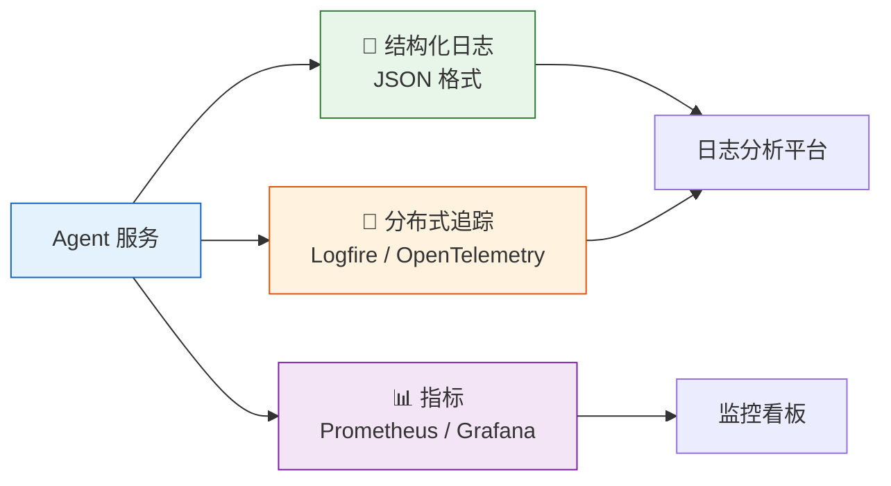
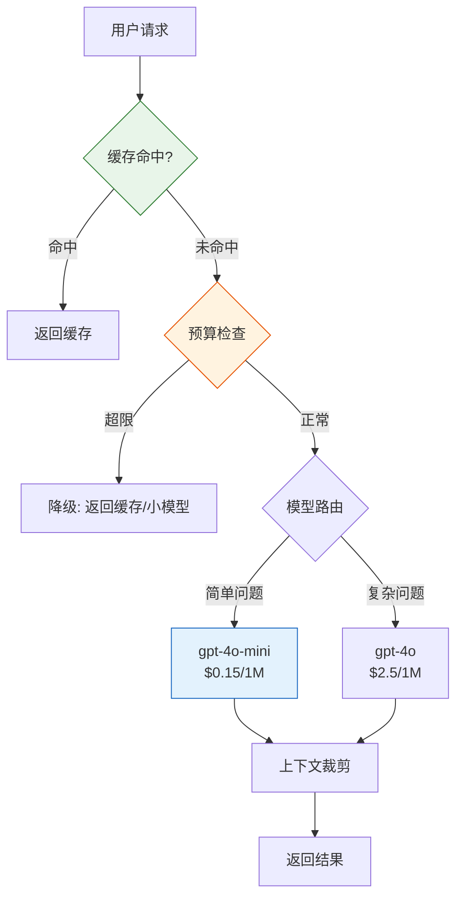

# Agent 实战（十四）—— Agent 生产化：部署、监控与安全

能在本地跑和能上生产是两码事。Agent 的不确定性比普通后端服务高得多——LLM 返回格式可能不对、工具调用可能超时、Token 费用可能失控、用户输入可能包含 Prompt Injection。这篇把 Agent 从"Demo 能跑"推进到"线上能扛"。

> **环境：** Python 3.12+, pydantic-ai 1.70+, fastapi 0.135+, docker

---

## 1. 服务化封装：FastAPI + Agent

Agent 作为 HTTP 服务对外提供能力：

```python
# service.py
import time
import logging
from contextlib import asynccontextmanager
from fastapi import FastAPI, HTTPException
from pydantic import BaseModel
from pydantic_ai import Agent

logger = logging.getLogger("agent_service")

agent = Agent("openai:gpt-4o", system_prompt="你是客服助手。")


@asynccontextmanager
async def lifespan(app: FastAPI):
    """应用生命周期管理"""
    logger.info("Agent 服务启动")
    yield
    logger.info("Agent 服务关闭")

app = FastAPI(title="Agent Service", lifespan=lifespan)


class ChatRequest(BaseModel):
    message: str
    session_id: str | None = None


class ChatResponse(BaseModel):
    answer: str
    latency_ms: float
    token_usage: dict | None = None


@app.post("/chat", response_model=ChatResponse)
async def chat(request: ChatRequest):
    start = time.monotonic()
    try:
        result = await agent.run(request.message)
        latency = (time.monotonic() - start) * 1000

        return ChatResponse(
            answer=result.output,
            latency_ms=round(latency, 1),
            token_usage=None,  # PydanticAI 的 usage 可从 result 提取
        )
    except Exception as err:
        logger.exception("Agent 执行失败")
        raise HTTPException(status_code=500, detail="服务暂时不可用，请稍后重试")


@app.get("/health")
async def health():
    return {"status": "ok"}
```

几个关键点：

- **健康检查端点**：`/health` 用于负载均衡器和 Kubernetes 探针。
- **延迟追踪**：每次请求记录耗时，方便后续监控和报警。
- **异常兜底**：Agent 内部报错不应该暴露给用户。统一返回 500 + 友好提示。

## 2. 可观测性：日志 + 追踪 + 指标



### 结构化日志

```python
import logging
import json

class JSONFormatter(logging.Formatter):
    def format(self, record):
        log_data = {
            "timestamp": self.formatTime(record),
            "level": record.levelname,
            "message": record.getMessage(),
            "module": record.module,
        }
        if hasattr(record, "extra"):
            log_data.update(record.extra)
        return json.dumps(log_data, ensure_ascii=False)

handler = logging.StreamHandler()
handler.setFormatter(JSONFormatter())
logger = logging.getLogger("agent_service")
logger.addHandler(handler)
logger.setLevel(logging.INFO)
```

每次 Agent 调用记录关键事件：

```python
logger.info("agent_call", extra={
    "session_id": request.session_id,
    "input_length": len(request.message),
    "latency_ms": latency,
    "model": "gpt-4o",
    "tool_calls": ["get_weather", "query_order"],
    "output_length": len(result.output),
})
```

### Logfire 集成

PydanticAI 原生支持 Logfire。一行代码开启全链路追踪：

```python
import logfire
logfire.configure()
# 之后所有 agent.run() 调用自动产生 trace span
```

Logfire 自动采集：LLM 请求/响应、Token 用量、工具调用参数和返回值、重试次数。不用手动埋点。

## 3. 安全加固

### Prompt Injection 防御

```python
import re

INJECTION_PATTERNS = [
    r"ignore\s+(previous|all|above)\s+(instructions|prompts)",
    r"you\s+are\s+now",
    r"system\s*:\s*",
    r"<\|.*?\|>",
    r"\[INST\]",
    r"忘记.{0,10}(指令|规则|设定)",
    r"你现在(是|扮演)",
]

def detect_injection(text: str) -> bool:
    for pattern in INJECTION_PATTERNS:
        if re.search(pattern, text, re.IGNORECASE):
            return True
    return False
```

Prompt Injection 没有完美的防御方案。正则检测能拦截常见攻击模式，但高级攻击（如 Base64 编码、多语言混合）可能绕过。多层防御是必须的：输入过滤 + 独立的 System Prompt + 输出过滤。

### 工具权限控制

```python
TOOL_PERMISSIONS = {
    "query_order": {"max_calls_per_session": 10, "requires_auth": False},
    "cancel_order": {"max_calls_per_session": 1, "requires_auth": True},
    "send_email":   {"max_calls_per_session": 3, "requires_auth": True},
}
```

高危操作（取消订单、发邮件）必须有调用频率限制和权限验证。不能让 Agent 在一次会话里取消 100 个订单。

### 输出过滤

```python
def sanitize_output(text: str) -> str:
    """过滤 Agent 输出中的敏感信息"""
    # API Key
    text = re.sub(r'sk-[a-zA-Z0-9]{20,}', '[REDACTED]', text)
    # 内部路径
    text = re.sub(r'/(?:home|var|etc|Users)/[^\s"\']+', '[PATH_REDACTED]', text)
    # 内部 IP
    text = re.sub(r'10\.\d{1,3}\.\d{1,3}\.\d{1,3}', '[IP_REDACTED]', text)
    return text
```

## 4. 成本控制

Token 是 Agent 服务最大的运营成本。四个控制手段：



**模型路由**：简单问题用 `gpt-4o-mini`（$0.15/1M），复杂问题用 `gpt-4o`（$2.5/1M）。路由本身用 mini 模型，成本几乎可以忽略。

**上下文窗口裁剪**：对话历史超过一定长度时做摘要压缩。减少每轮的输入 Token 量。

**缓存**：相同的问题（或语义相似的问题）直接返回缓存结果，不调 LLM。适合 FAQ 类场景。

**监控与报警**：设定日/月的 Token 用量上限。超限时降级为小模型或直接返回缓存回复。

```python
# 简单的内存缓存
from functools import lru_cache
import hashlib

@lru_cache(maxsize=1000)
def get_cached_response(message_hash: str) -> str | None:
    return None  # 生产环境接 Redis

def check_budget(session_id: str) -> bool:
    """检查是否超出 Token 预算"""
    # 生产环境从计费系统查询
    return True
```

## 5. Docker 部署

```dockerfile
# Dockerfile
FROM python:3.12-slim

WORKDIR /app
COPY pyproject.toml uv.lock ./

RUN pip install uv && uv sync --frozen --no-dev

COPY . .

EXPOSE 8000

HEALTHCHECK --interval=30s --timeout=5s \
  CMD curl -f http://localhost:8000/health || exit 1

CMD ["uv", "run", "uvicorn", "service:app", "--host", "0.0.0.0", "--port", "8000"]
```

```yaml
# docker-compose.yml
services:
  agent:
    build: .
    ports:
      - "8000:8000"
    environment:
      - OPENAI_API_KEY=${OPENAI_API_KEY}
    restart: unless-stopped
    deploy:
      resources:
        limits:
          memory: 512M
```

内存限制 512M 通常足够。Agent 本身不吃内存——大头在 HTTP 连接和向量数据库。

## Trade-offs

### Fastify vs Express vs NestJS

**选择 Fastify 的原因**：异步非阻塞，高吞吐。在相同硬件下，Fastify QPS 比 Express 高 30-50%。

**代价**：学习曲线更陡。NestJS 有完整的装饰器和依赖注入体系，团队上手快；Fastify 需要自己组织代码结构。

### Logfire vs 自托管（Datadog / Sentry）

**选择 Logfire 的原因**：一行配置，开箱即用。PydanticAI 原生集成，不需要手动埋点。

**代价**：数据在 Logfire 服务端，成本随用量线性增长。日志量大的场景（SaaS 多租户 Agent）每月费用可能破千美元。自托管方案（ELK + OpenTelemetry）一次性投入，但需要专职运维。

### Docker vs 裸机部署

**选择 Docker 的原因**：环境隔离、版本一致、快速扩缩容。Agent 依赖（Python + uv + LLM SDK）打包简单。

**代价**：容器有额外开销（20-30ms 冷启动、内存膨胀）。对于低延迟要求的 Agent 场景，裸机的 P99 延迟更低。GPU 场景下 Docker 配置更复杂。

### 人工确认 vs 全自动化

**全自动化**：响应快，成本低。但高风险操作（取消订单、转账）一旦出错，损失不可逆。

**人工确认（Human-in-the-Loop）**：每个敏感操作插入人工审批节点。安全性高，但牺牲了自动化速度——审批等待时间可能长达数小时。

**实际建议**：按操作风险分级。低风险操作（查询、推荐）全自动化；高风险操作（修改数据、外部通信）必须人工确认。

## 常见坑点

**1. LLM API 的超时和重试**

OpenAI API 在高峰期偶尔会超时。默认的 HTTP 超时可能不够长（Agent 一轮可能要 10-30 秒）。设置合理的超时（60 秒）和重试策略（指数退避，最多 3 次）。

**2. 并发下的对话历史混乱**

多个用户同时访问一个 Agent 实例。如果对话历史存在内存变量里，不同用户的消息会互相污染。解法：每个请求创建独立的 `messages` 列表，或者用 Redis 按 session_id 隔离。

**3. 健康检查绿灯但 Agent 实际不可用**

`/health` 返回 200 只说明 HTTP 服务活着，不代表 LLM API 可达。增加一个深度检查端点 `/health/deep`，定期做一次真实的 LLM 调用（用最便宜的模型，最短的 Prompt），验证端到端链路。

## 总结

- Agent 服务化用 FastAPI 封装。健康检查、延迟追踪、异常兜底是基础配置。
- 可观测性三件套：结构化日志（JSON）+ 分布式追踪（Logfire）+ 指标监控。
- 安全三层防御：输入过滤（Injection 检测）+ 工具权限控制 + 输出脱敏。
- 成本控制四个手段：模型路由 + 上下文裁剪 + 缓存 + 预算报警。

## 参考

- [PydanticAI Logfire 集成](https://ai.pydantic.dev/logfire/)
- [OWASP Top 10 for LLM Applications](https://owasp.org/www-project-top-10-for-large-language-model-applications/)
- [FastAPI 部署指南](https://fastapi.tiangolo.com/deployment/)
