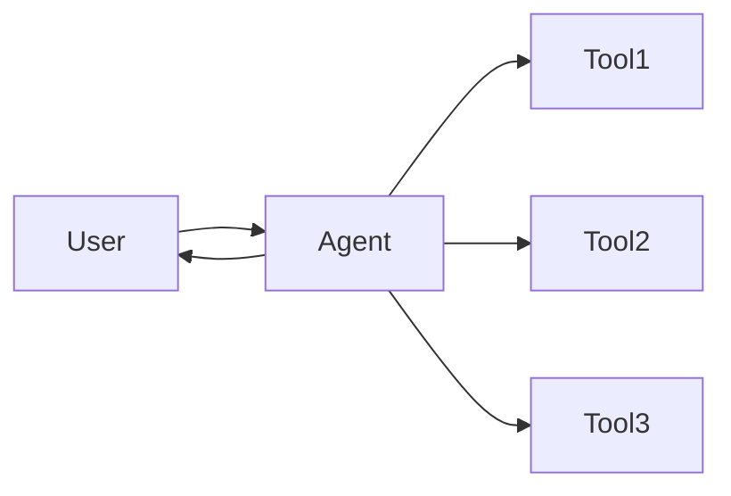
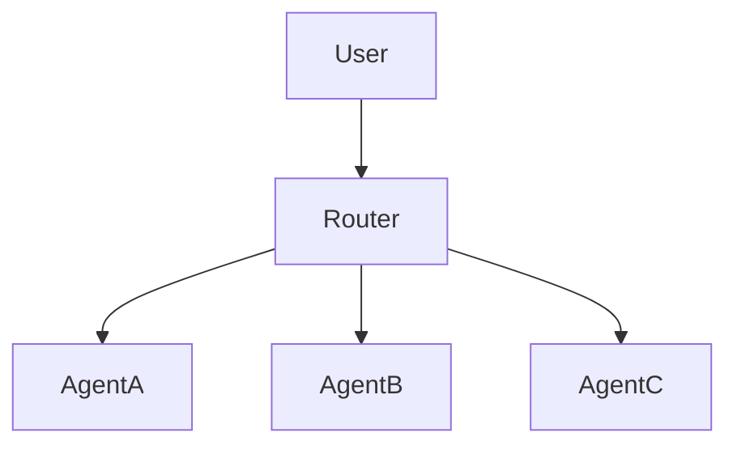
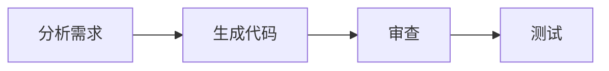
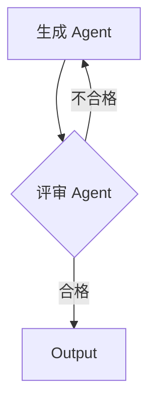
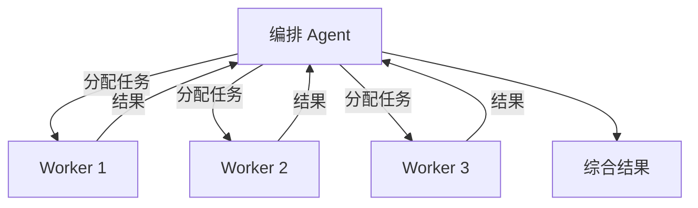
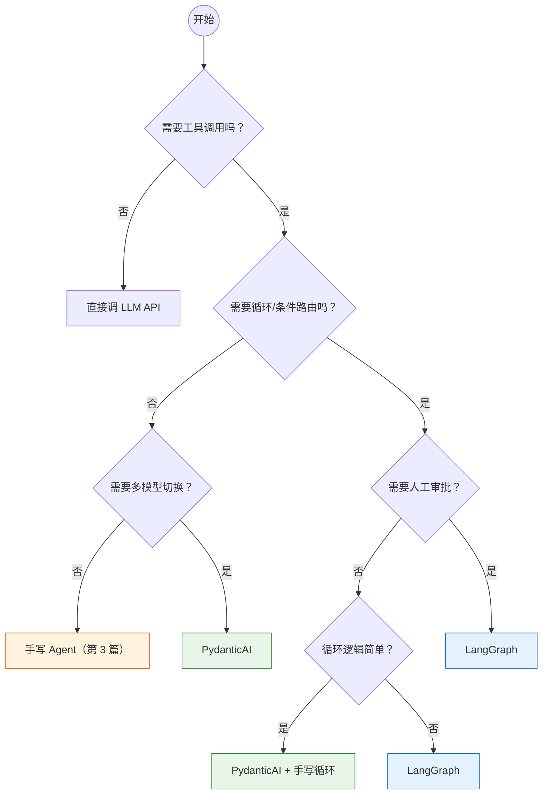

# Agent 实战（十五）—— Agent 设计模式与架构决策

十四篇写下来，从 ReAct 循环到三个生产级项目。这篇做两件事：提炼出 Agent 系统设计的通用模式，给出框架选型的决策依据。收官不是总结——是让你不依赖任何框架文档，也能独立设计一个 Agent 系统。

> **环境：** 本篇无代码依赖，纯架构与决策分析

---

## 1. 六大 Agent 架构模式

所有 Agent 系统，不管多复杂，都是以下六种模式的组合：

### 模式一：Single Agent（单体 Agent）



一个 Agent 挂所有工具。适合工具数量 ≤ 5、任务类型单一的场景。第 3-6 篇的所有示例都是这个模式。

**适用**：CLI 工具、简单问答、个人助手。
**边界**：工具超过 5 个或任务域超过 2 个时，准确率开始下降。

### 模式二：Router（路由分派）



路由 Agent 做意图分类，专家 Agent 做实际处理。第 9 篇和第 11 篇用的就是这个。

**适用**：客服系统、多领域问答。
**关键决策**：路由的准确率是整个系统的瓶颈。路由错了，后面做得再好也没用。

### 模式三：Pipeline（流水线）



多个 Agent 线性串联。每个 Agent 处理一个阶段，输出传给下一个。第 13 篇的 Copilot 基座就是 Pipeline。

**适用**：有明确阶段的工作流（内容生产、数据处理管道）。
**注意**：如果后续阶段依赖前序阶段的全部输出，Token 开销会逐步累积。

### 模式四：Evaluator-Optimizer（评审循环）



一个 Agent 生成结果，另一个 Agent 评审质量，不合格就打回重做。这是 Pipeline 的变体，加上了循环。第 10 篇和第 13 篇的审查→重写循环就是这个模式。

**适用**：需要质量保证的创作场景（代码、文案、报告）。
**关键决策**：评审标准必须具体可执行。"写得好一点"不是有效标准。

### 模式五：Orchestrator-Worker（编排-执行）



一个编排 Agent 把大任务拆成小任务，分别交给 Worker Agent 并行执行，最后汇总。

**适用**：可并行化的复杂任务（多维度分析、并行搜索）。
**Trade-off**：并行减少了总延迟，但增加了 Token 总消耗（每个 Worker 都需要完整的上下文）。

### 模式六：Swarm（去中心化群体）

没有中心路由。Agent 之间通过 Handoff 机制自由传递任务。谁能处理就谁接。OpenAI 的 Agents SDK 倾向于这个模式。

**适用**：对话流自然切换的场景（用户从聊天切到查订单再切到技术支持，不需要经过路由）。
**风险**：控制流不透明，调试困难。不推荐在需要可审计的业务系统中使用。

## 常见坑点

### Orchestrator-Worker：上下文窗口爆炸

并行 Worker 数量超过 5 个时，每个 Worker 都需要完整的上下文输入。上下文长度随 Worker 数量线性增长，容易触发 Token 上限或产生巨额账单。

**解法**：限制并发 Worker 数量（最多 3-4 个），或对 Worker 结果做摘要后再汇总。

### Supervisor：单点瓶颈

Supervisor 模式高度依赖中心节点做决策。当 Agent 任务密集时，Supervisor 成为性能瓶颈——它必须等待所有子任务返回才能做下一步决策。

**解法**：Supervisor 只做轻量决策（路由 + 汇总），不参与实际计算密集型任务。

### Swarm：调试地狱

去中心化 Swarm 模式下，没有明确的调用链路。Agent 之间的 Handoff 可能形成环形，或在某个节点死循环。

**解法**：必须引入结构化日志（Trace ID 贯穿每个 Agent 调用）。没有可观测性就不要用 Swarm。

## 2. 框架选型决策树



更直接的经验法则：

| 你的需求 | 选择 | 代价 |
|---------|------|------|
| 5 个以内的工具，单轮或简单多轮 | PydanticAI | 循环逻辑复杂时需要手写，维护成本高 |
| 需要结构化输出 + 类型安全 | PydanticAI | 与 LangGraph 相比，状态管理能力弱 |
| 简单的路由委派（2-4 个专家） | PydanticAI | 同上 |
| 带循环的质量保证流程 | LangGraph | 学习曲线陡，概念多（StateGraph、Checkpoint） |
| Human-in-the-Loop 审批 | LangGraph | 工作流硬编码，灵活性低 |
| 复杂的状态管理和持久化 | LangGraph | 同上 |
| 快速原型，验证想法 | 手写 / smolagents | 无生态支撑，工具调用需要自己实现 |
| 只用 OpenAI 模型 | OpenAI Agents SDK | 与 OpenAI 强绑定，换模型成本高 |

## 3. Agent 评估体系

Agent 的评估比普通软件测试复杂得多——LLM 的输出有随机性，同一个问题跑两次可能得到不同的工具调用序列和最终答案。

### 评估维度

| 维度 | 怎么测 | 指标 |
|------|--------|------|
| **任务完成率** | 准备 50-100 个测试用例，跑 Agent | 正确完成的百分比 |
| **工具调用准确率** | 检查每个测试用例的工具调用序列是否符合预期 | 调对工具 / 总任务数 |
| **Token 效率** | 记录每个任务消耗的总 Token | 平均 Token / 任务 |
| **延迟** | 记录端到端耗时 | P50 / P95 / P99 |
| **安全性** | 用 Injection 测试集攻击 | 拦截率 |

### 评估框架

```python
import json
from dataclasses import dataclass


@dataclass
class TestCase:
    input: str
    expected_tools: list[str]  # 预期调用的工具列表
    expected_keywords: list[str]  # 答案应包含的关键词
    max_iterations: int = 5


def evaluate_agent(agent, test_cases: list[TestCase]) -> dict:
    results = {"total": len(test_cases), "passed": 0, "failed_cases": []}

    for tc in test_cases:
        result = agent.run_sync(tc.input)
        output = result.output

        # 检查关键词是否出现在答案中
        keywords_found = all(kw in str(output) for kw in tc.expected_keywords)

        if keywords_found:
            results["passed"] += 1
        else:
            results["failed_cases"].append({
                "input": tc.input,
                "output": str(output)[:200],
                "missing_keywords": [
                    kw for kw in tc.expected_keywords if kw not in str(output)
                ],
            })

    results["pass_rate"] = results["passed"] / results["total"]
    return results
```

把 `pass_rate` 作为 Agent 版本迭代的核心指标。每次改 Prompt、换模型或调整工具描述后，先跑评估套件。低于基线不允许上线。

## 4. 2026 生态全景与演进方向

### 协议层

| 协议 | 提出者 | 解决问题 | 状态 |
|------|--------|---------|------|
| **MCP** | Anthropic | Agent ↔ 工具 | 事实标准 |
| **A2A** | Google | Agent ↔ Agent | 早期采纳 |
| **ACP** | IBM/BeeAI | Agent 编排通信 | 提案阶段 |

MCP 已经稳了。A2A 还在演进，但方向很明确——当你的 Agent 需要调用另一个团队/公司的 Agent 时，A2A 负责服务发现和安全握手。

### 框架层趋势

- **PydanticAI 往协议靠**：V2 计划更深度集成 MCP 和 A2A
- **LangGraph 往平台化走**：LangGraph Platform 提供托管部署
- **OpenAI 生态自成体系**：Agents SDK + Responses API + 内置工具
- **Hugging Face 走开源路线**：smolagents 极简但灵活

### 趋势判断

Agent 技术在 2026 年处于"协议标准化 + 框架稳定化"阶段。做技术选型时，押注协议（MCP）比押注框架更安全——框架可能被替换，但协议一旦成为标准就不会轻易变。

## 5. Agent 系统的技术债

Agent 系统和传统软件一样会累积技术债，但形式不同：

| 传统技术债 | Agent 技术债 |
|-----------|-------------|
| 代码坏味道 | Prompt 膨胀（System Prompt 越写越长） |
| 测试缺失 | 评估套件缺失（改了 Prompt 不知道影响了什么） |
| 配置硬编码 | 模型/工具硬编码（换模型要改一堆代码） |
| 依赖过时 | 工具 Schema 和实际 API 不一致 |

**管理策略**：

1. **System Prompt 版本化**：Prompt 和代码一样放在 Git 里，每次修改有 commit message
2. **评估套件是一等公民**：和代码测试同等地位，CI 里必须跑
3. **工具 Schema 自动生成**：不手写 JSON Schema，从函数签名自动生成（PydanticAI 已经做了这件事）
4. **定期审查 Agent 行为**：随机抽检线上的 Agent 对话记录，看是否有漂移

## 延伸思考

Agent 架构有一个深层矛盾：**自由度和可靠性负相关**。

完全自由的 Agent（单个 ReAct Agent，不限工具数量，不限循环次数）理论上能解决任何问题——但它会经常犯错、绕路、陷入死循环。完全受限的 Agent（LangGraph 硬编码工作流，每一步固定）极其可靠——但它只能处理预定义的场景。

生产系统的艺术在于找对这根线在哪里。经验是：**核心路径用硬编码的工作流（高可靠），边缘场景用自由 Agent（高灵活）**。客服系统的退款流程是核心路径，用 LangGraph 固定每一步；用户随口问的杂七杂八问题是边缘场景，用 PydanticAI 自由工具调用兜底。

如果非要选一个原则：**宁可少做对几个边缘场景，也不要在核心路径上翻车**。

## 总结

- 六大 Agent 架构模式：Single Agent、Router、Pipeline、Evaluator-Optimizer、Orchestrator-Worker、Swarm。实际系统通常是多种模式的组合。
- 框架选型的核心判断：需要循环和状态管理 → LangGraph；其他情况 → PydanticAI。
- Agent 评估必须量化：任务完成率、工具调用准确率、Token 效率、延迟——不量化就无法迭代。
- 押注协议（MCP/A2A）比押注框架更安全。框架会变，协议一旦标准化就是基础设施。
- Agent 的技术债形式和传统软件不同，但管理策略相通：版本化、自动化测试、定期审查。

---

Agent 系列到这里全部结束。15 篇文章的知识链路：

**概念建立**（01-03）→ **框架掌握**（04-06）→ **生态集成**（07-08）→ **多 Agent 编排**（09-10）→ **实战项目**（11-13）→ **生产化**（14-15）

如果只记住一件事：**Agent 不是魔法，是工程**。LLM 负责推理，你负责工具接口、安全边界、循环控制和成本管理。理解了这一点，不管框架怎么迭代，你都能从容应对。

## 参考

- [Anthropic Agent 设计模式](https://docs.anthropic.com/en/docs/build-with-claude/agent-patterns)
- [MCP Specification](https://spec.modelcontextprotocol.io/)
- [A2A Protocol](https://google.github.io/A2A/)
- [LangGraph 架构文档](https://langchain-ai.github.io/langgraph/)
- [PydanticAI 官方文档](https://ai.pydantic.dev/)
