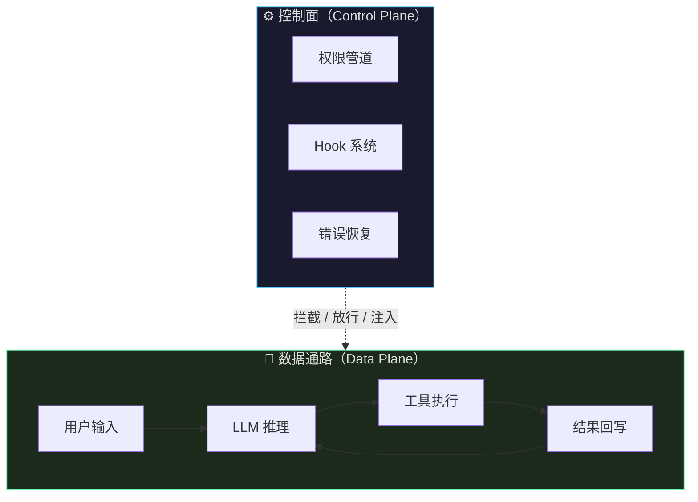
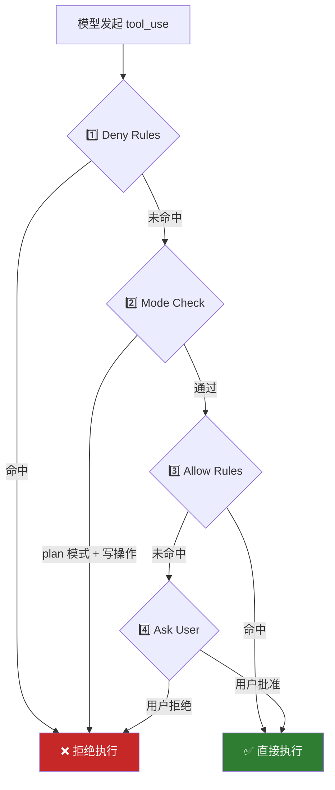
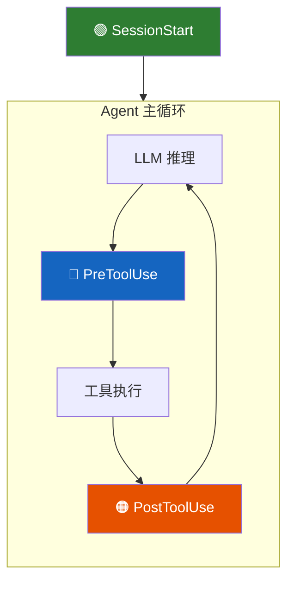
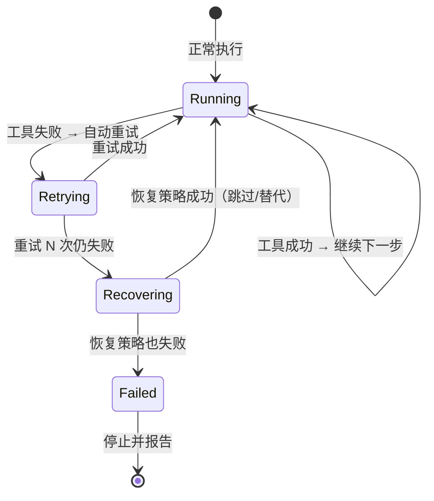
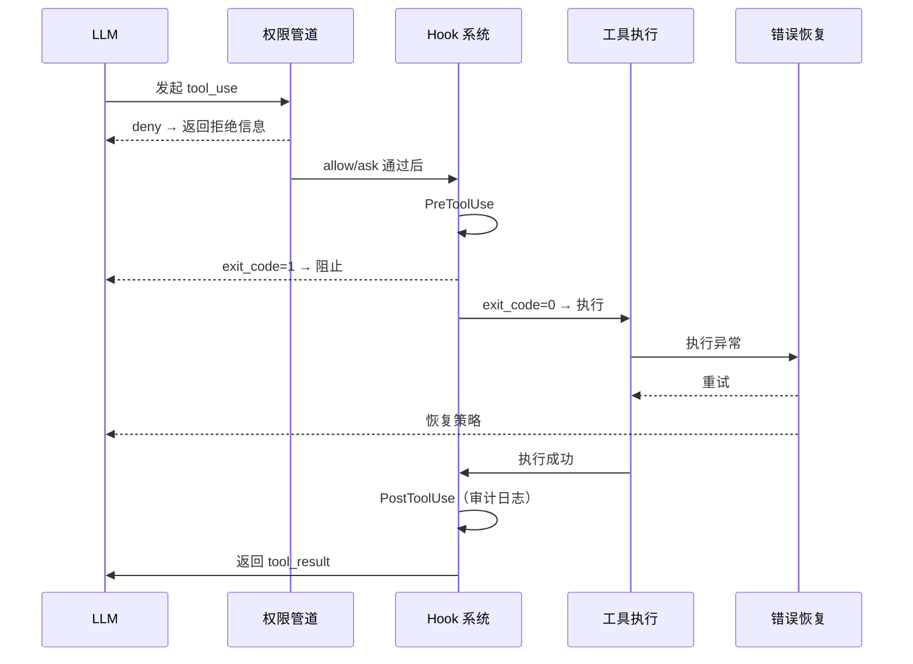

# Agent 实战（十八）—— Agent 控制面：权限管道、Hook 扩展与错误恢复

Agent 调了一条 `rm -rf /` 命令，没人拦。工具执行失败了，Agent 不知道是该重试还是跳过。每加一个审计需求，主循环就多一层 `if/else`——直到没人敢碰它。这三件事指向同一个缺失：Agent Loop 缺少一个正式的控制面。

> **环境：** Python 3.12+, pydantic-ai 1.70+

---

## 1. 什么是 Agent 控制面

第 3 篇手写的 ReAct 循环只做一件事：收消息 → 调模型 → 跑工具 → 把结果喂回模型。它是 Agent 的"数据通路"。

控制面是另一层——它不推进任务本身，但决定任务能不能推进、怎么推进：



Harness 特别篇提到过 Agent = Model + Harness。控制面就是 Harness 的神经系统——权限管道管"能不能做"，Hook 系统管"做之前做之后插什么逻辑"，错误恢复管"做砸了怎么办"。

---

## 2. 权限管道：工具执行的安全闸门

### 2.1 不是布尔开关，是四步管道

常见的权限实现是一个 `if can_use_tool:` 判断。这不够用。

生产级 Agent 的权限是一条管道，四步顺序执行，命中即停：



**为什么 deny 在最前面？** 因为有些操作（`sudo`、`rm -rf`）不应该交给"当前模式"去判断。它们无论在什么模式下都必须被挡住。

**为什么 allow 在 ask 前面？** 因为安全的高频操作（读文件、搜索代码）每次都弹确认框，用户会疯。

### 2.2 三个权限模式

不要一上来做六七个模式。三个就够覆盖绝大多数场景：

| 模式 | 行为 | 适用场景 |
|------|------|---------|
| `default` | 读操作自动放行，写操作问用户 | 日常使用 |
| `plan` | 所有写操作拒绝，只允许读和规划 | Agent 做任务拆解时 |
| `auto` | 安全操作全部放行，只拦截高危 | 信任度高的自动化场景 |

### 2.3 数据结构

```python
from dataclasses import dataclass
from enum import Enum


class PermissionBehavior(Enum):
    ALLOW = "allow"
    DENY = "deny"
    ASK = "ask"


@dataclass
class PermissionRule:
    """一条权限规则"""
    tool: str                          # 针对哪个工具
    behavior: PermissionBehavior       # 命中后怎么处理
    content_pattern: str | None = None # 内容匹配（如命令包含 sudo）


@dataclass
class PermissionDecision:
    """权限判定结果"""
    behavior: PermissionBehavior
    reason: str
```

### 2.4 最小实现

```python
import re

# 工具分类
READ_ONLY_TOOLS = {"read_file", "grep", "list_dir", "git_status"}
WRITE_TOOLS = {"write_file", "bash", "git_commit"}

# 默认规则
DENY_RULES = [
    PermissionRule("bash", PermissionBehavior.DENY, r"sudo\s+"),
    PermissionRule("bash", PermissionBehavior.DENY, r"rm\s+-rf\s+/"),
    PermissionRule("bash", PermissionBehavior.DENY, r"\$\("),  # 命令替换
]

ALLOW_RULES = [
    PermissionRule("read_file", PermissionBehavior.ALLOW),
    PermissionRule("grep", PermissionBehavior.ALLOW),
    PermissionRule("list_dir", PermissionBehavior.ALLOW),
]


def check_permission(
    tool_name: str,
    tool_input: dict,
    mode: str = "default",
) -> PermissionDecision:
    content = str(tool_input)

    # 第 1 步：deny rules 最高优先级
    for rule in DENY_RULES:
        if rule.tool == tool_name and rule.content_pattern:
            if re.search(rule.content_pattern, content):
                return PermissionDecision(
                    PermissionBehavior.DENY,
                    f"命中拒绝规则: {rule.content_pattern}",
                )

    # 第 2 步：mode check
    if mode == "plan" and tool_name in WRITE_TOOLS:
        return PermissionDecision(
            PermissionBehavior.DENY,
            "plan 模式禁止写操作",
        )

    # 第 3 步：allow rules
    for rule in ALLOW_RULES:
        if rule.tool == tool_name:
            return PermissionDecision(
                PermissionBehavior.ALLOW,
                "命中放行规则",
            )

    # 第 4 步：auto 模式对读操作放行
    if mode == "auto" and tool_name in READ_ONLY_TOOLS:
        return PermissionDecision(
            PermissionBehavior.ALLOW,
            "auto 模式放行读操作",
        )

    # 兜底：问用户
    return PermissionDecision(
        PermissionBehavior.ASK,
        "需要用户确认",
    )
```

### 2.5 Bash 为什么必须特殊对待

所有工具里，`bash` 是唯一的"万能工具"。`read_file` 只能读文件，`write_file` 只能写文件，但 `bash` 能做任何事——包括 `curl` 把数据发到外部服务器。

最小安全检查至少拦截这些：

```python
DANGEROUS_PATTERNS = [
    r"sudo\s+",           # 权限提升
    r"rm\s+-rf\s+/",      # 危险删除
    r"\$\(",              # 命令替换（可能注入）
    r"\|.*curl",          # 管道到 curl（数据外泄风险）
    r">\s*/etc/",         # 重定向到系统目录
    r"chmod\s+777",       # 权限全开
]
```

正则匹配是最粗糙的方案。高级攻击（Base64 编码命令、多层管道）可以绕过。但粗糙的检查永远比完全不检查好。

**Trade-off**：全面的 Bash 安全检查需要 AST 级别的命令解析（比如用 `shlex` 做分词），代价是引入复杂度和误拦截。对教学和中型项目来说，正则方案是合理的起点。

---

## 3. Hook 系统：不改主循环也能扩展

### 3.1 问题

Agent 上线运行一段时间后，需求会源源不断地涌进来：

- "加一个审计日志，记录每次工具调用"
- "工具执行前检查一下输出目录是否存在"
- "会话开始时自动加载用户的偏好配置"

如果每个需求都直接改主循环代码，三个月后主循环会变成一团无法维护的 `if/else` 面条。

Hook 的核心思想：**主循环只负责暴露"时机"，真正的附加行为交给可插拔的处理函数**。

### 3.2 三个关键时机

教学版先做三个事件，足够覆盖 80% 的扩展需求：



| 事件 | 触发时机 | 典型用途 |
|------|---------|---------|
| `SessionStart` | 会话启动时 | 加载用户配置、打印欢迎信息 |
| `PreToolUse` | 工具执行之前 | 额外安全检查、参数校验 |
| `PostToolUse` | 工具执行之后 | 审计日志、结果后处理 |

### 3.3 统一返回协议

Hook 的返回值必须有统一的语义，否则主循环不知道怎么处理：

```python
@dataclass
class HookResult:
    """Hook 的统一返回结构"""
    exit_code: int   # 0=继续, 1=阻止, 2=注入消息后继续
    message: str = ""
```

三种 `exit_code` 的含义：

- **0（继续）**：Hook 只做了观察/记录，不影响主流程
- **1（阻止）**：工具不应该被执行（比如 `PreToolUse` 发现参数异常）
- **2（注入）**：在消息流里追加一条说明（比如 `PostToolUse` 补一条审计记录给模型看）

### 3.4 实现

```python
from typing import Callable

# Hook 注册表：事件名 -> 处理函数列表
HookHandler = Callable[[dict], HookResult]
HOOKS: dict[str, list[HookHandler]] = {
    "SessionStart": [],
    "PreToolUse": [],
    "PostToolUse": [],
}


def register_hook(event: str, handler: HookHandler):
    """注册一个 Hook 处理函数"""
    HOOKS[event].append(handler)


def run_hooks(event: str, payload: dict) -> HookResult:
    """执行某个事件的所有 Hook，遇到阻止/注入立即返回"""
    for handler in HOOKS.get(event, []):
        result = handler(payload)
        if result.exit_code in (1, 2):
            return result
    return HookResult(exit_code=0)
```

写两个实际的 Hook：

```python
import logging
logger = logging.getLogger("agent")


def audit_log_hook(payload: dict) -> HookResult:
    """PostToolUse: 记录工具调用的审计日志"""
    logger.info("tool_call", extra={
        "tool": payload.get("tool_name"),
        "input_preview": str(payload.get("input", ""))[:200],
        "output_length": len(str(payload.get("output", ""))),
    })
    return HookResult(exit_code=0)


def directory_guard_hook(payload: dict) -> HookResult:
    """PreToolUse: 阻止写入受保护的目录"""
    tool_input = payload.get("input", {})
    path = tool_input.get("path", "")
    
    protected = ["/etc", "/usr", "/System"]
    for p in protected:
        if path.startswith(p):
            return HookResult(
                exit_code=1,
                message=f"禁止写入受保护目录: {p}",
            )
    return HookResult(exit_code=0)


# 注册
register_hook("PostToolUse", audit_log_hook)
register_hook("PreToolUse", directory_guard_hook)
```

### 3.5 接入主循环

把 Hook 接入第 3 篇的 Agent Loop，只需要在工具执行前后各加两三行：

```python
def agent_loop(state: dict):
    # 会话开始 Hook
    run_hooks("SessionStart", {"messages": state["messages"]})
    
    while True:
        response = call_model(state["messages"])
        state["messages"].append({
            "role": "assistant", "content": response.content
        })

        if response.stop_reason != "tool_use":
            return

        results = []
        for block in response.content:
            if block.type != "tool_use":
                continue
            
            # --- PreToolUse Hook ---
            pre = run_hooks("PreToolUse", {
                "tool_name": block.name,
                "input": block.input,
            })
            if pre.exit_code == 1:
                results.append({
                    "type": "tool_result",
                    "tool_use_id": block.id,
                    "content": f"[Blocked] {pre.message}",
                })
                continue
            if pre.exit_code == 2:
                state["messages"].append({
                    "role": "user", "content": pre.message
                })

            # 执行工具
            output = run_tool(block)

            # --- PostToolUse Hook ---
            post = run_hooks("PostToolUse", {
                "tool_name": block.name,
                "input": block.input,
                "output": output,
            })
            if post.exit_code == 2:
                output += f"\n[Note] {post.message}"

            results.append({
                "type": "tool_result",
                "tool_use_id": block.id,
                "content": output,
            })

        state["messages"].append({"role": "user", "content": results})
        state["turn_count"] += 1
```

主循环本身没有变复杂。它只在固定时机调用 `run_hooks`，具体做什么完全由注册的 Hook 决定。

**Trade-off**：Hook 的灵活性带来调试难度——当行为异常时，需要知道哪个 Hook 在哪个时机修改了什么。做法：Hook 返回时记录 `handler.__name__`，审计日志里标明是哪个 Hook 产生的副作用。

---

## 4. 错误恢复：Agent 做砸了怎么办

### 4.1 三种状态，必须显式区分

Agent Loop 的错误恢复有一个反直觉的关键点：工具失败后，系统必须清楚自己此刻是在**继续**、**重试**、还是处于**恢复流程**。



如果不显式维护这个状态，Agent 会出现两类问题：

1. **无限重试**：工具一直失败，Agent 一直调，Token 烧光
2. **静默失败**：工具报错了，Agent 假装没看见，继续用错误数据做下一步

### 4.2 事件驱动与显式状态机 (Machine-Readable State)

如果你只看标准输出的纯文本日志，Agent 卡死和 Agent 正在静默安装依赖看起来是一样的。高阶的生产实践（如 `claw-code` 架构）已经抛弃了纯文本日志截取（Log-scraping），转而维护一套更完善的生命周期状态机：

- `Spawning` → `TrustRequired` → `ReadyForPrompt` → `Running` → `Finished`/`Failed`

控制面在处理每次权限阻拦、错误恢复或工具结束时，不是仅仅在终端打印日志，而是**原子化地将当前状态以 JSON 格式写入系统态文件**（如 `.claw/worker-state.json`）。这也构成了无头（Headless）运行环境与外部调度器或 CI/CD 流水线做到高度集成的根本前提。

### 4.3 数据结构

```python
class RecoveryState(Enum):
    RUNNING = "running"
    RETRYING = "retrying"
    RECOVERING = "recovering"
    FAILED = "failed"


@dataclass
class ToolExecState:
    """单次工具执行的追踪状态"""
    tool_name: str
    retry_count: int = 0
    max_retries: int = 2
    recovery_state: RecoveryState = RecoveryState.RUNNING
    last_error: str = ""
```

### 4.3 恢复策略

工具失败后，有三种恢复策略，按优先级尝试：

```python
def handle_tool_failure(
    exec_state: ToolExecState,
    error: str,
) -> tuple[RecoveryState, str]:
    """决定工具失败后的恢复策略"""
    exec_state.last_error = error
    exec_state.retry_count += 1

    # 策略 1：自动重试（限 2 次）
    if exec_state.retry_count <= exec_state.max_retries:
        exec_state.recovery_state = RecoveryState.RETRYING
        return RecoveryState.RETRYING, "重试中"

    # 策略 2：告诉模型工具失败了，让它自己决定下一步
    exec_state.recovery_state = RecoveryState.RECOVERING
    recovery_msg = (
        f"工具 {exec_state.tool_name} 连续失败 "
        f"{exec_state.retry_count} 次。"
        f"最后一次错误: {error}\n"
        f"请选择: 1) 换一种方式完成 2) 跳过此步骤 3) 停止任务"
    )
    return RecoveryState.RECOVERING, recovery_msg
```

**策略 1（重试）**：网络抖动、API 限流这类临时性错误，直接重试通常就能过。

**策略 2（委托模型决策）**：把错误信息完整地喂回模型，让它自己判断是换一种方法还是跳过。这利用了 LLM 的推理能力。

**策略 3（断路器）**：如果模型的替代方案也失败了，必须有一个硬停机制。不能让 Agent 无限循环。

### 4.4 接入主循环

```python
def execute_tool_with_recovery(block, state: dict) -> str:
    """带恢复逻辑的工具执行"""
    exec_state = ToolExecState(tool_name=block.name)

    while exec_state.recovery_state != RecoveryState.FAILED:
        try:
            output = run_tool(block)
            exec_state.recovery_state = RecoveryState.RUNNING
            return output
        except Exception as e:
            recovery_state, msg = handle_tool_failure(
                exec_state, str(e)
            )

            if recovery_state == RecoveryState.RETRYING:
                logger.warning(f"重试 {block.name}: {e}")
                continue

            if recovery_state == RecoveryState.RECOVERING:
                # 把错误信息作为 tool_result 返回给模型
                return f"[Tool Failed] {msg}"

    return f"[Fatal] {block.name} 不可恢复: {exec_state.last_error}"
```

### 4.5 拒绝计数与模式切换

一个实用的辅助机制：如果 Agent 连续被权限系统拒绝多次，说明它可能在循环尝试被禁止的操作。此时应该主动干预：

```python
@dataclass 
class DenialTracker:
    """追踪连续拒绝次数"""
    consecutive_denials: int = 0
    threshold: int = 3

    def on_denial(self) -> str | None:
        self.consecutive_denials += 1
        if self.consecutive_denials >= self.threshold:
            self.consecutive_denials = 0
            return (
                "你已经连续 3 次尝试被拒绝的操作。"
                "请重新审视当前目标，考虑换一种方式。"
            )
        return None

    def on_success(self):
        self.consecutive_denials = 0
```

这条消息会作为 `tool_result` 的一部分注入回对话，帮助模型跳出无效循环。

---

## 5. 三者如何协同

权限、Hook、错误恢复不是独立的三块，而是控制面的三个层次：



执行顺序：**权限 → PreToolUse Hook → 工具执行 → 错误恢复 → PostToolUse Hook**。

任何一步都可以中断流程。这正是控制面的价值——每一层只做自己的判断，互不干扰。

---

## 常见坑点

**1. 权限规则写太严，Agent 什么都做不了**

常见的配法错误：deny 规则匹配了过宽的 pattern（比如 `r"rm"` 匹配到了 `format`）。测试方法：跑一轮正常的 Agent 任务，检查有多少正常工具调用被误拦。误拦率超过 5% 就说明规则需要收窄。

**2. Hook 之间的执行顺序导致隐藏 bug**

两个 PreToolUse Hook，一个检查路径安全性，一个修改路径参数。如果修改在检查之后执行，安全检查就失效了。做法：明确 Hook 的注册顺序就是执行顺序，安全类 Hook 永远排在最前面。

**3. 错误恢复消息格式不对，模型不理解**

把 Python 的 traceback 原样喂给模型，模型大概率会困惑。做法：错误信息做一层翻译——告诉模型"什么工具失败了"、"为什么失败"、"建议怎么处理"，不要倒一堆堆栈。

---

## 延伸思考

控制面的设计有一个根本性的张力：**安全和自主性是跷跷板**。

权限管道越严格，Agent 越安全，但也越笨——它不能自主尝试新的解决路径。Hook 越多，系统越可扩展，但运行时的可预测性下降——调试时你不知道哪个 Hook 改了什么。错误恢复策略越宽容（允许多次重试、允许模型自主选替代方案），Agent 越灵活，但 Token 消耗和延迟都会增加。

Claude Code 的做法是用 `--dangerously-skip-permissions` 标志完全关闭权限系统。这不是偷懒——它承认了一个现实：面向资深工程师的工具，权限的默认值应该偏向信任，而不是偏向管控。面向终端用户的 Agent，权限默认值必须偏向管控。

你的 Agent 面向谁，决定了控制面的松紧度。

## 总结

- Agent 控制面 = 权限管道 + Hook 系统 + 错误恢复。它不推进任务，但决定任务能不能推进。
- 权限管道四步：deny → mode → allow → ask。Bash 必须特殊对待，至少做正则级别的危险命令检测。
- Hook 系统三个事件：SessionStart / PreToolUse / PostToolUse。统一返回协议（0=继续, 1=阻止, 2=注入）让主循环保持简洁。
- 错误恢复三种状态：running / retrying / recovering。必须有硬性的重试上限和断路机制。
- 三者的执行顺序：权限 → PreToolUse → 工具执行 → 错误恢复 → PostToolUse。

## 参考

- [Learn Claude Code - s07 权限系统](https://learn.shareai.run/zh/s07/)
- [Learn Claude Code - s08 Hook 系统](https://learn.shareai.run/zh/s08/)
- [Learn Claude Code - s11 错误恢复](https://learn.shareai.run/zh/s11/)
- [OWASP Top 10 for LLM Applications](https://owasp.org/www-project-top-10-for-large-language-model-applications/)
- [Claude Code Permission Model](https://docs.anthropic.com/en/docs/claude-code/security)
