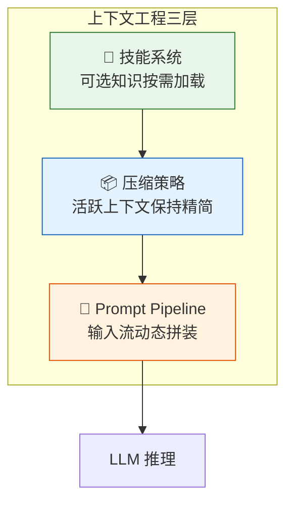
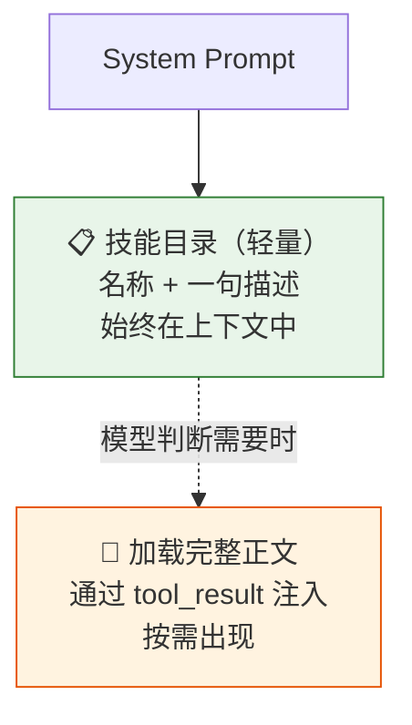
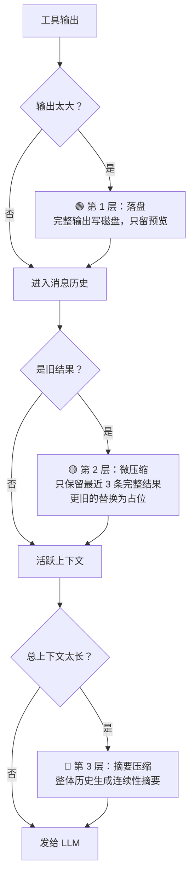
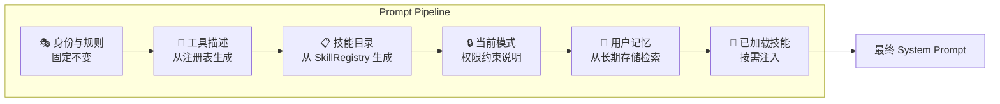
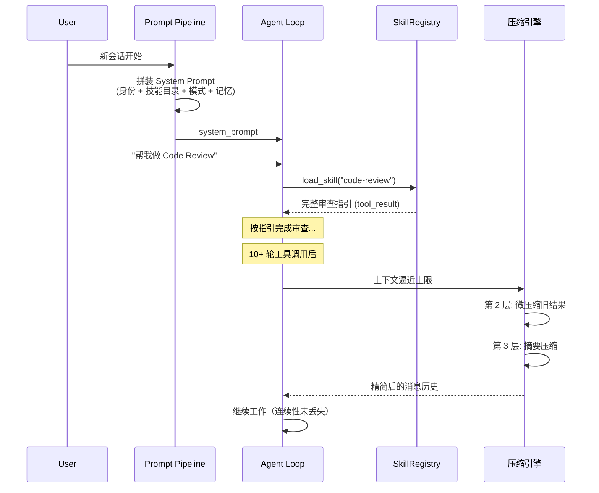

# Agent 实战（十九）—— 上下文工程：技能加载、压缩策略与 Prompt Pipeline

System Prompt 写到 3000 行，90% 的内容当前任务用不上。工具输出 500 行日志直接塞进上下文，模型注意力被淹没。对话到第 30 轮，Agent 开始"失忆"，忘了 10 轮之前确认过的关键决策。这三件事的根因相同：上下文不是越多越好，而是需要工程化管理。

> **环境：** Python 3.12+, pydantic-ai 1.70+

---

## 1. 上下文是 Agent 最稀缺的资源

Token 不是无限的。200K 的上下文窗口听起来很长，但一个中型项目的 Agent 做一轮复杂任务，轻松消耗 50K-80K Token。如果不主动管理，三个问题会依次出现：

1. **注意力稀释**：模型需要在大量无关信息里找到关键上下文，准确率下降
2. **成本爆炸**：每增加一条历史消息，后续所有轮次的输入 Token 都会增加
3. **窗口溢出**：撞到上下文上限，任务直接中断

第 17 篇的记忆架构解决了"跨会话怎么记住"。这篇解决的是更底层的问题：**单次会话内，上下文怎么保持精简、精准、可持续**。



---

## 2. 技能系统：可选知识的按需加载

### 2.1 两层设计

Agent 在不同任务里需要的领域知识完全不同——做 Code Review 需要审查清单，做 Git 操作需要提交约定，做 MCP 集成需要协议规范。

把这些全塞进 System Prompt 的后果：大部分 Token 浪费在当前用不到的说明上，Prompt 越来越臃肿，主线规则被噪声淹没。

技能系统的核心设计只有两层：



**第 1 层（轻量目录）**：始终存在于 System Prompt 中。只包含技能名称和一句描述。模型据此判断"有哪些知识包可用"。

**第 2 层（完整正文）**：只有模型主动调用 `load_skill` 工具时，才把对应技能的完整内容作为 `tool_result` 注入当前上下文。

### 2.2 数据结构

```python
from dataclasses import dataclass
from pathlib import Path
import yaml


@dataclass
class SkillManifest:
    """技能的轻量元信息——只用于目录展示"""
    name: str
    description: str


@dataclass
class SkillDocument:
    """技能的完整内容"""
    manifest: SkillManifest
    body: str  # 完整的指引正文
```

### 2.3 注册表

```python
class SkillRegistry:
    """技能注册表：统一管理发现与加载"""

    def __init__(self, skills_dir: Path):
        self.skills: dict[str, SkillDocument] = {}
        self._scan(skills_dir)

    def _scan(self, skills_dir: Path):
        """扫描目录，加载所有 SKILL.md"""
        for skill_file in skills_dir.rglob("SKILL.md"):
            text = skill_file.read_text()
            meta, body = self._parse_frontmatter(text)

            name = meta.get("name", skill_file.parent.name)
            self.skills[name] = SkillDocument(
                manifest=SkillManifest(
                    name=name,
                    description=meta.get("description", ""),
                ),
                body=body,
            )

    def list_available(self) -> str:
        """生成轻量目录（放进 System Prompt）"""
        lines = []
        for skill in self.skills.values():
            lines.append(
                f"- {skill.manifest.name}: "
                f"{skill.manifest.description}"
            )
        return "\n".join(lines)

    def load(self, name: str) -> str:
        """加载完整正文（作为 tool_result 返回）"""
        skill = self.skills.get(name)
        if not skill:
            return f"技能 '{name}' 不存在"
        return f"<skill name=\"{name}\">\n{skill.body}\n</skill>"

    @staticmethod
    def _parse_frontmatter(text: str) -> tuple[dict, str]:
        """解析 YAML frontmatter"""
        if not text.startswith("---"):
            return {}, text
        parts = text.split("---", 2)
        if len(parts) < 3:
            return {}, text
        meta = yaml.safe_load(parts[1]) or {}
        body = parts[2].strip()
        return meta, body
```

### 2.4 接入 Agent

```python
SKILL_REGISTRY = SkillRegistry(Path("./skills"))

# System Prompt 里放目录
SYSTEM = f"""你是一个编程助手。

可用技能（需要时调用 load_skill 加载详细内容）：
{SKILL_REGISTRY.list_available()}
"""

# 注册 load_skill 工具
TOOLS = [
    {
        "name": "load_skill",
        "description": "加载一个技能的完整指引内容",
        "input_schema": {
            "type": "object",
            "properties": {
                "name": {
                    "type": "string",
                    "description": "技能名称",
                }
            },
            "required": ["name"],
        },
    },
    # ... 其他工具
]

TOOL_HANDLERS = {
    "load_skill": lambda **kw: SKILL_REGISTRY.load(kw["name"]),
    # ...
}
```

一个典型的目录结构：

```
skills/
  code-review/
    SKILL.md          # frontmatter + 审查清单正文
  git-workflow/
    SKILL.md          # 分支策略和提交约定
  mcp-builder/
    SKILL.md          # MCP Server 开发步骤
```

### 2.5 Skill vs Memory vs CLAUDE.md

这三个概念容易混淆。关键区分：

| 维度 | Skill | Memory | CLAUDE.md |
|------|-------|--------|-----------|
| **定义** | 某类任务的可复用指引 | 跨会话仍有价值的事实 | 全局稳定规则 |
| **生命周期** | 按需加载，用完即走 | 持久化存储 | 始终在上下文中 |
| **例子** | Code Review 检查清单 | "用户偏好顺丰快递" | "所有回复使用中文" |

判断口诀：做这类事的步骤 → Skill；需要长期记住的事实 → Memory；无论干什么都适用的规则 → CLAUDE.md。

---

## 3. 压缩策略：保持活跃上下文精简

第 17 篇讲了滑动窗口和摘要压缩两种策略。这里从 Agent Loop 的角度，补充一个更系统的三层压缩模型。

### 3.1 三层压缩



每一层解决一个不同规模的问题：

| 层 | 触发条件 | 做法 | 保留什么 |
|----|---------|------|---------|
| 第 1 层 | 单次工具输出 > 阈值 | 全文写磁盘，上下文只留预览 | 文件路径 + 前 2000 字符 |
| 第 2 层 | 消息历史中旧结果累积 | 只保留最近 3 条完整结果 | 占位标记 |
| 第 3 层 | 总上下文逼近窗口上限 | 全量历史摘要化 | 目标 + 已做 + 文件 + 决策 + 下一步 |

### 3.2 第 1 层：大结果落盘

```python
PERSIST_THRESHOLD = 8000  # 字符数阈值
OUTPUT_DIR = Path(".task_outputs/tool-results")
OUTPUT_DIR.mkdir(parents=True, exist_ok=True)


def persist_large_output(tool_use_id: str, output: str) -> str:
    """大工具输出写磁盘，只返回预览"""
    if len(output) <= PERSIST_THRESHOLD:
        return output

    # 全文写磁盘
    stored_path = OUTPUT_DIR / f"{tool_use_id}.txt"
    stored_path.write_text(output)

    # 只返回预览
    preview = output[:2000]
    return (
        "<persisted-output>\n"
        f"完整输出已保存: {stored_path}\n"
        f"总长度: {len(output)} 字符\n"
        f"预览:\n{preview}\n"
        "</persisted-output>"
    )
```

模型看到 `<persisted-output>` 标记，知道完整数据存在但不在当前上下文里。如果它需要细节，可以用 `read_file` 工具去读磁盘上的完整输出。

### 3.3 第 2 层：旧结果微压缩

```python
def micro_compact(messages: list) -> list:
    """只保留最近 3 条工具结果的完整内容"""
    tool_results = []
    
    for i, msg in enumerate(messages):
        if isinstance(msg.get("content"), list):
            for block in msg["content"]:
                if isinstance(block, dict) and block.get("type") == "tool_result":
                    tool_results.append((i, block))

    # 超过 3 条，旧的替换为占位
    if len(tool_results) > 3:
        for idx, block in tool_results[:-3]:
            block["content"] = "[Earlier result omitted for brevity]"

    return messages
```

这一步不是为了精确优化，而是为了防止上下文被旧结果持续霸占。Agent 做了 20 步之后，第 2 步的 `grep` 输出对当前推理基本没有价值。

### 3.4 第 3 层：整体历史摘要

当前两层都不够用、上下文仍然逼近上限时，触发一次完整的历史压缩：

```python
def compact_history(messages: list) -> list:
    """把完整历史压缩为一份连续性摘要"""
    # 用 LLM 生成摘要（用小模型省钱）
    summary = summarize_with_llm(messages, guidelines=[
        "保留: 当前任务目标",
        "保留: 已完成的关键动作",
        "保留: 已修改或查看过的文件路径",
        "保留: 关键决策和约束条件",
        "保留: 所有数字、日期、人名、订单号",
        "保留: 下一步应该做什么",
        "删除: 中间步骤的工具输出细节",
    ])

    return [{
        "role": "user",
        "content": (
            "This conversation was compacted for continuity.\n\n"
            + summary
        ),
    }]
```

摘要的质量决定了压缩后 Agent 能否继续正常工作。坏的摘要只说"之前讨论了一些东西"；好的摘要像一份工作交接文档——接手的人看完就能直接干活。

### 3.5 接入主循环

```python
CONTEXT_LIMIT = 150000  # 字符数估算的上下文上限


def agent_loop(state: dict):
    while True:
        # 第 2 层：微压缩旧结果
        state["messages"] = micro_compact(state["messages"])

        # 第 3 层：整体过长时摘要压缩
        total_chars = sum(len(str(m)) for m in state["messages"])
        if total_chars > CONTEXT_LIMIT:
            state["messages"] = compact_history(state["messages"])
            state["has_compacted"] = True

        response = call_model(state["messages"])
        # ... 工具执行逻辑（第 1 层在工具结果返回时触发）
```

**Trade-off**：压缩总会丢信息。第 1 层丢的是工具输出的中间细节，第 2 层丢的是旧步骤的完整结果，第 3 层丢的是整个对话的原始上下文。每一层的决策都是在"上下文空间"和"信息精度"之间做取舍。没有完美的平衡点——只有适合你任务的平衡点。

---

## 4. Prompt Pipeline：动态拼装的输入流

### 4.1 System Prompt 不是一段固定文本

第 16 篇讲了 System Prompt 的设计模式。这里补充一个更底层的视角：在成熟的 Agent 系统里，System Prompt 不是一段写死的字符串，而是**一条按阶段拼装的流水线**。



每一块内容有不同的更新频率：

| 段落 | 更新频率 | 来源 |
|------|---------|------|
| 身份与规则 | 几乎不变 | 硬编码或 CLAUDE.md |
| 工具描述 | 会话初始化时 | 工具注册表自动生成 |
| 技能目录 | 会话初始化时 | SkillRegistry.list_available() |
| 当前模式 | 模式切换时 | 权限系统 (第 18 篇) |
| 用户记忆 | 新会话开始时 | 长期记忆 (第 17 篇) |
| 已加载技能 | 模型调用 load_skill 时 | SkillRegistry.load() |

### 4.2 实现

```python
class PromptPipeline:
    """动态拼装 System Prompt"""

    def __init__(
        self,
        identity: str,
        skill_registry: SkillRegistry,
        permission_mode: str = "default",
    ):
        self.identity = identity
        self.skill_registry = skill_registry
        self.permission_mode = permission_mode
        self.user_memory: str = ""
        self.loaded_skills: list[str] = []

    def build(self) -> str:
        """拼装最终的 System Prompt"""
        sections = []

        # 1. 身份与规则（固定）
        sections.append(self.identity)

        # 2. 技能目录（轻量）
        available = self.skill_registry.list_available()
        if available:
            sections.append(
                f"可用技能（用 load_skill 加载）：\n{available}"
            )

        # 3. 当前权限模式
        mode_desc = {
            "default": "当前模式: default — 读操作自动放行，写操作需确认",
            "plan": "当前模式: plan — 仅允许读操作和规划，禁止写操作",
            "auto": "当前模式: auto — 安全操作自动放行",
        }
        sections.append(mode_desc.get(self.permission_mode, ""))

        # 4. 用户记忆
        if self.user_memory:
            sections.append(f"用户信息：\n{self.user_memory}")

        return "\n\n---\n\n".join(s for s in sections if s)

    def inject_memory(self, memory_text: str):
        self.user_memory = memory_text

    def switch_mode(self, mode: str):
        self.permission_mode = mode
```

使用方式：

```python
pipeline = PromptPipeline(
    identity="你是一个编程助手，帮助用户完成代码任务。",
    skill_registry=SKILL_REGISTRY,
    permission_mode="default",
)

# 新会话开始时注入用户记忆
user_facts = get_user_facts("user_001")
if user_facts:
    pipeline.inject_memory(
        "\n".join(f"- {k}: {v}" for k, v in user_facts.items())
    )

# 构建最终 prompt
system_prompt = pipeline.build()

# 模式切换时重建
pipeline.switch_mode("plan")
system_prompt = pipeline.build()
```

### 4.3 PydanticAI 中的对应实现

PydanticAI 的 `@agent.system_prompt` 装饰器本身就支持动态拼装：

```python
from pydantic_ai import Agent, RunContext

agent = Agent("openai:gpt-4o", deps_type=str)


@agent.system_prompt
def base_identity(ctx: RunContext[str]) -> str:
    return "你是一个编程助手。"


@agent.system_prompt
def inject_skills(ctx: RunContext[str]) -> str:
    return f"可用技能：\n{SKILL_REGISTRY.list_available()}"


@agent.system_prompt
def inject_user_memory(ctx: RunContext[str]) -> str:
    facts = get_user_facts(ctx.deps)
    if not facts:
        return ""
    memory = "\n".join(f"- {k}: {v}" for k, v in facts.items())
    return f"用户信息：\n{memory}"
```

多个 `@agent.system_prompt` 装饰器的返回值会被拼接成最终的 System Prompt。每个函数可以访问 `RunContext`，实现基于运行时上下文的动态内容。

**Trade-off**：动态 Prompt 比静态字符串更灵活，但也更难调试。建议在开发阶段加一个 `pipeline.build()` 后的日志输出，验证拼装结果是否符合预期。

---

## 5. 三者的协作流程

把技能系统、压缩策略、Prompt Pipeline 放到一次完整的 Agent 会话里看：



---

## 常见坑点

**1. 技能目录描述写得太模糊，模型不知道什么时候该加载**

如果技能描述只有名字没有用途说明，模型无法判断何时触发 `load_skill`。做法：每个技能的 description 至少包含"适用场景"和"解决什么问题"两个信息点。

**2. 压缩后 Agent "失忆"，忘了之前确认过的关键决策**

摘要压缩时用通用的"对话总结"指令，LLM 往往会丢掉它认为"不重要"的细节——比如一个具体的版本号、一个文件路径。做法：在摘要 Prompt 中显式列出必须保留的信息类别（数字、日期、文件路径、用户确认的决策）。

**3. Skill 正文太长，加载一次就消耗大量上下文**

单个技能正文超过 5000 字符时，按需加载本身就成了上下文负担。做法：技能正文做分级——核心规则控制在 2000 字符以内，详细示例放在可选的附录里，模型需要才再加载。

**4. 把 Skill 和 Memory 混在一起存**

Skill 是"怎么做一类事"的指南，Memory 是"需要记住的事实"。混在一起会导致 Skill 内容随着 Memory 的更新而不稳定。做法：Skill 存在项目的 `skills/` 目录里，版本化管理；Memory 存在用户级的持久化存储里。

---

## 延伸思考

上下文工程的终极问题是：**信息的价值密度**。

200K 的窗口不是用来装 200K 低质量内容的。一段 500 字符的精炼摘要可能比 5 万字符的原始日志更有用——因为模型在推理时并不是均匀地"看"所有输入，而是在 attention 层分配权重。无关信息越多，关键信息被分配到的权重越少。

这意味着，上下文管理不仅仅是"不要超限"这么简单。往上下文里塞东西之前，值得先问一句：**这段信息对模型的下一步推理有多大价值？** 如果答案是"几乎没有"，它就不该出现在这里——即使窗口还有空间。

Anthropic 内部把这叫做"Context Engineering"（上下文工程），和 Prompt Engineering 并列。后者关注怎么写好一段指令，前者关注怎么控制模型看到什么、什么时候看到、以什么密度看到。某种程度上，这才是 Agent 工程中投入产出比最高的领域。

## 总结

- 上下文是 Agent 最稀缺的资源，需要工程化管理，不能任其膨胀。
- 技能系统两层设计：轻量目录常驻 System Prompt，完整正文通过 `load_skill` 按需注入。
- 压缩策略三层模型：大结果落盘（第 1 层）→ 旧结果微压缩（第 2 层）→ 整体历史摘要（第 3 层）。
- Prompt Pipeline 把 System Prompt 从固定字符串升级为动态拼装的流水线，不同段落有不同的更新频率。
- PydanticAI 的多 `@agent.system_prompt` 装饰器是 Prompt Pipeline 的框架级实现。

## 参考

- [Learn Claude Code - s05 技能系统](https://learn.shareai.run/zh/s05/)
- [Learn Claude Code - s06 上下文压缩](https://learn.shareai.run/zh/s06/)
- [Learn Claude Code - s10 系统提示词](https://learn.shareai.run/zh/s10/)
- [Context Engineering — Anthropic Research Blog](https://www.anthropic.com/research/context-engineering)
- [PydanticAI System Prompt 文档](https://ai.pydantic.dev/agents/#system-prompts)
