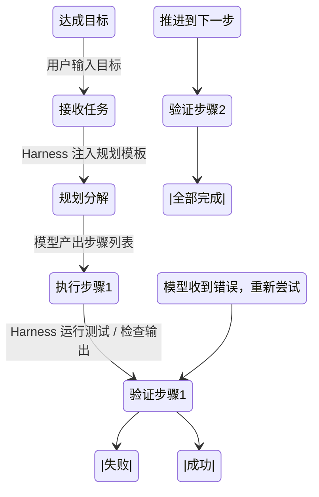
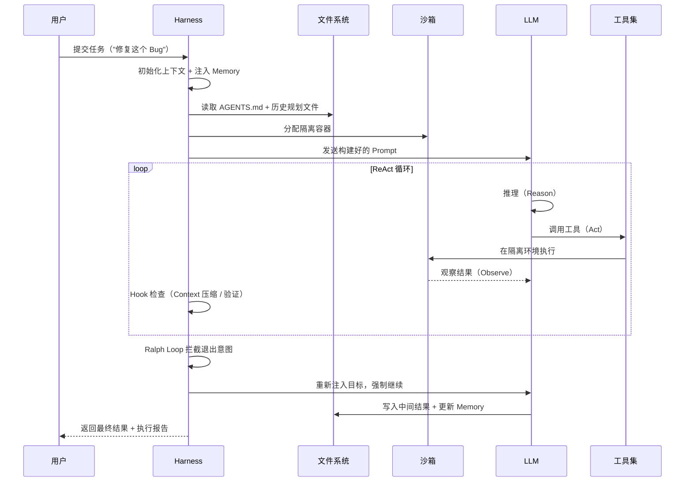

# Agent 工程体系（特别篇）—— Harness：智能体的"操作系统"

LLM 能推理、能写代码，但在生产环境里光靠一个模型什么都干不了——它不知道文件系统在哪，不会记住上一步的结果，
也不能自己调用工具。这层把模型变成可干活智能体的基础设施，就是 Harness。

> **前置知识：** 了解 LLM 基本原理、ReAct 推理模式、有过 AI Agent（AutoGPT / Claude Code / Cursor Agent）使用经验
> **核心观点：** 模型是商品，Harness 才是护城河

---

## 1. 一句话讲清楚 Harness 是什么

**Agent = Model + Harness**

模型负责"思考"，Harness 负责"执行"。前者产出一个语言 token，后者把它变成真实的动作——读文件、调用 API、执行代码、持久化状态。

如果把模型比作一匹野马：它有的是力气，但没有方向。Harness 就是那根缰绳，让力量变成可控的工作。

另一个更精确的比喻：**模型是 CPU，Harness 是操作系统**。CPU 执行指令，操作系统管理一切外围资源。没有 OS 的裸 CPU 连屏幕都点不亮。

LangChain 工程师 Vivek Trivedy 的定义最干净：

> 如果你不是模型本身，那你就是在 Harness 的范畴里。

换句话说——除了模型权重，所有让智能体运转起来的代码、配置、逻辑，统统是 Harness。

---

## 2. 为什么光有模型不够用

LLM 的本质是：输入 token，输出 token。来来回回就这一件事。它天然不具备以下能力：

| 缺失的能力 | 实际影响 |
|-----------|---------|
| 持久化状态 | 下一轮对话丢失上一轮的计算结果 |
| 访问真实文件系统 | 无法读取项目代码、无法写文件 |
| 执行代码 | 只能描述"应该怎么做"，不能真的运行 |
| 调用外部工具 | 无法查询实时数据、操作浏览器 |
| 长时间自主工作 | 上下文填满后性能急剧下降（Context Rot） |

每一种缺失，都是 Harness 需要填补的空白。

---

## 3. 核心组成：Harness 的解剖图

Harness 不是单一组件，而是一组按职责分层的能力模块。

```mermaid
flowchart TB
    subgraph Harness["&#9881; Harness（框架层）"]
        direction TB
        A["&#128190; 文件系统\
持久化存储 + 工作空间"] 
        B["&#128187; Bash / 代码执行\
通用工具 + 自定义工具"]
        C["&#128736; 沙箱环境\
隔离执行 + 安全边界"]
        D["&#128203; Memory / 检索\
跨会话记忆 + 实时知识"]
        E["&#128161; 规划 + 验证\
目标分解 + 自验证循环"]
        F["&#128279; Hooks / Middleware\
Context 压缩 + 拦截续接"]
    end

    subgraph Model["&#129504; LLM（智能层）"]
        M["推理引擎\
输入 Prompt → 输出 Action"]
    end

    A --> M
    B --> M
    C --> M
    D --> M
    E --> M
    F --> M

    style Harness fill:#1a1a2e,color:#e0e0e0,stroke:#4fc3f7
    style Model fill:#1b2a1b,color:#e0e0e0,stroke:#69f0ae
```

### 3.1 文件系统：持久化的地基

这是最底层、最重要的 primitive。

模型只能操作上下文窗口内的数据。没有文件系统，Agent 就像一个没有笔记本的人——聊到哪算哪，关掉窗口全忘光。

Harness 的文件系统抽象解决了三个问题：

- **工作空间**：给 Agent 一个可以读写代码、文档的目录
- **状态卸载**：把不在上下文里的中间结果存到磁盘，腾出宝贵的 context 空间
- **协作界面**：多个 Agent 或人与 Agent 之间，通过共享文件协调工作

> **高阶警示：防范“幻影完成（Phantom Completions）”**
> 生产级场景下只通过 Agent Session ID 隔离是极度危险的。如果有多个无头 Agent 并发工作，必须将 Session 的上下文强绑定到具体的 **Git 工作树路径 (CWD) 和分支名称**。在触发任何写操作的副作用之前强烈建议进行比对（ `WorkspaceMismatch` 拦截）。否则，并发 Agent 完全可能把任务 A 的补丁错误地打进任务 B 的路径树里，然后幽灵般地上报成功。

Git 在此基础上又加了一层版本控制——Agent 可以回滚错误、分支实验。多 Agent 协作场景下，共享文件系统就是所有人的账本。

### 3.2 Bash / 代码执行：通用工具瑞士军刀

ReAct 循环（Reason → Act → Observe → Repeat）是 Agent 的标准执行范式，但 ReAct 循环能执行什么动作，取决于 Harness 提供了哪些工具。

与其给 Agent 预置一百个专用工具，不如给它一个通用工具——Shell 执行。

有了 Bash + 代码执行，Agent 可以：
- 自举工具：自己写脚本，自己调用，不需要提前定义
- 动态适应：遇到任何预置工具没覆盖的场景，当场写代码解决
- 零前期投入：不用为每种操作单独开发插件

代价是：Agent 可能写出有 bug 的代码，或者在 Shell 里执行危险命令。沙箱的引入就是为了解决这个。

### 3.3 沙箱：安全的行动边界

在本地机器上跑 Agent 生成的 Shell 命令，等于把钥匙交给了一个不可预测的系统。

沙箱（Sandbox）为 Agent 提供了隔离的、可控的执行环境：

- **隔离性**：Agent 的操作不会影响宿主机文件系统
- **可观测**：执行过程可以截取日志、截图、录制
- **按需扩缩**：任务来了起新容器，干完了销毁，不占用本地资源
- **白名单控制**：可以限制 Agent 能执行的命令范围（如禁止 `rm -rf /`）

生产级的 Coding Agent（Claude Code、Cursor Agent）无一例外都运行在沙箱里。浏览器自动化场景则用 Playwright / Puppeteer 提供的浏览器沙箱。

### 3.4 Memory：跨会话的连续性

LLM 没有"记忆"——每次对话都是独立的 token 序列。Session 关闭，知识清零。

Harness 用以下机制对抗这个限制：

| 机制 | 原理 | 适用场景 |
|------|------|---------|
| **AGENTS.md 标准** | 在 Agent 启动时把约定好的文件注入上下文 | 项目约定、工具用法 |
| **Memory 文件滚动** | Agent 自己在文件里追加笔记，Harness 每次读取并注入 | 跨会话积累中间结论 |
| **向量检索（Vector Search）** | 把历史对话 chunk 向量化，检索时召回相关片段 | 大量历史数据中找上下文 |
| **Web Search / MCP** | 实时查外部知识（库版本、新闻、数据） | 知识截止日期之后的信息 |

### 3.5 规划 + 自验证：对抗 Context Rot

Context Rot（上下文腐烂）是长周期任务的天敌：当上下文窗口快填满时，模型的推理质量断崖式下跌。

Harness 用两套机制应对：

**规划（Planning）**：让模型先把大目标拆成小步骤，写入规划文件（plan.md）。每个步骤完成后，检查是否达标，再推进下一步。这比让模型一口气干到底可靠得多。

**自验证（Self-Verification）**：Agent 写完代码，Harness 自动跑测试套件。失败了，把错误信息喂回给模型，让它自己修复。这是一种外部反馈循环——不依赖模型的自我评估（那往往不靠谱）。

### 3.6 Hooks / Middleware：Context 工程的关键杠杆

Hooks 是拦截在模型调用链上的中间件，可以在关键节点注入逻辑、改写输入输出。典型场景：

- **Context 压缩（Compaction）**：上下文快满了，Hook 拦截，总结历史对话，腾出空间
- **Tool Call Offloading**：工具输出太长（几百行日志），只保留首尾 token，中间全压到文件系统，按需召回
- **Ralph Loop**：模型想退出时，Hook 拦截，重新注入原始目标，强迫它继续干
- **Lint Checks**：代码提交前，Hook 自动跑静态检查，不合格直接打回

Harness 的大部分工程价值，就藏在这些 Hook 的配置和调优里。

---

## 4. 完整执行流程：一次任务的生命周期

这个循环里，有两个点值得特别关注：

**第一，Context 是稀缺资源**。每一步的工具输出都是双刃剑——给模型提供了信息，但也迅速消耗 context。好的 Harness 会在 Hook 层主动管理这个消耗，而不是等模型自己报 OOM。

**第二，模型的自我评估不可靠**。研究反复证明，模型往往会高估自己代码的正确性。自验证必须由外部系统（Harness 跑测试套件）驱动，而不是让模型自己说"我检查过了，没问题"。

---

## 5. Trade-offs：Harness 工程的代价

引入 Harness 层，不是只有好处。

**性能代价**：每一次模型调用都经过 Harness 的 Prompt 工程和上下文组装。额外的序列化 / 反序列化、文件系统 I/O、Hook 执行都会引入延迟。对于低延迟场景（实时对话），这是不可忽视的开销。

**配置复杂度**：Harness 的能力上限取决于工程团队的配置水平。一个配置得当的 Harness 可以让普通模型在特定任务上超过顶级模型；反过来说，花哨的配置也可能带来难以排查的隐藏 bug。

**模型耦合风险**：主流 Coding Agent（Claude Code、Copilot）都在用 post-training 把模型调教成更适合特定 Harness 的形态。这导致"换 Harness = 模型能力骤降"的现象——模型和 Harness 的耦合越深，迁移成本越高。

**安全边界模糊**：Agent 能做的事情越多，Harness 的安全边界就越难定义。在沙箱里跑 Agent 永远比在本地安全，但沙箱里的 Agent 能调的工具也受限制——这是一个需要在灵活性和安全性之间反复权衡的动态博弈。

---

## 6. 常见坑点

**1. Context 填满了模型突然"失智"**

没有任何报错，但模型的回复质量断崖式下降。根因往往是工具输出太大——几百行日志直接塞进 context。

解法：开启 Tool Call Offloading，Harness 只保留工具输出的首尾 token，中间内容压到文件系统。

**2. Agent 跑着跑着就"放弃"了**

长任务（几十步甚至上百步），模型到一半就停止输出了，声称"任务已完成"。

解法：Ralph Loop Hook——检测到模型退出意图时，强制把上下文压缩重置，重新注入原始目标，逼迫它继续。

**3. 换了模型，Agent 性能腰斩**

换了个更贵的模型，结果 Benchmark 分数反而下降。

根因：模型和原 Harness 的工具调用方式深度耦合。换模型时，工具描述、调用格式、输出解析方式可能不兼容。Benchmark 数据（Terminal Bench 2.0）证明：同样一个 Opus 4.6，在 Claude Code Harness 里跑分远低于专用配置的 Harness。**调 Harness 比换模型更有效**。

**4. 沙箱里能跑，本地跑不动**

Agent 在云端沙箱环境工作正常，但在本地复现时依赖了未安装的包或特定工具链。

解法：统一开发环境和沙箱的镜像定义，确保两边一致。用 Docker Compose 或 Nix 做环境可复现性。

**5. Memory 文件膨胀失控**

Agent 每轮都往 Memory 文件追加内容，越积越大，最后塞满 context。

解法：定期压缩（Compaction），Harness 在合适时机（如每次大阶段完成后）触发总结，把历史信息浓缩成摘要。

---

## 7. 延伸思考

**Harness 的上限在哪里？**

现在看，Harness 的大部分工作是在弥补模型的不足——持久化（模型没有）、验证（模型做不好）、上下文管理（模型天然受限）。随着模型本身能力的提升，这些缺陷会逐渐被模型自己解决。

但这不意味着 Harness 会消失。就像 Prompt Engineering 在模型能力爆炸后依然有价值一样，Harness Engineering 会从"修修补补"转向"工程化放大"——给模型配置更好的工具链、更精细的执行策略、更智能的上下文组装。

真正值得追问的是：**在 Agent 能自主优化自身 Harness 的那一天，还需要人来写 Harness 吗？**

这基本上就是 AutoML 在 Agent 领域的翻版。历史告诉我们，自动化工具确实会取代大量人工配置，但顶尖系统始终保留着人类的判断空间——因为系统的目标本身，往往需要人来定义。

---

## 总结

- **Agent = Model + Harness**：模型提供智能，Harness 提供执行力
- **核心组成**：文件系统、Bash/代码执行、沙箱、Memory、规划验证、Hooks
- **执行范式**：ReAct 循环 + Ralph Loop 拦截 + 自验证反馈
- **关键工程**：Context 管理（Compaction / Offloading）是性能瓶颈的核心战场
- **行业现状**：模型同质化加剧，Harness 才是差异化竞争力——"模型是商品，Harness 是护城河"

---

## 参考

- [The Anatomy of an Agent Harness — LangChain Blog](https://blog.langchain.dev/the-anatomy-of-an-agent-harness/)
- [What Is Harness Engineering — Harness Engineering](https://harness-engineering.ai/blog/what-is-harness-engineering/)
- [The Complete Guide to Agent Harness — Harness Engineering](https://harness-engineering.ai/blog/agent-harness-complete-guide/)
- [Terminal Bench 2.0 Leaderboard](https://www.tbench.ai/leaderboard/terminal-bench/2.0)
