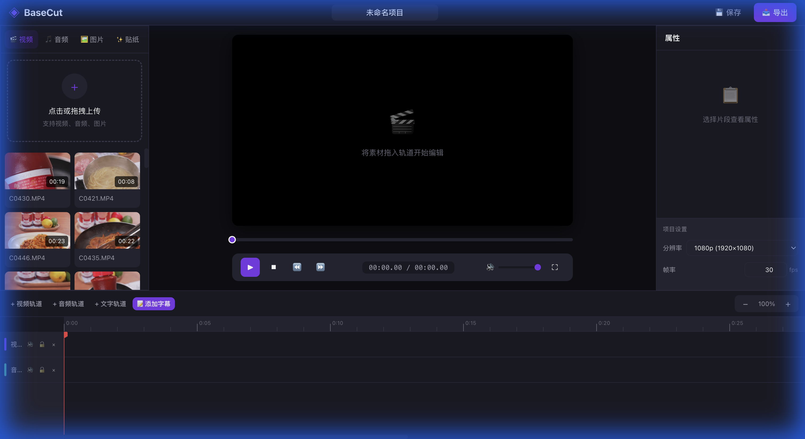

# 我是怎么用 Web 技术撸了一个视频剪辑器的

> 这是 BaseCut 技术博客系列的第一篇。不讲大道理，就聊聊我在做这个项目时踩过的坑、做过的选择。

## 先看成品



这是做出来的效果：左边是素材库，中间是预览播放器，右边是属性面板，下面是时间轴。功能上基本对标剪映网页版。

## 起因

去年接了个需求，要做一个在线视频编辑工具。当时看了一圈市面上的方案，要么是桌面软件（Premiere、剪映），要么是需要后端渲染的云剪辑。但老板的要求很明确：

> **纯前端，不要后端，用户数据不能上传服务器。**

好家伙，这就意味着所有视频处理、渲染、导出都得在浏览器里完成。

当时我心想：浏览器能干这活吗？

---

## 浏览器的进化：从"只能看"到"能编辑"

### 2010-2015：Flash 死了，HTML5 来了

那时候网页播放视频还得靠 Flash 插件。2014 年 HTML5 的 `<video>` 标签普及后，终于可以原生播放视频了。

但"播放"和"编辑"是两回事。那时候浏览器只能：
- 播放视频 ✓
- 暂停、快进 ✓
- 但想改一帧画面？门都没有 ✗

### 2020 至今：浏览器变成了"超级计算机"

现代浏览器多了一堆黑科技 API：

| API | 干嘛的 | 类比 |
|-----|-------|------|
| **WebGL** | 调用 GPU 画图 | 给浏览器装了块 RTX 4090 |
| **WebCodecs** | 原生视频编解码 | 内置了一个"格式工厂" |
| **OffscreenCanvas** | 后台渲染 | 多线程绘图 |
| **Web Audio** | 音频处理 | 内置了 Audition |
| **IndexedDB** | 大文件存储 | 给浏览器加了块硬盘 |

有了这些，纯前端视频编辑终于成为可能。

---

## 技术选型深度解析

### 前端框架：Vue 3

**为什么不用 React？**

个人习惯问题，两者都能做。Vue 的模板语法对于 UI 密集型应用更直观一些。关键是要利用好**响应式（Reactivity）**：

```
视频编辑器的状态联动非常复杂：

currentTime 变化时：
├── 播放器要 seek 到对应位置
├── 时间轴指针要移动
├── 当前帧要重新渲染（可能有滤镜）
├── 属性面板要更新选中状态
└── 贴纸层要更新显示/隐藏

如果手动管理这些更新，漏一个就是 bug。
用响应式，改一处，全自动更新。
```

### 类型系统：TypeScript

这个没什么好犹豫的。30000+ 行的项目，没类型约束会疯掉。

```typescript
// 类型定义让代码自文档化
interface Clip {
  id: string
  startTime: number  // 时间轴位置（秒）
  duration: number   // 持续时长（秒）
  inPoint: number    // 素材入点
  outPoint: number   // 素材出点
  filter?: FilterParams  // 可选的滤镜参数
}
```

### 状态管理：Pinia

**为什么不用 Vuex？**

Vuex 要写 mutation、action，太啰嗦了。Pinia 是 Vue 官方推荐的下一代状态管理，写法更简洁：

```typescript
// Pinia 写法
export const useTimelineStore = defineStore('timeline', () => {
  const currentTime = ref(0)
  
  function seek(time: number) {
    currentTime.value = time
  }
  
  return { currentTime, seek }
})
```

**关键设计原则：单一数据源（Single Source of Truth）**

所有状态只存一份，组件只读取、不自己存。这样永远不会出现"A 显示 3 秒，B 显示 5 秒"的同步 bug。

---

## 渲染方案：为什么必须用 WebGL

### 问题：视频滤镜需要逐像素计算

用户调亮度时，需要把每个像素的 RGB 值都加上一个数。1080p 有 200 万像素，每秒 30 帧，就是 6000 万次像素操作。

### 方案 A：Canvas 2D（CPU 计算）

```javascript
// 最直观的写法
const imageData = ctx.getImageData(0, 0, w, h)
for (let i = 0; i < imageData.data.length; i += 4) {
  imageData.data[i] += brightness  // R
  imageData.data[i+1] += brightness // G
  imageData.data[i+2] += brightness // B
}
ctx.putImageData(imageData, 0, 0)
```

**实测结果：**

| 分辨率 | 帧率 | 体验 |
|--------|------|------|
| 480p | 25 fps | 勉强能用 |
| 720p | 12 fps | 卡 |
| 1080p | 5 fps | 幻灯片 |

### 方案 B：WebGL（GPU 加速）

GPU 和 CPU 的本质区别：

```
CPU：8-16 个核心，每个核心很强，适合复杂逻辑
GPU：几千个核心，每个核心简单，适合大规模并行

滤镜操作 = "对每个像素做同样的简单数学运算"
完美适配 GPU 的并行架构
```

**实测结果：**

| 分辨率 | 帧率 |
|--------|------|
| 1080p | 60 fps |
| 4K | 45 fps |

性能提升 **10-20 倍**。

---

## 导出方案：WebCodecs vs FFmpeg.wasm

### FFmpeg.wasm：功能全但太重

FFmpeg 是视频处理领域的瑞士军刀，FFmpeg.wasm 是它的 WebAssembly 移植版。

**优点：**
- 功能极其丰富，几乎啥格式都支持
- 生态成熟，文档多

**缺点：**
- 核心文件 30MB+，首次加载要很久
- WebAssembly 是软件模拟，**没有硬件加速**
- 实测编码速度大约 10 fps，导出 1 分钟视频要等好几分钟

### WebCodecs：原生 API，硬件加速

WebCodecs 是 Chrome 2020 年推出的原生视频编解码 API。

**优点：**
- 浏览器内置，零加载成本
- 直接调用系统的硬件编码器（GPU 加速）
- 实测编码速度 100+ fps

**缺点：**
- Safari 不支持（2024 年底）
- 只管编码，不管封装（需要配合 mp4-muxer 封装成 MP4）

**我的选择：WebCodecs + mp4-muxer**

为了性能，我选了 WebCodecs。Safari 用户暂时不能导出，但考虑到目标用户主要是电脑端，Chrome 占比高，可以接受。

---

## 贴纸系统：LeaferJS

### 需求：可拖拽、可缩放的图片叠加

用户要能在视频上叠加贴纸/水印，并且可以拖拽、缩放、旋转。

### 方案对比

| 方案 | 优点 | 缺点 |
|------|------|------|
| 原生 Canvas | 轻量 | 要自己写命中检测、选中框、拖拽手柄... |
| Fabric.js | 生态成熟 | 包体积大（200KB+），代码有点老 |
| Konva.js | 性能不错 | API 设计一般 |
| **LeaferJS** | 性能极致、TypeScript 原生、编辑器功能开箱即用 | 社区相对小 |

### 为什么选 LeaferJS

[LeaferJS](https://leaferjs.com) 是国人开发的 Canvas 2D 渲染引擎，有几个特点让我眼前一亮：

**1. 性能炸裂**

官方数据：创建 100 万个可交互矩形，首屏渲染 1.5 秒，内存占用 350MB。这个数据远超同类引擎。

**2. 包体积极小**

gzip 后只有 42KB，是 Fabric.js 的 1/5。

**3. 编辑器功能开箱即用**

不用自己实现选中框、变换手柄、旋转控制，LeaferJS 的 `@leafer-ui/editor` 包直接提供。

```typescript
import { App, Rect } from 'leafer-ui'
import '@leafer-in/editor'

const app = new App({ view: 'canvas' })
const rect = new Rect({ 
  x: 100, y: 100, 
  width: 200, height: 100,
  fill: '#32cd79', 
  editable: true  // 加这一行就可以拖拽缩放了
})
app.tree.add(rect)
```

**4. TypeScript 原生**

API 设计现代，类型定义完善，开发体验很好。

---

## 项目架构

```
src/
├── components/           # Vue 组件
│   ├── player/           # 播放器
│   ├── timeline/         # 时间轴
│   └── property/         # 属性面板
│
├── stores/               # Pinia 状态管理
│   ├── timeline.ts       # 时间轴状态
│   └── player.ts         # 播放状态
│
├── engine/               # 核心引擎（纯 TS，不依赖 Vue）
│   ├── WebGLRenderer.ts  # WebGL 渲染器
│   └── WebCodecsExporter.ts # 视频导出
│
└── types/                # 类型定义
```

**为什么要把 engine 独立出来？**

1. **关注点分离**：引擎只管渲染/导出逻辑，不知道 Vue 的存在
2. **可复用**：以后想做 React 版本，engine 可以直接用
3. **可测试**：引擎逻辑可以单独写单元测试

---

## 这篇就到这

下一篇聊**时间轴的数据模型**——怎么用代码描述"这个片段放在哪、持续多久、用素材的哪一段"。

---

**系列目录**

1. [x] 技术选型与项目结构（本文）
2. [ ] 时间轴数据模型
3. [ ] WebGL 渲染与滤镜
4. [ ] 转场动画实现
5. [ ] WebCodecs 视频导出
6. [ ] LeaferJS 贴纸系统
