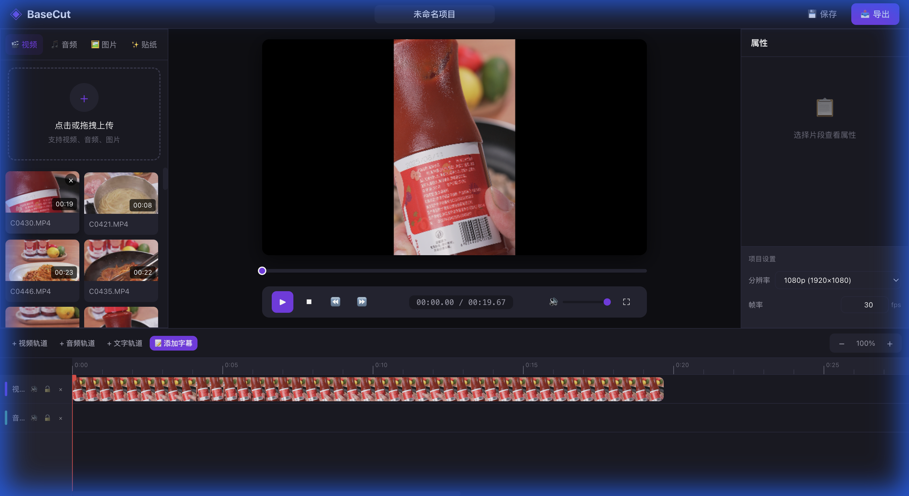

# 时间轴的数据模型，我是这么设计的

> BaseCut 技术博客第二篇。这篇聊聊时间轴——整个编辑器最核心的数据结构。

## 先看效果



这是添加了视频片段后的时间轴。可以看到视频缩略图、轨道、以及右边的属性面板。

下面这张图是时间轴的数据模型示意：


---

## 什么是非线性编辑（NLE）

在聊数据模型之前，先说一个概念：**非线性编辑（Non-Linear Editing）**。

### 线性编辑：80 年代的痛苦记忆

早期的视频剪辑是"线性"的。剪辑师面前有两台录像机：

```
源带机（Source）     →    成品机（Master）
   磁带 A                    成品带
```

工作流程：
1. 在源带机上找到想要的片段
2. 按录制键，把这段录到成品带上
3. 换另一盘磁带
4. 继续录下一段

**问题在哪？**

- 录错了？**从头来**
- 想在中间插入一段？**不可能**
- 想调整两个片段的顺序？**从头来**

### 非线性编辑：数字时代的革命

1990 年代，数字技术带来了革命。Avid、Final Cut Pro 等软件出现了：

```
素材文件存在硬盘上，可以随机访问（Random Access）

时间轴上的片段只是"引用"，不修改原文件
可以随意拖动、插入、删除
```

**非线性的本质：**
- **不破坏原素材**（Non-Destructive）
- **随机访问任意位置**（Random Access）
- **无限撤销/重做**（Undo/Redo）

我们要做的 Web 视频编辑器，就是要在浏览器里实现一个 NLE 系统。

---

## 时间轴需要存什么数据

梳理一下用户操作：

```
1. 导入一个视频文件
2. 把视频拖到时间轴上
3. 裁剪片段（只用素材的中间部分）
4. 调整片段位置（左右拖动）
5. 添加多条轨道（画中画、配音）
6. 在两个片段之间加转场
```

翻译成数据需求：

- 时间轴上有**多条轨道**
- 每条轨道上有**多个片段**
- 每个片段有**位置、时长**
- 每个片段引用**素材的某一段**（入点、出点）

---

## 核心数据结构

### 素材（Resource）

素材是用户导入的原始文件：

```typescript
interface Resource {
  id: string
  type: 'video' | 'audio' | 'image'
  
  // 文件信息
  name: string
  url: string          // Blob URL 或远程地址
  
  // 媒体信息
  duration: number     // 视频/音频的原始时长
  width?: number       // 视频宽度
  height?: number      // 视频高度
  
  // 预生成的缩略图
  thumbnails?: string[]
}
```

素材存在 IndexedDB 里，不会丢失。

### 片段（Clip）

片段是时间轴上的"方块"，引用素材的某一段：

```typescript
interface Clip {
  id: string
  trackId: string       // 属于哪条轨道
  resourceId: string    // 引用哪个素材
  
  // 时间轴位置
  startTime: number     // 在时间轴的第 X 秒开始显示
  duration: number      // 显示 Y 秒
  
  // 素材裁剪范围
  inPoint: number       // 从素材的第 A 秒开始
  outPoint: number      // 到素材的第 B 秒结束
  
  // 可选属性
  speed?: number        // 播放速度，1.0 是原速
  filter?: FilterParams // 滤镜参数
  transform?: Transform // 位置、缩放、旋转
}
```

### 轨道（Track）

轨道是片段的容器：

```typescript
interface Track {
  id: string
  type: 'video' | 'audio' | 'text' | 'sticker'
  name: string
  clips: Clip[]
  
  // 轨道级别设置
  muted?: boolean       // 静音
  locked?: boolean      // 锁定（不可编辑）
}
```

---

## 最容易搞混的概念：入点/出点 vs 开始时间/时长

### 场景：裁剪一段采访视频

你有一段 60 秒的采访视频，但嘉宾在前 10 秒还在看手机，后 15 秒在整理衣服。你只想用中间 35 秒（10s-45s）。

**问题：怎么定义"用中间这一段"？**

### 入点（inPoint）和出点（outPoint）

入点和出点是**素材坐标系**下的概念：

```
素材（60 秒）:

0s       10s                   45s       60s
|         |                     |         |
|  不要的  |       想要的       |  不要的  |
          ↑ inPoint             ↑ outPoint
```

`inPoint = 10`，`outPoint = 45`

意思是：从素材的第 10 秒开始用，用到第 45 秒。

### 开始时间（startTime）和时长（duration）

这两个是**时间轴坐标系**下的概念：

```
时间轴:

0s     5s                      40s
|       |                       |
|  空   |        片段           |
        ↑ startTime             
        └────── 35s duration ───┘
```

`startTime = 5`，`duration = 35`

意思是：这个片段在时间轴的第 5 秒开始，持续 35 秒。

### 它们的关系

```
正常情况（原速播放）：
duration = outPoint - inPoint

变速情况（2 倍速）：
duration = (outPoint - inPoint) / speed
```

### 我踩的坑

一开始我觉得 `duration` 是冗余字段，可以通过 `(outPoint - inPoint) / speed` 算出来，就没单独存。

结果做变速功能时才发现：当用户调整 `speed` 时，`duration` 会变，但 `inPoint` 和 `outPoint` 不应该变。如果不单独存 `duration`，就需要复杂的反向计算。

**教训：不要过度追求"避免冗余"，合理的冗余能让逻辑简单很多。**

---

## 状态管理：Pinia Store

所有时间轴数据放在一个 Pinia Store 里：

```typescript
// stores/timeline.ts
export const useTimelineStore = defineStore('timeline', () => {
  // 核心状态
  const tracks = ref<Track[]>([])
  const currentTime = ref(0)
  const isPlaying = ref(false)
  
  // 计算属性：时间轴总时长
  const totalDuration = computed(() => {
    let max = 0
    for (const track of tracks.value) {
      for (const clip of track.clips) {
        const end = clip.startTime + clip.duration
        if (end > max) max = end
      }
    }
    return max
  })
  
  // 获取某个时间点上的所有活跃片段
  function getActiveClips(time: number): Clip[] {
    const result: Clip[] = []
    
    for (const track of tracks.value) {
      for (const clip of track.clips) {
        const start = clip.startTime
        const end = clip.startTime + clip.duration
        
        if (time >= start && time < end) {
          result.push(clip)
        }
      }
    }
    
    return result
  }
  
  // 添加片段
  function addClip(trackId: string, clip: Clip) {
    const track = tracks.value.find(t => t.id === trackId)
    if (track) {
      track.clips.push(clip)
    }
  }
  
  return {
    tracks,
    currentTime,
    isPlaying,
    totalDuration,
    getActiveClips,
    addClip
  }
})
```

`getActiveClips` 是整个编辑器最重要的函数之一：

- 播放器每帧渲染时调用，获取当前应该显示哪些片段
- 时间轴高亮当前片段时调用
- 属性面板更新时调用

---

## 源时间计算：timelineTime → sourceTime

播放器拿到一个 `Clip` 后，怎么知道该播放素材的哪一帧？

需要一个坐标转换：

```typescript
/**
 * 把时间轴时间转换成素材时间
 */
function getSourceTime(clip: Clip, timelineTime: number): number {
  // 1. 计算在片段内的相对位置
  const timeInClip = timelineTime - clip.startTime
  
  // 2. 考虑变速
  const speed = clip.speed ?? 1
  const scaledTime = timeInClip * speed
  
  // 3. 加上入点偏移
  const sourceTime = clip.inPoint + scaledTime
  
  return sourceTime
}

// 示例：
// 片段在时间轴 5s 位置，入点是 10s，速度 1x
// 当前时间轴播放到 8s
//
// timeInClip = 8 - 5 = 3s
// sourceTime = 10 + 3 = 13s
//
// 播放器应该播放素材的第 13 秒画面
```

这个函数每帧都要调用，必须高效。

---

## UI 与数据的对应

### 时间 ↔ 像素

时间轴的缩放由一个比例因子控制：

```typescript
const PIXELS_PER_SECOND = ref(20) // 每秒 20 像素

// 时间转像素
function timeToPixel(time: number): number {
  return time * PIXELS_PER_SECOND.value
}

// 像素转时间
function pixelToTime(pixel: number): number {
  return pixel / PIXELS_PER_SECOND.value
}
```

### 片段渲染

```vue
<template>
  <div 
    class="clip"
    :style="{
      left: timeToPixel(clip.startTime) + 'px',
      width: timeToPixel(clip.duration) + 'px'
    }"
  >
    <!-- 缩略图、标题等 -->
  </div>
</template>
```

### 点击跳转

```typescript
function onTimelineClick(e: MouseEvent) {
  const rect = timelineEl.getBoundingClientRect()
  const x = e.clientX - rect.left
  const time = pixelToTime(x)
  
  timelineStore.currentTime = time
}
```

---

## 下一篇

聊 WebGL 渲染——为什么 CPU 扛不住视频滤镜，以及着色器是怎么工作的。

---

**系列目录**

1. [x] 技术选型与项目结构
2. [x] 时间轴数据模型（本文）
3. [ ] WebGL 渲染与滤镜
4. [ ] 转场动画实现
5. [ ] WebCodecs 视频导出
6. [ ] LeaferJS 贴纸系统
