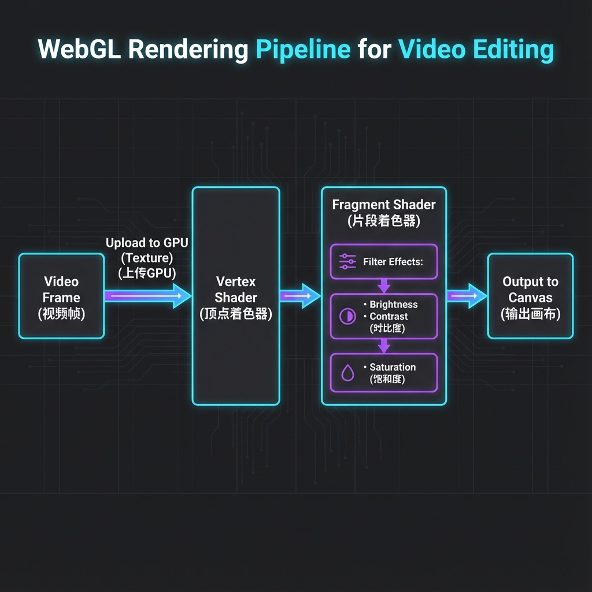

# 为什么必须用 WebGL？聊聊滤镜的实现

> BaseCut 技术博客第三篇。这篇讲渲染——为什么 Canvas 2D 扛不住，以及我是怎么用 WebGL 实现滤镜的。

## 整体流程

先看一张图，这是 WebGL 渲染视频的完整流程：



简单来说：视频帧上传到 GPU → 经过着色器处理（加滤镜）→ 输出到画布。

---

## 需求：实时预览滤镜效果

用户调亮度、对比度、饱和度的时候，需要实时看到效果。

听起来不难，但算一笔账就知道有多吓人：

```
1080p 分辨率：1920 × 1080 = 2,073,600 像素
每秒 30 帧：2,073,600 × 30 = 每秒 6200 万像素

每个像素要做：
  - 读取 RGB 值
  - 计算新的亮度/对比度/饱和度
  - 写回去
```

6200 万次计算，每秒钟。

---

## Canvas 2D：第一次尝试

最直观的方法是用 Canvas 2D：

```javascript
const ctx = canvas.getContext('2d')

// 把视频画到 canvas 上
ctx.drawImage(videoElement, 0, 0)

// 读取像素数据
const imageData = ctx.getImageData(0, 0, width, height)
const data = imageData.data

// 遍历每个像素
for (let i = 0; i < data.length; i += 4) {
  // 亮度调节：RGB 各加一个值
  data[i] = clamp(data[i] + brightness)       // R
  data[i + 1] = clamp(data[i + 1] + brightness) // G
  data[i + 2] = clamp(data[i + 2] + brightness) // B
  // data[i + 3] 是 Alpha，一般不动
}

// 写回去
ctx.putImageData(imageData, 0, 0)
```

代码很简单，但**实测性能很差**：

| 分辨率 | 帧率 | 体验 |
|--------|------|------|
| 480p | 25 fps | 勉强能用 |
| 720p | 12 fps | 卡 |
| 1080p | 5 fps | 幻灯片 |

**为什么这么慢？**

因为这个 for 循环是在 **CPU** 上跑的。CPU 只有几个核心，需要一个像素一个像素地算。200 万个像素，真的就要循环 200 万次。

---

## GPU 和 CPU：本质区别

先理解一下 CPU 和 GPU 的设计思路：

### CPU：少而精

```
CPU 架构：
├── 核心数量：4-16 个
├── 单核性能：极强
├── 擅长：复杂逻辑、分支判断、串行计算
└── 类比：博士生，学问渊博，但一次只能做一件事
```

### GPU：多而专

```
GPU 架构：
├── 核心数量：几千个
├── 单核性能：较弱
├── 擅长：简单运算、大规模并行
└── 类比：一万个小学生，每人只会算加减法，但可以同时算
```

### 滤镜操作为什么适合 GPU

```
滤镜特点：
1. 数据量大：200 万像素
2. 逻辑简单：每个像素做同样的数学运算
3. 互不依赖：像素 A 的结果不影响像素 B

这完美契合 GPU 的并行架构
```

---

## WebGL：在浏览器里调 GPU

WebGL 是浏览器提供的 GPU 编程接口，基于 OpenGL ES 2.0 标准。

### WebGL 的核心概念

**1. 着色器（Shader）**

着色器是运行在 GPU 上的小程序，用 GLSL（OpenGL Shading Language）编写。

有两种着色器：

- **顶点着色器（Vertex Shader）**：处理顶点位置
- **片段着色器（Fragment Shader）**：处理每个像素的颜色

对于视频滤镜来说：
- 顶点着色器很简单，只需要画一个全屏矩形
- 片段着色器是重点，滤镜逻辑写在这里

**2. 纹理（Texture）**

纹理就是 GPU 内存里的图片。我们把视频帧作为纹理上传，着色器可以从纹理中采样颜色。

**3. Uniform**

Uniform 是从 CPU 传给 GPU 的参数，比如亮度值、对比度值。

---

## 滤镜实现详解

### 顶点着色器

顶点着色器非常简单，只做两件事：
1. 把顶点位置传给管线
2. 把纹理坐标传给片段着色器

```glsl
attribute vec2 a_position;   // 顶点位置
attribute vec2 a_texCoord;   // 纹理坐标
varying vec2 v_texCoord;     // 传给片段着色器

void main() {
  gl_Position = vec4(a_position, 0.0, 1.0);
  v_texCoord = a_texCoord;
}
```

### 片段着色器

这是核心，每个像素都会执行一次：

```glsl
precision mediump float;

varying vec2 v_texCoord;        // 当前像素的纹理坐标
uniform sampler2D u_texture;    // 视频纹理

// 滤镜参数
uniform float u_brightness;     // 亮度 (-1 ~ 1)
uniform float u_contrast;       // 对比度 (0 ~ 2)
uniform float u_saturation;     // 饱和度 (0 ~ 2)

void main() {
  // 从纹理采样原始颜色
  vec4 color = texture2D(u_texture, v_texCoord);
  vec3 rgb = color.rgb;
  
  // 1. 亮度调节：直接加减
  rgb += u_brightness;
  
  // 2. 对比度调节：以 0.5 为中心拉伸
  rgb = (rgb - 0.5) * u_contrast + 0.5;
  
  // 3. 饱和度调节：和灰度混合
  float gray = dot(rgb, vec3(0.299, 0.587, 0.114));
  rgb = mix(vec3(gray), rgb, u_saturation);
  
  // 输出
  gl_FragColor = vec4(clamp(rgb, 0.0, 1.0), color.a);
}
```

### 各个滤镜的数学原理

**亮度（Brightness）**

```
新颜色 = 原颜色 + 亮度值

brightness = 0.1 时，所有颜色变亮 10%
brightness = -0.1 时，所有颜色变暗 10%
```

**对比度（Contrast）**

```
新颜色 = (原颜色 - 0.5) × 对比度 + 0.5

原理：以中间灰（0.5）为基准
对比度 > 1：亮的更亮，暗的更暗
对比度 < 1：颜色趋向中间灰
对比度 = 0：全灰
```

**饱和度（Saturation）**

```
灰度 = 0.299×R + 0.587×G + 0.114×B  // 人眼加权平均
新颜色 = mix(灰度, 原颜色, 饱和度)

原理：
饱和度 = 0：完全灰度（黑白照片）
饱和度 = 1：原色
饱和度 > 1：更鲜艳
```

人眼对绿色最敏感，所以绿色权重最高（0.587）。

---

## 16ms 帧预算

要达到 60fps，每帧只有 16.67ms 时间。

```
一帧的时间预算分配：

├── 获取视频帧：     1-2 ms
├── 上传纹理到 GPU： 1-2 ms
├── 执行着色器：     2-5 ms（GPU 并行计算）
├── 渲染贴纸/字幕：  2-3 ms
├── 其他开销：       2-3 ms
└── 缓冲：          3-5 ms
```

用 WebGL，可以轻松控制在 10ms 以内。

---

## 踩过的坑

### 坑 1：纹理重复创建

一开始我每帧都创建新纹理：

```javascript
// 错误写法
function render() {
  const texture = gl.createTexture()  // 每帧都创建
  gl.bindTexture(gl.TEXTURE_2D, texture)
  gl.texImage2D(..., videoElement)
  // ...
}
```

这样 GPU 内存会不断增长，最后崩溃。

**正确做法：复用纹理对象，只更新内容。**

```javascript
// 正确写法
init() {
  this.texture = gl.createTexture()  // 只创建一次
}

render() {
  gl.bindTexture(gl.TEXTURE_2D, this.texture)
  gl.texImage2D(..., videoElement)  // 只更新内容
}
```

### 坑 2：WebGL 上下文丢失

浏览器在某些情况下会回收 WebGL 上下文（比如 GPU 资源紧张）。这时候渲染会失败。

需要监听 `webglcontextlost` 和 `webglcontextrestored` 事件：

```javascript
canvas.addEventListener('webglcontextlost', (e) => {
  e.preventDefault()
  console.log('WebGL context lost')
})

canvas.addEventListener('webglcontextrestored', () => {
  console.log('WebGL context restored')
  initWebGL()  // 重新初始化
})
```

---

## 性能对比

| 方案 | 1080p 帧率 | 备注 |
|------|------------|------|
| Canvas 2D | 5 fps | 完全不可用 |
| WebGL | 60 fps | 丝滑 |

提升了 **12 倍**。

---

## 下一篇

讲转场动画——两个画面之间的淡入淡出、滑动是怎么做的。

---

**系列目录**

1. [x] 技术选型与项目结构
2. [x] 时间轴数据模型
3. [x] WebGL 渲染与滤镜（本文）
4. [ ] 转场动画实现
5. [ ] WebCodecs 视频导出
6. [ ] LeaferJS 贴纸系统
