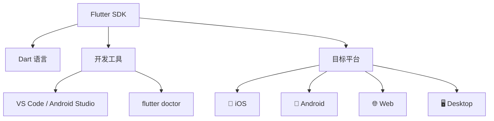

# 00. 启程：环境准备与 Dart 速成

在深入原理之前，需先确保“能跑起来”。
本篇是系列的**起点**，通过“极速通关”方式辅助环境搭建和语言预热。

## 1. 环境搭建 (最佳实践)



建议避免直接安装 Flutter SDK！易遭遇版本冲突问题。
**推荐使用 FVM (Flutter Version Management)**。

### 安装 FVM
```bash
brew tap leoafarias/fvm
brew install fvm
```

### 初始化项目
```bash
fvm install 3.29.0  # 安装指定版本
fvm global 3.29.0   # 设置全局版本
fvm flutter create my_app # 创建项目
```

## 2. Hello World 结构解析

打开 `lib/main.dart`，会看到：

```dart
void main() {
  runApp(const MyApp()); // 1. 入口：启动 Flutter 引擎
}

class MyApp extends StatelessWidget { // 2. 根组件
  const MyApp({super.key});

  @override
  Widget build(BuildContext context) {
    return MaterialApp( // 3. App 壳子：提供路由、主题
      home: Scaffold( // 4. 页面脚手架：提供 AppBar, Body
        body: Center(child: Text('Hello World')),
      ),
    );
  }
}
```

## 3. Dart 语言速成 (Dart Cheatsheet)

Flutter 是 UI 框架，Dart 是语言。不懂 Dart 就像不懂砖头去盖房。

### (1) 变量与空安全 (Null Safety)
Dart 默认变量**不为空**。

```dart
String name = "Lucas";
// String heavy; // 报错！必须初始化
String? maybeNull; // 加 ? 表示允许为空
late String lazy; // 加 late 表示稍后初始化（需人工保证非空）
```

### (2) 函数是一等公民
```dart
// 箭头函数
int add(int a, int b) => a + b;

// 命名参数 (推荐)
void configure({required int width, int height = 100}) {}
configure(width: 200); // 清晰易读
```

### (3) 类与构造函数
```dart
class User {
  final String name; // final 表示赋值后不可变
  final int age;

  // 语法糖：直接赋值给成员变量
  const User({required this.name, this.age = 18}); 
}
```

### (4) 异步 (Async/Await)
```dart
Future<String> fetchUser() async {
  await Future.delayed(Duration(seconds: 1)); // 模拟耗时
  return "Lucas";
}
```

### (5) 级联操作符 (..)
```dart
var paint = Paint()
  ..color = Colors.black
  ..strokeWidth = 5.0; // 链式调用，不用重复写 paint.xxx
```

### (6) Dart 3+ 现代特性 (Modern Dart)

Dart 3 带来了语言层面的巨大革新：

*   **Records (记录类型)**: 允许函数返回多个值，无需定义临时类。
    ```dart
    (String, int) getUser() {
      return ('Lucas', 18);
    }
    var (name, age) = getUser(); // 解构
    ```

*   **Pattern Matching (模式匹配)**: 极大地简化了 switch 和 JSON 解析。
    ```dart
    var json = {'type': 'text', 'content': 'Hello'};
    switch (json) {
      case {'type': 'text', 'content': String c}: // 匹配结构并提取变量
        print('Text: $c');
      case {'type': 'image'}:
        print('Image');
    }
    ```

*   **Class Modifiers (类修饰符)**: 
    *   `sealed class`: 密封类，强制 switch 检查所有子类（配合 Bloc 状态管理的神器）。
    *   `interface class`: 强制实现接口，禁止继承。
    *   `final class`: 禁止在此库之外继承。

准备好砖头（Dart）和工具（FVM）后，即刻开始搭建 Flutter 的大厦。
下一篇，将直击 Flutter 的核心灵魂：**架构**.
