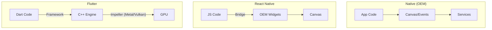

# 01. 拨开云雾：Flutter 架构与渲染三棵树

Flutter 之所以能实现媲美原生的性能，并非依靠魔法，而是源于其独特的架构设计与渲染机制。本篇将深入剖析 Flutter 的底层架构，并重点阐述支撑其运作的核心机制——“三棵树”。

## 架构概览：不仅是 UI 框架

Flutter 与传统的原生开发（iOS/Android）或跨平台方案（React Native）有着本质区别。它不仅仅是一个 UI 库，更是一个自带渲染引擎的完整 GUI 系统。

### 跨平台方案的演进

理解 Flutter 的位置，需要先审视跨平台技术的发展：

1.  **WebView 时代 (Cordova/Ionic)**: 利用系统 WebView 渲染 HTML/CSS。
    *   *特点*: 开发快，但性能受限于 Bridge 通信与 DOM 渲染，体验与原生有差距。
2.  **桥接时代 (React Native)**: 使用原生控件，通过 JavaScript Bridge 进行逻辑控制。
    *   *特点*: 性能优于 WebView，但 JS 与 Native 频繁通信（Bridge）成为瓶颈，且依赖 OEM 控件，导致各平台表现不一致。
3.  **自绘引擎时代 (Flutter)**: 抛弃系统控件，自带 **Impeller** (或老旧的 Skia) 引擎，直接在 GPU 画布上绘制。
    *   *特点*: 避免了 Bridge 通信成本，且 UI 在所有平台高度一致。Impeller 已彻底解决 iOS/Android 的掉帧问题。



### Flutter 架构由下至上

Flutter 的架构可以简化为三层：

1.  **Embedder (平台嵌入层)**:
    *   由平台原生语言（Java/Kotlin, ObjC/Swift, C++）编写。
    *   完全支持 **WasmGC** (WebAssembly Garbage Collection)，使 Flutter Web 性能接近原生。
2.  **Engine (C++ 引擎层)**:

    *   Flutter 的核心。
    *   **Impeller**: 默认渲染后端。预编译 Shader，彻底消除了 Skia 时代的 "Jank"。
    *   包含了 Dart 虚拟机 (Dart VM)、文本排版等。
3.  **Framework (Dart 框架层)**:

    *   开发者日常接触的一层。
    *   包含了 Material/Cupertino 组件库、渲染对象树 (Rendering)、元素树 (Element) 和 组件树 (Widget)。

## 核心机制：三棵树 (The Three Trees)

在 Flutter 开发中，经常听到“Widget 是不可变的配置”。如果 Widget 每次都销毁重建，性能从未何而来？答案在于 Widget 背后默默工作的另外两棵树：**Element Tree** 和 **RenderObject Tree**。

这三棵树各司其职，共同完成了从**配置**到**实例化**再到**渲染**的全过程。

### 1. Widget Tree (配置层)

*   **职责**: 描述 UI 长什么样（Configuration）。
*   **特性**: **Immutable (不可变)**，轻量级。
*   **生命周期**: 非常短暂。每次 `build` 都会创建新的 Widget 实例，但这几乎不消耗性能，因为它们只是简单的 Dart 对象。

### 2. Element Tree (管家层)

*   **职责**: 维护 UI 的结构与状态（Lifecycle & State）。
*   **特性**: **Mutable (可变)**，重量级。
*   **关系**: 一一对应 Widget。Element 是 Widget 在树中的实例化对象。
*   **作用**: 当 Widget 树发生变化时，Element 树会根据 diff 算法判断是复用、更新还是销毁对应的 RenderObject，从而避免昂贵的渲染对象重建。

### 3. RenderObject Tree (渲染层)

*   **职责**: 负责布局与绘制（Layout & Paint）。
*   **特性**: **Mutable (可变)**，极其重量级。
*   **关系**: 不一定一一对应 Element（某些 ComponentElement 如 Container 不直接对应 RenderObject）。
*   **作用**: 处理尺寸计算、坐标变换、绘制指令生成等繁重工作。

### 三棵树的协作流程

为了理解它们如何协作，请看以下伪代码与流程图：

```dart
// 伪代码演示三者关系

// 1. Widget: 只是配置文件
class MyTextWidget extends Widget {
  final String text;
  MyTextWidget(this.text);

  @override
  Element createElement() => MyTextElement(this);
}

// 2. Element: 持有 State，协调更新
class MyTextElement extends Element {
  MyTextWidget widget;
  RenderParagraph renderObject;

  void update(MyTextWidget newWidget) {
    // 比较新旧配置
    if (widget.text != newWidget.text) {
      widget = newWidget;
      // 只更新 RenderObject 的属性，不销毁重建
      renderObject.text = newWidget.text; 
    }
  }
}

// 3. RenderObject: 干苦力，负责画画
class RenderParagraph extends RenderBox {
  String text;
  void paint(PaintingContext context, Offset offset) {
    // 调用 Canvas 绘制文字
    context.canvas.drawText(text, offset);
  }
}
```

**更新流程示例：**

1.  开发者调用 `setState`。
2.  **Widget Tree**: 重新运行 `build`，生成全新的 Widget 树（例如 Text 内容从 "Hello" 变为 "Hi"）。
3.  **Element Tree**: 发现新旧 Widget 类型（runtimeType）和 Key 相同。
    *   判定为 **Update** 操作，而非 Destroy + Create。
    *   Element 指向新的 Widget 实例。
4.  **RenderObject Tree**: Element 将新 Widget 的配置（"Hi"）同步给现有的 RenderObject。
    *   RenderObject 标记为 `needsPaint`。
    *   下一帧渲染时，仅重绘文字，无需重新布局或创建对象。

```mermaid
graph LR
    subgraph "Phase 1: Initial Build"
        W1[Widget: Text('A')] -->|create| E1[Element]
        E1 -->|create| R1[RenderObject]
    end

    subgraph "Phase 2: Rebuild (Text changes to 'B')"
        W2[Widget: Text('B')] 
        W2 -.->|canUpdate? Yes| E1
        E1 -->|update text| R1
    end
    
    style E1 fill:#f9f,stroke:#333,stroke-width:2px
    style R1 fill:#ccf,stroke:#333,stroke-width:2px
    style W1 stroke-dasharray: 5 5
    style W2 stroke-dasharray: 5 5
```

> **注意**: Widget 轻量且廉价，RenderObject 昂贵且沉重。Flutter 性能优化的核心原则，就是**尽可能复用 Element 和 RenderObject**，通过不断新建低成本的 Widget 来更新视图。

## 总结

-   **Flutter 架构**: 基于 Embedder, Engine, Framework 分层，使用 Skia/Impeller 直接渲染，超越了传统的 WebView 和 Bridge 方案。
-   **三棵树机制**:
    -   **Widget**: 蓝图，不可变，随用随丢。
    -   **Element**: 骨架，维持结构，负责协调。
    -   **RenderObject**: 实体，负责干活（测量、绘制）。
-   **性能秘诀**: Widget 的频繁重建并不可怕，Element 层巧妙的 Diff 机制确保了底层的 RenderObject 得到最大程度的复用。

### 核心机制补遗：Keys (钥匙)

在 Element 复用逻辑 `canUpdate` 中，**Key** 起着决定性作用。

1.  **LocalKey (局部键)**: `ValueKey`, `ObjectKey`, `UniqueKey`。
    *   *作用*: 在平级组件列表（如 Column 的 children）中，**唯一标识**某个 Widget。
    *   *场景*: 当你对一个列表进行拖拽排序时，如果没有 Key，Flutter 可能只是互换了数据（Text 内容），而没有互换 State（CheckBox 的选中状态），导致 bug。
2.  **GlobalKey (全局键)**:
    *   *作用*: 在**整个 App** 中唯一标识 Element。
    *   *能力*: 允许跨 Widget 访问 State (即 `globalKey.currentState`)。
    *   *代价*: 极其昂贵（需要全树扫描），慎用。

## 进阶视角 (Advanced Insight)


### 1. 第四棵树：Layer Tree

其实在 RenderObject 树之后，还有一棵 **Layer Tree**。
RenderObject 的 `paint` 方法并不直接绘制像素，而是记录绘制指令形成 `Layer`。
-   **Widget/Element/RenderObject**: 运行在 Dart UI 线程。
-   **Layer Tree**: 是 Dart 线程交给 GPU 线程的最终产物（Scene）。

这解释了为什么 Opacity 或 ClipPath 昂贵：它们会改变 Layer Tree 的结构，导致 GPU 需要额外的 Framebuffer 来进行混合。

### 2. Element 的生命周期

Element 才是幕后的大 Boss，它有着严谨的生命周期状态机：
1.  **Initial**: 刚被 Widget 创建。
2.  **Mount**: 被挂载到树上（调用 `mount`）。这是它去创建 RenderObject 的时刻。
3.  **Active**: 正常存活，可以响应 Frame 刷新。
4.  **Inactive**: 这一帧不需要它了（比如被移出了屏幕），但它还没死，可能被 GlobalKey 复用（KeepAlive 机制）。
5.  **Defunct**: 彻底销毁（调用 `unmount`）。


下一篇，将深入探讨 RenderObject 如何进行布局与约束传递。
