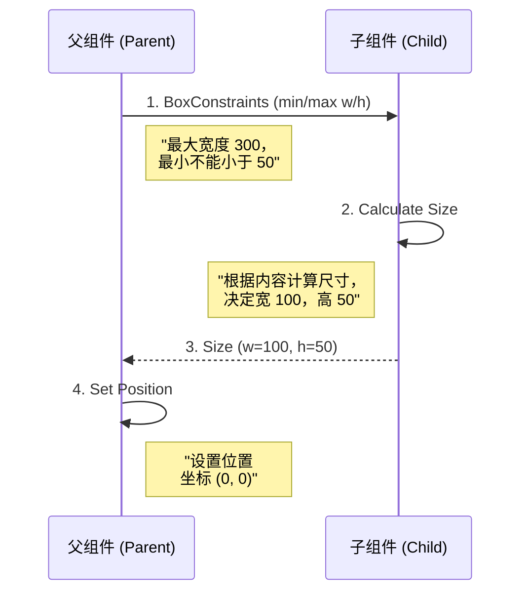

# 02. 驯服布局：约束与尺寸的博弈

常见困扰如：“为何组件宽/高设了却不生效？”或“为何发生溢出 (Overflow) ？”。

这一切的根源，在于对 Flutter 布局协议的误解。本篇将通过一个核心法则，解析 Flutter 的布局原理。

## 核心法则：布局三部曲

Flutter 的布局系统（Box Model）可以用一句话概括：

> **Constraints go down. Sizes go up. Parent sets position.**
>
> **约束向上传递。尺寸向上传递。父级决定位置。**

这意味着：
1.  **父级** 向 **子级** 传递 **约束 (Constraints)**（指示子级尺寸范围）。
2.  **子级** 根据约束，结合自身内容，计算出自己的 **尺寸 (Size)**，并汇报给 **父级**。
3.  **父级** 拿到子级的尺寸后，决定子级摆放在 **什么位置 (Position)**（例如居中、左上角）。



## 深入理解 BoxConstraints

BoxConstraints 只有四个属性：
-   `minWidth`
-   `maxWidth`
-   `minHeight`
-   `maxHeight`

所有布局问题，本质上都是数学问题。子组件必须满足：
`minWidth <= childWidth <= maxWidth`
`minHeight <= childHeight <= maxHeight`

### 1. 紧约束 (Tight) vs 松约束 (Loose)

-   **Tight (紧约束)**:
    -   `minWidth == maxWidth` 且 `minHeight == maxHeight`。
    -   父级强制指定确切尺寸。
    -   示例：`SizedBox(width: 100, height: 100)` 就会产生种种 Tight 约束。
    
-   **Loose (松约束)**:
    -   `minWidth == 0` 且 `minHeight == 0`。
    -   父级允许子级在指定范围内自由决定。
    -   示例：`Center` 组件通常会给子组件传递 Loose 约束。

### 2. 无界 (Unbounded)

-   `maxWidth == double.infinity` 或 `maxHeight == double.infinity`。
-   这通常发生在滚动视图（如 `ListView`、`Column` 的纵轴）中。
-   **禁忌**: 千万不要在一个 Unbounded 的容器里放一个试图撑满无限空间的组件（如 `Expanded`），这会导致 `Layout Error`。

## 典型案例解析

### 为什么 `Container(width: 100)` 不生效？

```dart
// 场景 1：屏幕直接包裹 Container
void main() {
  runApp(
    Container(width: 100, height: 100, color: Colors.red)
  );
}
```

**现象**: 红色填充全屏，而非 100x100。
**原因**:
1.  `runApp` 的根节点（屏幕）给它的子级传递了 **Tight** 约束（屏幕尺寸）。
2.  `Constraints(minW=ScreenW, maxW=ScreenW, ...)` 传给了 `Container`。
3.  `Container` 目标尺寸 100，但受限于约束条件（minW=ScreenW），被迫调整为屏幕大小。

**修正**:

```dart
// 场景 2：中间加个 Center
void main() {
  runApp(
    Center(
      child: Container(width: 100, height: 100, color: Colors.red),
    )
  );
}
```

**解析**:
1.  屏幕向 `Center` 传递 **Tight** 约束（屏幕大小）。 `Center` 填充全屏。
2.  `Center` 向子级（`Container`）传递 **Loose** 约束：`Constraints(minW=0, maxW=ScreenW, ...)`。
3.  `Container` 收到松约束，发现 `100` 在 `0` 到 `ScreenW` 之间，合法。
4.  `Container` 决定自己尺寸为 100x100。
5.  `Center` 拿到 100x100，把它摆在屏幕中间。

## 常见布局组件的性格分析

| 组件 | 性格 (约束行为) | 行为描述 |
| :--- | :--- | :--- |
| **ConstrainedBox** | **控制狂** | 强制子级遵循特定约束。 |
| **UnconstrainedBox** | **自由主义者** | 允许子级突破父级约束（需注意溢出风险）。 |
| **Center / Align** | **和事佬** | 消耗 Tight 约束，向子级传递 Loose 约束。 |
| **Column / Row** | **甚至有点放纵** | 主轴方向允许无限尺寸。 |
| **ListView** | **无限空间** | 提供无限滚动空间。 |

## 伪代码：RenderObject 的布局逻辑

在底层，所有 RenderObject 都要实现 `performLayout` 方法：

```dart
class RenderMyBox extends RenderBox {
  @override
  void performLayout() {
    // 1. 获取父级传来的约束
    BoxConstraints constraints = this.constraints;
    
    // 2. 决定自己的大小 (必须遵守约束)
    if (constraints.hasBoundedWidth) {
      size = Size(constraints.maxWidth, 50.0);
    } else {
      size = Size(100.0, 50.0);
    }
    
    // 3. 如果有子节点，对子节点进行 layout
    // child.layout(childConstraints, parentUsesSize: true);
  }
}
```

## 总结

-   **核心口诀**: 约束向下 (Parent -> Child)，尺寸向上 (Child -> Parent)，位置由父定。
-   **调试技巧**: 遇到布局问题，先问自己：**“父级给它的约束到底是什么？”** 使用 Flutter Inspector 查看 Render Tree 的约束信息最有帮助。
-   **Tight vs Loose**: 理解这两种约束状态，就能看懂 90% 的布局行为。

## 进阶视角 (Advanced Insight)

### 1. O(N) 的线性布局性能

为什么 Flutter 性能优异？
其他框架（如 Android 原生 View）经常需要 Measure 两次（父子组件间多次协商）。
Flutter 强制 **Single Pass Layout (单次遍历)**：
-   Constraint 只能向下传一次。
-   Size 只能向上传一次。
-   一旦子级算好 Size，父级无法要求重新计算。

这保证了布局的复杂度永远是 **O(N)**，而不是指数级爆炸。这也是为什么 Flutter 布局层级做深了也不卡的关键。

### 2. 打破常规：CustomMultiChildLayout

当常规布局无法满足需求时（比如：我想让 A 组件位于 B 组件的 1/3 高度处，且宽度是 B 的一半），不要去手写坐标计算。

使用 `CustomMultiChildLayout`:
-   它允许你获得所有子组件的 ID。
-   你可以手动控制每个子组件的 constraints。
-   你可以拿到每个子组件算好的 size，再决定它们的位置。

这是实现复杂自定义 UI 的终极武器。


下一篇，我们将进入这一层抽象之下的世界：**渲染管线与帧生成**。
