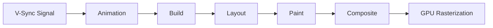
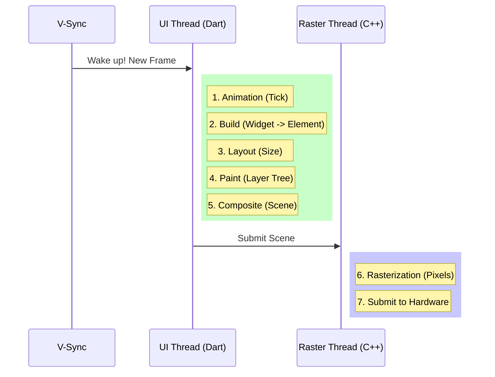

# 03. 像素的旅程：渲染管线与帧生成

前文解析了布局（Layout）是如何计算尺寸的。但计算出尺寸只是第一步，Flutter 如何将这些矩形转化为屏幕上每秒 60 次（或 120 次）闪烁的像素？

这就涉及到了 Flutter 高性能的秘密武器：**渲染管线 (Rendering Pipeline)**。

## 有节奏的心跳：V-Sync

一切始于 **V-Sync (垂直同步信号)**。
当屏幕准备好显示下一帧时，会向系统发送一个 V-Sync 信号。Flutter Engine 监听这个信号，一旦收到，就会触发新一帧的渲染流程。

如果在一帧的时间内（16.6ms @ 60Hz）没跑完整个管线，会导致视觉卡顿 (Jank)。

## 渲染管线五步走

Flutter 的 Dart 这一侧（Framework）的渲染流水线主要包含五个阶段：

### 1. Animation (动画)
-   **任务**:  ticking (滴答)。
-   **行为**: `AnimationController` 会根据当前时间戳，计算出动画当前的 value（比如 0.5）。
-   **结果**: 如果动画值变了，会标记相关的 Widget 为 dirty，需要 rebuild。

### 2. Build (构建阶段)
-   **任务**: 构建 Widget 树。
-   **行为**: `Widget.build()` 被调用。重新创建 Widget 树，Element 树进行 diff 更新。
-   **结果**: 确定了 UI 的结构，Element 树同步更新了 RenderObject 的属性。

### 3. Layout (布局阶段)
-   **任务**: 计算几何信息。
-   **行为**: 即前文所述 "Constraints go down, Sizes go up"。RenderObject 算出自己的具体大小和位置。
-   **结果**: 每个节点都有了确定的几何信息 (Size & Offset)。

### 4. Paint (绘制阶段)
-   **任务**: 生成绘制指令。
-   **行为**: 这一步并没有真正画出像素！RenderObject 只是生成了一堆 **绘制指令 (Draw Commands)**，比如 `drawRect`, `drawText`。
-   **结果**: 生成了一个 **Layer Tree (图层树)**。这里的 Paint 更像是“录制”，而不是“播放”。

### 5. Composite (合成阶段)
-   **任务**: 图层叠加。
-   **行为**: 将 Paint 阶段生成的各个 Layer（比如 TransformLayer, ClipLayer）按照层级顺序打包。
-   **结果**: 生成一个 **Scene** 对象，通过 `window.render(scene)` 发送给 C++ Engine。

> **重点**: 在 `RepaintBoundary` 包裹下的子树，会拥有独立的 Layer。当这部分子树重绘时，不需要重绘整个界面，只需要更新这个 Layer 即可。这就是为什么列表优化常推荐 `RepaintBoundary`。

## 幕后英雄：Rasterization (光栅化)

当 Dart 完成了 Composite，把 `Scene` 丢给 Engine 后，Dart 线程的任务就结束了。接下来的工作交给 **GPU Runner (Raster Thread)**。

### Skia / Impeller 的工作
Engine 接收 Scene (绘制指令集)，开始执行 **光栅化**：
-   将矢量指令（“绘制圆形指令”）翻译成屏幕上的像素点数据。
-   与 GPU 通信，利用 OpenGL/Vulkan/Metal 将像素填充到 Framebuffer 中。
-   最终显示在屏幕上。

**Impeller (新一代引擎)** 的改进主要就在这里：它预编译了着色器 (Shader)，避免了 Skia 在运行时编译 Shader 导致的“首帧卡顿 (Jank)”。

## 流程图解析：一帧的诞生

## 性能优化启示

基于管线原理的优化方向：

1.  **减少 Build**: 将 `setState` 范围最小化，避免整棵树重建。
2.  **避免布局抖动**: 不要在 `Layout` 阶段触发 `Build`（除特殊情况）。
3.  **合理使用 RepaintBoundary**: 将频繁变化的区域（如倒计时、Loading 动画）与静态背景隔开，利用 Layer 合成机制，避免全屏重绘。

## 总结

-   **非直接绘制**: Flutter 的 Paint 阶段主要是在“录制指令”，生成 Layer Tree。
-   **双线程模型**: UI 线程负责逻辑和指令生成，Raster 线程负责像素填充。两者流水线并行工作。
-   **合成的力量**: Composite 阶段将 Layer 组合，是 Flutter 处理复杂层级还能保持流畅的关键。

## 进阶视角 (Advanced Insight)

### 1. Raster Cache (光栅化缓存)

Composite 阶段虽然快，但 Rasterization（像素填充）依然是 GPU 的重活。
Flutter 引擎有一个智能的 **Raster Cache** 机制：
-   引擎会检测这张图片或这块 UI 是否在几帧内都没有变化但经常被绘制（比如滚动列表中的图片）。
-   如果符合条件，它会把这块 UI 渲染后的**位图 (Bitmap)** 缓存起来。
-   下一帧直接把位图贴上去，跳过光栅化计算。

### 2. Shader Warmup (着色器预热) 的消亡

在旧的 Skia 时代，Shader 编译导致卡顿曾是主要瓶颈。
但在 **Impeller 时代**，这个问题已成为历史。

Impeller 的核心设计就是：**AOT (Ahead of Time) Shader Compilation**。
-   所有的 Shader 在 App 编译阶段就已经编译成了 Metal Lib (iOS) 或 SPIR-V (Android)。
-   运行时不再通过 Driver 编译 Shader。
-   因此，**Shader Warmup 已不再需要**。若仍保留集成测试抓取 Shader，则表明技术栈需更新。

下一篇，我们将探讨在这个静态的渲染结构中，**数据是如何流动**的——即状态管理。
