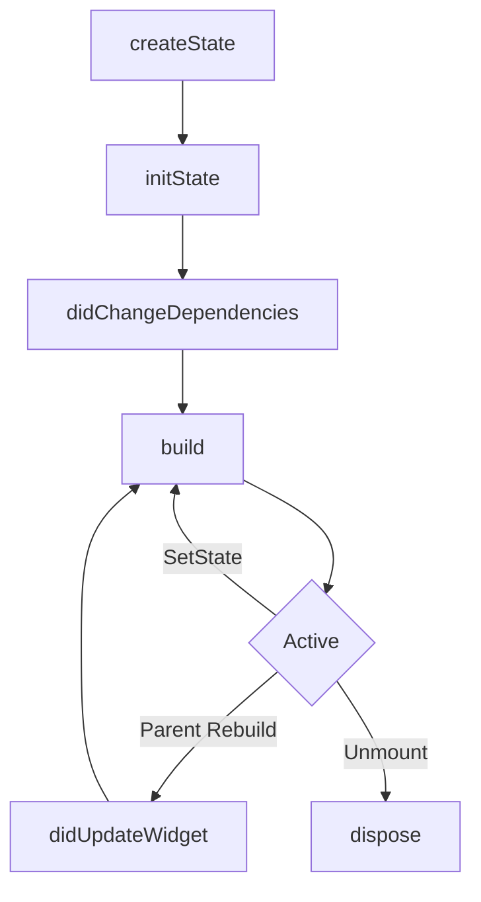

# 04. 数据的流动：状态管理本质

在大概了解了视图（View）如何渲染后，我们需要解决“数据（Model）如何驱动视图更新”的问题。

Flutter 提倡 **Declarative UI (声明式 UI)**，其核心公式为：

> **UI = f(State)**
>
> **界面是状态的函数。**

这意味着不应直接修改 DOM 或 View 属性（比如 `button.setText("Hi")`），仅需改变 `State`，框架将自动重绘。

## 状态的分类

在工程实践中，状态通常被分为两类：

1.  **Ephemeral State (短时状态)**
    *   **定义**: 仅在一个 Widget 内部使用，不需要分享给其他部分。
    *   **例子**: `PageView` 的当前页码、`TextField` 的输入内容、动画的当前进度。
    *   **方案**: 直接用 `StatefulWidget` 的 `setState` 即可。

2.  **App State (应用状态)**
    *   **定义**: 需要在应用的不同部分共享，或者需要跨越组件树传递。
    *   **例子**: 用户登录信息、购物车列表、App 主题配置。
    *   **方案**: Provider, Riverpod, Bloc, Redux 等。

## `setState` 到底做了什么？

避免滥用 `setState`，其背后的机制为：

`setState` 的源码（简化版）逻辑非常简单：

```dart
// State 类内部
void setState(VoidCallback fn) {
  fn(); // 1. 执行闭包，修改内部变量
  _element.markNeedsBuild(); // 2. 标记对应的 Element 为 dirty
}
```

此操作并不会立即触发 rebuild，而是标记 Element 为 dirty。等待下一帧 V-Sync 信号到来时，Engine 会遍历所有 dirty elements 并调用它们的 `build` 方法。

**误区警示**:
-   不要在 `build` 方法里调用 `setState`（会导致死循环）。
-   不要在 `setState` 里做耗时操作（HTTP 请求）。虽然 `setState` 本身是同步的，但触发的 build 也是在 UI 线程，耗时会导致卡顿。

## State 的生命周期 (Lifecycle)

理解 `State` 的存活时间轴是正确使用 API 的前提。



### 关键钩子
1.  **`initState()`**: 仅调用一次。适合初始化变量、订阅 Stream、尤其是初始化 `AnimationController`。
2.  **`didChangeDependencies()`**: 当依赖的 `InheritedWidget` 发生变化时调用。
3.  **`didUpdateWidget(oldWidget)`**: 当父组件重建导致当前 Widget 更新配置时调用。**此为响应外部参数变动的最佳时机**（比如父组件传来的 `userId` 变了，需在此处重置数据）。
4.  **`dispose()`**: 永久销毁。**必须**在这里释放 Controller、StreamSubscription，否则内存泄漏。

## 跨组件传递：InheritedWidget 的魔法

当组件层级很深时，如何实现数据透传？层层构造函数传递 (Prop Drilling) 维护成本极高。

Flutter 内置的终极解决方案是 **`InheritedWidget`**。所有第三方状态管理库（Provider, Bloc 等）本质上都是对它的封装。

### O(1) 的查找能力

`InheritedWidget` 允许子孙组件通过 `context.dependOnInheritedWidgetOfExactType<T>()` 直接获取它，而不需要层层传递。

为什么这么快？
因为每个 `Element` 都在内部维护了一个 `Map<Type, InheritedElement>`。查找 `InheritedWidget` 的时间复杂度是 **O(1)**，与树的深度无关！

### 依赖与更新机制

当 `InheritedWidget` 发生变化（Rebuild）时，它会自动通知所有**注册了依赖**的子孙组件进行 rebuild。

```mermaid
graph TD
    Root[App Root] --> Inherited[InheritedWidget (Color: Red)]
    Inherited --> Parent[Middle Widget]
    Parent --> Child1[Child A (Uses Color)]
    Parent --> Child2[Child B (No Dependency)]

    style Inherited fill:#f9f
    style Child1 fill:#ccf
```

**更新流程**:
1.  `InheritedWidget` 数据变了（Red -> Blue）。
2.  Flutter 查找谁依赖了它（Child A）。
3.  标记 `InheritedWidget` **和** `Child A` 为 dirty。
4.  `Middle Widget` 和 `Child B` **不会** 被 rebuild（如果它们本身没有依赖该数据）。

这就是为什么 Provider 等库能实现**局部刷新**的底层原理。

## 为什么需要 Provider/Riverpod/Bloc？

为何在拥有原生 `InheritedWidget` 的前提下仍需第三方库？
因原生实现较为繁琐：
1.  样板代码多。
2.  无法分离逻辑 (Business Logic) 和视图 (UI)。
3.  很难处理复杂的依赖注入 (DI)。

第三方库封装了底层细节，核心依然是：**Element Tree 的上下文查找与标记机制**。

## 总结

-   **UI = f(State)**: 改变状态，而不是改变组件。
-   **setState**: 仅仅是标记 dirty，等待下一帧绘制。
-   **InheritedWidget**: 实现了高效的、跨层级的数据共享，是 Flutter 状态管理的基石。
-   **局部刷新**: 依赖 `InheritedWidget` 更新链，只刷新真正用到数据的叶子节点。

### 宏编程与状态 (Macros)
随着 Dart Macros (Dart 3.x) 的成熟，像 `freezed` 和 `equatable` 这样依赖 build_runner 的库正在被原生的 `@Data()` 宏取代，不仅编译速度飞快，而且样板代码几乎为零。


## 进阶视角 (Advanced Insight)

### 1. 数据的反向流动：Notification

数据通常向下传递 (Data/Constraints go down)。子组件通过 **Notification** 机制（冒泡）向上通知父级。

-   **Scrollable** 组件在滚动时，会不断 dispatch `ScrollNotification`。
-   这些 Notification 会沿着 Element Tree **向上冒泡**。
-   父级可以通过 `NotificationListener` 监听到这些事件。
因此监听 ListView 滚动需包裹 Listener。

### 2. 脏链传播：markNeedsBuild vs markNeedsLayout

-   `setState` -> `markNeedsBuild`: 标记自己是 dirty 的，下一帧重跑 `build()`。
-   更新 RenderObject 属性 -> `markNeedsLayout`: 标记自己布局这一块脏了，下一帧重跑 `performLayout`。
-   **Relayout Boundary**:
    如果一个节点被标记 `markNeedsLayout`，引擎会检查它是否是 RelayoutBoundary。
    -   如果是：布局计算止步于此，不影响父级。
    -   如果否：继续把父级也标记为 `needsLayout`，一直往上找，直到遇到 RelayoutBoundary 或 Root。
    因此建议在复杂的 Leaf 组件上设置明确的大小，阻断递归布局。


下一篇，我们将解决 Dart 单线程模型下的并发问题：**异步机制与事件循环**。
