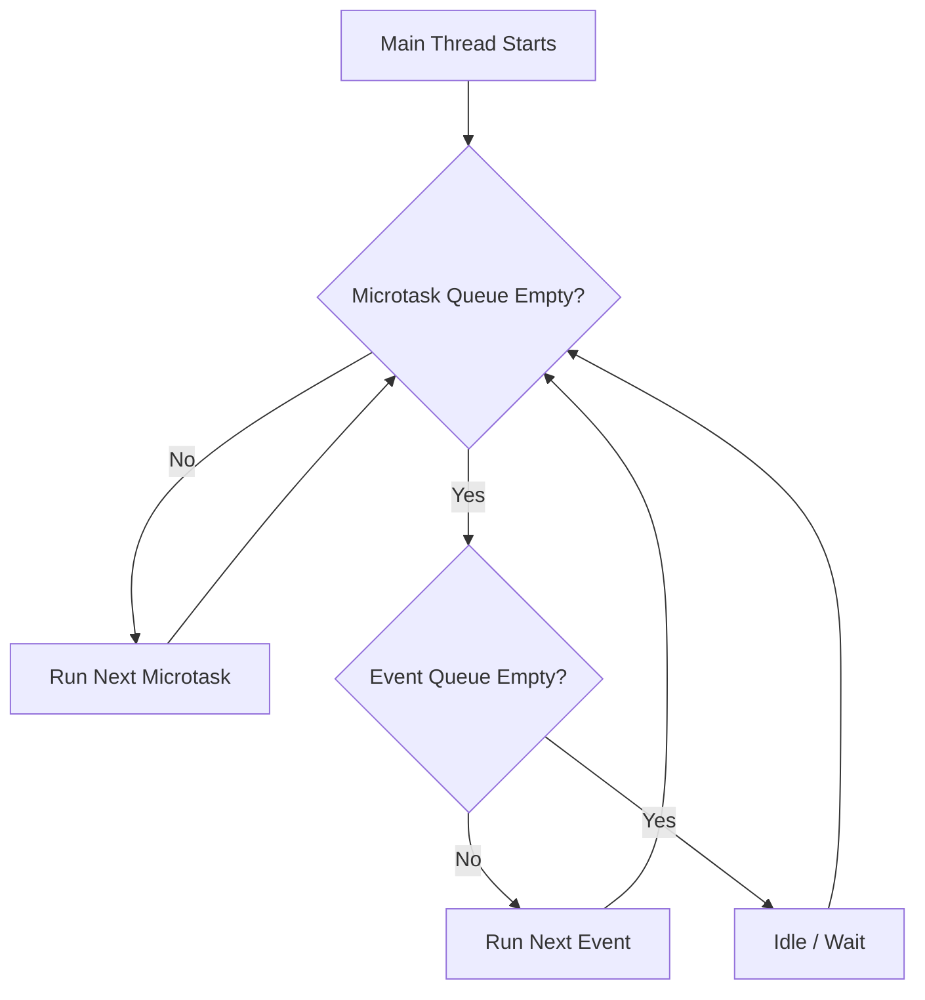

# 05. 驯服单线程：异步机制与事件循环

“Flutter 不是单线程的吗？如果不允许多线程，网络请求为什么不会卡死 UI？”

此为常见困惑。本篇将揭开 Dart 单线程模型下“并发”的真相。

## 核心前提：Dart 是单线程的

首先确认事实：**Dart 代码默认跑在单线程（UI 线程）中**。
即同一时刻仅执行具体的某一行代码。

网络请求未阻塞 UI 的原因？
等待过程不消耗 CPU。发起 HTTP 请求时，Dart 只是把任务交给了系统底层的 IO 线程（非 Dart 线程），Dart 线程随即处理其他任务。等系统层拿到了数据，再通知 Dart 线程进行处理。

## 调度的大脑：Event Loop (事件循环)

Dart 线程永不休息，它依靠一个死循环不断地从队列里取任务执行。这个机制叫做 **Event Loop**。

Dart 有两个队列，优先级从高到低：

1.  **Microtask Queue (微任务队列)**: 极其紧急。
    *   例如：`scheduleMicrotask`, `Future.microtask`.
    *   **特点**: 只要这个队列不空，Event Loop 绝不处理 Event Queue。插队专用。
2.  **Event Queue (事件队列)**: 普通任务。
    *   例如：I/O 事件, 计时器 (Timer), 绘制事件, 点击事件, `Future.delayed`.
    *   **特点**: 大部分日常异步操作都在这里。



### 经典面试题：执行顺序

```dart
void main() {
  print('1'); 
  
  Future(() => print('2')); // Event Queue
  
  scheduleMicrotask(() => print('3')); // Microtask Queue
  
  Future.microtask(() => print('4')); // Microtask Queue
  
  print('5');
}
```

**输出顺序**: `1 -> 5 -> 3 -> 4 -> 2`
**解析**:
1.  `1`, `5`: 同步代码，立即执行。
2.  `3`, `4`: 进入微任务队列，同步代码走完后立刻插队执行。
3.  `## Future 其实不在“未来”

`Future` 并非意味着“新开一个线程”，而是表示“将会在稍后执行”。

当代码运行到 `await future` 时：
1.  Dart 将 `await` 之后的代码打包成一个回调。
2.  将这个回调注册到 Future 完成的事件中。
3.  **当前函数立即挂起（return 一个未完成的 Future）**。
4.  Event Loop 继续去处理别的的任务。

## 实战：发起网络请求

实战：网络请求。
推荐使用 `http` 或 `dio` 包。

```dart
// 需要并在 pubspec.yaml 添加 http 依赖
import 'package:http/http.dart' as http;
import 'dart:convert';

Future<void> fetchUser() async {
  // 1. 未开启新线程，将任务移交 OS
  final response = await http.get(Uri.parse('https://api.example.com/user'));

  // 2. 仅当 OS 返回数据，Event Loop 才继续执行下面
  if (response.statusCode == 200) {
    // 3. 解析 JSON (注意：如果 JSON 很大，这里会卡 UI，建议用 compute 放到 Isolate)
    final data = jsonDecode(response.body);
    print(data['name']);
  }
}
```

## 真的卡住了怎么办？Isolate


由于单线程特性，若在 Dart 里写了一个死循环或者超大规模计算（比如解析几十 MB 的 JSON），UI 线程将被阻塞，应用直接**卡顿 (Jank)**。

这时候你需要 **Isolate**。
Isolate 是真正的“多线程”。但它和 Java 的 Thread 不同，Isolate 之间**不共享内存**。
它们就像两个独立的进程，通过 Port (端口) 互相发消息通信。

```mermaid
graph LR
    Main[Main Isolate (UI)] -- Send: JSON String --> Worker[Worker Isolate]
    Worker -- Process: massive_calculation() --> Worker
    Worker -- Send: Result Object --> Main
```

**Flutter 提供了简便写法 `compute`**:

```dart
// 耗时计算函数，甚至都不能访问外部变量
int fibonacci(int n) {
  if (n < 2) return n;
  return fibonacci(n - 1) + fibonacci(n - 2);
}

void main() async {
  // 自动创建 Isolate -> 执行 -> 返回结果 -> 销毁 Isolate
  int result = await compute(fibonacci, 40); 
  print(result);
}
```

## 总结

-   **单线程**: Dart 默认只用一个 CPU 核心。
-   **异步 != 并行**: `Future` 和 `async/await` 只是基于 Event Loop 的任务调度，并没有开启新线程。
-   **微任务优先**: Microtask 永远插队在 Event 之前。
-   **Isolate**: 只有当进行大量 CPU 密集型计算时，才需要使用 Isolate，它是拥有独立内存堆的并发单元。

## 进阶视角 (Advanced Insight)

### 1. Zone：代码执行的“结界”

在 Dart 中，有一个概念叫 **Zone**。你可以把它理解为代码执行的“沙盒”或“上下文环境”。

`runZonedGuarded(() => runApp(), ...)` 捕获全局异常的原理？
因为 Dart 所有的异步操作（Future, Timer, Stream）在微观执行时，都会检查当前 Zone 环境。
-   默认为 `Zone.root`。
-   `runZoned` 会 Fork 一个新的子 Zone。
-   当子 Zone 里的代码抛出未捕获异常时，不会直接 Crash Runtime，而是交给了 Zone 的 `handleUncaughtError` 回调。

这不仅用于捕获错误，很多全链路追踪 (APM) 工具也是利用 Zone 的 `values` 属性在异步调用链中传递 Trace ID。


下一篇，我们将探讨最后一块拼图：**工程实践与原生集成**。
