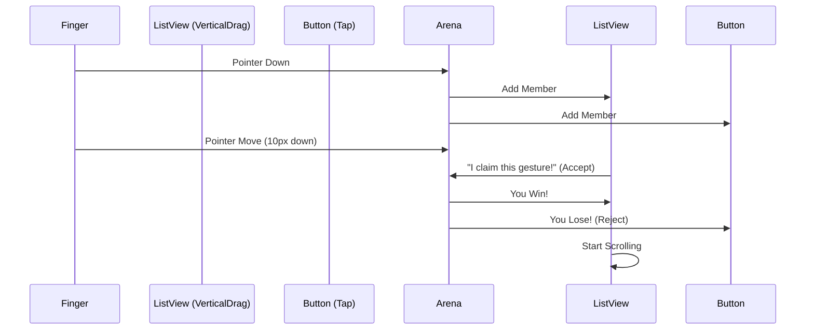

# 08. 手势竞技场：Gesture Arena

常见场景：在 `ListView` 里嵌套了一个 `GestureDetector`，导致事件被 `ListView` 拦截。

此即 Flutter 独特的 **Gesture Arena (手势竞技场)** 机制所致。

## 原始指针 vs 手势识别

Flutter 的触摸系统分为两层：

1.  **Pointer Events (原始指针层)**
    *   直接来自系统的 `down`, `move`, `up`, `cancel` 事件。
    *   `Listener` Widget 监听的就是这一层。其不参与竞技，由触控点直接触发。

2.  **Gesture Recognizer (语义手势层)**
    *   将原始指针解释为 `Tap` (点击), `Drag` (拖拽), `Scale` (缩放)。
    *   `GestureDetector` 是这一层的代表。

##Hit Test: 命中测试

当手指按下的瞬间 (PointerDown)，Flutter 会从 Root RenderObject 开始进行 **Hit Test (命中测试)**。
这是一个递归过程：所有包含这个坐标点的 RenderObject 都会被收集到一个列表中，称为 **HitTestResult**。
这个列表通常是：`[RenderView, ..., RenderListView, ..., RenderButton]`。

## 欢迎来到竞技场 (The Arena)

收集完所有参与者后，竞技场开启 (Arena Opened)。所有注册了 `GestureRecognizer` 的组件（比如 ListView 的 VerticalDragRecognizer 和 Button 的 TapRecognizer）都进场参赛。

### 规则：

1.  **胜利者通吃**: 最终只有一个手势可以赢得比赛。
2.  **逻辑判断**:
    *   Finger Move: 所有参与者关注位移。
    *   若垂直位移超阈值，VerticalDragRecognizer 宣布独占，Arena 裁定胜利。
    *   失败者（如 TapRecognizer）被强制重置。此即为何列表滚动时，按钮不会触发点击。



## 解决手势冲突

### 1. 想要同时触发？

若需让父组件和子组件都响应点击，避免使用两个 `GestureDetector`（子胜父败）。
使用 `Listener`（原始指针）+ `GestureDetector`，或者自定义 Recognizer。

### 2. 嵌套滚动冲突

当 `PageView` 左右滑嵌套 `ListView` 上下滑时，通常没事，因为轴线不同。
但在同轴嵌套时（ListView 嵌 ListView），需明确子 ListView 行为。

```dart
ListView(
  // 强制子列表参与竞争
  physics: AlwaysScrollableScrollPhysics(), 
  shrinkWrap: true, // 慎用！影响性能
)
```

## 进阶视角 (Advanced Insight)

### Listener 的“预知未来”

`Listener` 的 `onPointerDown` 触发于竞技场开启**之前**。
这意味着 `Listener` 可优先获取原始数据。若需做一个“全局点击特效”，或者想在手势竞争前截获坐标，`Listener` 为唯一选择。

### EagerGestureRecognizer (急切手势)

部分场景需“一触即发”，无需等待竞技场裁决（比如绘画板）。
可实现一个自定义的 Recognizer，在 `addPointer` 时直接宣布胜利 (`resolve(GestureDisposition.accepted)`)。
