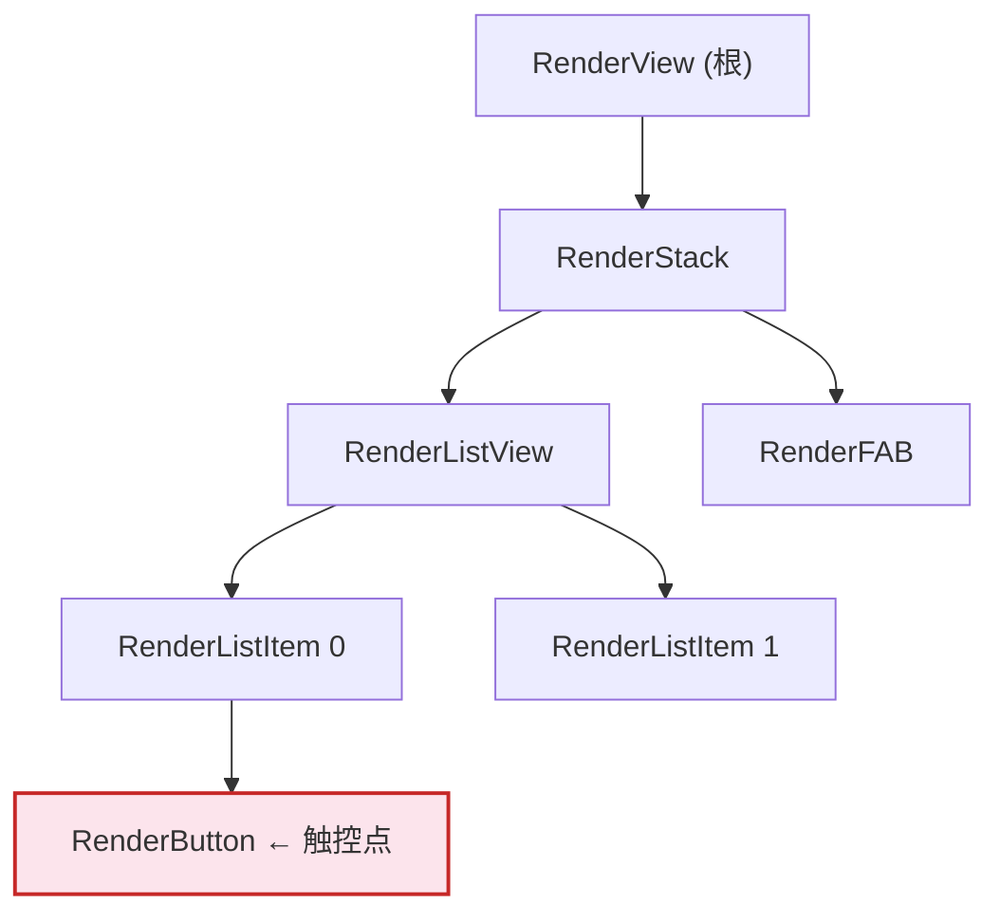
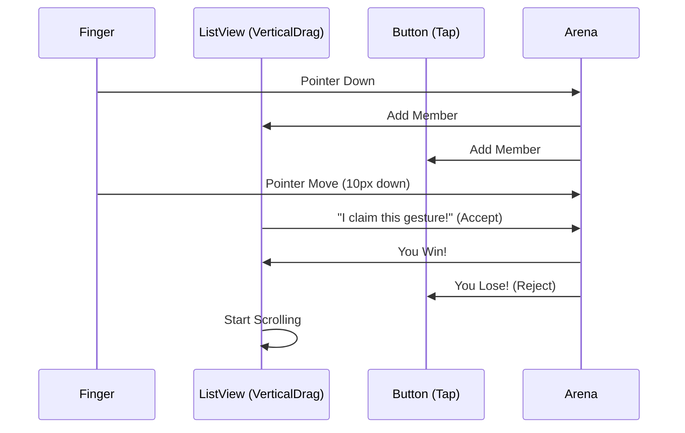

# 08. 手势竞技场：Gesture Arena

常见场景：在 `ListView` 里嵌套了一个 `GestureDetector`，导致事件被 `ListView` 拦截。

此即 Flutter 独特的 **Gesture Arena (手势竞技场)** 机制所致。

## 原始指针 vs 手势识别

Flutter 的触摸系统分为两层：

1.  **Pointer Events (原始指针层)**
    *   直接来自系统的 `down`, `move`, `up`, `cancel` 事件。
    *   `Listener` Widget 监听的就是这一层。其不参与竞技，由触控点直接触发。

2.  **Gesture Recognizer (语义手势层)**
    *   将原始指针解释为 `Tap` (点击), `Drag` (拖拽), `Scale` (缩放)。
    *   `GestureDetector` 是这一层的代表。

## Hit Test: 命中测试

当手指按下的瞬间 (PointerDown)，Flutter 会从 Root RenderObject 开始进行 **Hit Test (命中测试)**。
这是一个递归过程：所有包含这个坐标点的 RenderObject 都会被收集到一个列表中，称为 **HitTestResult**。
这个列表通常是：`[RenderView, ..., RenderListView, ..., RenderButton]`。

### Hit Test 的遍历顺序


```mermaid
graph TD
    RenderView["RenderView (根)"] --> Stack["RenderStack"]
    Stack --> ListView["RenderListView"]
    Stack --> FAB["RenderFAB"]
    ListView --> Item1["RenderListItem 0"]
    ListView --> Item2["RenderListItem 1"]
    Item1 --> Button["RenderButton ← 触控点"]
    
    style Button fill:#fce4ec,stroke:#c62828,stroke-width:2px
```

遍历是**从子到父**（深度优先，后序遍历）。先检查最上层的子节点是否命中，如果命中就加入列表。最终 HitTestResult 里的顺序是从最具体的子组件到最外层的根组件。

## 欢迎来到竞技场 (The Arena)

收集完所有参与者后，竞技场开启 (Arena Opened)。所有注册了 `GestureRecognizer` 的组件（比如 ListView 的 VerticalDragRecognizer 和 Button 的 TapRecognizer）都进场参赛。

### 规则：

1.  **胜利者通吃**: 最终只有一个手势可以赢得比赛。
2.  **逻辑判断**:
    *   Finger Move: 所有参与者关注位移。
    *   若垂直位移超阈值（18 逻辑像素），VerticalDragRecognizer 宣布独占，Arena 裁定胜利。
    *   失败者（如 TapRecognizer）被强制重置。此即为何列表滚动时，按钮不会触发点击。


```mermaid
sequenceDiagram
    participant Finger
    participant ListView as ListView (VerticalDrag)
    participant Button as Button (Tap)
    participant Arena

    Finger->>Arena: Pointer Down
    Arena->>ListView: Add Member
    Arena->>Button: Add Member
    
    Finger->>Arena: Pointer Move (10px down)
    ListView->>Arena: "I claim this gesture!" (Accept)
    Arena->>ListView: You Win!
    Arena->>Button: You Lose! (Reject)
    
    ListView->>ListView: Start Scrolling
```

### 特殊情况：只有一个参与者

如果竞技场只有一个参赛者（比如页面上就一个按钮，没有可滚动的容器），那这个 Recognizer 会在一定延迟后（通常 200ms）自动获胜。这就是为什么按钮的 `onTap` 有时候感觉有一点点延迟——它在等待看是否有其他选手加入竞争。

## 解决手势冲突

### 1. 想要同时触发？

若需让父组件和子组件都响应点击，避免使用两个 `GestureDetector`（子胜父败）。

**方案一**：使用 `Listener`（原始指针）+ `GestureDetector`。`Listener` 不参与竞技场，可以同时收到事件。

```dart
Listener(
  onPointerDown: (event) {
    // 这里的事件不经过竞技场，100% 触发
    print('Parent received pointer down at ${event.position}');
  },
  child: GestureDetector(
    onTap: () => print('Child tapped'),
    child: Container(width: 100, height: 100, color: Colors.blue),
  ),
)
```

**方案二**：使用 `RawGestureDetector` 自定义 Recognizer 的竞争行为。

### 2. 嵌套滚动冲突

当 `PageView` 左右滑嵌套 `ListView` 上下滑时，通常没事，因为轴线不同。
但在同轴嵌套时（ListView 嵌 ListView），需要使用 `NestedScrollView` 或显式设置子列表行为：

```dart
// 方案一：NestedScrollView（推荐）
NestedScrollView(
  headerSliverBuilder: (context, innerBoxIsScrolled) => [
    SliverAppBar(title: Text('Header'), floating: true),
  ],
  body: ListView.builder(
    itemCount: 100,
    itemBuilder: (ctx, i) => ListTile(title: Text('Item $i')),
  ),
)

// 方案二：手动控制子列表行为
ListView(
  physics: NeverScrollableScrollPhysics(), // 子列表放弃滚动权
  shrinkWrap: true,  // 慎用！大列表会损失懒加载优势
)
```

### 3. 多指手势：ScaleGestureRecognizer

双指缩放 (Pinch to Zoom) 和双指旋转使用 `ScaleGestureRecognizer`。它能同时追踪多个触控点：

```dart
GestureDetector(
  onScaleStart: (details) {
    // details.focalPoint: 多指的中心点
    // details.pointerCount: 当前触控点数量
  },
  onScaleUpdate: (details) {
    setState(() {
      _scale *= details.scale;      // 缩放比例
      _rotation += details.rotation; // 旋转角度（弧度）
    });
  },
  child: Transform(
    transform: Matrix4.identity()
      ..scale(_scale)
      ..rotateZ(_rotation),
    child: Image.asset('photo.jpg'),
  ),
)
```

## 进阶视角 (Advanced Insight)

### Listener 的"预知未来"

`Listener` 的 `onPointerDown` 触发于竞技场开启**之前**。
这意味着 `Listener` 可优先获取原始数据。若需做一个"全局点击特效"，或者想在手势竞争前截获坐标，`Listener` 为唯一选择。

### EagerGestureRecognizer (急切手势)

部分场景需"一触即发"，无需等待竞技场裁决（比如绘画板的笔触）。
可实现一个自定义的 Recognizer，在 `addPointer` 时直接宣布胜利 (`resolve(GestureDisposition.accepted)`)：

```dart
class EagerRecognizer extends OneSequenceGestureRecognizer {
  @override
  void addPointer(PointerDownEvent event) {
    startTrackingPointer(event.pointer);
    resolve(GestureDisposition.accepted); // 立即宣布胜利
  }
  
  @override
  void handleEvent(PointerEvent event) {
    if (event is PointerMoveEvent) {
      // 绘画笔触逻辑
    }
  }
  
  @override
  void didStopTrackingLastPointer(int pointer) {}
  
  @override
  String get debugDescription => 'eager';
}
```

### Velocity Tracker (速度追踪)

`GestureDetector` 的 `onPanEnd` 和 `onDragEnd` 回调中有一个 `details.velocity` 参数，它是通过 `VelocityTracker` 计算的。算法对最近的 20 个触控点进行最小二乘法拟合，得出手指离开屏幕时的瞬时速度。这个速度值是 `Fling` 动画（惯性滚动）的关键输入。
