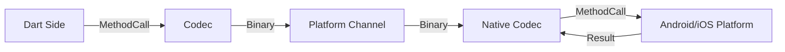

# 09. 打破次元壁：Native Interop 与 FFI

Flutter 虽然自绘了一切，但它并不孤立。
若需获取电池电量、调用蓝牙、使用原生相机 SDK，或者复用已有的 C++ 图像处理算法时，需打破 Dart 的次元壁，与 Host Platform (Android/iOS/Windows) 进行通信。

## 1. Platform Channels (平台通道)

此为常用方式。简言之，即一条全双工的通信管道。

### 架构原理

*   **Client (Dart)**: 发送此时的消息（MethodCall）。
*   **Host (Android/iOS)**: 接收消息，调用原生 API，返回结果。
*   **Codec (编解码器)**: 消息必须序列化成二进制。



> **注意**: 所有的 Platform Channel 通信都是**异步**的。

### 常用通道类型
*   `MethodChannel`: 类 RPC 方法调用 (一次请求，一次响应)。
*   `EventChannel`: 数据流通信 (一次监听，持续响应，如传感器数据)。
*   `BasicMessageChannel`: 传递字符串或半结构化数据。

## 2. 性能瓶颈与 FFI (Foreign Function Interface)

Platform Channels 存在显著代价：**序列化与反序列化**。
传递大数据（如图片）需经多次内存拷贝。

对于计算密集型或高频场景，**Dart FFI** 为最佳方案。
Dart FFI 允许 Dart 代码**直接**调用 C/C++ 的函数，读写 C 的内存堆 (Heap)。

```dart
// C 代码
// int add(int a, int b) { return a + b; }

// Dart 代码
typedef NativeAdd = Int32 Function(Int32, Int32);
typedef DartAdd = int Function(int, int);

final dylib = DynamicLibrary.open('my_lib.so');
final add = dylib.lookupFunction<NativeAdd, DartAdd>('add');

print(add(1, 2)); // 直接调用，无序列化开销。
```

### 自动化生成工具

手动编写 FFI 绑定或 MethodChannel 较为繁琐。
目前主要使用代码生成工具：

*   **ffigen**: 直接读取 C/C++ Header (.h) 文件，自动生成 Dart 绑定代码。
*   **jnigen**: 直接读取 Java/Kotlin 的 Jar/Class 文件，自动生成 Dart 绑定代码。仅需在 Dart 中直接调用 `new JavaArrayList()`，底层走的是 JNI，但写法像 Dart。

## 3. Platform View (原生视图)

对于无法重写的原生组件（比如 Google Maps, WebView）。
Flutter 提供了 `AndroidView` / `UiKitView`，把原生控件“镶嵌”到 Flutter 的 Widget 树里。

### 两种模式
*   **Virtual Display (老模式)**: 把原生 View 渲染到内存 Texture，再贴到 Flutter 上。兼容性良好，键盘输入存在已知问题。
*   **Hybrid Composition (新模式)**: 将原生 View 把盖于 Flutter Surface 上，或者两者混合。性能更优，交互自然。

## 进阶视角 (Advanced Insight)

### 主线程死锁风险

Platform Channel 的 Handler 默认跑在原生的 **Main Thread**。
Android 端若在 Handler 执行耗时操作，是否会阻塞 Dart UI 线程？
**不会直接阻塞 Dart 线程**（因为是异步等待），但会导致 Android 应用 ANR (Application Not Responding)。
因此，原生端实现时，务必记得切到后台线程执行耗时任务，最后回调回主线程返回结果。
