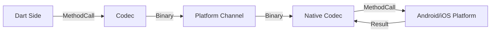

# 09. 打破次元壁：Native Interop 与 FFI

Flutter 虽然自绘了一切，但它并不孤立。
若需获取电池电量、调用蓝牙、使用原生相机 SDK，或者复用已有的 C++ 图像处理算法时，需打破 Dart 的次元壁，与 Host Platform (Android/iOS/Windows) 进行通信。

## 1. Platform Channels (平台通道)

此为常用方式。简言之，即一条全双工的通信管道。

### 架构原理

*   **Client (Dart)**: 发送此时的消息（MethodCall）。
*   **Host (Android/iOS)**: 接收消息，调用原生 API，返回结果。
*   **Codec (编解码器)**: 消息必须序列化成二进制。


```mermaid
graph LR
    Dart[Dart Side] -- MethodCall --> Codec
    Codec -- Binary --> Channel[Platform Channel]
    Channel -- Binary --> HostCodec[Native Codec]
    HostCodec -- MethodCall --> Native[Android/iOS Platform]
    Native -- Result --> HostCodec
```

> **注意**: 所有的 Platform Channel 通信都是**异步**的。

### 常用通道类型
*   `MethodChannel`: 类 RPC 方法调用 (一次请求，一次响应)。
*   `EventChannel`: 数据流通信 (一次监听，持续响应，如传感器数据)。
*   `BasicMessageChannel`: 传递字符串或半结构化数据。

### 最佳实践：Pigeon (类型安全)

手写 `MethodChannel` 容易出现 "Dart 传 String 但 Native 想要 Int" 的运行时错误，且两端样板代码极多。
**强烈推荐使用官方工具 [Pigeon](https://pub.dev/packages/pigeon)**。

1.  **定义接口**: 使用 Dart 定义 API。
    ```dart
    class Book {
      String? title;
      String? author;
    }
    
    @HostApi()
    abstract class BookApi {
      List<Book> search(String keyword);
    }
    ```
2.  **生成代码**: Pigeon 会自动生成 Java/Kotlin, ObjC/Swift, C++ 代码。
3.  **调用**: 直接调用生成的强类型 API，无需手动处理编解码和方法名字符串。

## 2. 性能瓶颈与 FFI (Foreign Function Interface)

Platform Channels 存在显著代价：**序列化与反序列化**。
传递大数据（如图片）需经多次内存拷贝。

对于计算密集型或高频场景，**Dart FFI** 为最佳方案。
Dart FFI 允许 Dart 代码**直接**调用 C/C++ 的函数，读写 C 的内存堆 (Heap)。

```dart
// C 代码
// int add(int a, int b) { return a + b; }

// Dart 代码
typedef NativeAdd = Int32 Function(Int32, Int32);
typedef DartAdd = int Function(int, int);

final dylib = DynamicLibrary.open('my_lib.so');
final add = dylib.lookupFunction<NativeAdd, DartAdd>('add');

print(add(1, 2)); // 直接调用，无序列化开销。
```

### 自动化生成工具

手动编写 FFI 绑定或 MethodChannel 较为繁琐。
目前主要使用代码生成工具：

*   **ffigen**: 直接读取 C/C++ Header (.h) 文件，自动生成 Dart 绑定代码。
*   **jnigen**: 直接读取 Java/Kotlin 的 Jar/Class 文件，自动生成 Dart 绑定代码。仅需在 Dart 中直接调用 `new JavaArrayList()`，底层走的是 JNI，但写法像 Dart。

## 3. Platform View (原生视图)

对于无法重写的原生组件（比如 Google Maps, WebView）。
Flutter 提供了 `AndroidView` / `UiKitView`，把原生控件“镶嵌”到 Flutter 的 Widget 树里。

### 两种模式
*   **Virtual Display (老模式)**: 把原生 View 渲染到内存 Texture，再贴到 Flutter 上。兼容性良好，键盘输入存在已知问题。
*   **Hybrid Composition (新模式)**: 将原生 View 把盖于 Flutter Surface 上，或者两者混合。性能更优，交互自然。

---

## Trade-offs

### Platform Channel vs FFI vs Platform Views

三种方案在延迟、复杂度和维护成本上差异明显：

| 方案 | 延迟 | 复杂度 | 维护成本 |
|------|------|--------|----------|
| Platform Channel | 中等（序列化和 IPC 开销）| 低（官方标配）| 低（自动代码生成）|
| FFI | 极低（直接函数调用）| 高（需处理内存）| 中（跨平台绑定难写）|
| Platform Views | 高（额外布局层）| 中（需原生代码）| 高（多平台维护）|

**Platform Channel** 兼容性最好，适合 90% 的场景。但对于高频调用（如每秒上千次图像处理），序列化开销会累积成瓶颈。

**FFI** 延迟最低，适合计算密集型任务。代价是只能调用 C/C++，且需要手动管理内存——一旦出现野指针，Dart VM 直接崩溃。

**Platform Views** 适合嵌入复杂原生组件（地图、WebView）。代价是 Hybrid Composition 在某些设备上有性能问题，Virtual Display 模式键盘输入有已知 bug。

---

## 常见坑点

### 1. 主线程死锁风险

Platform Channel 的 Handler 默认跑在原生的 **Main Thread**。Android 端若在 Handler 执行耗时操作，是否会阻塞 Dart UI 线程？
**不会直接阻塞 Dart 线程**（因为是异步等待），但会导致 Android 应用 ANR (Application Not Responding)。

**解法**：原生端务必切到后台线程执行耗时任务，最后回调回主线程返回结果。

### 2. Virtual Display 键盘问题

Virtual Display（老模式）把原生 View 渲染到内存 Texture，再贴到 Flutter 上。兼容性良好，但键盘输入存在已知问题：光标位置和实际输入位置可能不一致。

**解法**：如果需要处理文本输入，优先使用 Hybrid Composition（新模式），或在 Flutter 层自己管理输入焦点。

### 3. FFI 内存泄漏

使用 FFI 时，`malloc` 分配的内存必须手动 `free`。如果忘记释放，或者 Dart 侧抛出异常导致释放逻辑没执行，就会内存泄漏。

**解法**：使用 `Arena` 或 `NativeFinalizer` 确保资源必定释放。

---

## 进阶视角 (Advanced Insight)

### 主线程死锁风险

Platform Channel 的 Handler 默认跑在原生的 **Main Thread**。
Android 端若在 Handler 执行耗时操作，是否会阻塞 Dart UI 线程？
**不会直接阻塞 Dart 线程**（因为是异步等待），但会导致 Android 应用 ANR (Application Not Responding)。
因此，原生端实现时，务必记得切到后台线程执行耗时任务，最后回调回主线程返回结果。

## Trade-offs

### Platform Channel vs FFI vs Platform Views

**Platform Channel**：
- 延迟：毫秒级（需要序列化和跨进程通信）
- 复杂度：低，官方提供完整封装
- 维护成本：中等，两端代码都要维护

适合场景：低频调用（如获取电池电量、调起分享面板）。

**FFI (Foreign Function Interface)**：
- 延迟：微秒级（直接函数调用，无序列化）
- 复杂度：高，需要手写绑定或用 ffigen 自动生成
- 维护成本：高，C/C++ 代码需要跨平台编译（iOS .a, Android .so）

适合场景：高频调用（如图像处理、音视频编解码）。

**Platform Views**：
- 延迟：取决于渲染模式，Hybrid Composition 更低
- 复杂度：高，涉及纹理共享、生命周期管理
- 维护成本：高，需要处理 iOS/Android 双端视图差异

适合场景：复用已有原生组件（Google Maps、WebView）。

选择顺序：如果 Platform Channel 能满足性能需求，优先用它；遇到瓶颈再考虑 FFI；只有无法重写组件时才用 Platform Views。

---

## 常见坑点

### 1. Platform Channel 的返回值类型不匹配

Dart 端传 Int，Native 端返回 String，运行时不报错但拿到的是 null 或异常数据。

**解法**：使用 Pigeon 生成强类型代码，避免手写方法名和类型映射。

### 2. Android View 内存泄漏

`AndroidView` 如果没有在 `dispose()` 里正确释放，会导致 Activity 销毁后 View 依然存活，引发内存泄漏。

**解法**：在 Flutter 侧确保 `AndroidView` 放在 StatefulWidget 中，并在 `dispose()` 中清理资源。

### 3. FFI 传递大数据导致的 OOM

`ffi` 包传递大型数据结构时，默认使用 `malloc` 分配内存。如果忘记 `free()`，会导致原生堆内存泄漏。

**解法**：使用 `Arena` 或 `allocate` + `free` 配对管理内存，或者用 `NativeFinalizer` 自动回收。
