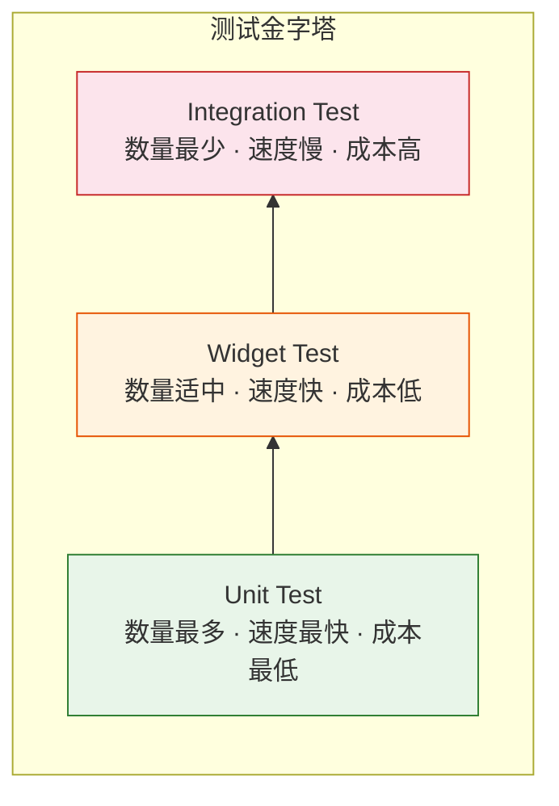

# 10. 守护质量：测试金字塔与 CI/CD

> "代码可用即可"不仅非专业态度。专业项目必须依靠自动化测试来保证长期的可维护性。

Flutter 提供了极其完善的测试框架，完美契合**测试金字塔**模型。



## 1. Unit Test (单元测试)

*   **目标**: 验证单一函数、类或模块的逻辑。
*   **特点**: 不依赖 UI，不依赖模拟器，跑在电脑本地 Dart VM 上，速度极快（毫秒级）。
*   **适用**: 验证算法、JSON 解析、Validator、ViewModel 状态流转。

```dart
test('Counter value should be incremented', () {
  final counter = Counter();
  counter.increment();
  expect(counter.value, 1);
});
```

### group 与 setUp

复杂测试用 `group` 分组，用 `setUp` / `tearDown` 管理测试上下文：

```dart
group('TaskRepository', () {
  late TaskRepository repo;
  late MockDatabase mockDb;
  
  setUp(() {
    mockDb = MockDatabase();
    repo = TaskRepository(mockDb);
  });
  
  test('fetchTasks returns empty list when no data', () async {
    when(mockDb.query('tasks')).thenAnswer((_) async => []);
    final result = await repo.fetchTasks();
    expect(result, isEmpty);
  });
  
  test('addTask calls insert with correct data', () async {
    await repo.addTask(Task(title: 'Test'));
    verify(mockDb.insert('tasks', any)).called(1);
  });
});
```

## 2. Widget Test (组件测试)

此为 Flutter 的核心优势。无需启动浏览器或模拟器。
它在一个**虚拟的 UI 环境**中构建 Widget 树。

*   **目标**: 验证 UI 构建逻辑、交互响应。
*   **特点**: **不依赖真机渲染**（Headless），但能模拟点击、滑动。速度快（秒级）。
*   **Finder**: 通过 text, key, icon 找到组件。
*   **Matcher**: 验证组件是否存在 (`findsOneWidget`), 颜色对不对。

```dart
testWidgets('MyWidget has a title and message', (WidgetTester tester) async {
  await tester.pumpWidget(MyWidget(title: 'T', message: 'M'));
  
  expect(find.text('T'), findsOneWidget);
  expect(find.text('M'), findsOneWidget);
  
  await tester.tap(find.byType(FloatingActionButton));
  await tester.pump(); // 触发 rebuild
  
  // 验证状态变化
  expect(find.text('1'), findsOneWidget); // 计数器变为 1
});
```

### 测试异步操作

当 Widget 包含动画或异步加载时，`pump()` 只推进一帧。如果需要等待所有异步操作完成：

```dart
testWidgets('Loading state shows spinner', (tester) async {
  await tester.pumpWidget(UserProfile(userId: '123'));
  
  // 初始状态：显示 Loading
  expect(find.byType(CircularProgressIndicator), findsOneWidget);
  
  // 等待所有异步操作完成
  await tester.pumpAndSettle();
  
  // 加载完成：显示用户名
  expect(find.text('Lucas'), findsOneWidget);
  expect(find.byType(CircularProgressIndicator), findsNothing);
});
```

`pumpAndSettle()` 会持续推进帧，直到没有待处理的帧为止。但要注意：如果 Widget 包含无限循环的动画（如旋转 Logo），`pumpAndSettle` 会超时。

## 3. Integration Test (集成测试)

*   **目标**: 端到端 (E2E) 验证完整 User Flow。
*   **特点**: **必须跑在真机或模拟器上**。由 `integration_test` 包驱动。
*   **代价**: 慢，不稳定。通常只覆盖核心路径（如登录 -> 下单 -> 支付）。

```dart
// integration_test/app_test.dart
import 'package:integration_test/integration_test.dart';

void main() {
  IntegrationTestWidgetsFlutterBinding.ensureInitialized();
  
  testWidgets('Full login flow', (tester) async {
    app.main();
    await tester.pumpAndSettle();
    
    // 输入用户名
    await tester.enterText(find.byKey(Key('email_field')), 'test@example.com');
    await tester.enterText(find.byKey(Key('password_field')), 'password123');
    
    // 点击登录
    await tester.tap(find.byKey(Key('login_button')));
    await tester.pumpAndSettle();
    
    // 验证跳转到首页
    expect(find.text('Welcome'), findsOneWidget);
  });
}
```

### Patrol (现代化集成测试)

Flutter 官方的 `integration_test` 的最大痛点是**无法操作原生 UI**（例如系统权限弹窗、通知栏、WebView）。
[Patrol](https://patrol.leancode.co/) 完美解决了这个问题，它允许在测试代码中同时操作 Flutter Widget 和 Native View：

```dart
patrolTest('Grant camera permission and take photo', ($) async {
  await $.pumpWidgetAndSettle(MyApp());
  
  await $.tap(find.text('Take Photo'));
  
  // 自动处理系统相机权限弹窗
  await $.native.tap(NativeSelector(text: 'Allow'));
  
  await $.pumpAndSettle();
  expect(find.byType(PhotoPreview), findsOneWidget);
});
```

## 4. Golden Test (黄金快照测试)

UI 逻辑正确之外，像素级还原同样重要。
Golden Test 将当前的 UI 渲染成一张 png 图片，并与仓库里存好的"黄金标准图"进行逐像素比对。

```dart
testWidgets('ProfileCard matches golden', (tester) async {
  await tester.pumpWidget(
    MaterialApp(
      home: ProfileCard(
        name: 'Lucas',
        avatar: 'assets/avatar.png',
        bio: 'Flutter Developer',
      ),
    ),
  );
  
  await expectLater(
    find.byType(ProfileCard),
    matchesGoldenFile('goldens/profile_card.png'),
  );
});
```

首次运行时用 `flutter test --update-goldens` 生成基准图。之后每次运行测试都会对比差异。

### 跨平台一致性问题

*   **痛点**: 不同操作系统（Mac/Linux/Windows）渲染字体的抗锯齿算法不同，导致 CI 经常失败。
*   **解法**:
    *   **[Golden Toolkit](https://pub.dev/packages/golden_toolkit)**: 加载测试字体替换系统字体，支持多设备尺寸快照。
    *   **[Alchemist](https://pub.dev/packages/alchemist)**: 更好的 CI 集成体验。
    *   **Docker**: 统一在 Linux Docker 容器中生成和比对快照。

## 5. Mocking (模拟)

测试过程中，应避免真实去请求网络接口。
使用 `Mockito` 或 `Mocktail` 来 Mock 依赖。通过 **Dependency Injection (DI)**，在测试时注入 Mock 对象，确保测试环境可控。

```dart
// 使用 Mocktail（不需要代码生成，API 更简洁）
class MockApi extends Mock implements Api {}

void main() {
  late MockApi mockApi;
  
  setUp(() {
    mockApi = MockApi();
    // 当调用 fetchUser 时，返回假数据
    when(() => mockApi.fetchUser()).thenAnswer((_) async => User('Test'));
  });
  
  test('UserViewModel loads user on init', () async {
    final vm = UserViewModel(api: mockApi);
    await vm.init();
    expect(vm.user.name, 'Test');
    verify(() => mockApi.fetchUser()).called(1);
  });
}
```

## 6. CI/CD 集成 (GitHub Actions)

自动化测试需要接入 CI 流水线才能发挥真正价值。以下是 GitHub Actions 的典型配置：

```yaml
# .github/workflows/flutter_ci.yml
name: Flutter CI

on:
  push:
    branches: [main]
  pull_request:
    branches: [main]

jobs:
  test:
    runs-on: ubuntu-latest
    steps:
      - uses: actions/checkout@v4
      - uses: subosito/flutter-action@v2
        with:
          flutter-version: '3.24.0'
          channel: 'stable'
      
      - name: Install dependencies
        run: flutter pub get
      
      - name: Analyze code
        run: flutter analyze
      
      - name: Run unit & widget tests
        run: flutter test --coverage
      
      - name: Check coverage threshold
        run: |
          COVERAGE=$(lcov --summary coverage/lcov.info 2>&1 | grep "lines" | awk '{print $2}' | sed 's/%//')
          if (( $(echo "$COVERAGE < 80" | bc -l) )); then
            echo "Coverage $COVERAGE% is below 80% threshold"
            exit 1
          fi
```

关键要素：
*   **代码分析** (`flutter analyze`): 静态检查，发现类型错误和潜在问题。
*   **覆盖率门槛**: 设定最低覆盖率（如 80%），低于阈值则 PR 无法合并。
*   **Golden Test 一致性**: 在 CI 中生成快照时统一用 Linux 环境，避免跨平台差异。

## 总结

| 层级 | 工具 | 速度 | 覆盖范围 |
|------|------|------|---------|
| Unit | `flutter test` | 毫秒 | 逻辑函数、数据模型 |
| Widget | `flutter test` | 秒 | UI 构建、交互响应 |
| Golden | `flutter test --update-goldens` | 秒 | 像素级视觉验证 |
| Integration | `flutter test integration_test/` | 分钟 | E2E 用户流程 |

从架构原理的深潜，到手势与滑动的微操，再到原生交互的破壁，最后以工程化测试收尾。这不仅是 Flutter 的旅程，更是现代客户端开发的缩影。
