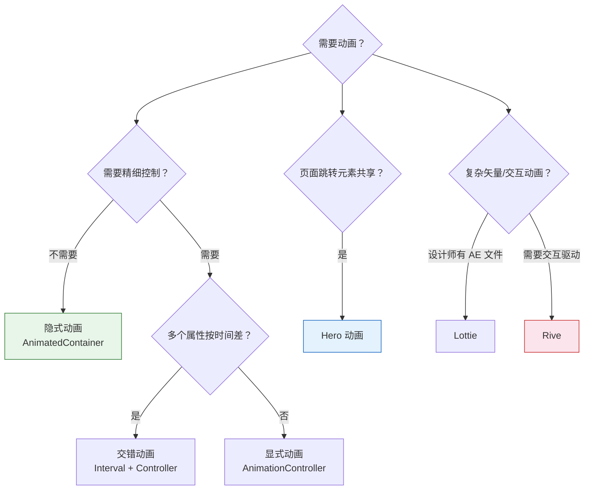

# 15. 灵动交互：动画与转场

若 Layout 决定骨架，Paint 决定皮囊，**Animation** 则赋予灵魂。
Flutter 的动画系统强大且分层清晰，从简单的淡入淡出到复杂的物理模拟都能胜任。

## 1. 隐式动画 (Implicit Animations)

这是最简单、最推荐的动画方式。
仅需改变属性值（如 `width`），Flutter 将自动计算差值并播放动画。

*   **关键词**: `AnimatedContainer`, `AnimatedOpacity`, `AnimatedPadding`, `AnimatedPositioned`。
*   **特点**: 无需 `AnimationController`，亦无需 `setState`（除了触发属性变化的那一次）。

```dart
AnimatedContainer(
  duration: Duration(seconds: 1),
  curve: Curves.easeInOut,
  width: selected ? 200.0 : 100.0, // 修改数值自动触发动画
  height: selected ? 100.0 : 200.0,
  decoration: BoxDecoration(
    color: selected ? Colors.blue : Colors.red,
    borderRadius: BorderRadius.circular(selected ? 16 : 0),
  ),
  child: ...
)
```

### AnimatedSwitcher：子组件切换动画

当需要在两个 Widget 之间做平滑过渡时，`AnimatedSwitcher` 比手写 `AnimatedOpacity` 更方便：

```dart
AnimatedSwitcher(
  duration: Duration(milliseconds: 300),
  transitionBuilder: (child, animation) {
    return FadeTransition(
      opacity: animation,
      child: SlideTransition(
        position: Tween<Offset>(
          begin: Offset(0, 0.1),
          end: Offset.zero,
        ).animate(animation),
        child: child,
      ),
    );
  },
  child: Text(
    '$_count',
    key: ValueKey<int>(_count), // key 变化时触发动画
    style: TextStyle(fontSize: 48),
  ),
)
```

**注意点**：`key` 是触发切换的核心。`AnimatedSwitcher` 通过比较 child 的 key 来判断是否需要执行过渡动画。如果忘记设置 key，新旧 Widget 会被判定为同一个，动画不会触发。

## 2. 显式动画 (Explicit Animations)

需要更精细的控制（暂停、倒放、无限循环、交错动画）时，需要显式动画。

*   **核心**: `AnimationController`。
*   **原理**: Controller 在每一帧 V-Sync 信号时生成一个 0.0 到 1.0 的数字，通过 `Tween` 映射成目标范围（如 0 到 100 像素），再通过 `AnimatedBuilder` 更新 UI。

```dart
// 1. 定义 Controller（需要 SingleTickerProviderStateMixin）
controller = AnimationController(duration: Duration(seconds: 1), vsync: this);
// 2. 定义动画曲线和范围
animation = CurvedAnimation(parent: controller, curve: Curves.elasticOut);
sizeAnimation = Tween(begin: 0.0, end: 100.0).animate(animation);
// 3. 构建 UI
AnimatedBuilder(
  animation: sizeAnimation,
  builder: (ctx, child) => Container(width: sizeAnimation.value),
)
```

### 交错动画 (Staggered Animations)

多个属性按**时间差**依次启动，视觉上形成"波浪"效果。关键是用 `Interval` 控制每个子动画在整体时间轴中的活跃区间：

```dart
// 整体 controller: 0.0 -> 1.0, 持续 2 秒
final controller = AnimationController(duration: Duration(seconds: 2), vsync: this);

// 0% ~ 40% 时间段：透明度从 0 到 1
final opacity = Tween(begin: 0.0, end: 1.0).animate(
  CurvedAnimation(parent: controller, curve: Interval(0.0, 0.4, curve: Curves.easeIn)),
);

// 30% ~ 70% 时间段：从左侧滑入
final slideX = Tween(begin: -100.0, end: 0.0).animate(
  CurvedAnimation(parent: controller, curve: Interval(0.3, 0.7, curve: Curves.easeOut)),
);

// 60% ~ 100% 时间段：缩放弹出
final scale = Tween(begin: 0.5, end: 1.0).animate(
  CurvedAnimation(parent: controller, curve: Interval(0.6, 1.0, curve: Curves.elasticOut)),
);
```

`Interval(0.3, 0.7)` 的含义是：这个子动画只在 controller 跑到 30%~70% 时才活跃。在此区间之外，值保持在 begin 或 end 不动。这样就能用一个 controller 编排出复杂的动画序列。

### 自定义 Curve

内置的 `Curves.easeInOut` 不够用时，可以自定义三阶贝塞尔曲线：

```dart
// 自定义弹跳曲线
const customCurve = Cubic(0.68, -0.55, 0.27, 1.55); // 会有明显的过冲效果

// 或者实现 Curve 接口，完全自定义
class StairCurve extends Curve {
  final int steps;
  StairCurve(this.steps);
  
  @override
  double transformInternal(double t) {
    return (t * steps).floor() / steps; // 阶梯式变化
  }
}
```

## 3. 英雄动画 (Hero Animations)

在页面跳转时，让共有元素（如列表页的小图 -> 详情页的大图）平滑过渡。
只需要给两个页面的组件加上相同的 `tag`。

```dart
// Page A
Hero(tag: 'avatar_1', child: Image.asset('cat.jpg'))

// Page B
Hero(tag: 'avatar_1', child: Image.network('cat_hd.jpg'))
```

### PageTransitionsBuilder：全局页面转场

通过 `ThemeData` 可以全局配置页面切换动画，不需要每个路由单独设置：

```dart
MaterialApp(
  theme: ThemeData(
    pageTransitionsTheme: PageTransitionsTheme(
      builders: {
        TargetPlatform.android: CupertinoPageTransitionsBuilder(),  // 安卓也用 iOS 风格
        TargetPlatform.iOS: CupertinoPageTransitionsBuilder(),
      },
    ),
  ),
)
```

如果需要完全自定义（比如淡入 + 缩放），可以继承 `PageTransitionsBuilder` 并重写 `buildTransitions`。

## 4. 物理模拟 (Physics-based Animations)

*   **SpringSimulation**: 模拟弹簧阻尼效果，让交互更符合物理直觉（如拖拽回弹）。核心参数是 `mass`（质量）、`stiffness`（刚度）、`damping`（阻尼比）。

```dart
final spring = SpringDescription(mass: 1, stiffness: 100, damping: 10);
final simulation = SpringSimulation(spring, 0, 1, -1); // 起点, 终点, 初速度

controller.animateWith(simulation);
```

*   **FrictionSimulation**: 模拟惯性滑动减速，常用于自定义滚动效果。
*   **GravitySimulation**: 模拟重力加速，可用于下落、抛物线动画。

## 5. Rive vs Lottie

两者都是矢量动画引擎，但定位不同：

| 维度 | Lottie | Rive |
|------|--------|------|
| 来源 | After Effects 导出 JSON | Rive Editor 原生创作 |
| 交互性 | 单纯播放为主 | 支持状态机、用户输入驱动 |
| 文件体积 | 较大（JSON 描述每一帧） | 极小（二进制格式 .riv） |
| 运行时性能 | 依赖 Skia 渲染，复杂动画可能掉帧 | 自带渲染器，性能更稳定 |
| 适用场景 | 设计师已有 AE 工作流 | 需要交互式动画（如按钮状态、游戏角色） |

如果是静态播放型动画（如加载动画、启动页），Lottie 够用。如果需要根据用户操作实时变化（如拖拽控制角色表情），Rive 的状态机能力是 Lottie 做不到的。

## 总结



> **官方资源**: [Animation & Motion](https://docs.flutter.dev/ui/animations)
