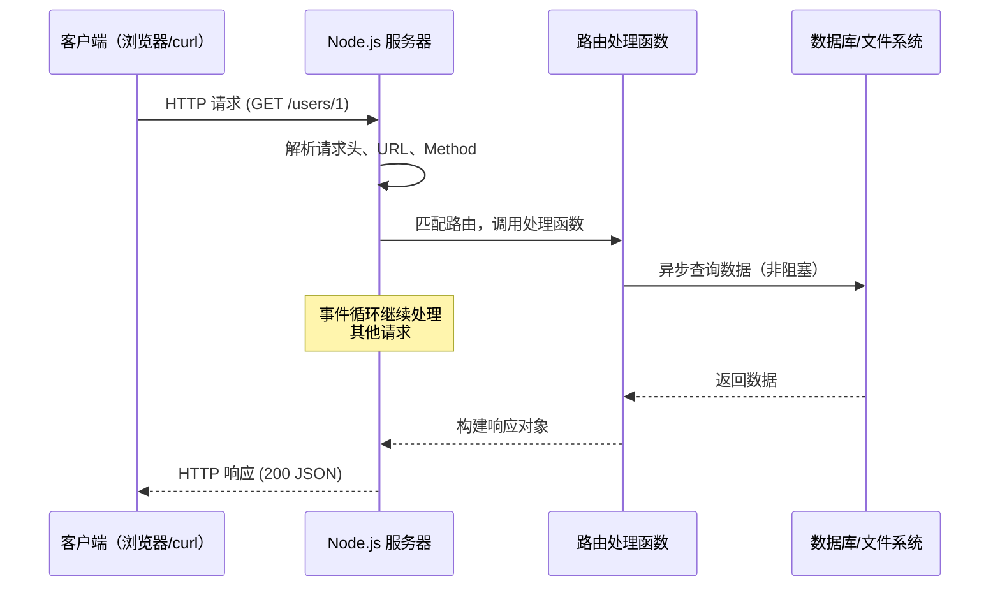

# Node.js 深度实战（零）—— 极速入门

不用啃完所有文档，10 分钟内写出第一个 Node.js 服务器。

## 全系列目录

1. **极速入门（零基础篇）**
2. **架构与运行时原理**
3. **事件循环深度解析**
4. **模块系统：ESM、CJS 与未来**
5. **Stream 与 Buffer：高性能数据处理**
6. **HTTP/3 与网络编程**
7. **文件系统与操作系统交互**
8. **Worker Threads 与多进程架构**
9. **Fastify + TypeScript 构建现代 REST API**
10. **数据库集成：Prisma ORM 实战**
11. **安全加固指南**
12. **性能优化与可观测性**
13. **测试策略与工程化**
14. **容器化与云原生部署**
15. **现代包管理：pnpm、Corepack 与 Monorepo**
16. **Node.js 原生 TypeScript 支持**

---

## 1. 什么是 Node.js？

Node.js 是运行在服务端的 JavaScript 运行时，基于 Google V8 引擎构建。与浏览器中的 JavaScript 不同，它没有 DOM，但拥有文件系统、网络、操作系统等能力。

```
浏览器 JS = V8 引擎 + Web API（DOM、BOM、Fetch...）
Node.js  = V8 引擎 + Node.js API（fs、net、os、http...）
```

一句话理解：**用 JavaScript 写后端服务器**。

## 2. 安装环境

推荐使用 [fnm](https://github.com/Schniz/fnm)（Fast Node Manager）管理 Node.js 版本，比 nvm 快 40 倍：

```bash
# macOS / Linux（使用 Homebrew）
brew install fnm

# 安装 Node.js 24 LTS（2026年当前 Active 长期支持版）
fnm install 24
fnm use 24

# 验证安装
node -v   # v24.x.x
npm -v    # 11.x.x
```

> **为什么选 24 LTS？** Node.js 发布规律：偶数版本为 LTS，每年 4 月发布。Node.js 24（2025~2028年）是当前 Active LTS，包含最新稳定特性（包括`--strip-types`稳定版）。

### 包管理器选择

2026 年大多数新项目已经从 npm 迁移到 **pnpm**：

```bash
# 启用 Corepack（Node.js 内置，管理包管理器版本）
corepack enable

# 安装并激活 pnpm
corepack prepare pnpm@latest --activate

# 验证
pnpm -v  # 9.x.x
```

| 特性 | npm | pnpm |
|------|-----|------|
| 磁盘占用 | 每个项目独立复制 | 全局硬链接，节省 60%+ 磁盘 |
| 安装速度 | 基准 | 快 2-3 倍（缓存命中率高） |
| 幻影依赖 | 允许（有隐患） | 严格隔离（更安全） |
| Monorepo 支持 | ⚠️ 有限 | ✅ 原生 Workspace |

> **本系列示例均可将 `npm` 替换为 `pnpm`**，命令完全兼容。

## 3. 第一个程序：Hello Node.js

创建文件 `hello.js`：

```javascript
// hello.js
console.log('Hello, Node.js!');
console.log('当前 Node 版本：', process.version);
console.log('当前操作系统：', process.platform);
```

运行：

```bash
node hello.js
# Hello, Node.js!
# 当前 Node 版本： v22.11.0
# 当前操作系统： darwin
```

## 4. 同步 vs 异步：Node.js 的核心思维

这是初学者最容易困惑的地方。先看一个比喻：

**同步**（Synchronous）= 去餐厅点餐，站在收银台等厨师做好，期间什么都不干。

**异步**（Asynchronous）= 点完餐拿到取餐号，去座位坐着等叫号，期间可以刷手机。

Node.js 是**单线程**的，所以必须用异步避免阻塞：

```javascript
const fs = require('fs');

// ❌ 同步读取（会阻塞，期间无法处理其他请求）
const data = fs.readFileSync('./package.json', 'utf8');
console.log('同步读取完成');

// ✅ 异步读取（非阻塞，读取时可处理其他事）
fs.readFile('./package.json', 'utf8', (err, data) => {
  if (err) throw err;
  console.log('异步读取完成');
});

console.log('这行会在异步读取完成之前打印！');
```

运行结果：
```
同步读取完成
这行会在异步读取完成之前打印！
异步读取完成
```

### Promise 和 async/await（现代写法）

回调函数容易写成"回调地狱"。现代 Node.js 更推荐 async/await：

```javascript
const fs = require('fs/promises'); // 注意：引入 promises 版本

async function readConfig() {
  try {
    const data = await fs.readFile('./package.json', 'utf8');
    const config = JSON.parse(data);
    console.log('项目名称：', config.name);
  } catch (err) {
    console.error('读取失败：', err.message);
  }
}

readConfig();
```

## 5. require vs import：两个模块系统

Node.js 有两套模块系统，初学者经常搞混：

| 特性 | CommonJS (`require`) | ES Modules (`import`) |
|------|---------------------|----------------------|
| 语法 | `require('...')` | `import ... from '...'` |
| 执行时机 | 运行时动态加载 | 编译时静态分析 |
| 文件扩展名 | `.js` / `.cjs` | `.mjs` 或 `type: "module"` |
| 异步导入 | 不支持（同步） | 支持 `import()` |
| 适用场景 | 旧项目、工具脚本 | 新项目首推 |

**快速上手建议：** 新项目在 `package.json` 中加 `"type": "module"`，统一用 import。

```json
{
  "name": "my-app",
  "type": "module",
  "version": "1.0.0"
}
```

```javascript
// 使用 ESM
import { readFile } from 'fs/promises';
import path from 'path';
```

## 6. 第一个 HTTP 服务器

Node.js 内置 `http` 模块，无需任何依赖即可创建服务器：

```javascript
// server.js
import { createServer } from 'http';

const server = createServer((req, res) => {
  // req = 请求对象（客户端发来的信息）
  // res = 响应对象（返回给客户端的信息）

  res.writeHead(200, { 'Content-Type': 'application/json; charset=utf-8' });
  res.end(JSON.stringify({
    message: '你好，Node.js！',
    url: req.url,
    method: req.method,
    time: new Date().toISOString()
  }));
});

server.listen(3000, () => {
  console.log('服务器已启动：http://localhost:3000');
});
```

```bash
node server.js
# 打开浏览器访问 http://localhost:3000
```

## 7. 用 Fastify 写第一个 REST API

内置 `http` 模块太低级，生产环境推荐使用 Fastify（2026 年 Node.js 社区首选框架）。

### 初始化项目

```bash
mkdir my-first-api && cd my-first-api
npm init -y
npm install fastify
```

### 创建入口文件

```javascript
// index.js
import Fastify from 'fastify';

const app = Fastify({ logger: true });

// 定义路由
app.get('/hello', async (request, reply) => {
  return { message: '你好！', timestamp: Date.now() };
});

app.get('/users/:id', async (request, reply) => {
  const { id } = request.params;  // 获取路径参数
  return { userId: id, name: '张三' };
});

app.post('/users', async (request, reply) => {
  const body = request.body;  // 获取请求体
  reply.code(201).send({ created: true, data: body });
});

// 启动服务
try {
  await app.listen({ port: 3000, host: '0.0.0.0' });
} catch (err) {
  app.log.error(err);
  process.exit(1);
}
```

```bash
node index.js
```

用 curl 测试：

```bash
# GET 请求
curl http://localhost:3000/hello
# {"message":"你好！","timestamp":1740000000000}

# 带路径参数
curl http://localhost:3000/users/42
# {"userId":"42","name":"张三"}

# POST 请求
curl -X POST http://localhost:3000/users \
  -H "Content-Type: application/json" \
  -d '{"name":"李四","email":"lisi@example.com"}'
# {"created":true,"data":{"name":"李四","email":"lisi@example.com"}}
```

## 8. 包管理基础（npm / pnpm）

```bash
# ── npm 常用命令 ──────────────────────────────
# 安装生产依赖
npm install fastify
# 安装开发依赖
npm install -D vitest
# 查看已安装的包
npm list --depth=0
# 安全审计
npm audit && npm audit fix

# ── pnpm 对应命令（推荐新项目使用）──────────────
pnpm add fastify
pnpm add -D vitest
pnpm list --depth=0
pnpm audit
```

`package.json` 常用脚本：

```json
{
  "scripts": {
    "dev": "node --watch index.js",
    "start": "node index.js",
    "test": "node --test"
  }
}
```

> **`node --watch`** 是 Node.js 18.11+ 内置的热重载功能，开发时无需额外安装 nodemon。

### 直接运行 TypeScript（Node.js 22.6+）

Node.js 22.6 起支持原生运行 TypeScript 文件，不需要编译步骤（类型注解被自动剥离）：

```bash
# 直接运行 .ts 文件（类型错误不会阻止运行）
node --experimental-strip-types app.ts

# Node.js 22.7+ 还支持 tsconfig paths、装饰器等（功能更完整）
node --experimental-transform-types app.ts
```

```typescript
// app.ts —— 无需 tsc 编译，直接 node 运行！
const greet = (name: string): string => `你好，${name}！`;
console.log(greet('Node.js'));
```

> 这个特性适合**脚本、工具**快速迭代。**生产环境**仍建议先 `tsc` 编译再运行，以获得类型检查保障。详见第 15 章。

## 9. 流程图：一个 HTTP 请求的生命周期



## 10. 快速检查清单

完成本章后，应能做到：

- [x] 安装 Node.js 24 LTS 并验证版本
- [x] 理解同步和异步的根本区别
- [x] 区分 `require` 和 `import`
- [x] 用内置 `http` 模块创建服务器
- [x] 用 Fastify 创建基本的 REST API
- [x] 使用 `npm` / `pnpm` 安装和管理依赖
- [x] 了解 `node --experimental-strip-types` 原生运行 TypeScript

---

下一章将深入 **Node.js 架构与运行时原理**，揭秘 V8 引擎与 libuv 是如何配合工作的。
